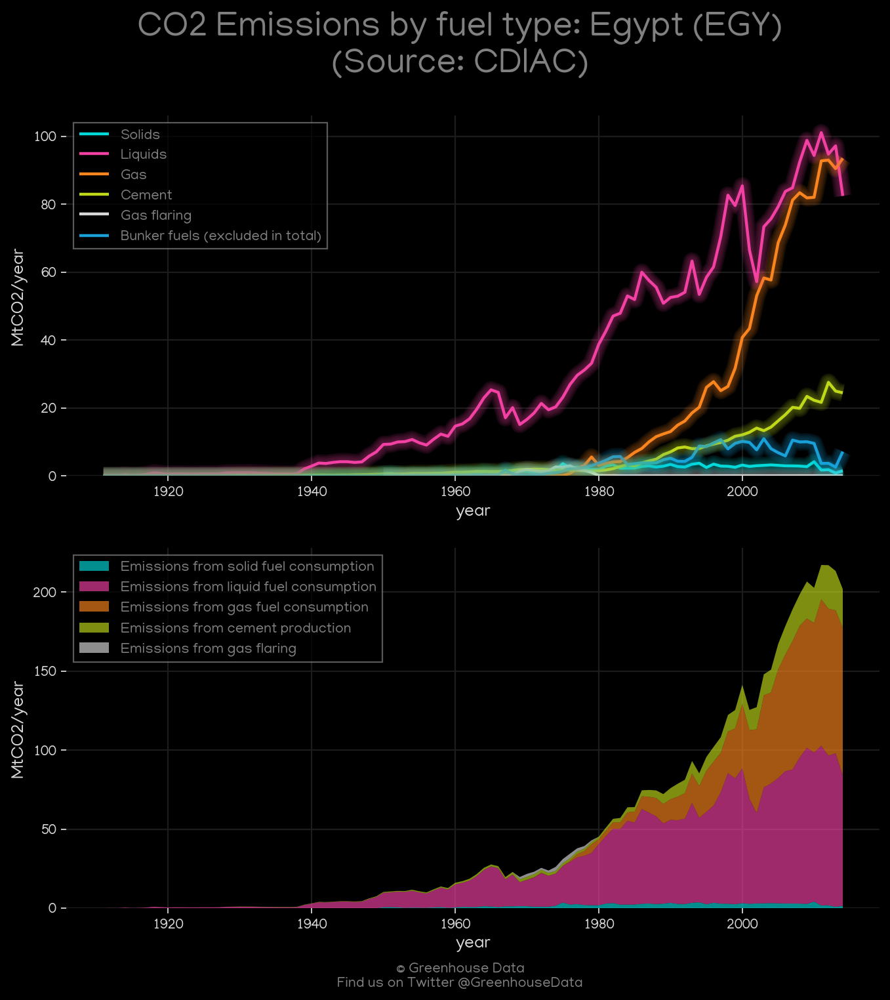
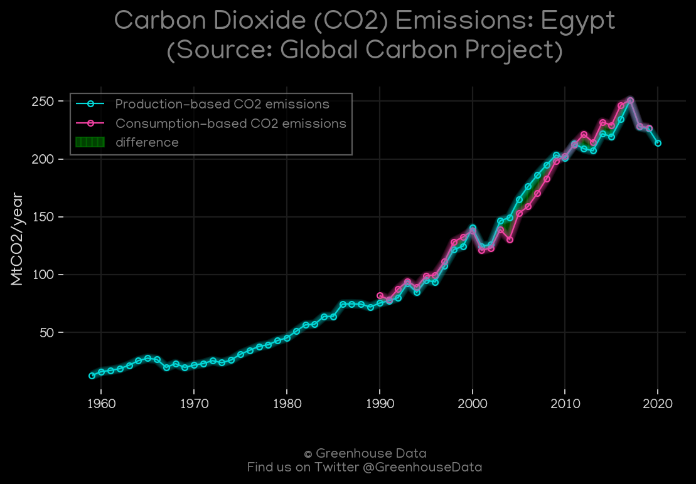
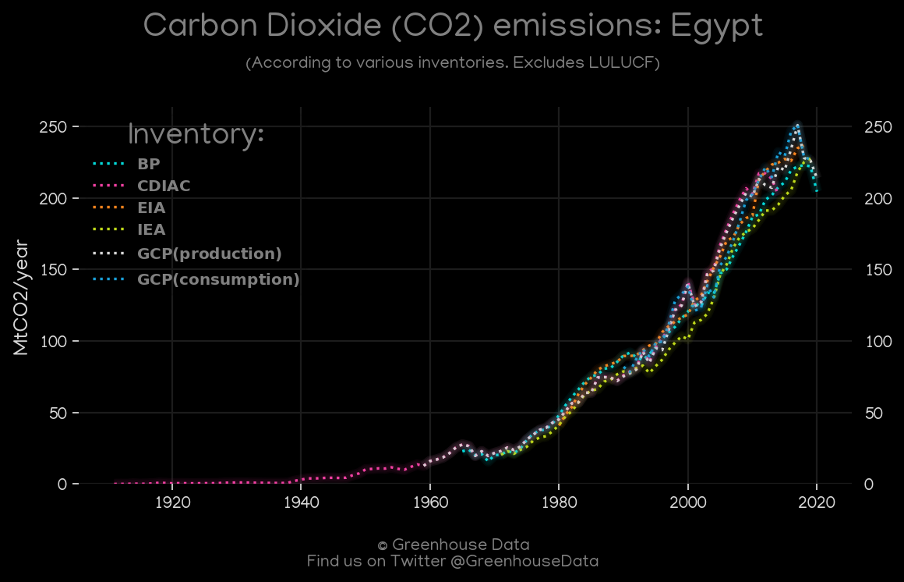
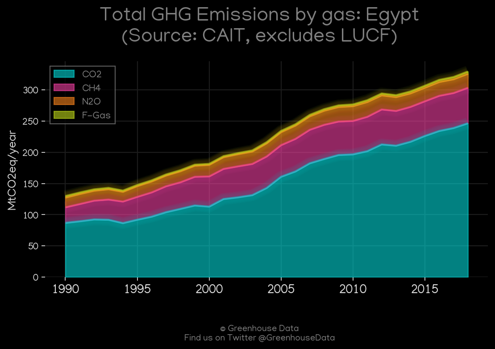
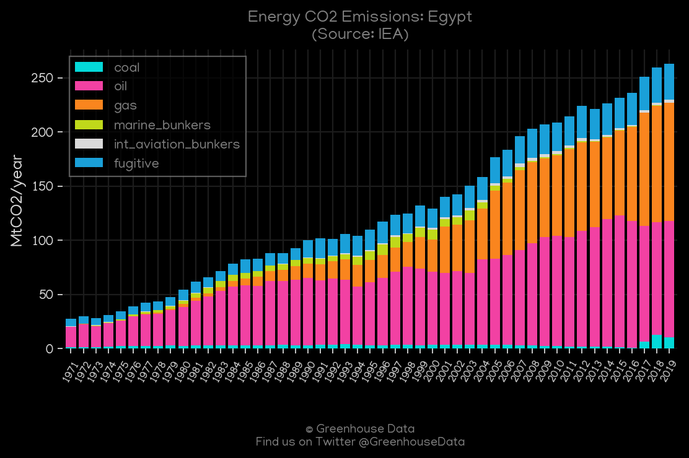
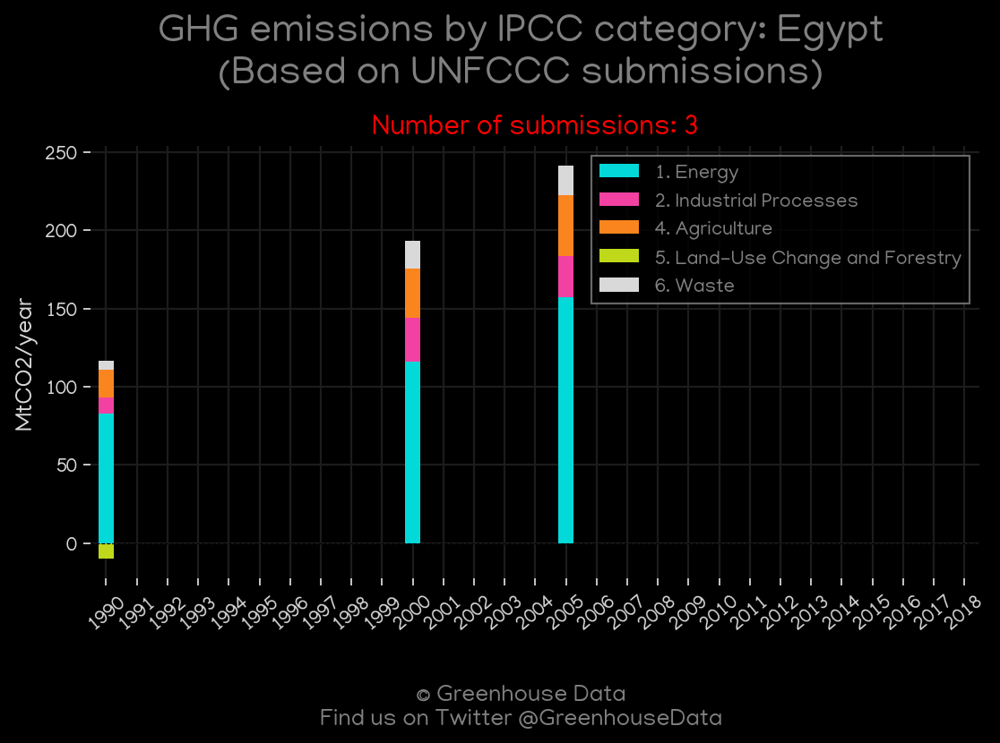
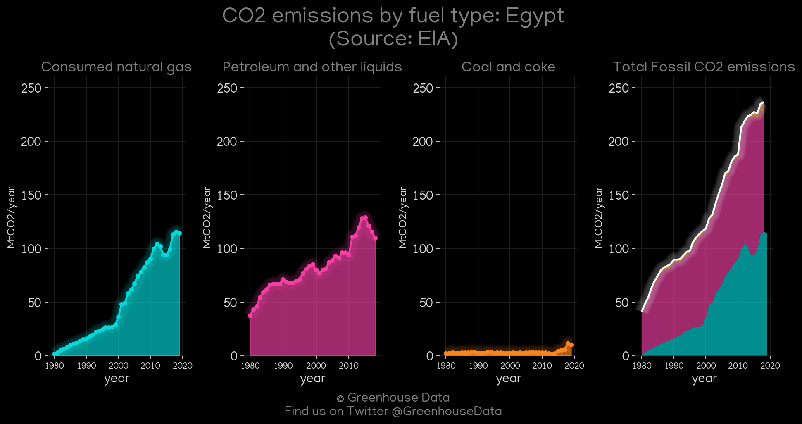
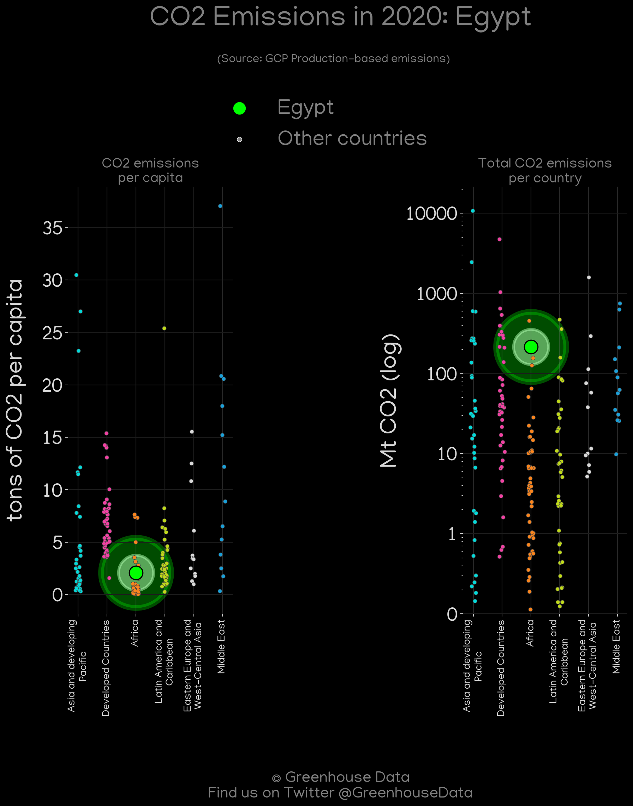
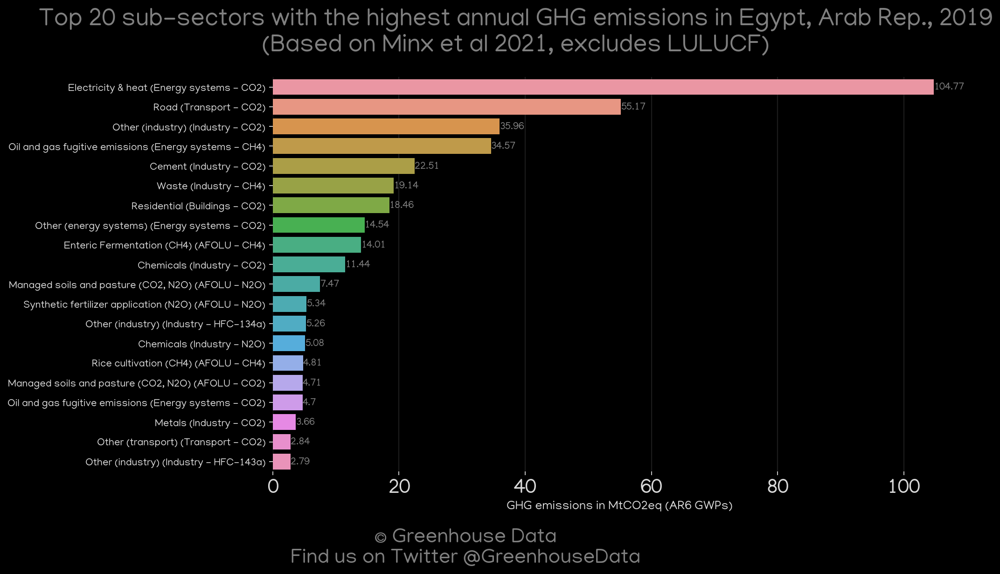

<h1 align="center">
🇪🇬🇪🇬🇪🇬🇪🇬🇪🇬
 
Egypt
 
🇪🇬🇪🇬🇪🇬🇪🇬🇪🇬
</h1>
<h2>Datasets:</h2>

<a href="https://github.com/dquintani/GreenhouseData/tree/master/country_data/EGY_Egypt/data">View on Github</a>
 

<a href="data/EGY_GCP.csv">GCP</a> || <a href="data/EGY_Minx_2021.csv">Minx_2021</a> || <a href="data/EGY_PRIMAP-hist.csv">PRIMAP-hist</a> || <a href="data/EGY_IEA.csv">IEA</a> || <a href="data/EGY_EIA.csv">EIA</a> || <a href="data/EGY_FAO.csv">FAO</a> || <a href="data/EGY_GCP_consupmption.csv">GCP_consupmption</a> || <a href="data/EGY_BP.csv">BP</a> || <a href="data/EGY_CDIAC.csv">CDIAC</a> || <a href="data/EGY_CAIT.csv">CAIT</a> || <a href="data/EGY_EPA.csv">EPA</a> || <a href="data/EGY_EDGAR.csv">EDGAR</a>

 

<h1>Figures:</h1><h2>#1 (EGY_CDIAC_1)</h2>

<h2>#2 (EGY_GCP_1)</h2>

<h2>#3 (EGY_BP_1)</h2>

<h2>#4 (EGY_CO2_totals)</h2>

<h2>#5 (EGY_CAIT_gases_1)</h2>

<h2>#6 (EGY_IEA_1)</h2>

<h2>#7 (EGY_CAIT_lucf_vs_nolucf)</h2>

<h2>#8 (EGY_UNFCCC_NAI_1)</h2>

<h2>#9 (EGY_EIA_1)</h2>

<h2>#10 (EGY_GCP_Country_Highlight)</h2>

<h2>#11 (EGY_Minx_top20_subsectors)</h2>

