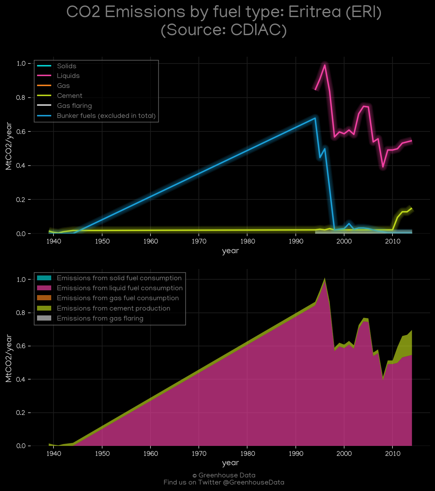
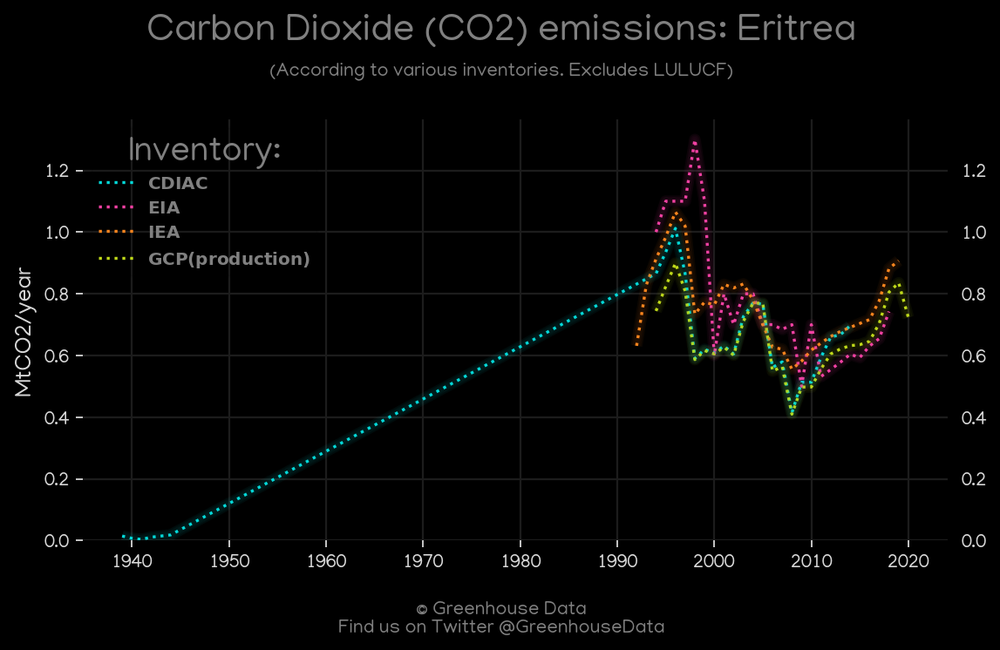
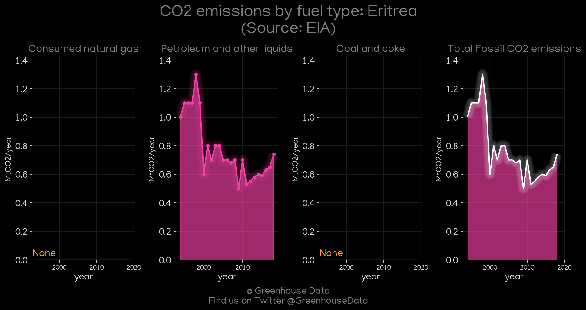
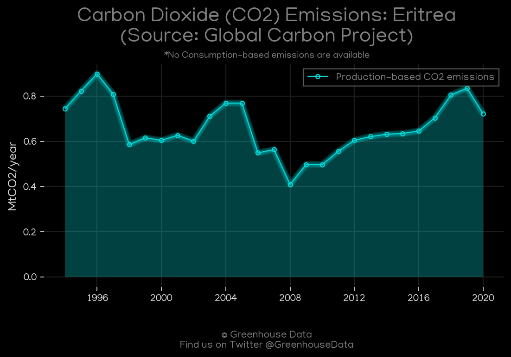
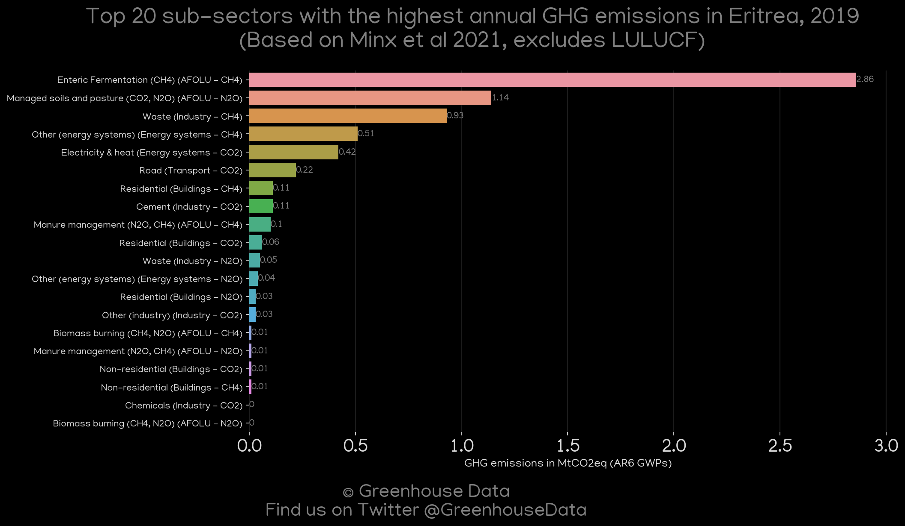
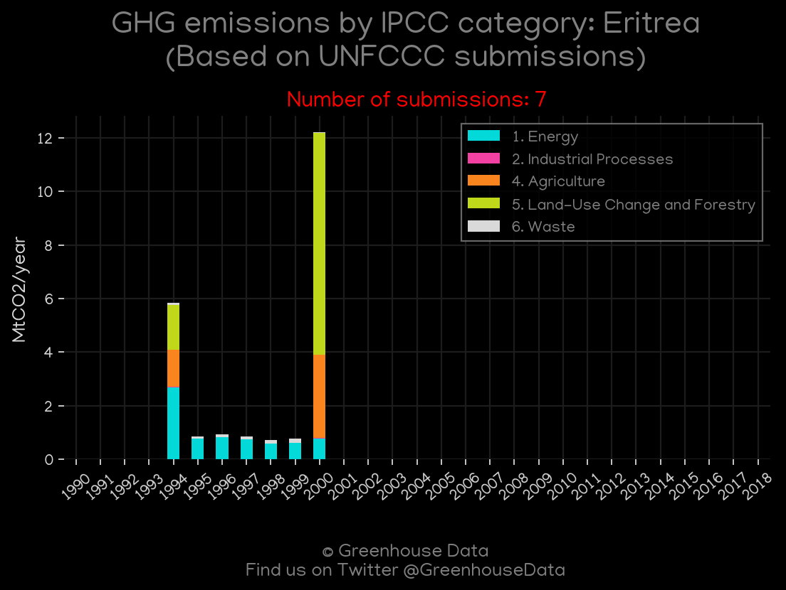

<h1 align="center">
🇪🇷🇪🇷🇪🇷🇪🇷🇪🇷
 
Eritrea
 
🇪🇷🇪🇷🇪🇷🇪🇷🇪🇷
</h1>
<h2>Datasets:</h2>

<a href="https://github.com/dquintani/GreenhouseData/tree/master/country_data/ERI_Eritrea/data">View on Github</a>
 

<a href="data/ERI_CAIT.csv">CAIT</a> || <a href="data/ERI_CDIAC.csv">CDIAC</a> || <a href="data/ERI_EDGAR.csv">EDGAR</a> || <a href="data/ERI_EIA.csv">EIA</a> || <a href="data/ERI_EPA.csv">EPA</a> || <a href="data/ERI_FAO.csv">FAO</a> || <a href="data/ERI_GCP.csv">GCP</a> || <a href="data/ERI_GCP_consupmption.csv">GCP_consupmption</a> || <a href="data/ERI_IEA.csv">IEA</a> || <a href="data/ERI_Minx_2021.csv">Minx_2021</a> || <a href="data/ERI_PRIMAP-hist.csv">PRIMAP-hist</a>

 

<h1>Figures:</h1><h2>#1 (ERI_CAIT_gases_1)</h2>

<h2>#2 (ERI_CAIT_lucf_vs_nolucf)</h2>

<h2>#3 (ERI_CDIAC_1)</h2>

<h2>#4 (ERI_CO2_totals)</h2>

<h2>#5 (ERI_EIA_1)</h2>

<h2>#6 (ERI_GCP_1)</h2>

<h2>#7 (ERI_GCP_Country_Highlight)</h2>

<h2>#8 (ERI_IEA_1)</h2>

<h2>#9 (ERI_Minx_top20_subsectors)</h2>

<h2>#10 (ERI_relative_totals)</h2>

<h2>#11 (ERI_UNFCCC_NAI_1)</h2>

