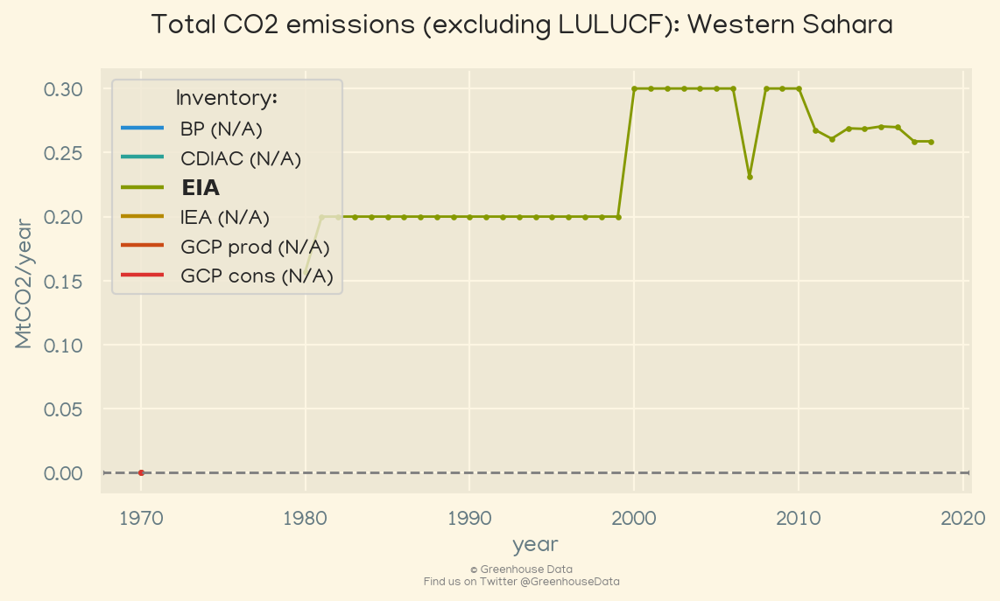
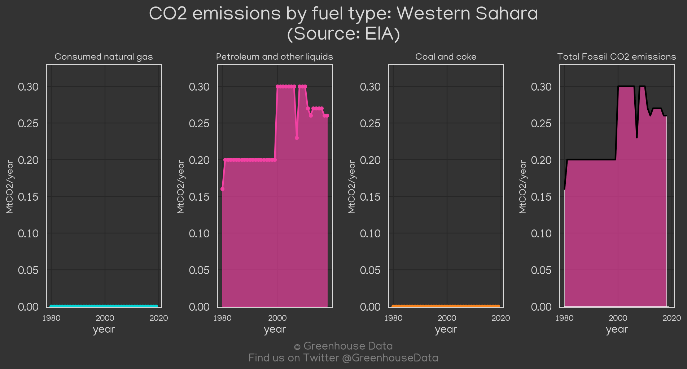
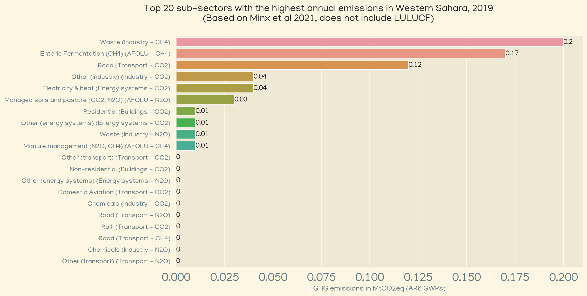

<h1 align="center">
🇪🇭🇪🇭🇪🇭🇪🇭🇪🇭
 
Western Sahara
 
🇪🇭🇪🇭🇪🇭🇪🇭🇪🇭
</h1>
<h2>Datasets:</h2>

<a href="https://github.com/dquintani/Greenhouse-Data/tree/master/country_data/ESH_Western Sahara/data">View on Github</a>
 

<a href="data/ESH_EIA.csv">EIA</a> || <a href="data/ESH_Minx_2021.csv">Minx_2021</a> || <a href="data/ESH_FAO.csv">FAO</a> || <a href="data/ESH_EDGAR.csv">EDGAR</a>

 

<h1>Figures:</h1><h2>#1 (ESH_CO2_totals)</h2>

<h2>#2 (ESH_EIA_1)</h2>

<h2>#3 (ESH_Minx_top20_subsectors)</h2>

