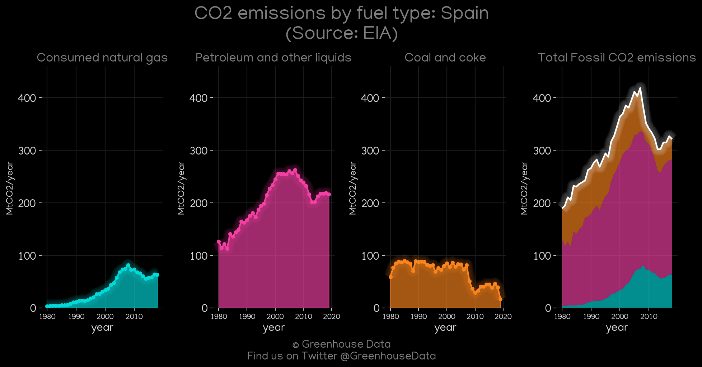
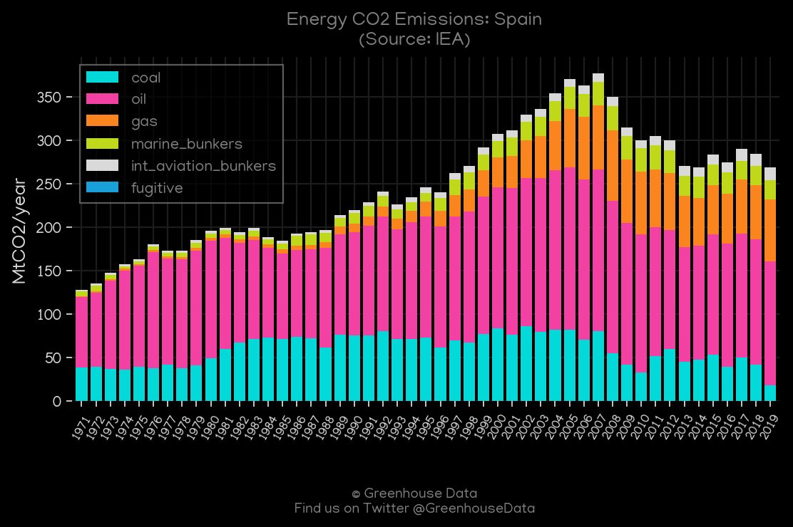
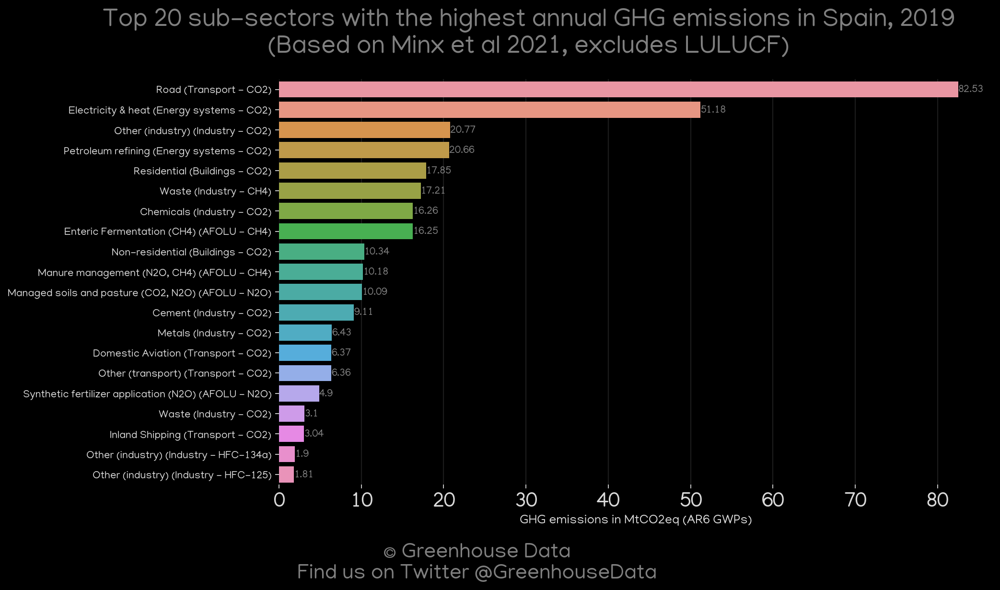
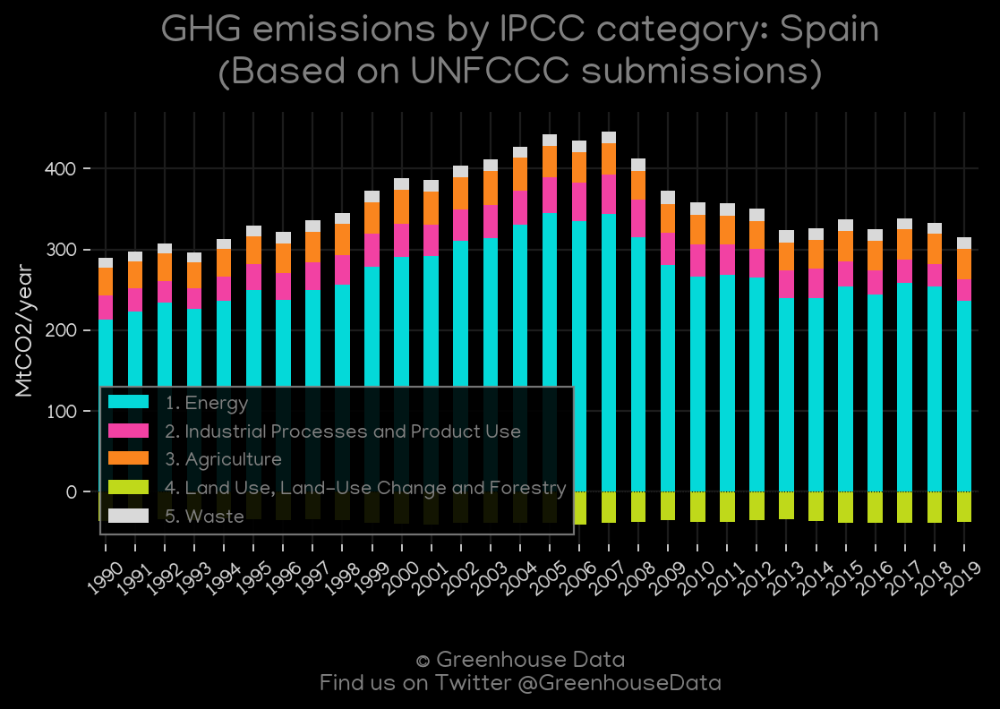
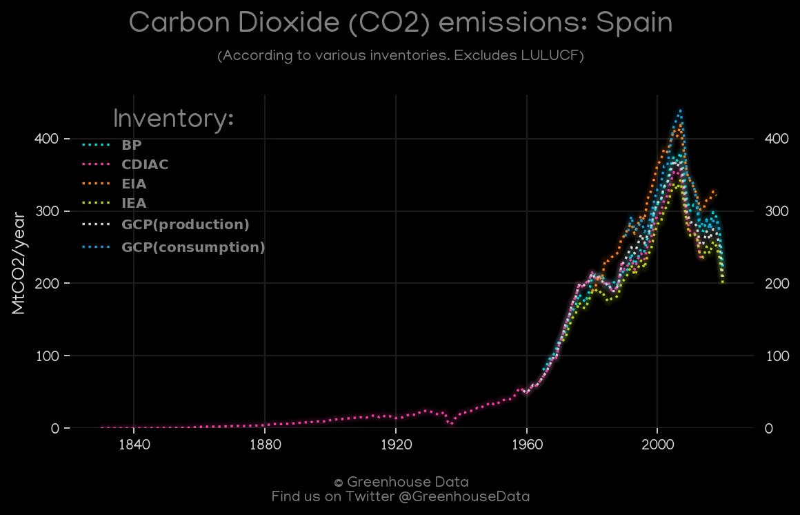
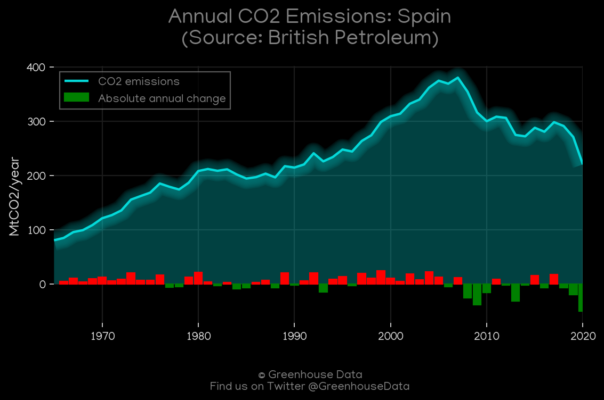
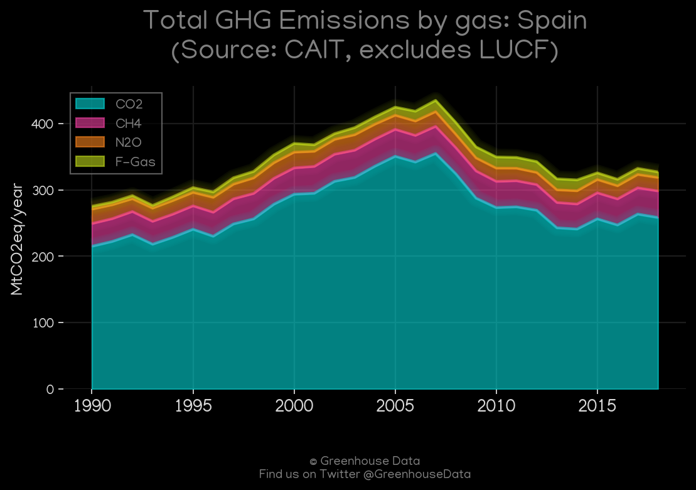
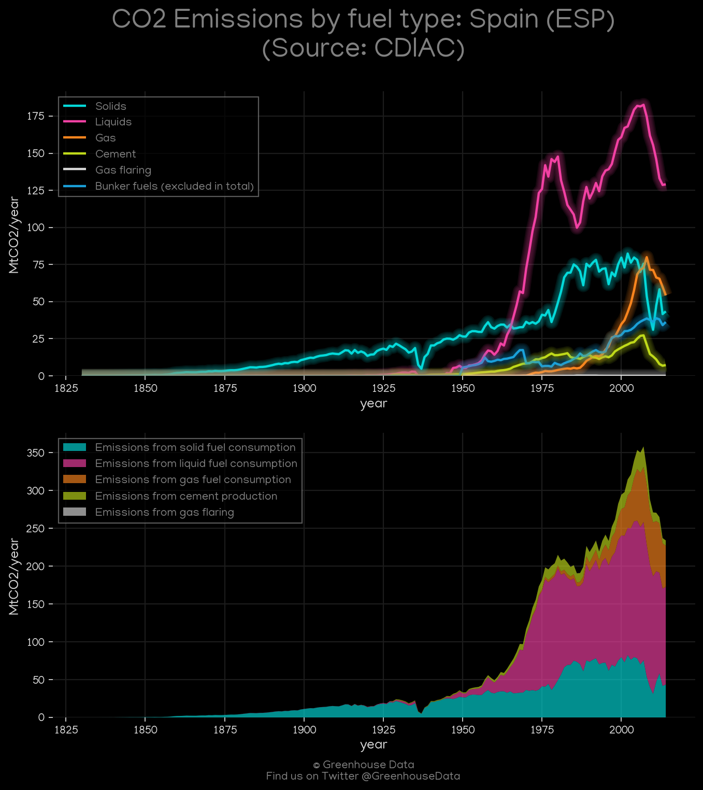
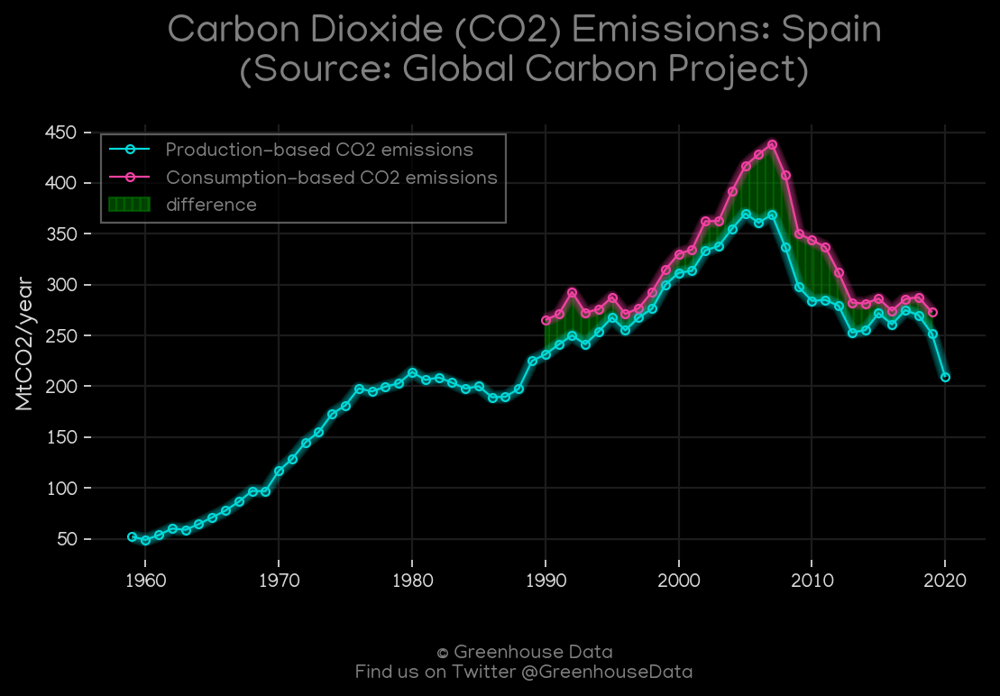

<h1 align="center">
🇪🇸🇪🇸🇪🇸🇪🇸🇪🇸
 
Spain
 
🇪🇸🇪🇸🇪🇸🇪🇸🇪🇸
</h1>
<h2>Datasets:</h2>

<a href="https://github.com/dquintani/GreenhouseData/tree/master/country_data/ESP_Spain/data">View on Github</a>
 

<a href="data/ESP_BP.csv">BP</a> || <a href="data/ESP_EIA.csv">EIA</a> || <a href="data/ESP_FAO.csv">FAO</a> || <a href="data/ESP_EPA.csv">EPA</a> || <a href="data/ESP_PRIMAP-hist.csv">PRIMAP-hist</a> || <a href="data/ESP_EDGAR.csv">EDGAR</a> || <a href="data/ESP_IEA.csv">IEA</a> || <a href="data/ESP_CDIAC.csv">CDIAC</a> || <a href="data/ESP_Minx_2021.csv">Minx_2021</a> || <a href="data/ESP_CAIT.csv">CAIT</a> || <a href="data/ESP_GCP.csv">GCP</a> || <a href="data/ESP_GCP_consupmption.csv">GCP_consupmption</a>

 

<h1>Figures:</h1><h2>#1 (ESP_EIA_1)</h2>

<h2>#2 (ESP_IEA_1)</h2>

<h2>#3 (ESP_Minx_top20_subsectors)</h2>

<h2>#4 (ESP_UNFCCC_AI_1)</h2>

<h2>#5 (ESP_CO2_totals)</h2>

<h2>#6 (ESP_BP_1)</h2>

<h2>#7 (ESP_CAIT_gases_1)</h2>

<h2>#8 (ESP_CDIAC_1)</h2>

<h2>#9 (ESP_GCP_1)</h2>

