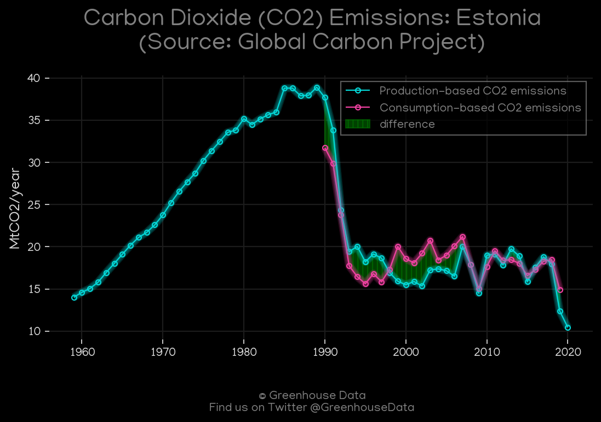
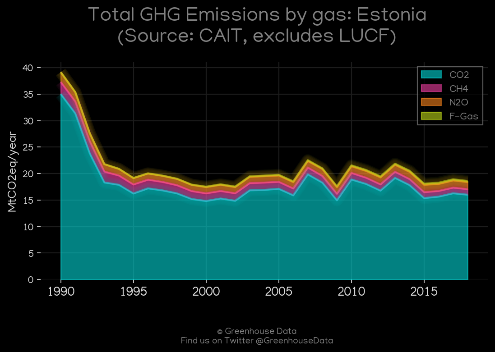
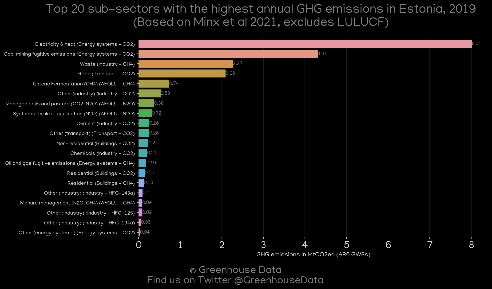
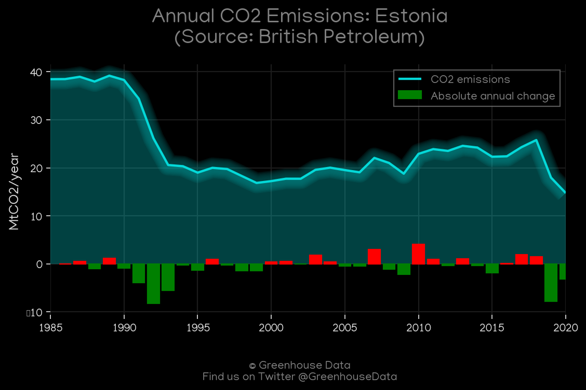
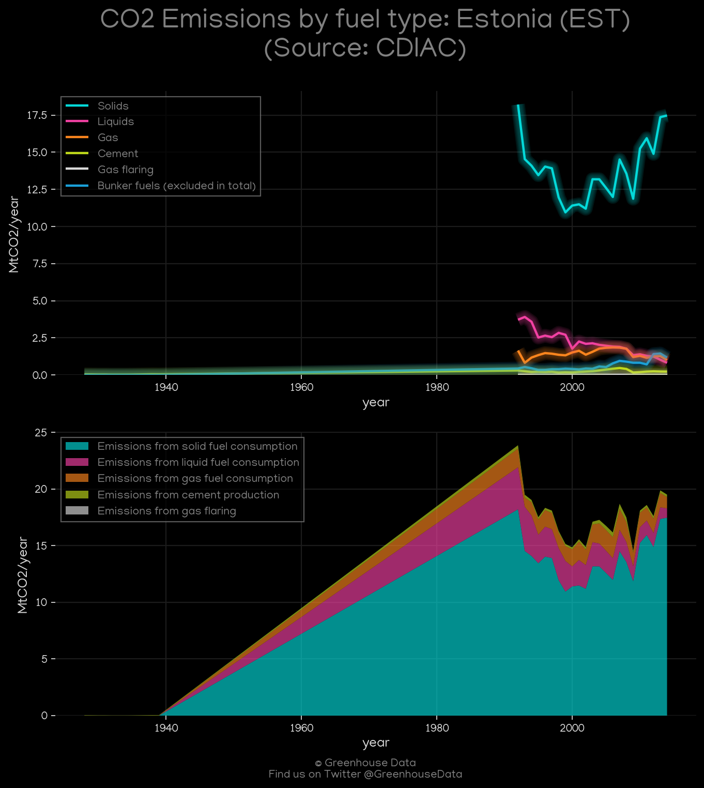
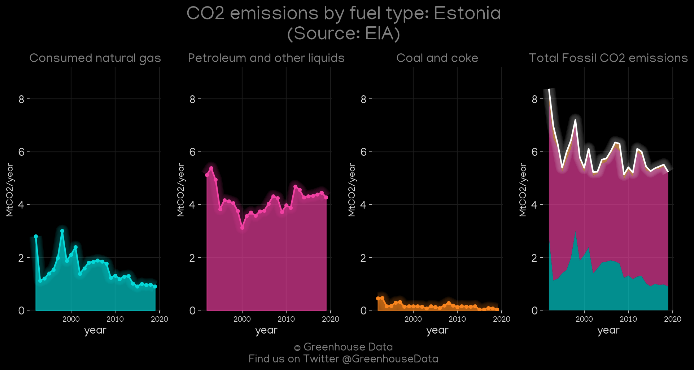
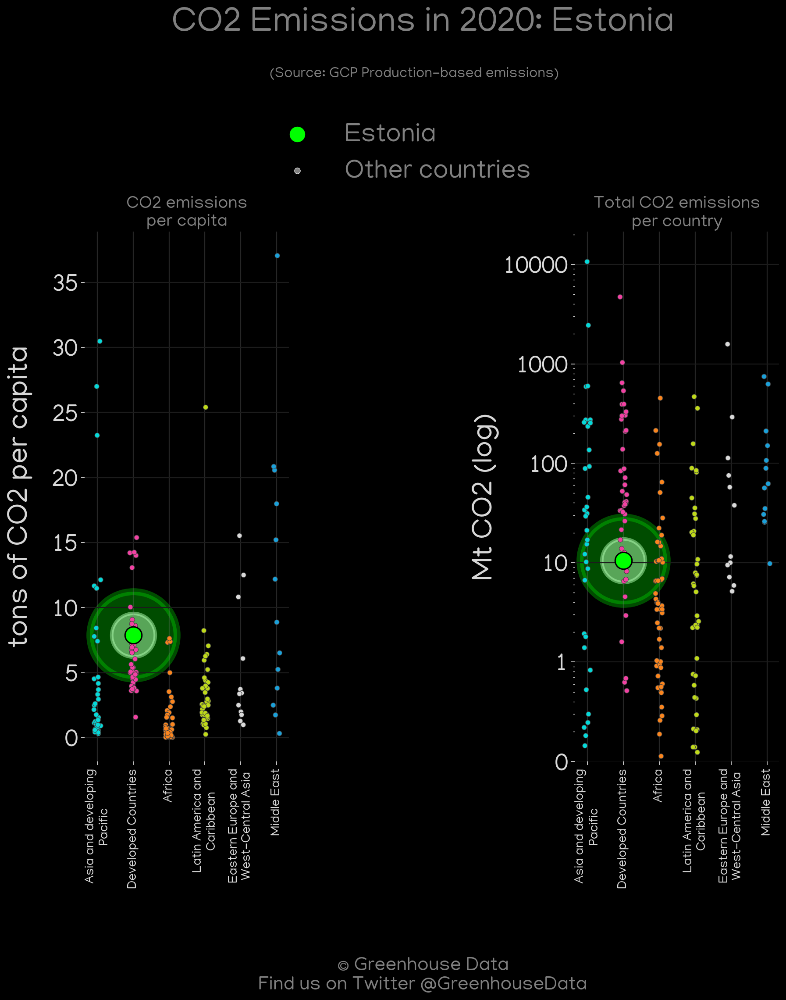
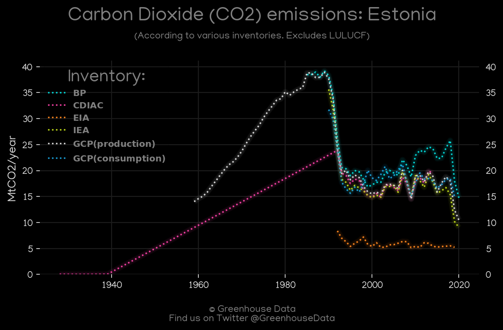
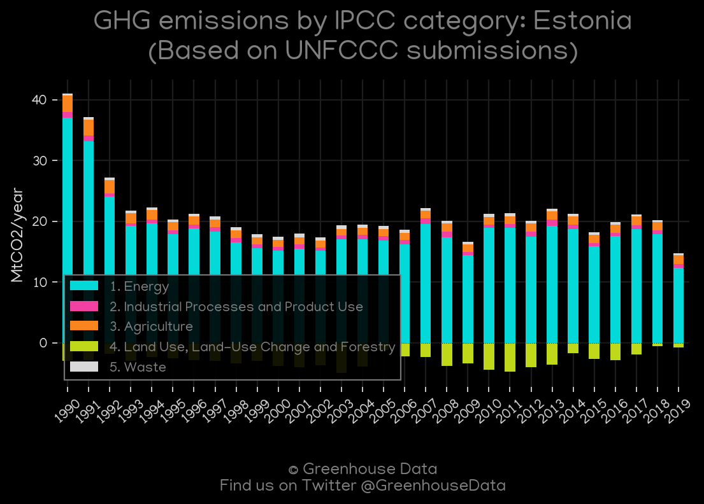

<h1 align="center">
🇪🇪🇪🇪🇪🇪🇪🇪🇪🇪
 
Estonia
 
🇪🇪🇪🇪🇪🇪🇪🇪🇪🇪
</h1>
<h2>Datasets:</h2>

<a href="https://github.com/dquintani/GreenhouseData/tree/master/country_data/EST_Estonia/data">View on Github</a>
 

<a href="data/EST_CAIT.csv">CAIT</a> || <a href="data/EST_GCP_consupmption.csv">GCP_consupmption</a> || <a href="data/EST_IEA.csv">IEA</a> || <a href="data/EST_BP.csv">BP</a> || <a href="data/EST_EPA.csv">EPA</a> || <a href="data/EST_EDGAR.csv">EDGAR</a> || <a href="data/EST_FAO.csv">FAO</a> || <a href="data/EST_CDIAC.csv">CDIAC</a> || <a href="data/EST_EIA.csv">EIA</a> || <a href="data/EST_GCP.csv">GCP</a> || <a href="data/EST_Minx_2021.csv">Minx_2021</a> || <a href="data/EST_PRIMAP-hist.csv">PRIMAP-hist</a>

 

<h1>Figures:</h1><h2>#1 (EST_GCP_1)</h2>

<h2>#2 (EST_CAIT_gases_1)</h2>

<h2>#3 (EST_Minx_top20_subsectors)</h2>

<h2>#4 (EST_BP_1)</h2>

<h2>#5 (EST_CAIT_lucf_vs_nolucf)</h2>

<h2>#6 (EST_CDIAC_1)</h2>

<h2>#7 (EST_EIA_1)</h2>

<h2>#8 (EST_IEA_1)</h2>

<h2>#9 (EST_GCP_Country_Highlight)</h2>

<h2>#10 (EST_CO2_totals)</h2>

<h2>#11 (EST_UNFCCC_AI_1)</h2>

