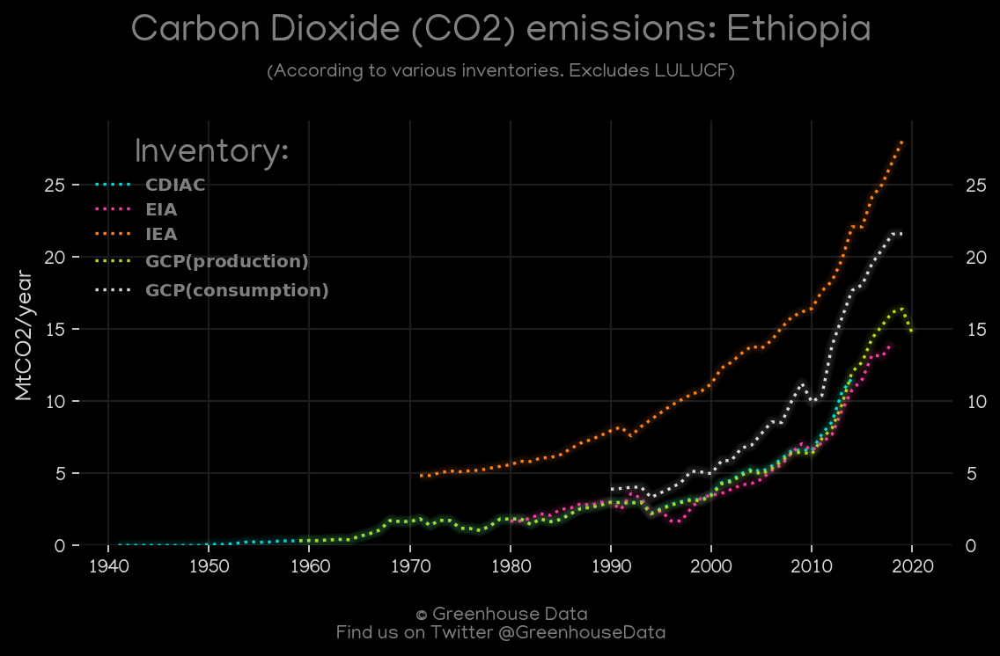
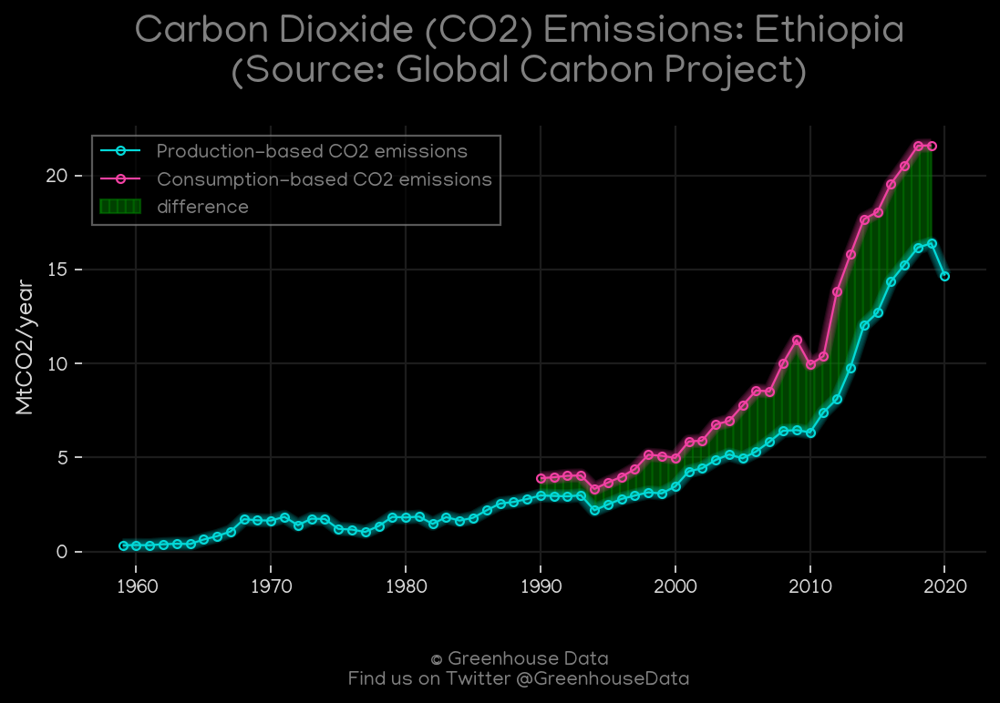
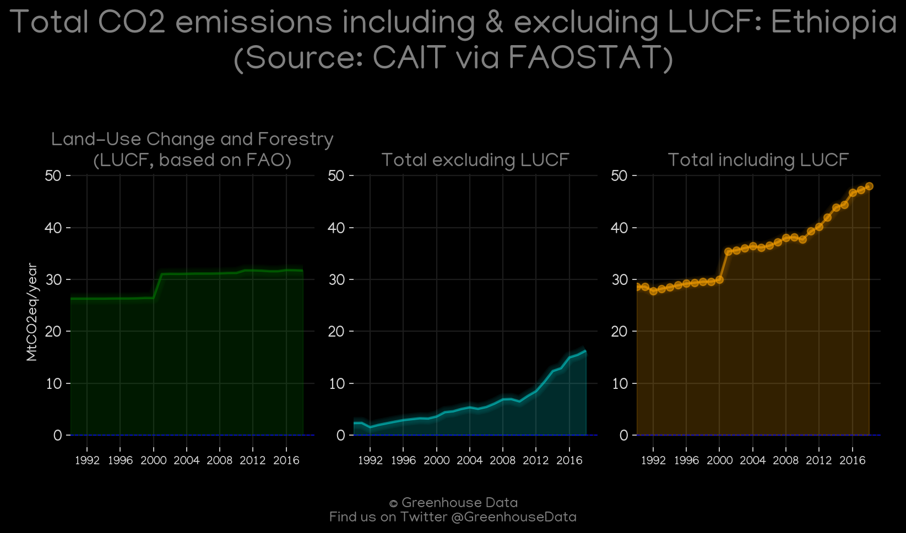
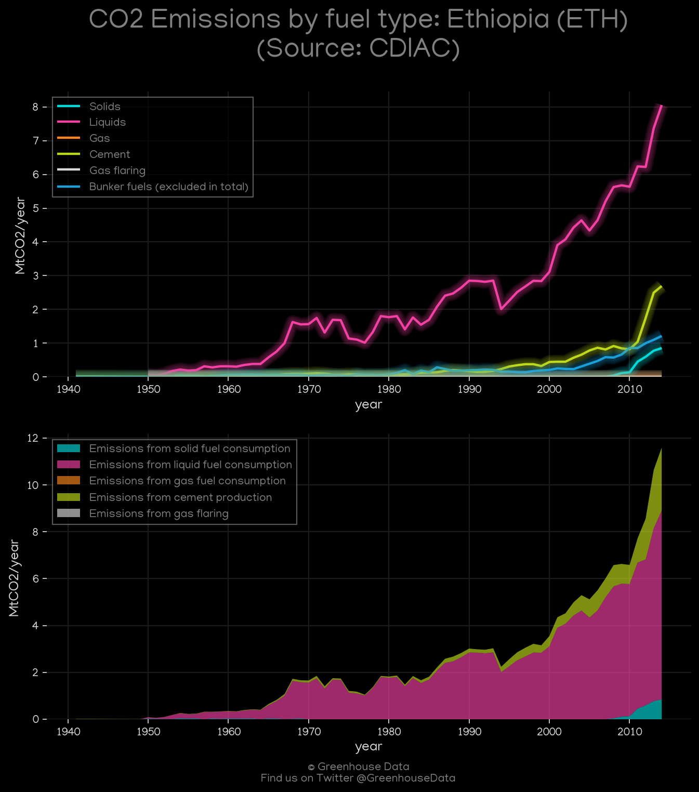
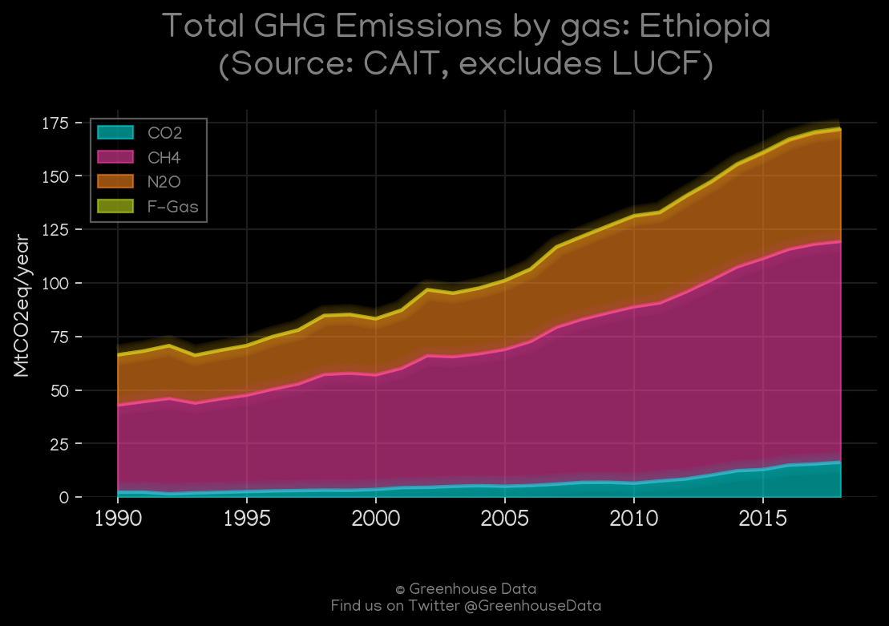
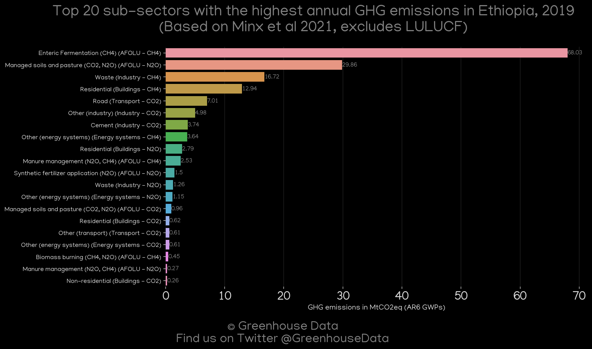
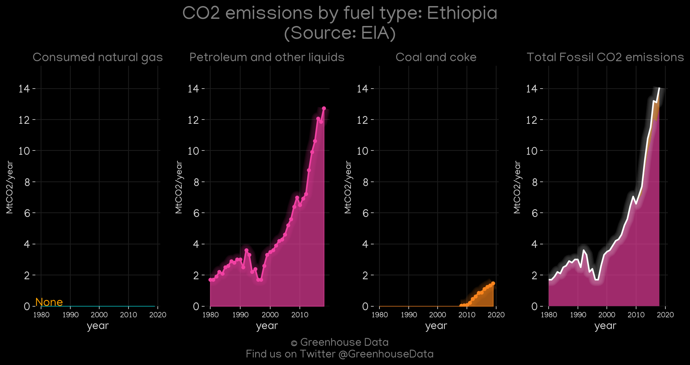
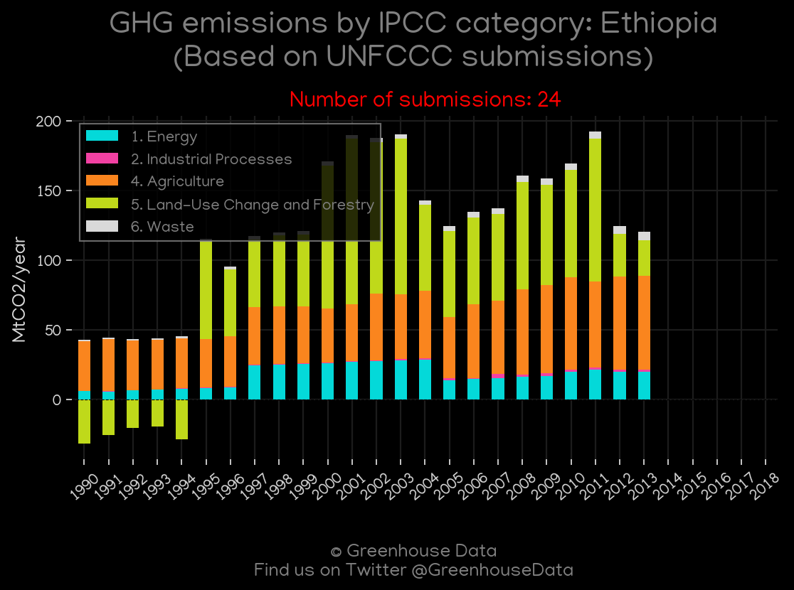

<h1 align="center">
🇪🇹🇪🇹🇪🇹🇪🇹🇪🇹
 
Ethiopia
 
🇪🇹🇪🇹🇪🇹🇪🇹🇪🇹
</h1>
<h2>Datasets:</h2>

<a href="https://github.com/dquintani/GreenhouseData/tree/master/country_data/ETH_Ethiopia/data">View on Github</a>
 

<a href="data/ETH_EIA.csv">EIA</a> || <a href="data/ETH_IEA.csv">IEA</a> || <a href="data/ETH_CDIAC.csv">CDIAC</a> || <a href="data/ETH_EPA.csv">EPA</a> || <a href="data/ETH_Minx_2021.csv">Minx_2021</a> || <a href="data/ETH_GCP.csv">GCP</a> || <a href="data/ETH_PRIMAP-hist.csv">PRIMAP-hist</a> || <a href="data/ETH_EDGAR.csv">EDGAR</a> || <a href="data/ETH_FAO.csv">FAO</a> || <a href="data/ETH_CAIT.csv">CAIT</a> || <a href="data/ETH_GCP_consupmption.csv">GCP_consupmption</a>

 

<h1>Figures:</h1><h2>#1 (ETH_CO2_totals)</h2>

<h2>#2 (ETH_GCP_1)</h2>

<h2>#3 (ETH_CAIT_lucf_vs_nolucf)</h2>

<h2>#4 (ETH_CDIAC_1)</h2>

<h2>#5 (ETH_CAIT_gases_1)</h2>

<h2>#6 (ETH_Minx_top20_subsectors)</h2>

<h2>#7 (ETH_EIA_1)</h2>

<h2>#8 (ETH_IEA_1)</h2>

<h2>#9 (ETH_UNFCCC_NAI_1)</h2>

