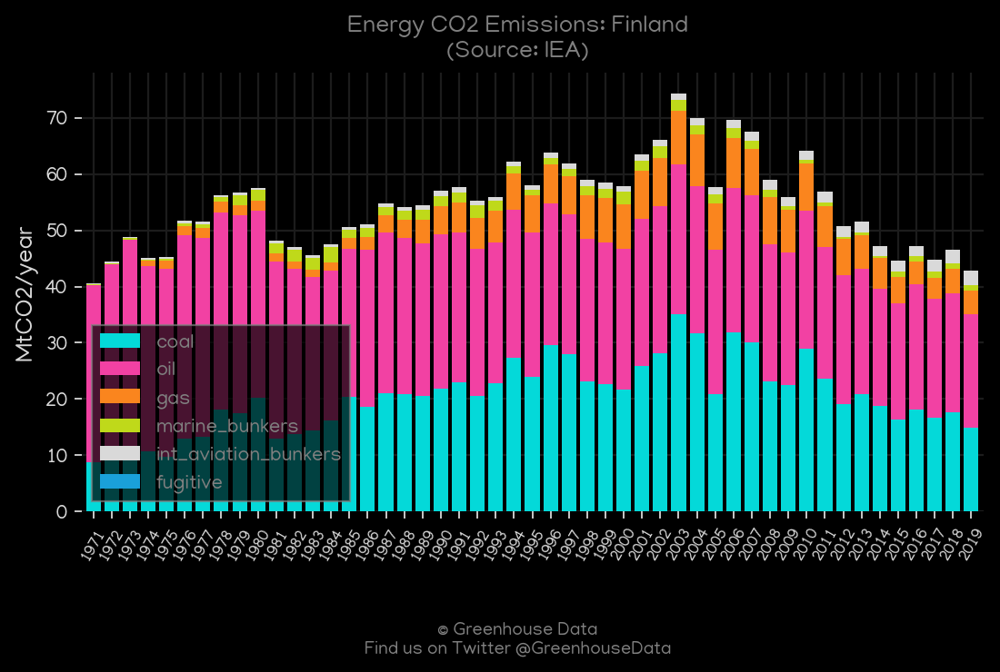
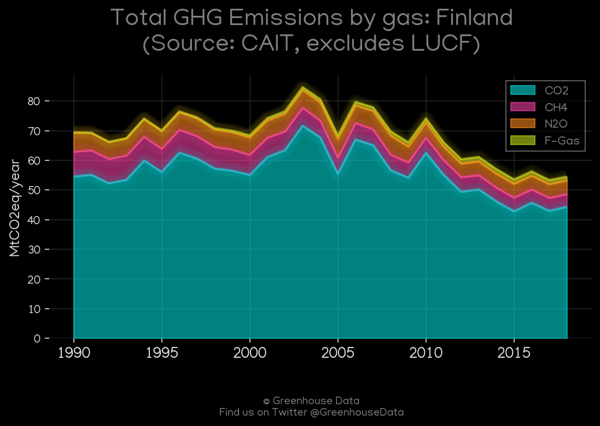
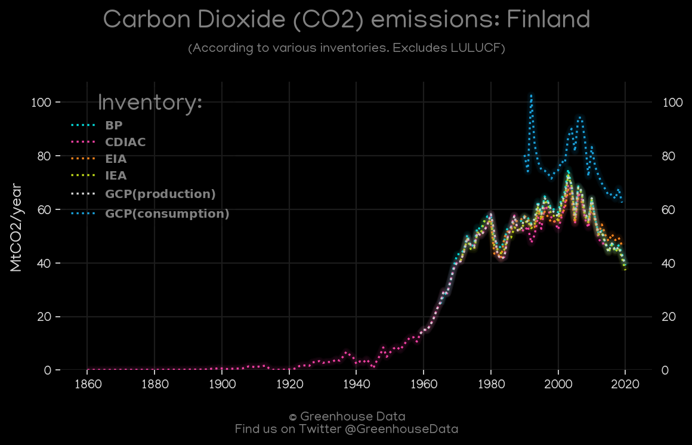
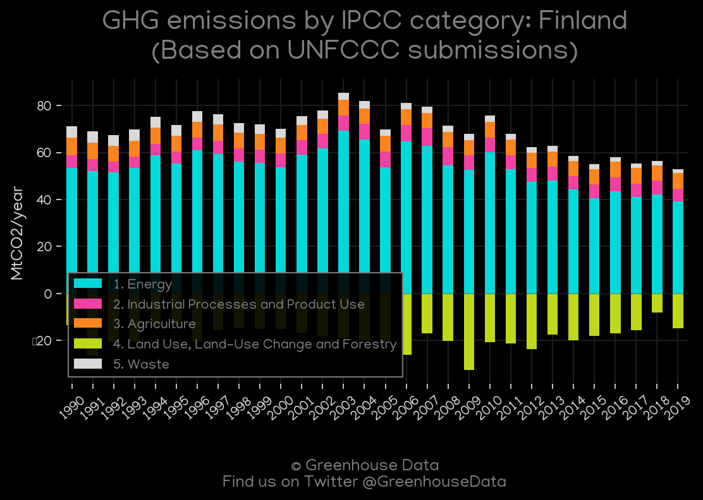
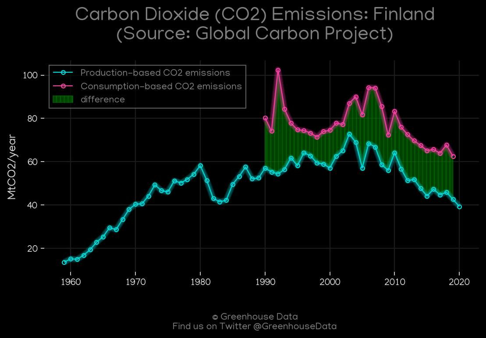
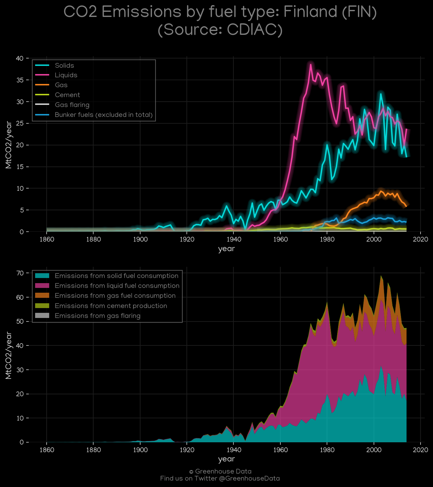
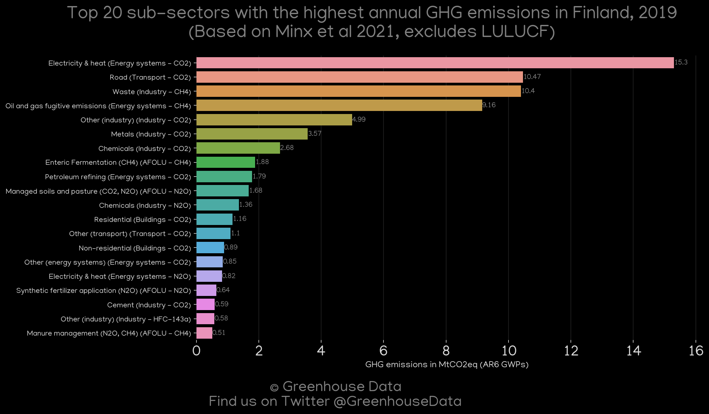

<h1 align="center">
🇫🇮🇫🇮🇫🇮🇫🇮🇫🇮
 
Finland
 
🇫🇮🇫🇮🇫🇮🇫🇮🇫🇮
</h1>
<h2>Datasets:</h2>

<a href="https://github.com/dquintani/GreenhouseData/tree/master/country_data/FIN_Finland/data">View on Github</a>
 

<a href="data/FIN_EPA.csv">EPA</a> || <a href="data/FIN_EDGAR.csv">EDGAR</a> || <a href="data/FIN_GCP.csv">GCP</a> || <a href="data/FIN_IEA.csv">IEA</a> || <a href="data/FIN_EIA.csv">EIA</a> || <a href="data/FIN_FAO.csv">FAO</a> || <a href="data/FIN_PRIMAP-hist.csv">PRIMAP-hist</a> || <a href="data/FIN_CDIAC.csv">CDIAC</a> || <a href="data/FIN_GCP_consupmption.csv">GCP_consupmption</a> || <a href="data/FIN_BP.csv">BP</a> || <a href="data/FIN_CAIT.csv">CAIT</a> || <a href="data/FIN_Minx_2021.csv">Minx_2021</a>

 

<h1>Figures:</h1><h2>#1 (FIN_IEA_1)</h2>

<h2>#2 (FIN_CAIT_gases_1)</h2>

<h2>#3 (FIN_CO2_totals)</h2>

<h2>#4 (FIN_UNFCCC_AI_1)</h2>

<h2>#5 (FIN_GCP_1)</h2>

<h2>#6 (FIN_BP_1)</h2>

<h2>#7 (FIN_CDIAC_1)</h2>

<h2>#8 (FIN_EIA_1)</h2>

<h2>#9 (FIN_Minx_top20_subsectors)</h2>

