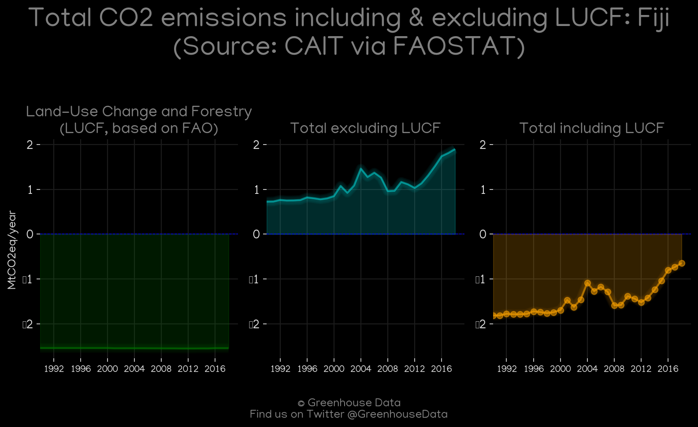
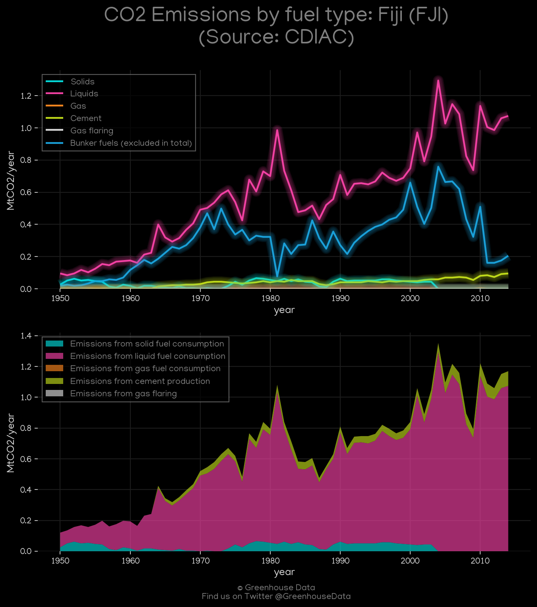
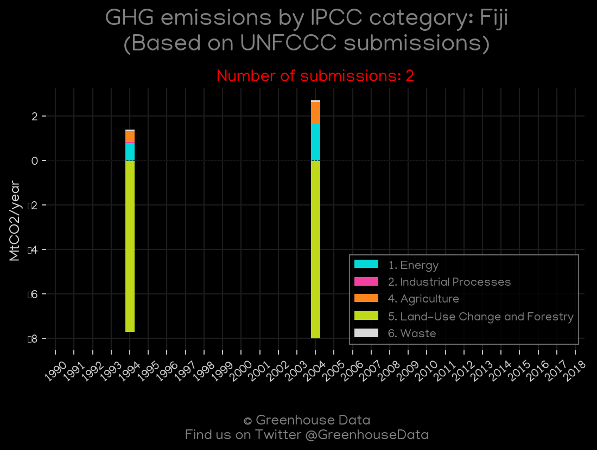
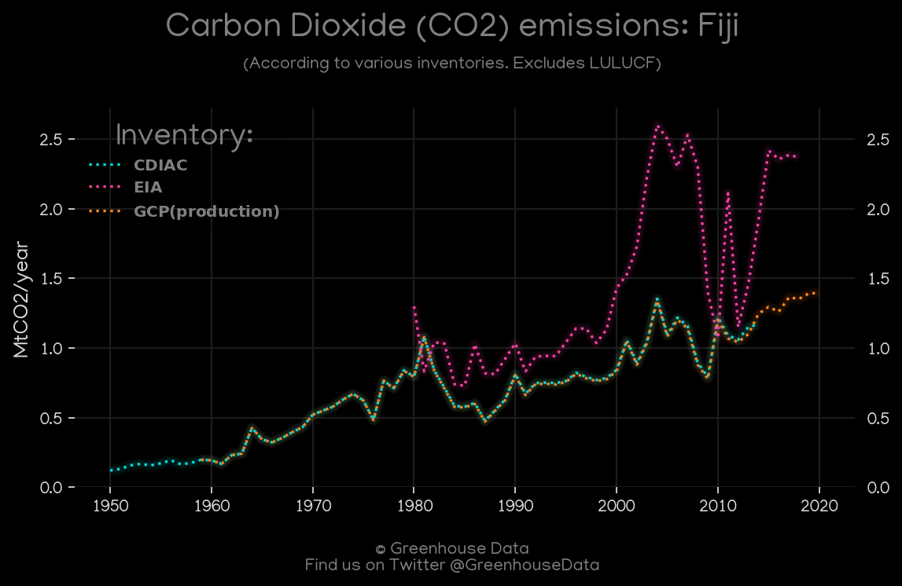
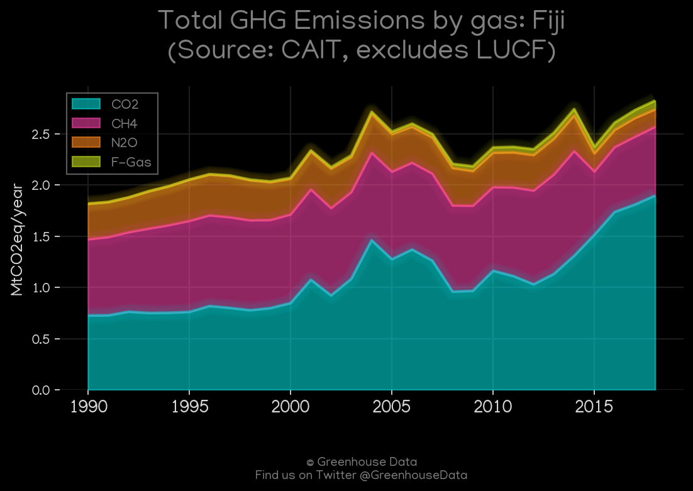
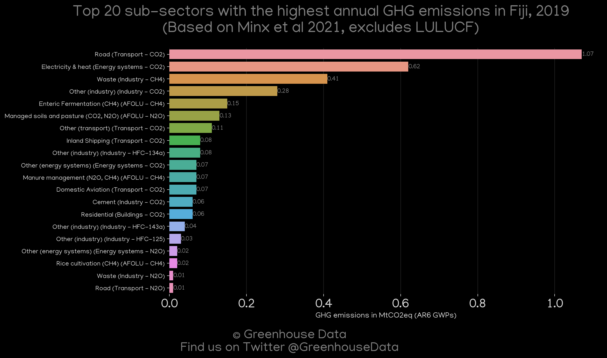
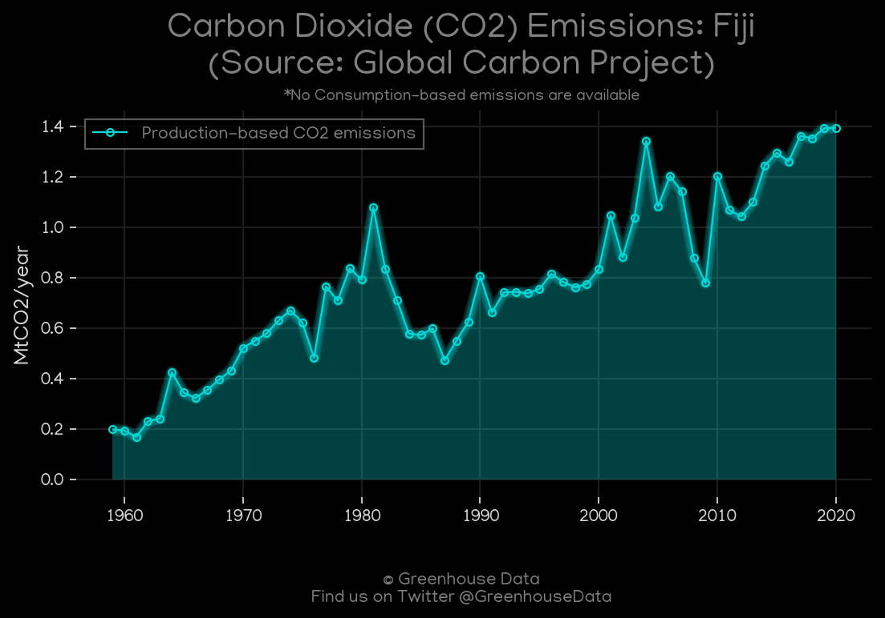
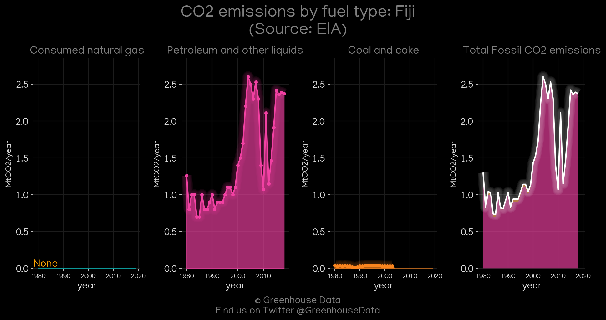

<h1 align="center">
🇫🇯🇫🇯🇫🇯🇫🇯🇫🇯
 
Fiji
 
🇫🇯🇫🇯🇫🇯🇫🇯🇫🇯
</h1>
<h2>Datasets:</h2>

<a href="https://github.com/dquintani/GreenhouseData/tree/master/country_data/FJI_Fiji/data">View on Github</a>
 

<a href="data/FJI_GCP.csv">GCP</a> || <a href="data/FJI_Minx_2021.csv">Minx_2021</a> || <a href="data/FJI_FAO.csv">FAO</a> || <a href="data/FJI_PRIMAP-hist.csv">PRIMAP-hist</a> || <a href="data/FJI_CDIAC.csv">CDIAC</a> || <a href="data/FJI_EPA.csv">EPA</a> || <a href="data/FJI_EDGAR.csv">EDGAR</a> || <a href="data/FJI_GCP_consupmption.csv">GCP_consupmption</a> || <a href="data/FJI_EIA.csv">EIA</a> || <a href="data/FJI_CAIT.csv">CAIT</a>

 

<h1>Figures:</h1><h2>#1 (FJI_CAIT_lucf_vs_nolucf)</h2>

<h2>#2 (FJI_CDIAC_1)</h2>

<h2>#3 (FJI_UNFCCC_NAI_1)</h2>

<h2>#4 (FJI_CO2_totals)</h2>

<h2>#5 (FJI_CAIT_gases_1)</h2>

<h2>#6 (FJI_Minx_top20_subsectors)</h2>

<h2>#7 (FJI_GCP_1)</h2>

<h2>#8 (FJI_EIA_1)</h2>

