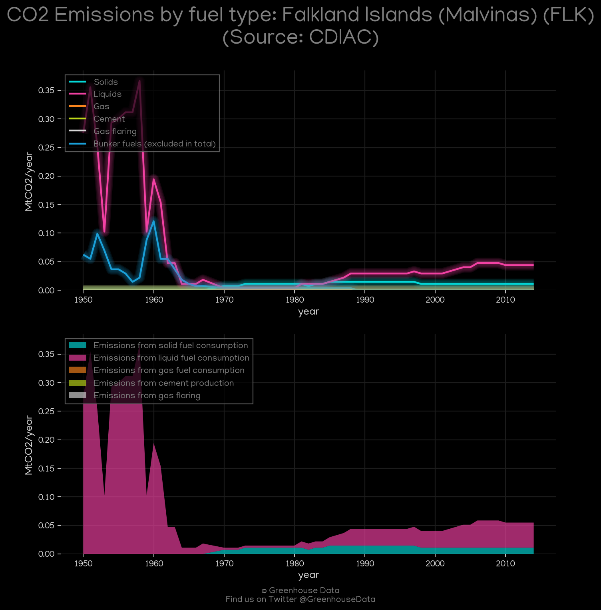
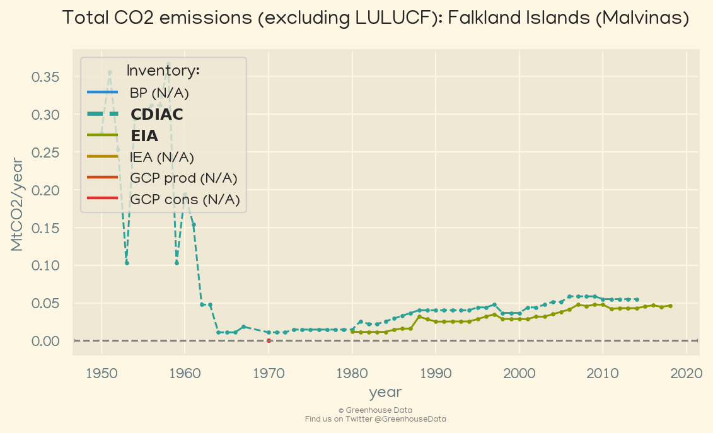
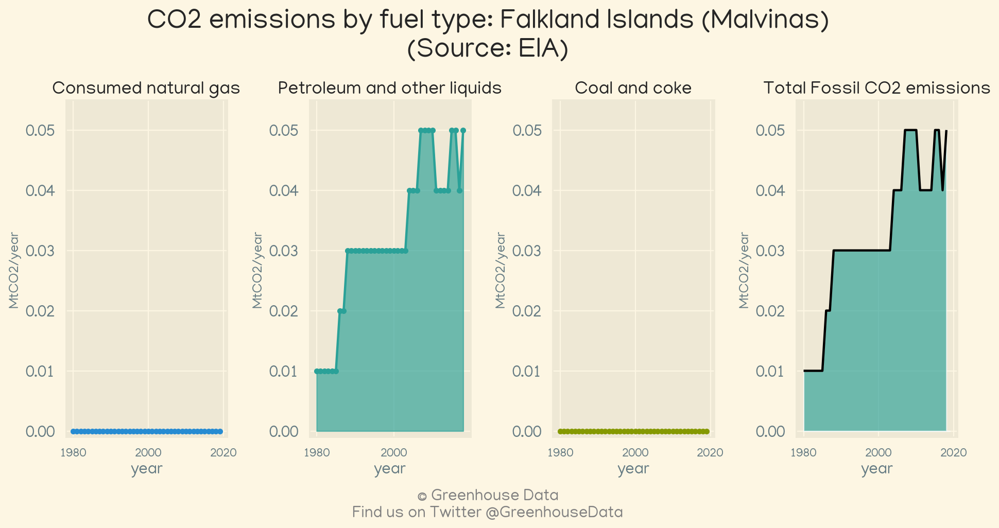
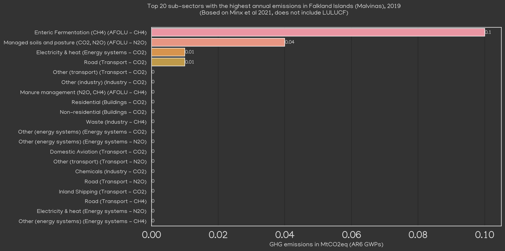
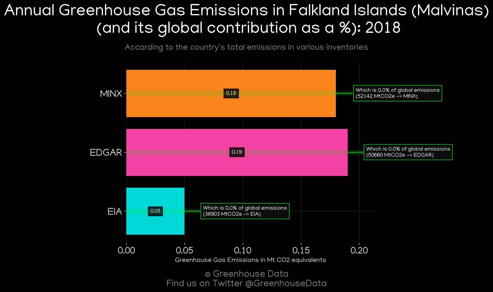

<h1 align="center">
🇫🇰🇫🇰🇫🇰🇫🇰🇫🇰
 
Falkland Islands (Malvinas)
 
🇫🇰🇫🇰🇫🇰🇫🇰🇫🇰
</h1>
<h2>Datasets:</h2>

<a href="https://github.com/dquintani/GreenhouseData/tree/master/country_data/FLK_Falkland Islands (Malvinas)/data">View on Github</a>
 

<a href="data/FLK_CDIAC.csv">CDIAC</a> || <a href="data/FLK_EDGAR.csv">EDGAR</a> || <a href="data/FLK_EIA.csv">EIA</a> || <a href="data/FLK_FAO.csv">FAO</a> || <a href="data/FLK_Minx_2021.csv">Minx_2021</a>

 

<h1>Figures:</h1><h2>#1 (FLK_CDIAC_1)</h2>

<h2>#2 (FLK_CO2_totals)</h2>

<h2>#3 (FLK_EIA_1)</h2>

<h2>#4 (FLK_Minx_top20_subsectors)</h2>

<h2>#5 (FLK_relative_totals)</h2>

