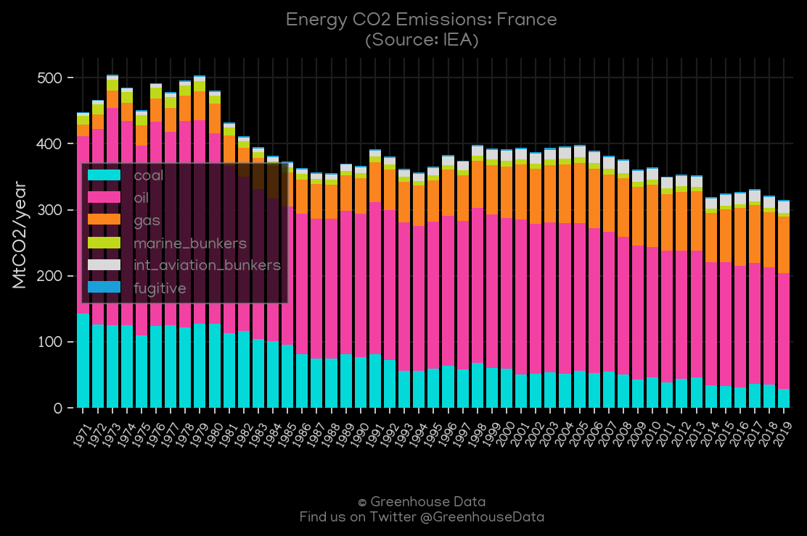
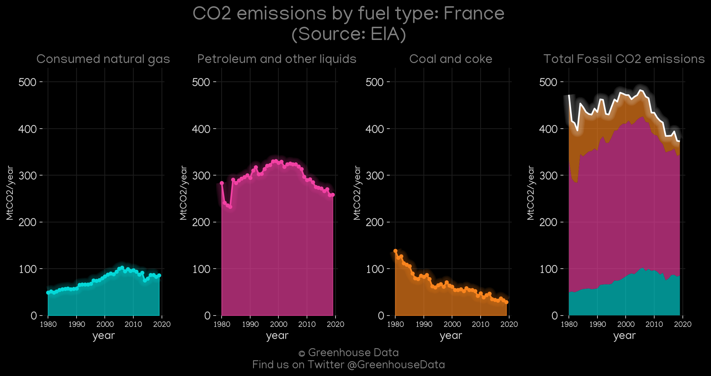
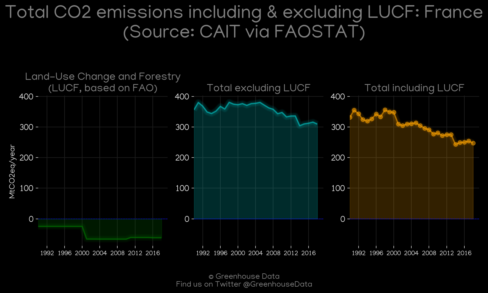
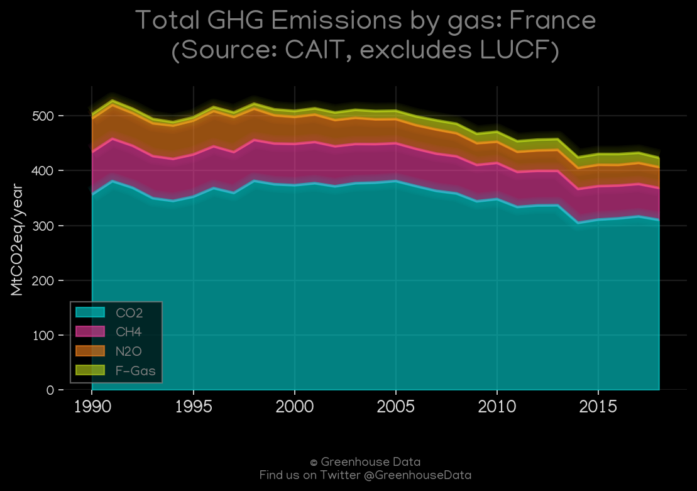
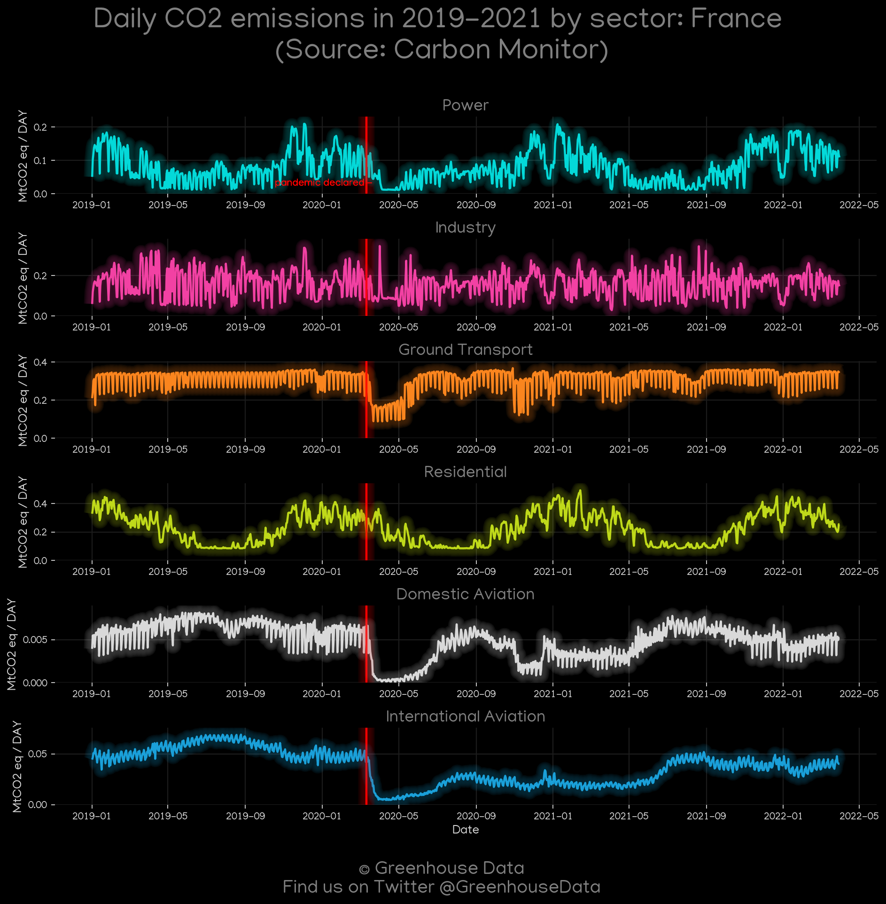
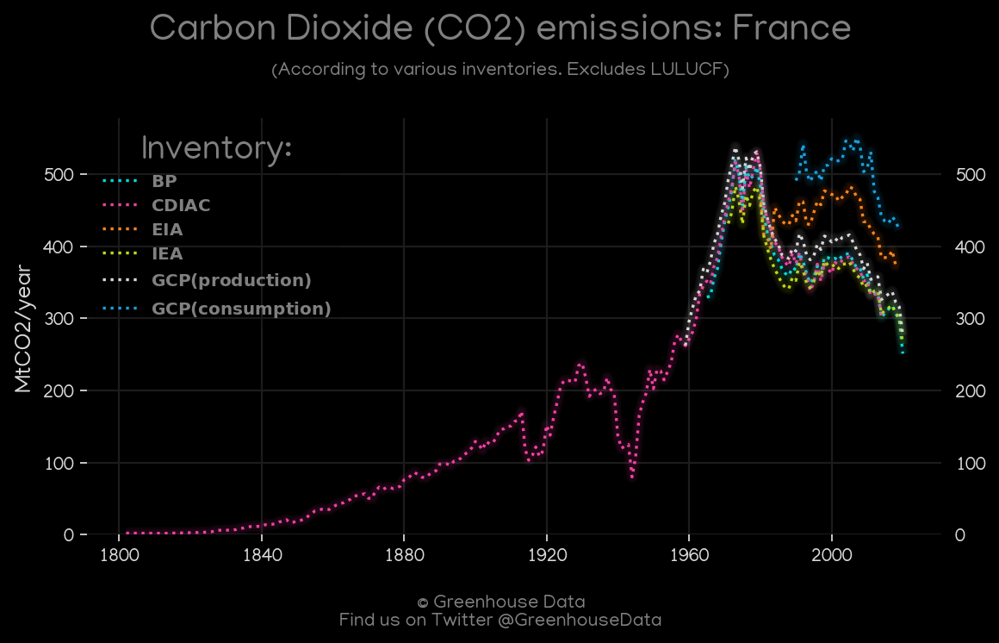
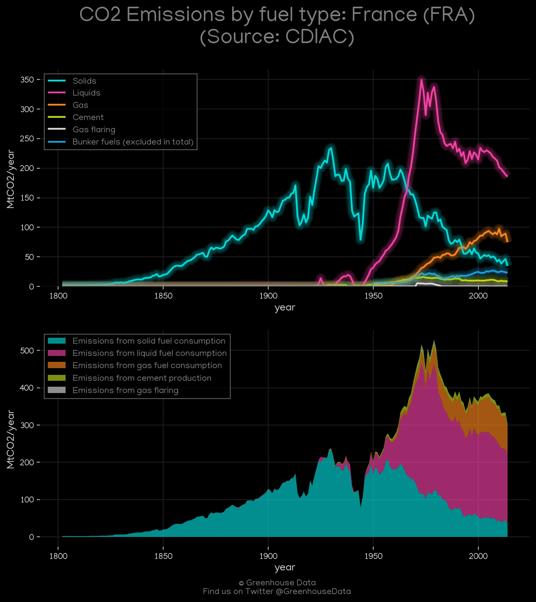
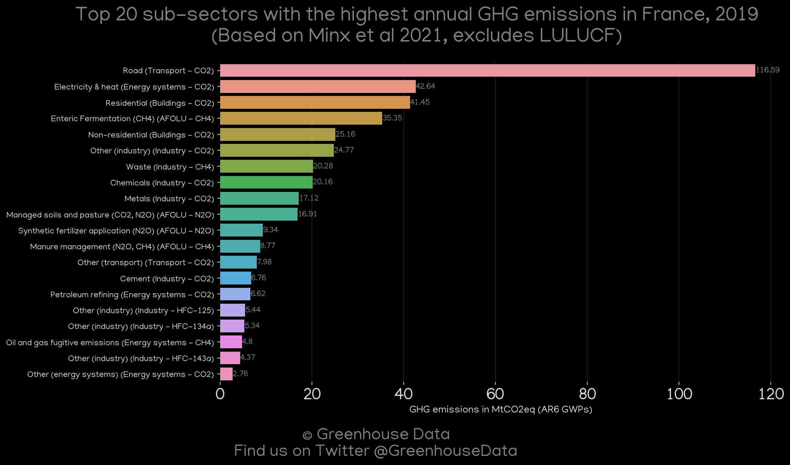
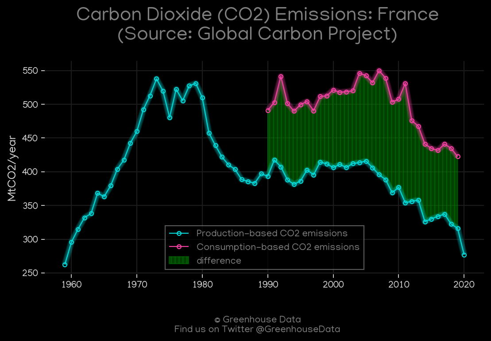

<h1 align="center">
🇫🇷🇫🇷🇫🇷🇫🇷🇫🇷
 
France
 
🇫🇷🇫🇷🇫🇷🇫🇷🇫🇷
</h1>
<h2>Datasets:</h2>

<a href="https://github.com/dquintani/GreenhouseData/tree/master/country_data/FRA_France/data">View on Github</a>
 

<a href="data/FRA_PRIMAP-hist.csv">PRIMAP-hist</a> || <a href="data/FRA_EDGAR.csv">EDGAR</a> || <a href="data/FRA_IEA.csv">IEA</a> || <a href="data/FRA_EIA.csv">EIA</a> || <a href="data/FRA_CDIAC.csv">CDIAC</a> || <a href="data/FRA_BP.csv">BP</a> || <a href="data/FRA_EPA.csv">EPA</a> || <a href="data/FRA_GCP_consupmption.csv">GCP_consupmption</a> || <a href="data/FRA_CAIT.csv">CAIT</a> || <a href="data/FRA_FAO.csv">FAO</a> || <a href="data/FRA_GCP.csv">GCP</a> || <a href="data/FRA_Minx_2021.csv">Minx_2021</a>

 

<h1>Figures:</h1><h2>#1 (FRA_IEA_1)</h2>

<h2>#2 (FRA_EIA_1)</h2>

<h2>#3 (FRA_CAIT_lucf_vs_nolucf)</h2>

<h2>#4 (FRA_CAIT_gases_1)</h2>

<h2>#5 (FRA_Carbon_Monitor_1)</h2>

<h2>#6 (FRA_CO2_totals)</h2>

<h2>#7 (FRA_CDIAC_1)</h2>

<h2>#8 (FRA_BP_1)</h2>

<h2>#9 (FRA_UNFCCC_AI_1)</h2>

<h2>#10 (FRA_Minx_top20_subsectors)</h2>

<h2>#11 (FRA_GCP_1)</h2>

