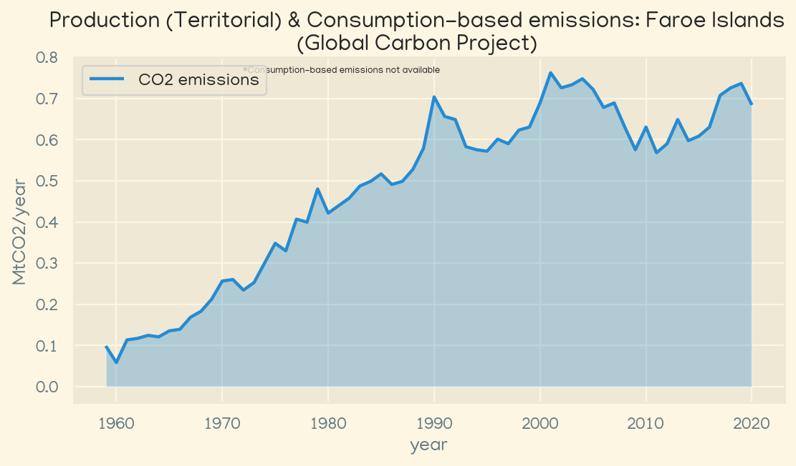
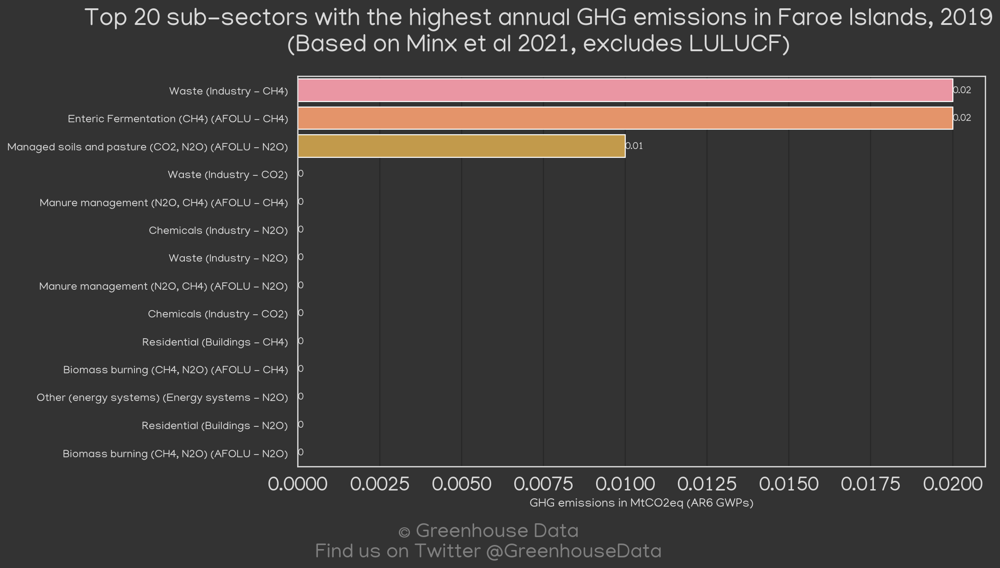
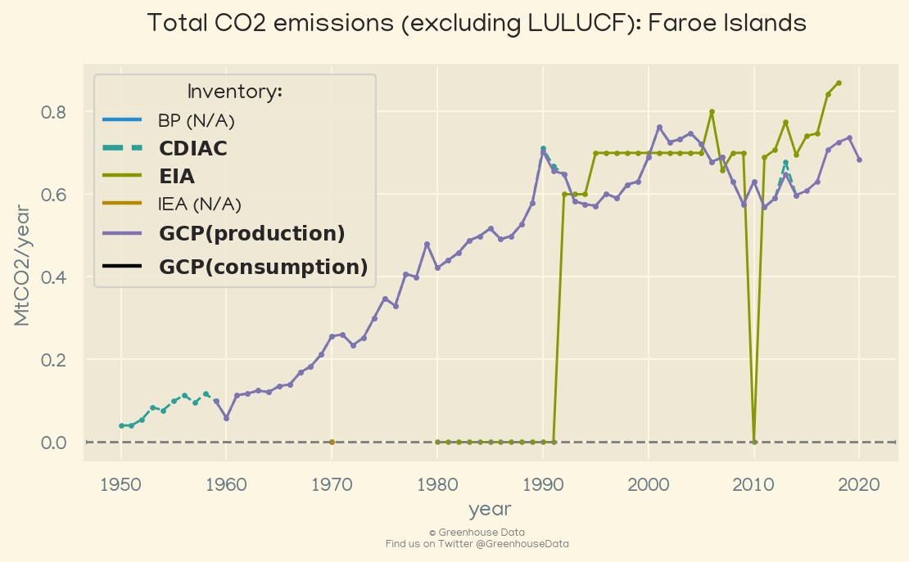
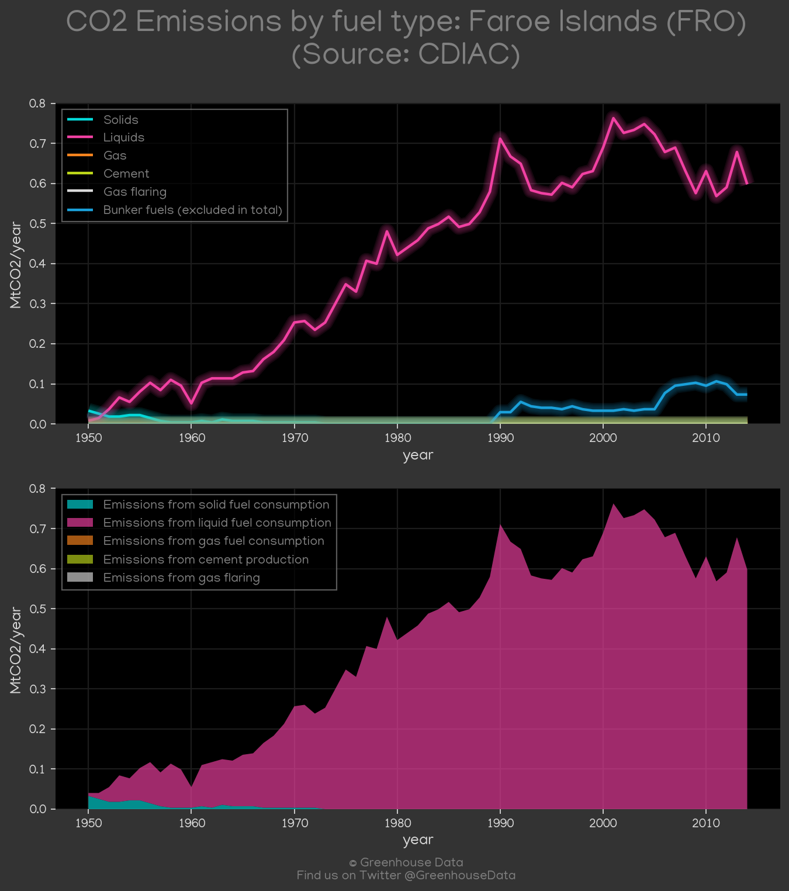
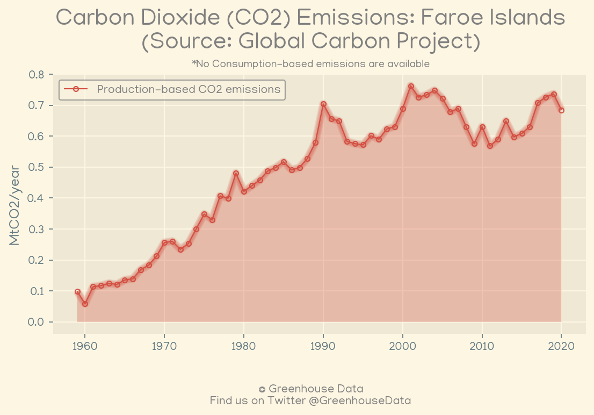
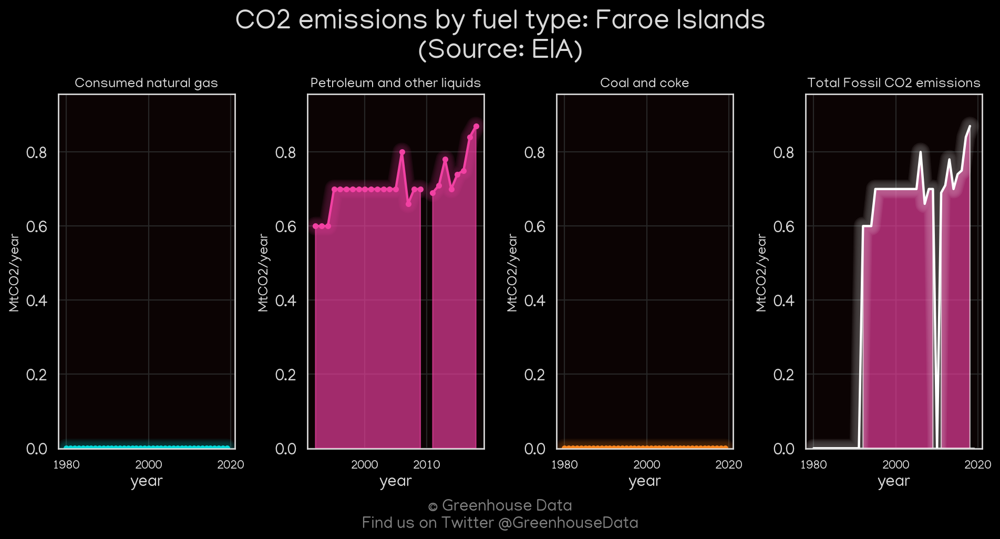

<h1 align="center">
🇫🇴🇫🇴🇫🇴🇫🇴🇫🇴
 
Faroe Islands
 
🇫🇴🇫🇴🇫🇴🇫🇴🇫🇴
</h1>
<h2>Datasets:</h2>

<a href="https://github.com/dquintani/GreenhouseData/tree/master/country_data/FRO_Faroe Islands/data">View on Github</a>
 

<a href="data/FRO_FAO.csv">FAO</a> || <a href="data/FRO_GCP_consupmption.csv">GCP_consupmption</a> || <a href="data/FRO_GCP_cons.csv">GCP_cons</a> || <a href="data/FRO_CDIAC.csv">CDIAC</a> || <a href="data/FRO_Minx_2021.csv">Minx_2021</a> || <a href="data/FRO_EDGAR.csv">EDGAR</a> || <a href="data/FRO_EIA.csv">EIA</a> || <a href="data/FRO_GCP.csv">GCP</a>

 

<h1>Figures:</h1><h2>#1 (FRO_BP_1)</h2>

<h2>#2 (FRO_Minx_top20_subsectors)</h2>

<h2>#3 (FRO_CO2_totals)</h2>

<h2>#4 (FRO_CDIAC_1)</h2>

<h2>#5 (FRO_GCP_1)</h2>

<h2>#6 (FRO_EIA_1)</h2>

