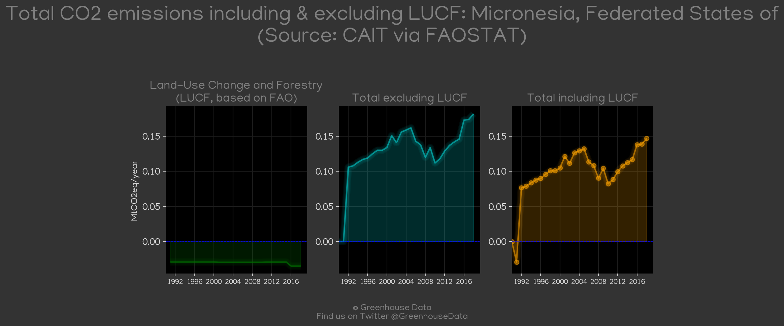
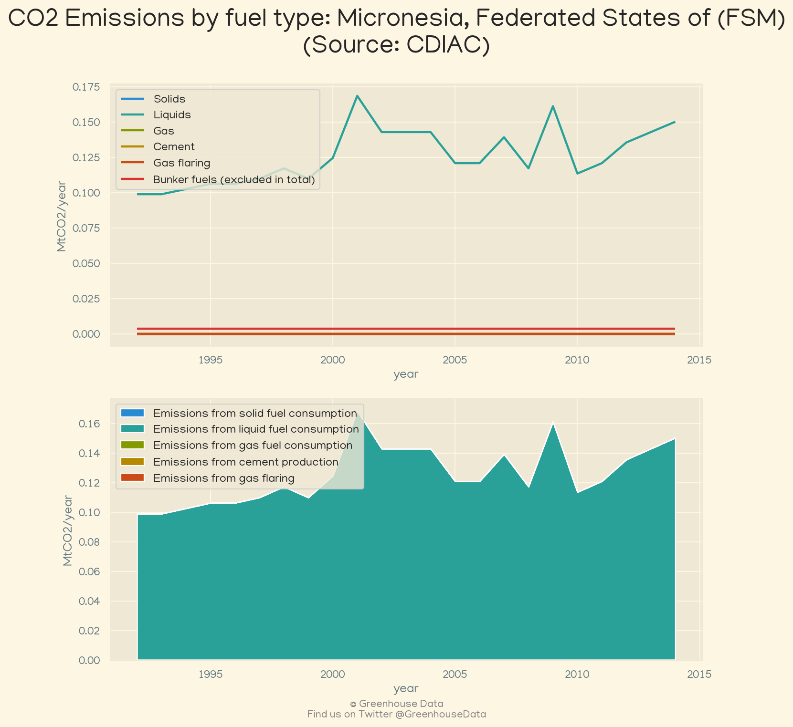
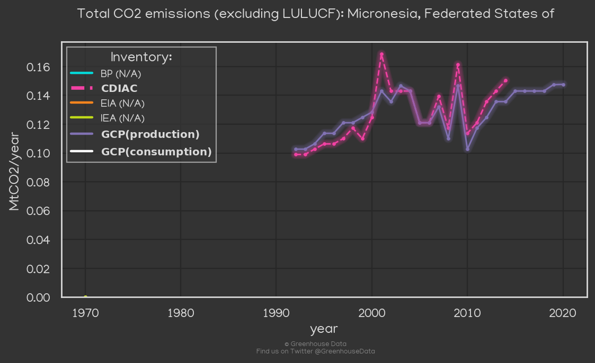
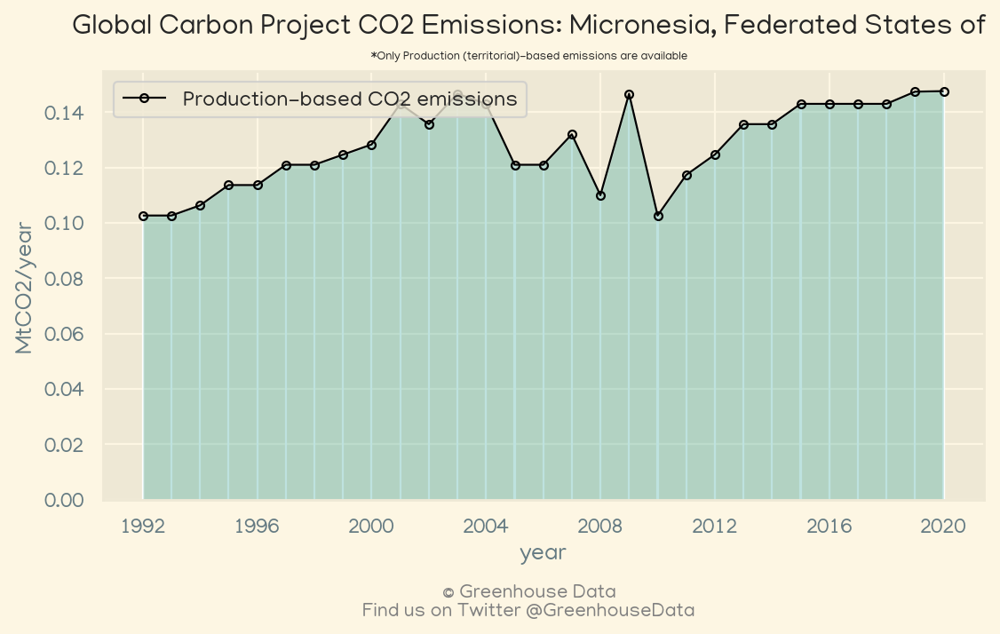
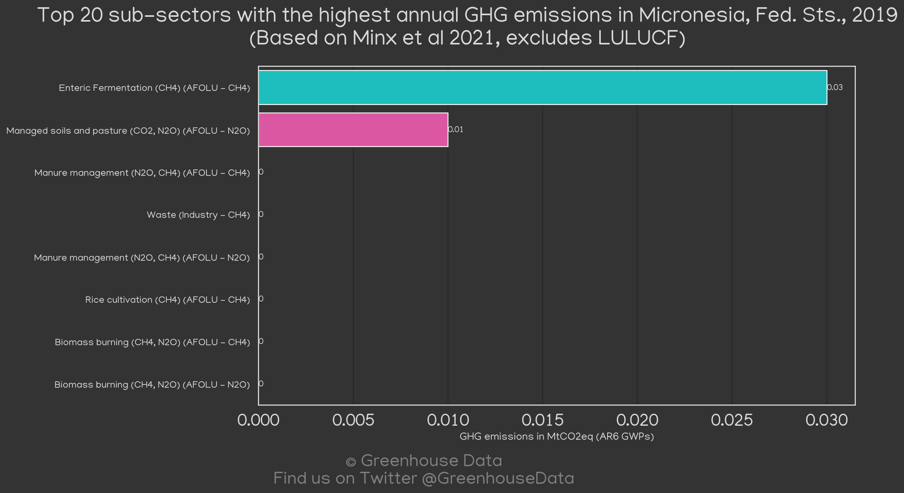
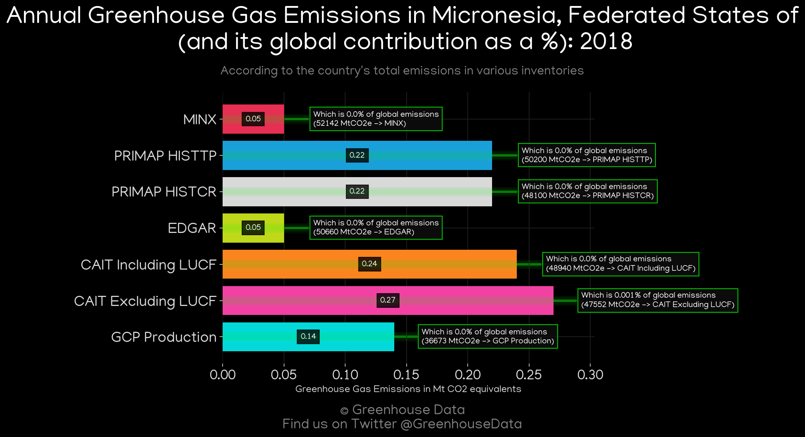
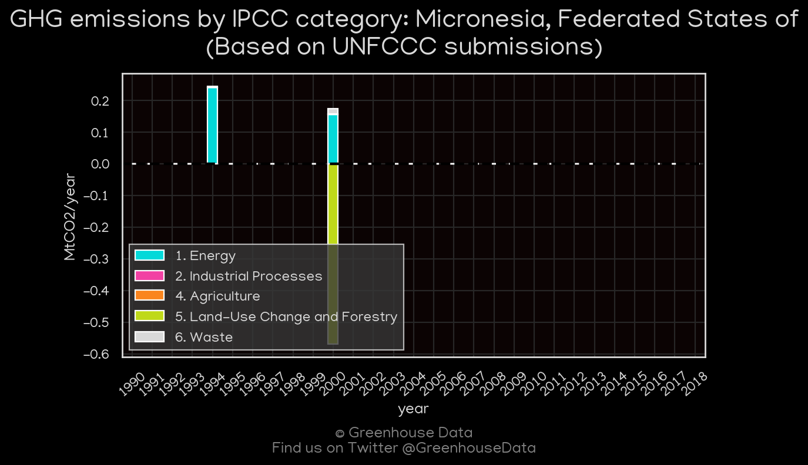

<h1 align="center">
🇫🇲🇫🇲🇫🇲🇫🇲🇫🇲
 
Micronesia, Federated States of
 
🇫🇲🇫🇲🇫🇲🇫🇲🇫🇲
</h1>
<h2>Datasets:</h2>

<a href="https://github.com/dquintani/GreenhouseData/tree/master/country_data/FSM_Micronesia, Federated States of/data">View on Github</a>
 

<a href="data/FSM_CAIT.csv">CAIT</a> || <a href="data/FSM_CDIAC.csv">CDIAC</a> || <a href="data/FSM_EDGAR.csv">EDGAR</a> || <a href="data/FSM_EPA.csv">EPA</a> || <a href="data/FSM_FAO.csv">FAO</a> || <a href="data/FSM_GCP.csv">GCP</a> || <a href="data/FSM_GCP_consupmption.csv">GCP_consupmption</a> || <a href="data/FSM_Minx_2021.csv">Minx_2021</a> || <a href="data/FSM_PRIMAP-hist.csv">PRIMAP-hist</a>

 

<h1>Figures:</h1><h2>#1 (FSM_CAIT_gases_1)</h2>

<h2>#2 (FSM_CAIT_lucf_vs_nolucf)</h2>

<h2>#3 (FSM_CDIAC_1)</h2>

<h2>#4 (FSM_CO2_totals)</h2>

<h2>#5 (FSM_GCP_1)</h2>

<h2>#6 (FSM_Minx_top20_subsectors)</h2>

<h2>#7 (FSM_relative_totals)</h2>

<h2>#8 (FSM_UNFCCC_NAI_1)</h2>

