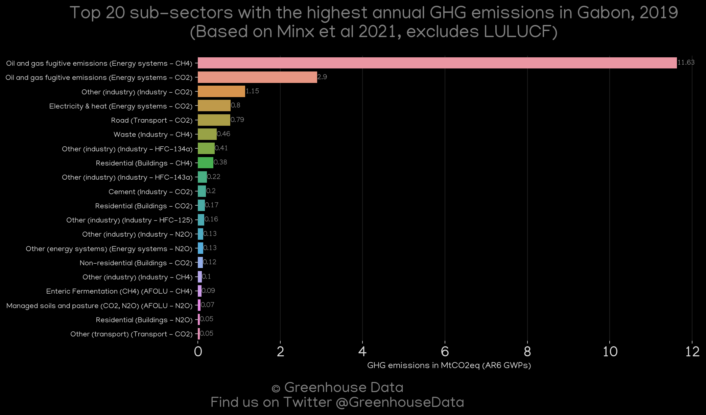
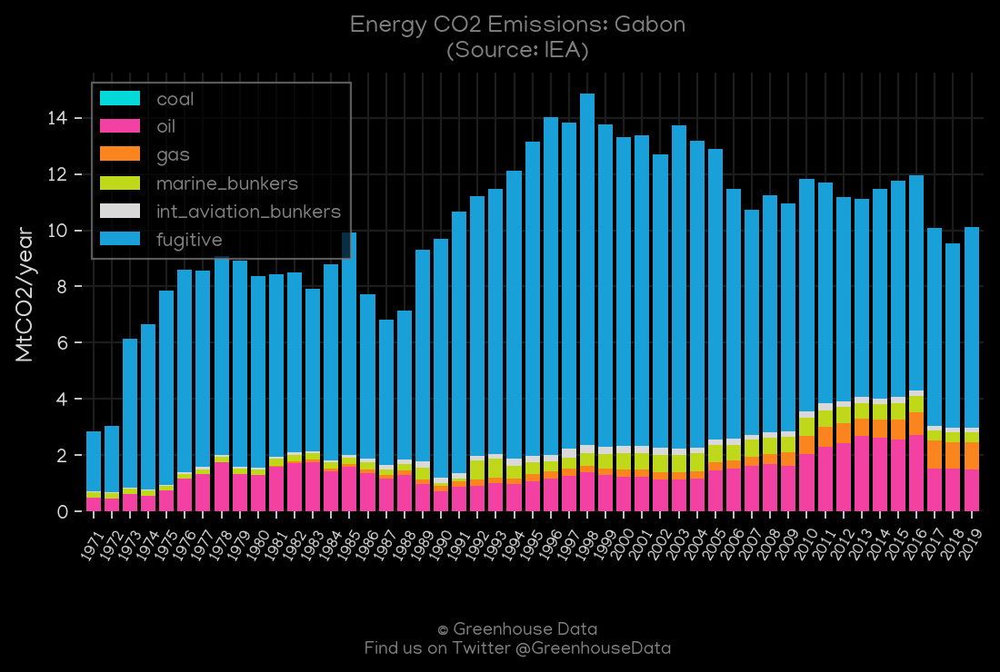
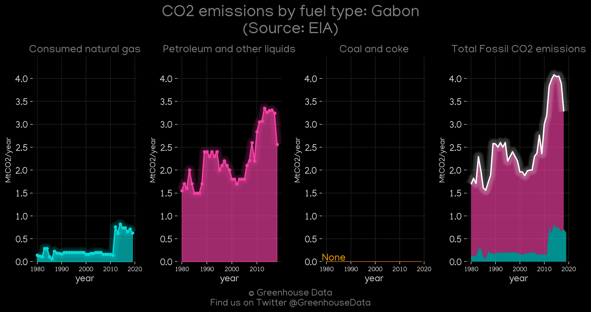
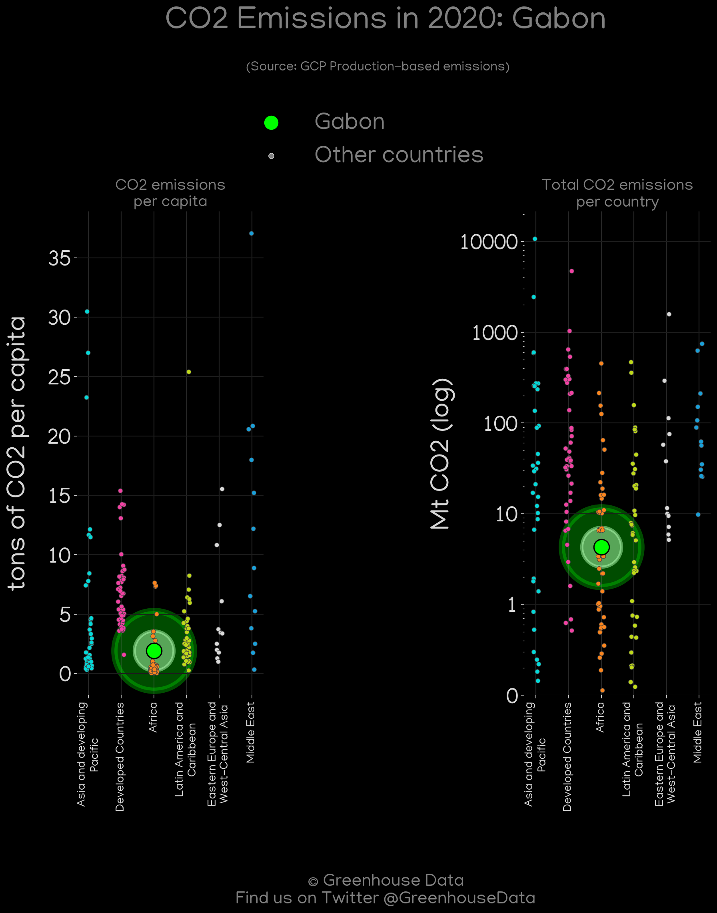
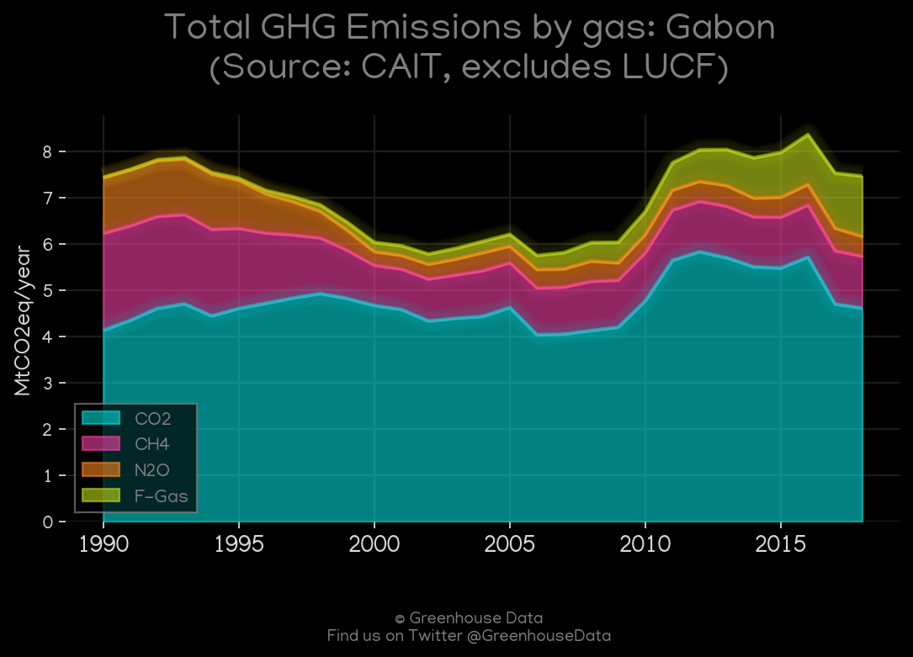
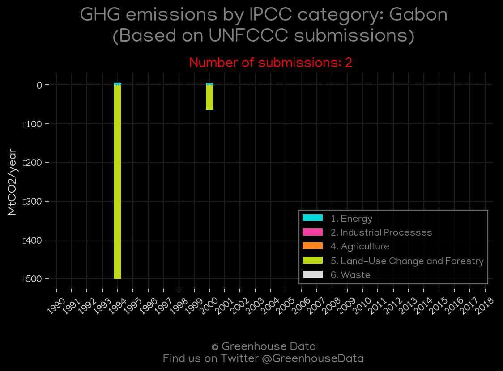

<h1 align="center">
🇬🇦🇬🇦🇬🇦🇬🇦🇬🇦
 
Gabon
 
🇬🇦🇬🇦🇬🇦🇬🇦🇬🇦
</h1>
<h2>Datasets:</h2>

<a href="https://github.com/dquintani/GreenhouseData/tree/master/country_data/GAB_Gabon/data">View on Github</a>
 

<a href="data/GAB_PRIMAP-hist.csv">PRIMAP-hist</a> || <a href="data/GAB_GCP_consupmption.csv">GCP_consupmption</a> || <a href="data/GAB_IEA.csv">IEA</a> || <a href="data/GAB_CAIT.csv">CAIT</a> || <a href="data/GAB_Minx_2021.csv">Minx_2021</a> || <a href="data/GAB_EPA.csv">EPA</a> || <a href="data/GAB_EDGAR.csv">EDGAR</a> || <a href="data/GAB_GCP.csv">GCP</a> || <a href="data/GAB_EIA.csv">EIA</a> || <a href="data/GAB_FAO.csv">FAO</a> || <a href="data/GAB_CDIAC.csv">CDIAC</a>

 

<h1>Figures:</h1><h2>#1 (GAB_Minx_top20_subsectors)</h2>

<h2>#2 (GAB_CO2_totals)</h2>

<h2>#3 (GAB_GCP_1)</h2>

<h2>#4 (GAB_IEA_1)</h2>

<h2>#5 (GAB_EIA_1)</h2>

<h2>#6 (GAB_GCP_Country_Highlight)</h2>

<h2>#7 (GAB_CDIAC_1)</h2>

<h2>#8 (GAB_relative_totals)</h2>

<h2>#9 (GAB_CAIT_gases_1)</h2>

<h2>#10 (GAB_UNFCCC_NAI_1)</h2>

<h2>#11 (GAB_CAIT_lucf_vs_nolucf)</h2>

