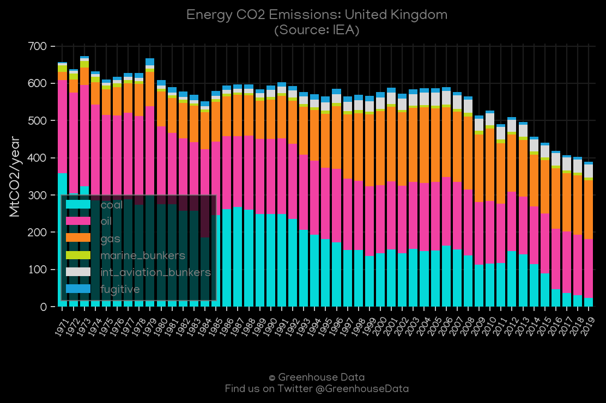
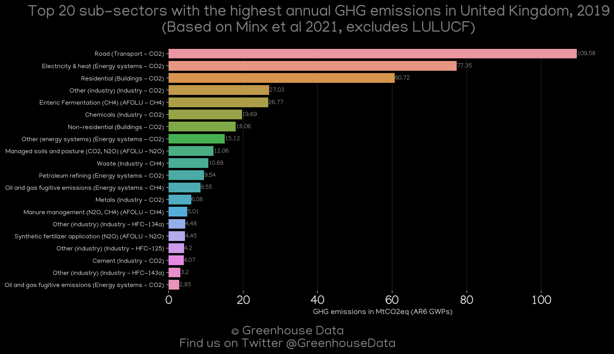
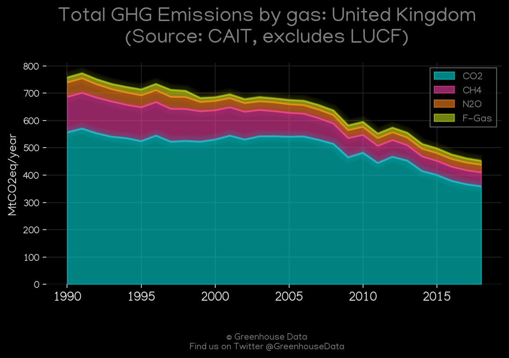
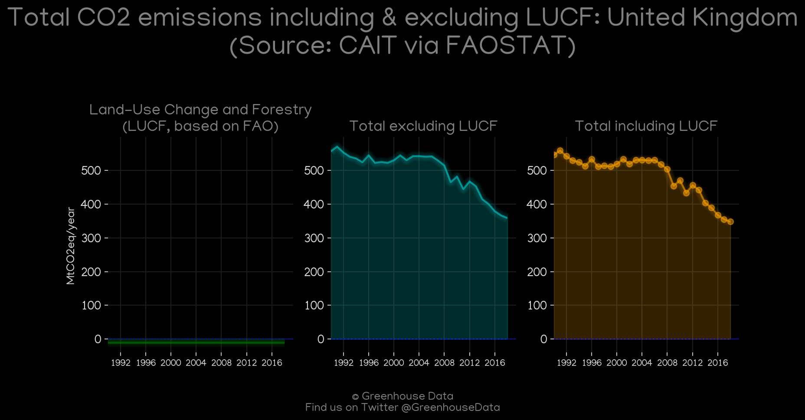
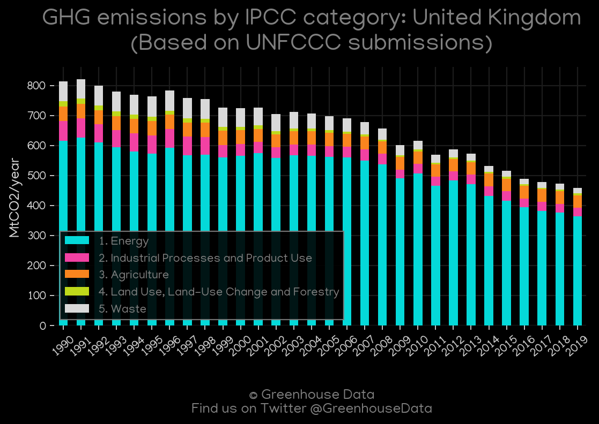
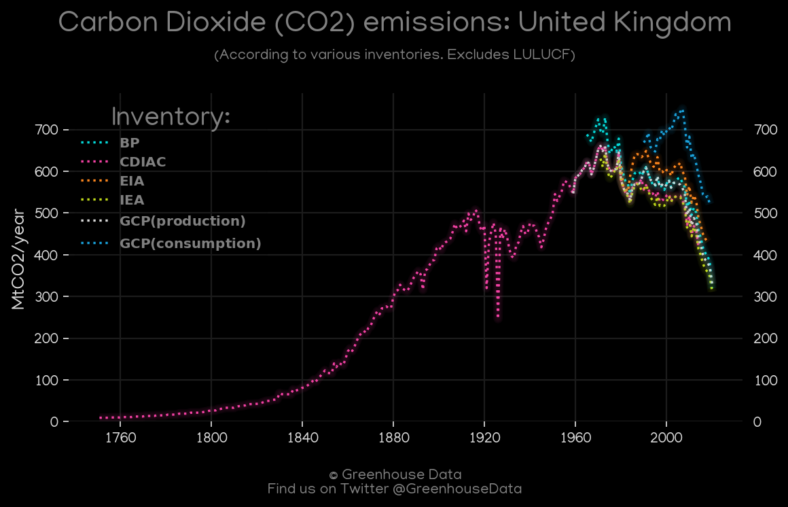
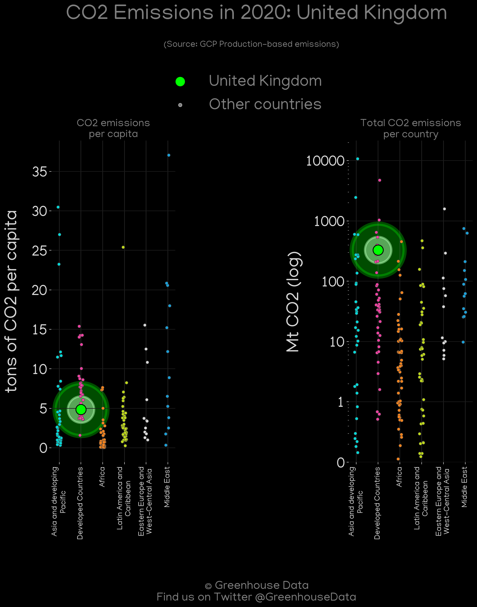
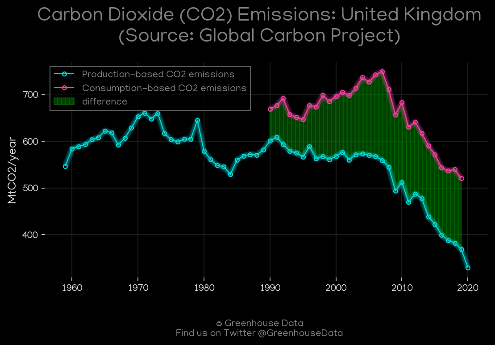
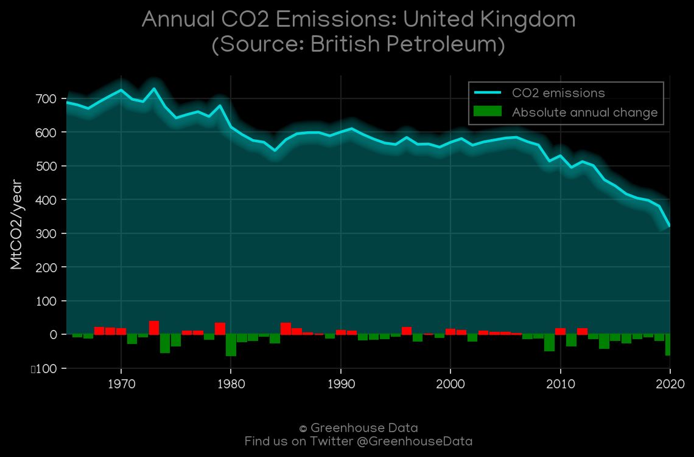

<h1 align="center">
🇬🇧🇬🇧🇬🇧🇬🇧🇬🇧
 
United Kingdom
 
🇬🇧🇬🇧🇬🇧🇬🇧🇬🇧
</h1>
<h2>Datasets:</h2>

<a href="https://github.com/dquintani/GreenhouseData/tree/master/country_data/GBR_United Kingdom/data">View on Github</a>
 

<a href="data/GBR_PRIMAP-hist.csv">PRIMAP-hist</a> || <a href="data/GBR_CDIAC.csv">CDIAC</a> || <a href="data/GBR_EIA.csv">EIA</a> || <a href="data/GBR_IEA.csv">IEA</a> || <a href="data/GBR_EPA.csv">EPA</a> || <a href="data/GBR_GCP_consupmption.csv">GCP_consupmption</a> || <a href="data/GBR_EDGAR.csv">EDGAR</a> || <a href="data/GBR_FAO.csv">FAO</a> || <a href="data/GBR_BP.csv">BP</a> || <a href="data/GBR_CAIT.csv">CAIT</a> || <a href="data/GBR_Minx_2021.csv">Minx_2021</a> || <a href="data/GBR_GCP.csv">GCP</a>

 

<h1>Figures:</h1><h2>#1 (GBR_CDIAC_1)</h2>

<h2>#2 (GBR_IEA_1)</h2>

<h2>#3 (GBR_Minx_top20_subsectors)</h2>

<h2>#4 (GBR_CAIT_gases_1)</h2>

<h2>#5 (GBR_EIA_1)</h2>

<h2>#6 (GBR_CAIT_lucf_vs_nolucf)</h2>

<h2>#7 (GBR_UNFCCC_AI_1)</h2>

<h2>#8 (GBR_relative_totals)</h2>

<h2>#9 (GBR_CO2_totals)</h2>

<h2>#10 (GBR_GCP_Country_Highlight)</h2>

<h2>#11 (GBR_GCP_1)</h2>

<h2>#12 (GBR_BP_1)</h2>

