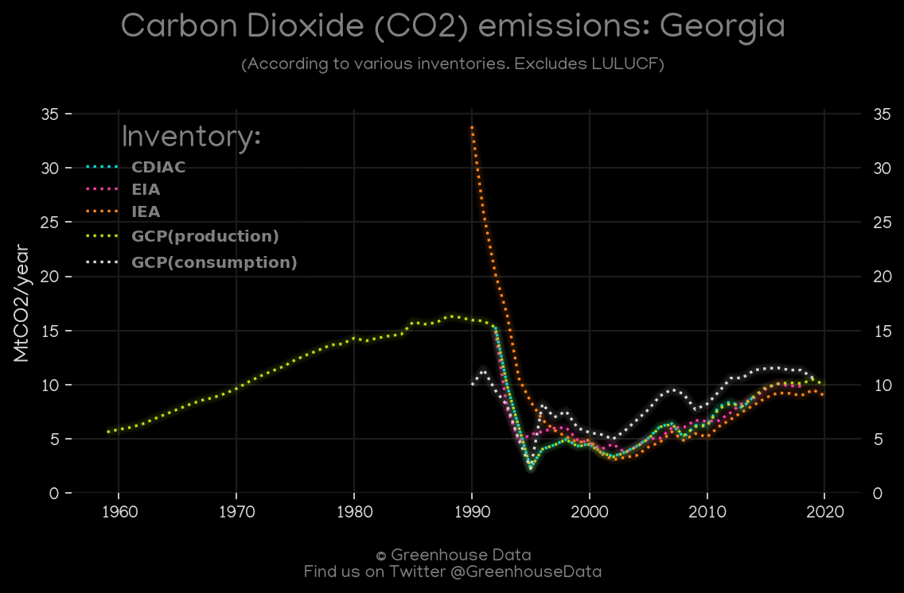
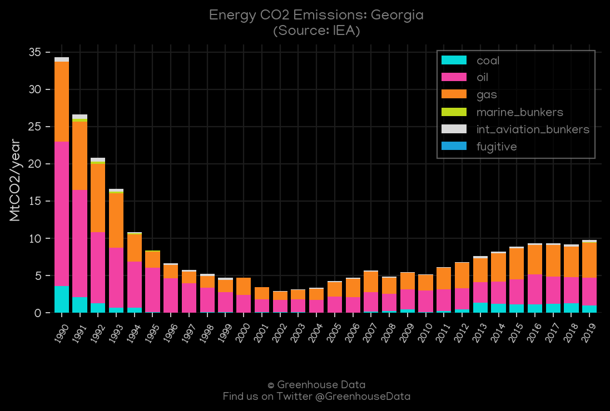
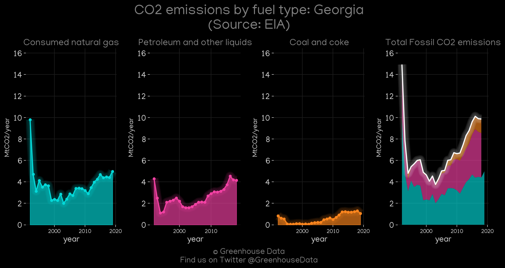
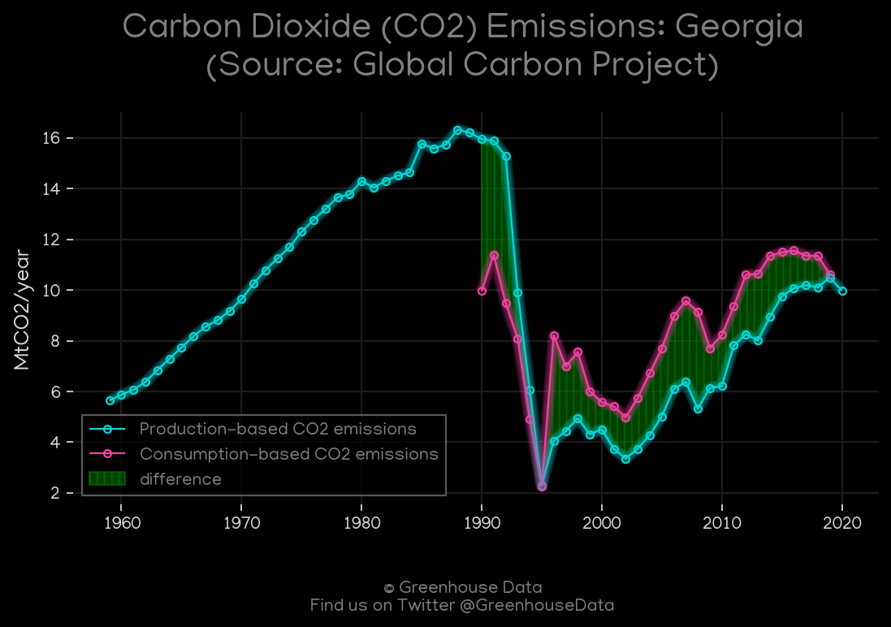
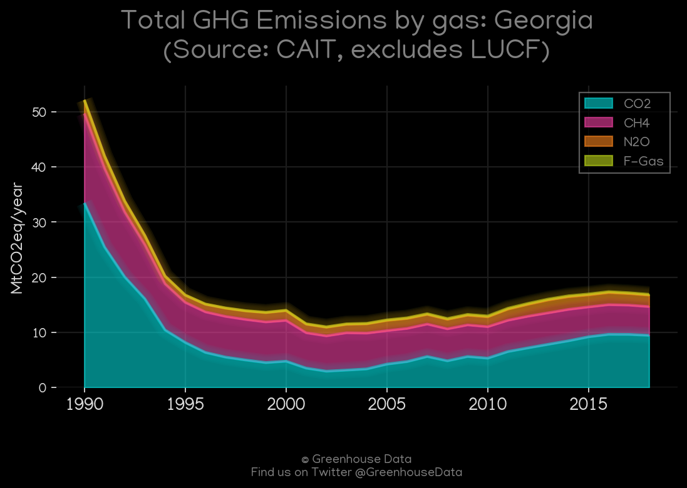
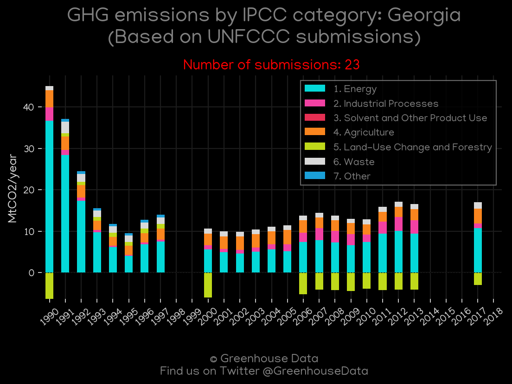
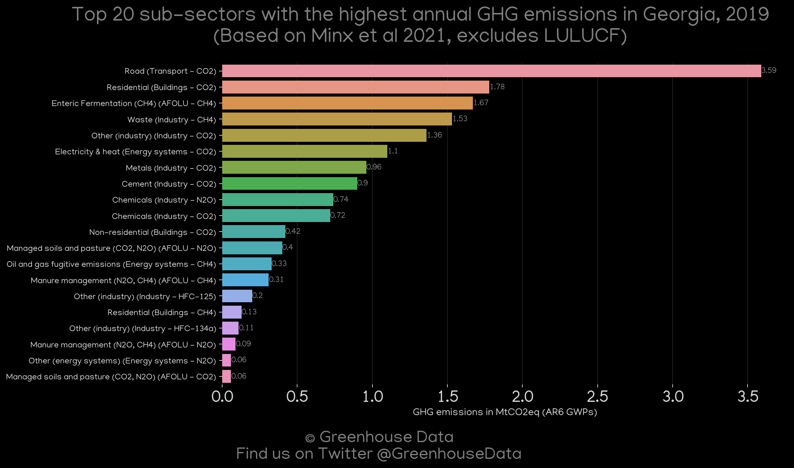

<h1 align="center">
🇬🇪🇬🇪🇬🇪🇬🇪🇬🇪
 
Georgia
 
🇬🇪🇬🇪🇬🇪🇬🇪🇬🇪
</h1>
<h2>Datasets:</h2>

<a href="https://github.com/dquintani/Greenhouse-Data/tree/master/country_data/GEO_Georgia/data">View on Github</a>
 

<a href="data/GEO_EIA.csv">EIA</a> || <a href="data/GEO_GCP_cons.csv">GCP_cons</a> || <a href="data/GEO_CDIAC.csv">CDIAC</a> || <a href="data/GEO_GCP_consupmption.csv">GCP_consupmption</a> || <a href="data/GEO_FAO.csv">FAO</a> || <a href="data/GEO_CAIT.csv">CAIT</a> || <a href="data/GEO_EPA.csv">EPA</a> || <a href="data/GEO_IEA.csv">IEA</a> || <a href="data/GEO_Minx_2021.csv">Minx_2021</a> || <a href="data/GEO_GCP.csv">GCP</a> || <a href="data/GEO_EDGAR.csv">EDGAR</a> || <a href="data/GEO_PRIMAP-hist.csv">PRIMAP-hist</a>

 

<h1>Figures:</h1><h2>#1 (GEO_CO2_totals)</h2>

<h2>#2 (GEO_IEA_1)</h2>

<h2>#3 (GEO_EIA_1)</h2>

<h2>#4 (GEO_GCP_1)</h2>

<h2>#5 (GEO_CDIAC_1)</h2>

<h2>#6 (GEO_CAIT_gases_1)</h2>

<h2>#7 (GEO_UNFCCC_NAI_1)</h2>

<h2>#8 (GEO_Minx_top20_subsectors)</h2>

