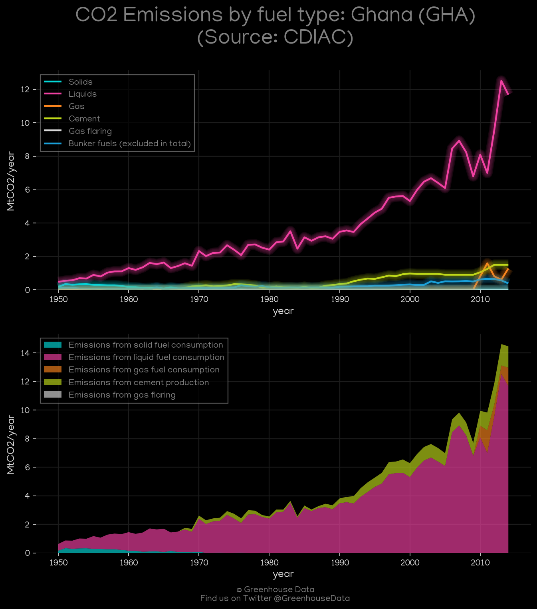
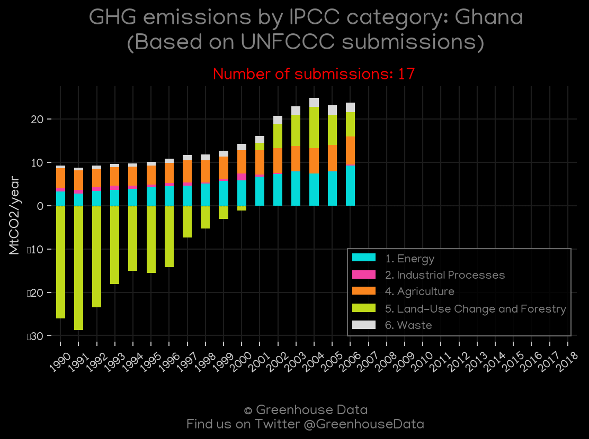
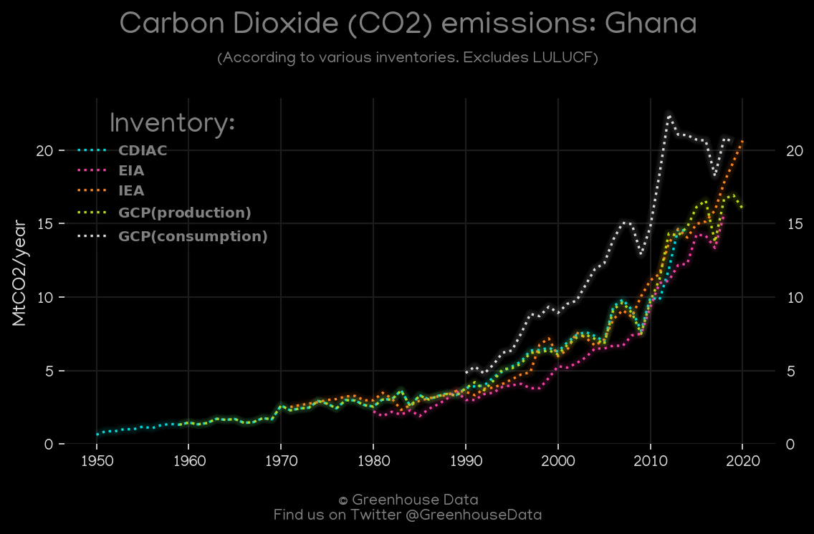
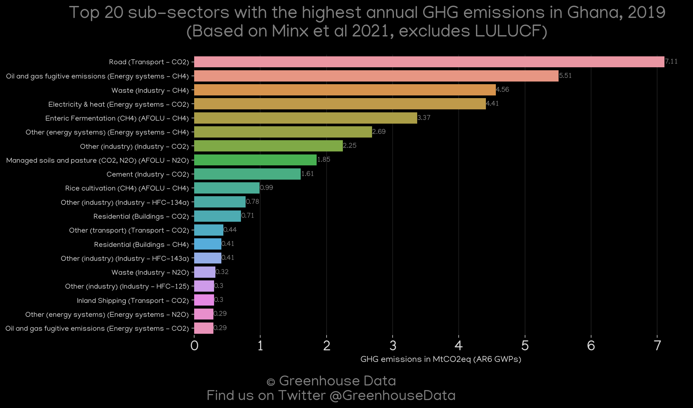
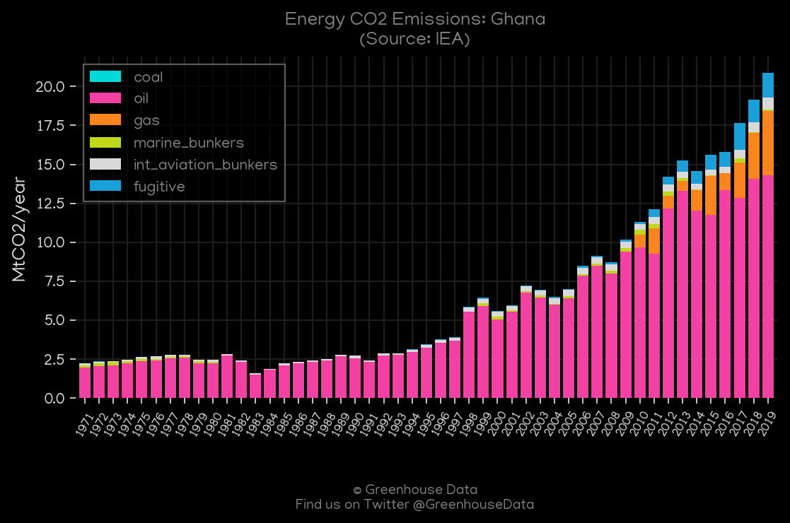
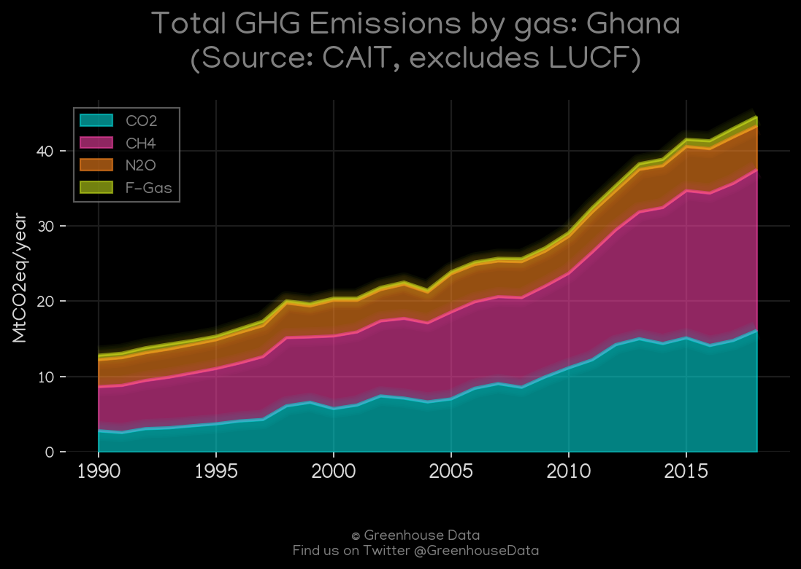
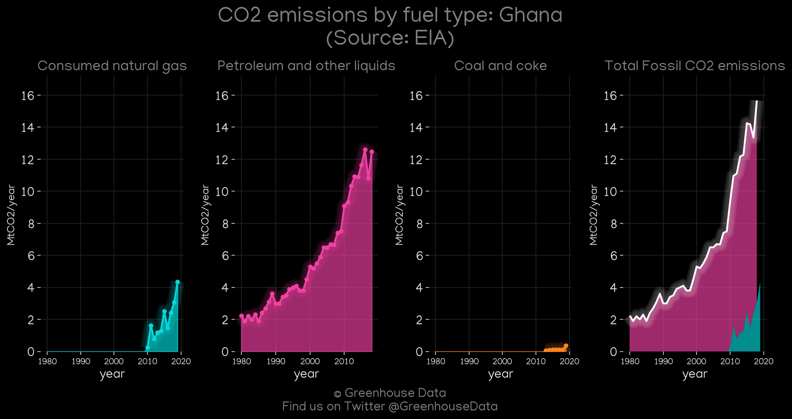

<h1 align="center">
🇬🇭🇬🇭🇬🇭🇬🇭🇬🇭
 
Ghana
 
🇬🇭🇬🇭🇬🇭🇬🇭🇬🇭
</h1>
<h2>Datasets:</h2>

<a href="https://github.com/dquintani/GreenhouseData/tree/master/country_data/GHA_Ghana/data">View on Github</a>
 

<a href="data/GHA_CAIT.csv">CAIT</a> || <a href="data/GHA_GCP_consupmption.csv">GCP_consupmption</a> || <a href="data/GHA_IEA.csv">IEA</a> || <a href="data/GHA_GCP_cons.csv">GCP_cons</a> || <a href="data/GHA_GCP.csv">GCP</a> || <a href="data/GHA_FAO.csv">FAO</a> || <a href="data/GHA_EDGAR.csv">EDGAR</a> || <a href="data/GHA_PRIMAP-hist.csv">PRIMAP-hist</a> || <a href="data/GHA_EIA.csv">EIA</a> || <a href="data/GHA_EPA.csv">EPA</a> || <a href="data/GHA_Minx_2021.csv">Minx_2021</a> || <a href="data/GHA_CDIAC.csv">CDIAC</a>

 

<h1>Figures:</h1><h2>#1 (GHA_CDIAC_1)</h2>

<h2>#2 (GHA_BP_1)</h2>

<h2>#3 (GHA_UNFCCC_NAI_1)</h2>

<h2>#4 (GHA_CO2_totals)</h2>

<h2>#5 (GHA_GCP_1)</h2>

<h2>#6 (GHA_Minx_top20_subsectors)</h2>

<h2>#7 (GHA_IEA_1)</h2>

<h2>#8 (GHA_CAIT_gases_1)</h2>

<h2>#9 (GHA_EIA_1)</h2>

