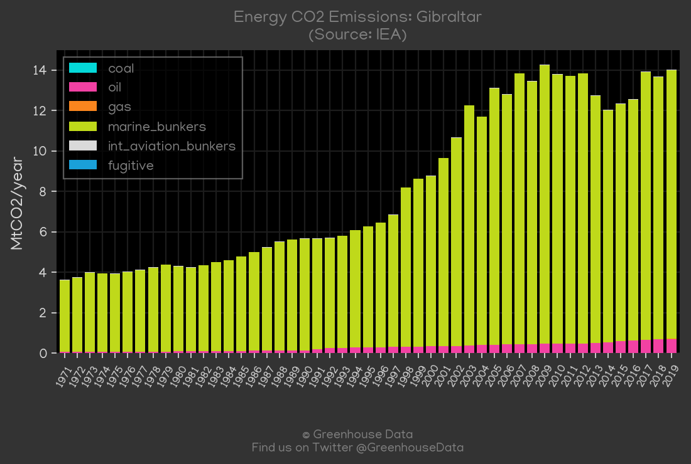
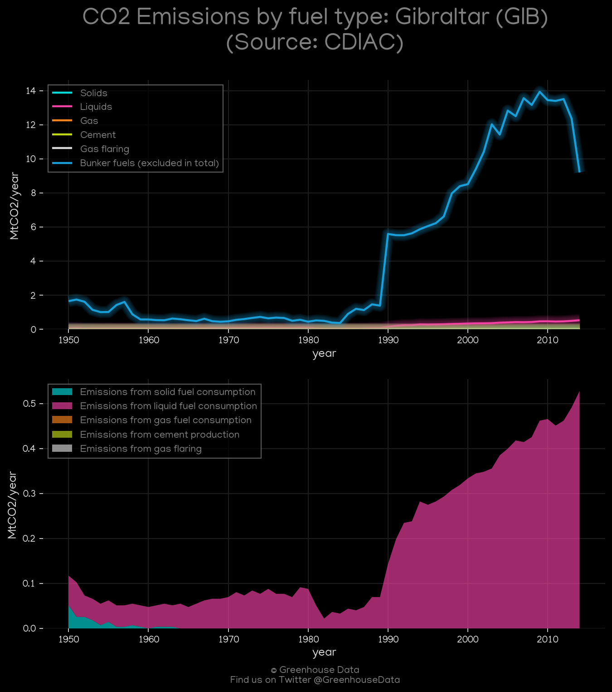
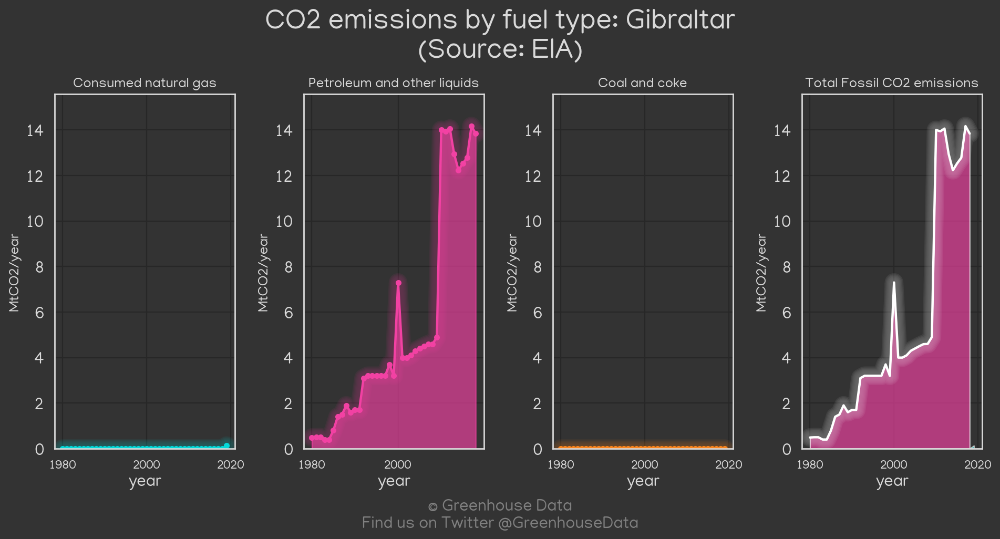
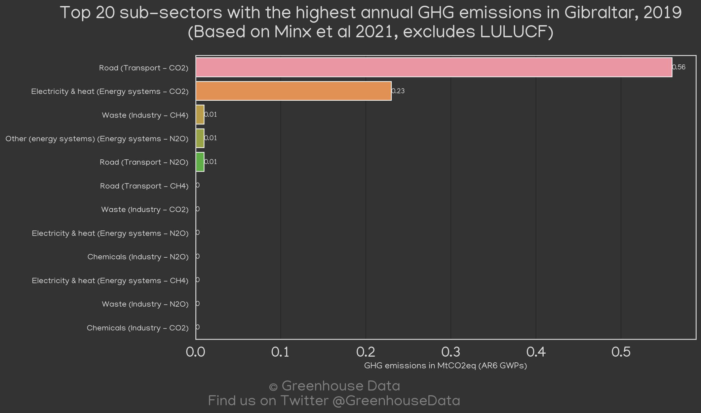
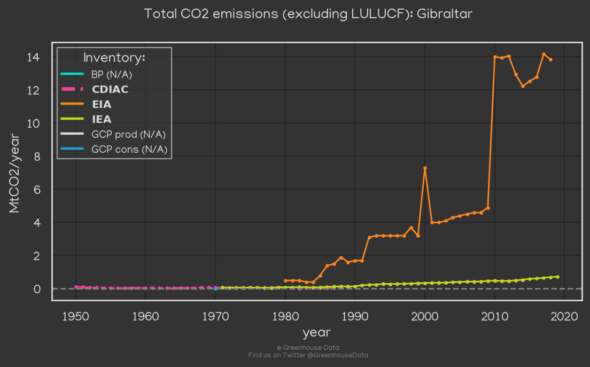

<h1 align="center">
🇬🇮🇬🇮🇬🇮🇬🇮🇬🇮
 
Gibraltar
 
🇬🇮🇬🇮🇬🇮🇬🇮🇬🇮
</h1>
<h2>Datasets:</h2>

<a href="https://github.com/dquintani/Greenhouse-Data/tree/master/country_data/GIB_Gibraltar/data">View on Github</a>
 

<a href="data/GIB_EIA.csv">EIA</a> || <a href="data/GIB_EDGAR.csv">EDGAR</a> || <a href="data/GIB_IEA.csv">IEA</a> || <a href="data/GIB_FAO.csv">FAO</a> || <a href="data/GIB_Minx_2021.csv">Minx_2021</a> || <a href="data/GIB_CDIAC.csv">CDIAC</a>

 

<h1>Figures:</h1><h2>#1 (GIB_IEA_1)</h2>

<h2>#2 (GIB_CDIAC_1)</h2>

<h2>#3 (GIB_EIA_1)</h2>

<h2>#4 (GIB_Minx_top20_subsectors)</h2>

<h2>#5 (GIB_CO2_totals)</h2>

