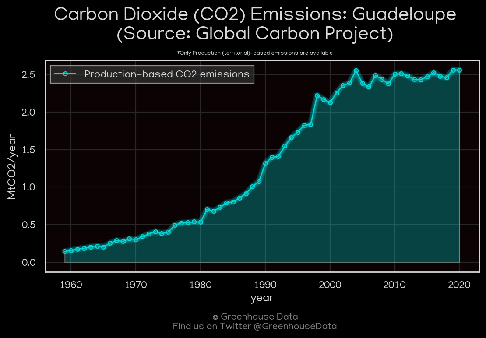
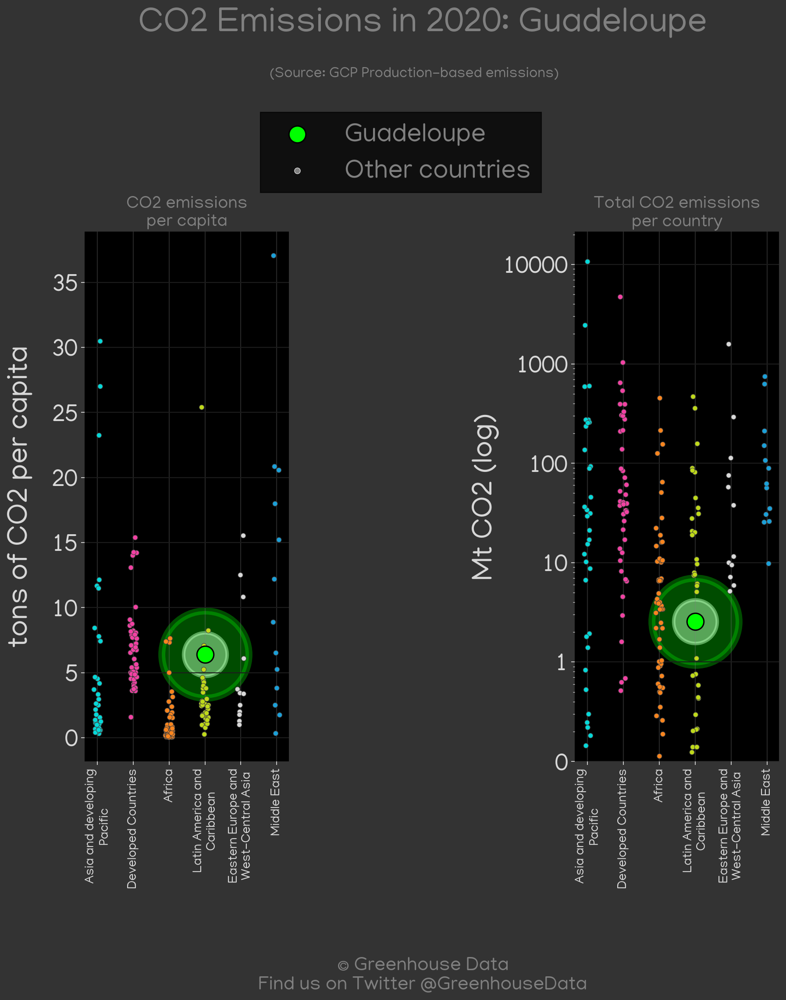
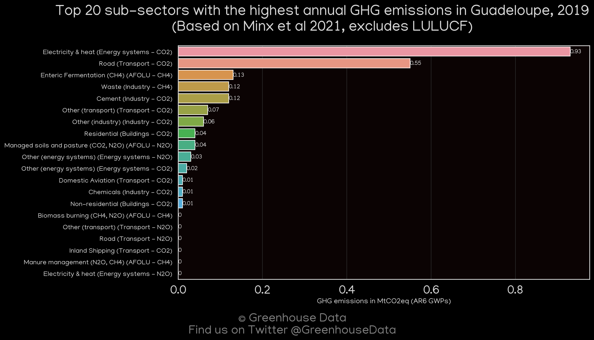
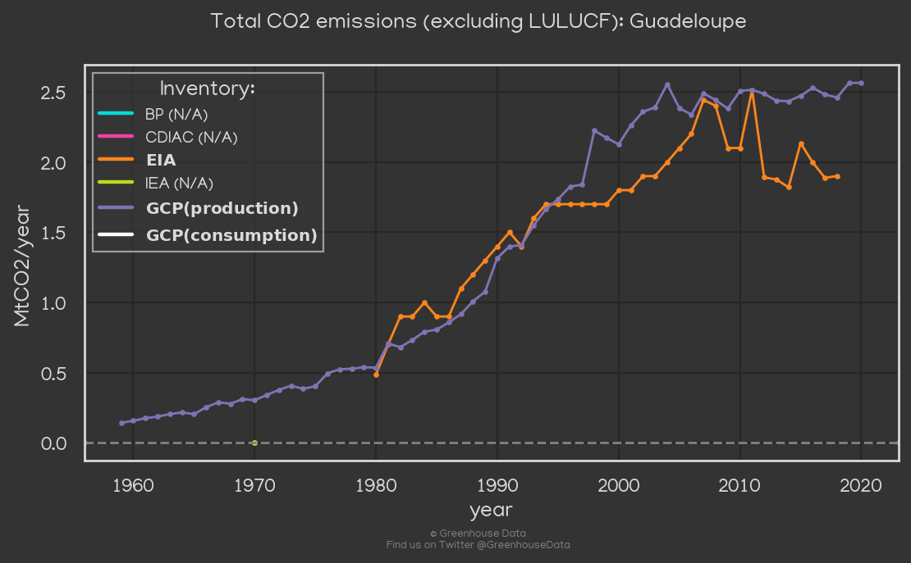
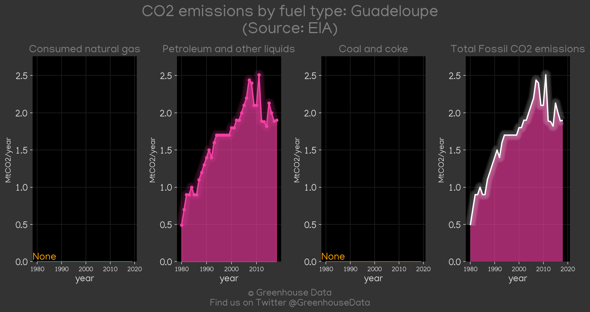

<h1 align="center">
🇬🇵🇬🇵🇬🇵🇬🇵🇬🇵
 
Guadeloupe
 
🇬🇵🇬🇵🇬🇵🇬🇵🇬🇵
</h1>
<h2>Datasets:</h2>

<a href="https://github.com/dquintani/GreenhouseData/tree/master/country_data/GLP_Guadeloupe/data">View on Github</a>
 

<a href="data/GLP_GCP_consupmption.csv">GCP_consupmption</a> || <a href="data/GLP_GCP.csv">GCP</a> || <a href="data/GLP_Minx_2021.csv">Minx_2021</a> || <a href="data/GLP_FAO.csv">FAO</a> || <a href="data/GLP_EIA.csv">EIA</a> || <a href="data/GLP_EDGAR.csv">EDGAR</a>

 

<h1>Figures:</h1><h2>#1 (GLP_GCP_1)</h2>

<h2>#2 (GLP_GCP_Country_Highlight)</h2>

<h2>#3 (GLP_Minx_top20_subsectors)</h2>

<h2>#4 (GLP_CO2_totals)</h2>

<h2>#5 (GLP_EIA_1)</h2>

