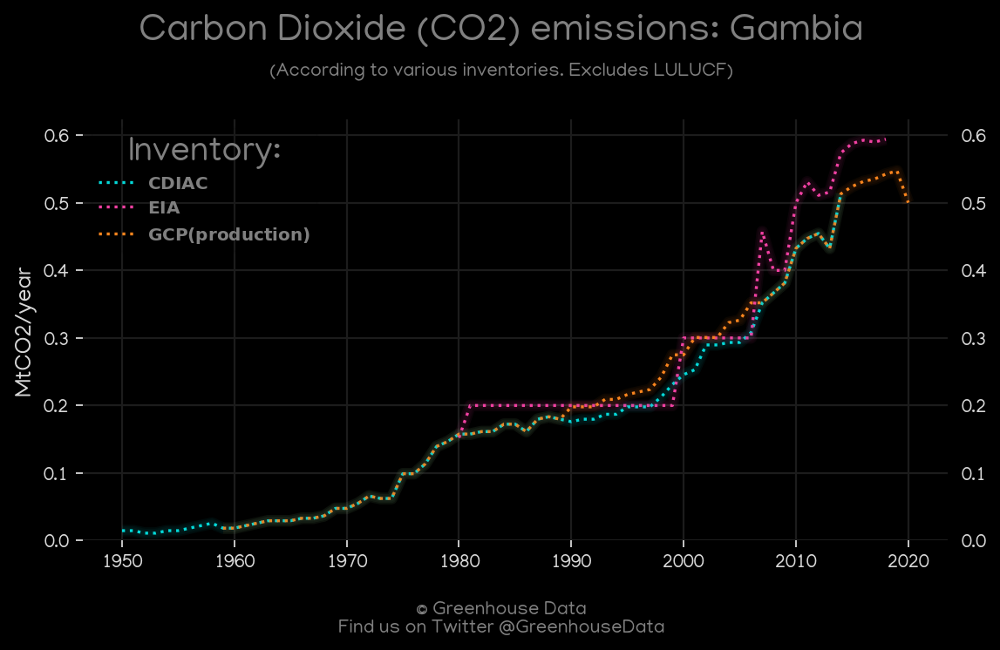
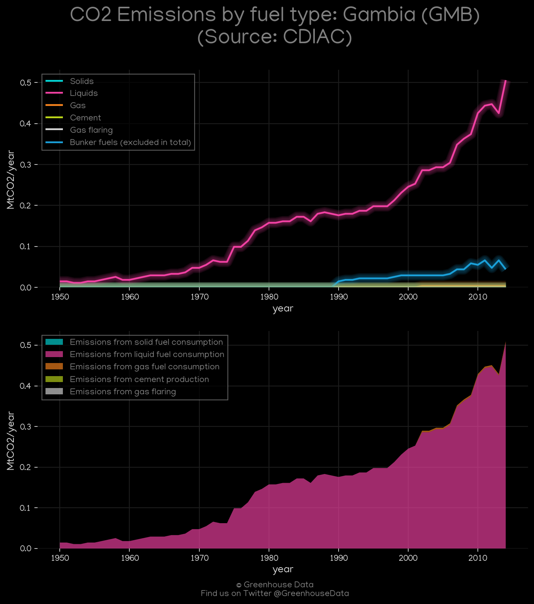
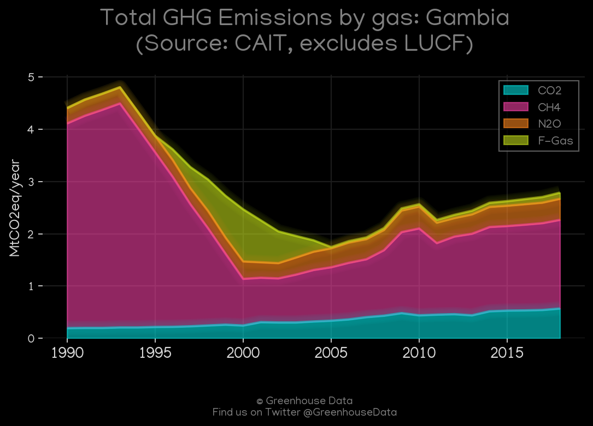
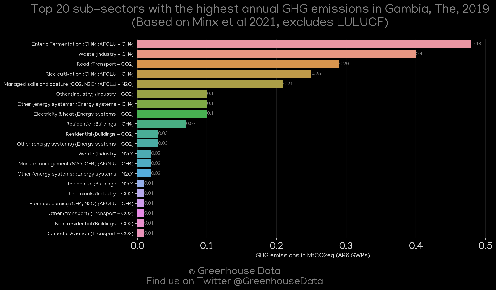
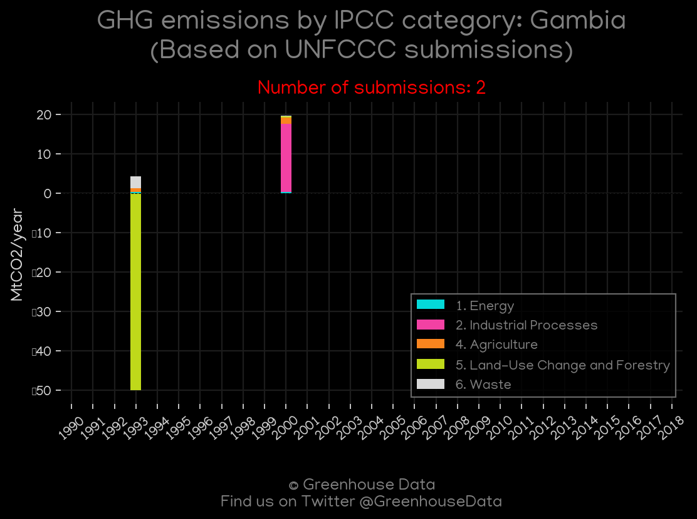
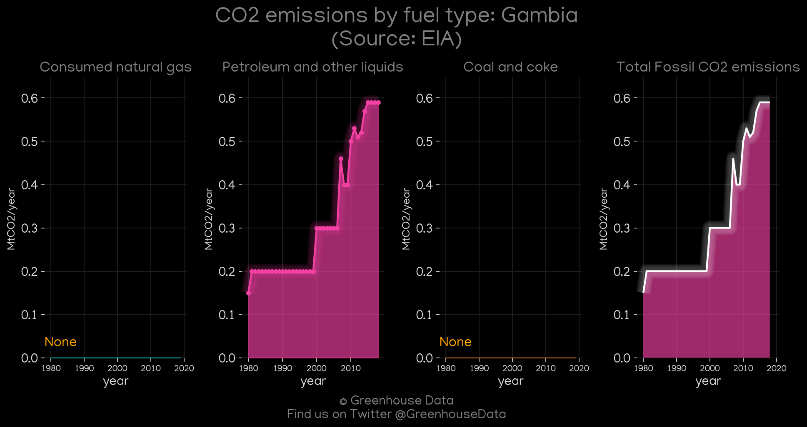

<h1 align="center">
🇬🇲🇬🇲🇬🇲🇬🇲🇬🇲
 
Gambia
 
🇬🇲🇬🇲🇬🇲🇬🇲🇬🇲
</h1>
<h2>Datasets:</h2>

<a href="https://github.com/dquintani/GreenhouseData/tree/master/country_data/GMB_Gambia/data">View on Github</a>
 

<a href="data/GMB_EPA.csv">EPA</a> || <a href="data/GMB_PRIMAP-hist.csv">PRIMAP-hist</a> || <a href="data/GMB_GCP.csv">GCP</a> || <a href="data/GMB_GCP_consupmption.csv">GCP_consupmption</a> || <a href="data/GMB_Minx_2021.csv">Minx_2021</a> || <a href="data/GMB_EDGAR.csv">EDGAR</a> || <a href="data/GMB_FAO.csv">FAO</a> || <a href="data/GMB_CDIAC.csv">CDIAC</a> || <a href="data/GMB_CAIT.csv">CAIT</a> || <a href="data/GMB_EIA.csv">EIA</a>

 

<h1>Figures:</h1><h2>#1 (GMB_GCP_1)</h2>

<h2>#2 (GMB_CO2_totals)</h2>

<h2>#3 (GMB_CDIAC_1)</h2>

<h2>#4 (GMB_CAIT_gases_1)</h2>

<h2>#5 (GMB_Minx_top20_subsectors)</h2>

<h2>#6 (GMB_UNFCCC_NAI_1)</h2>

<h2>#7 (GMB_EIA_1)</h2>

