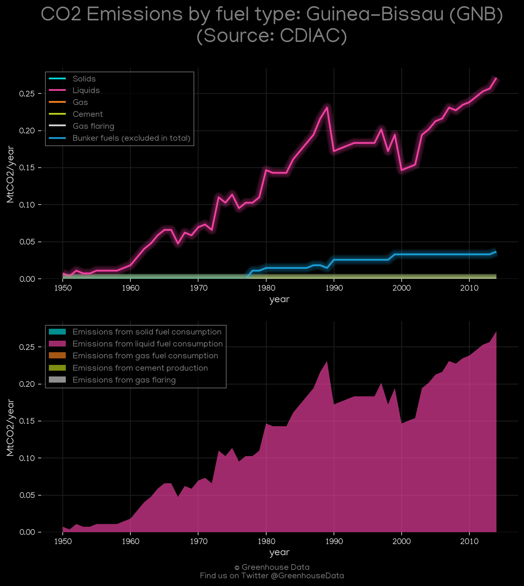
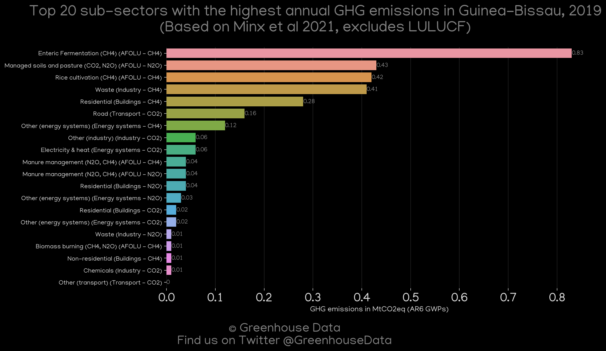
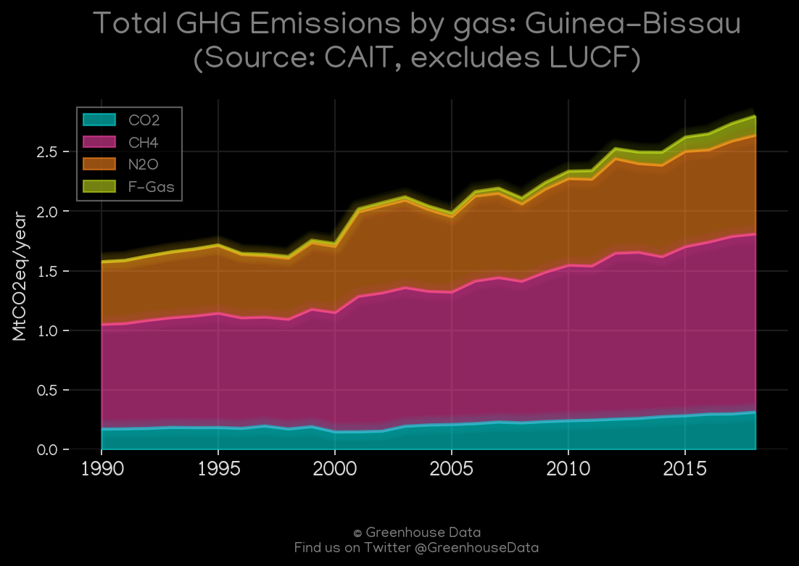
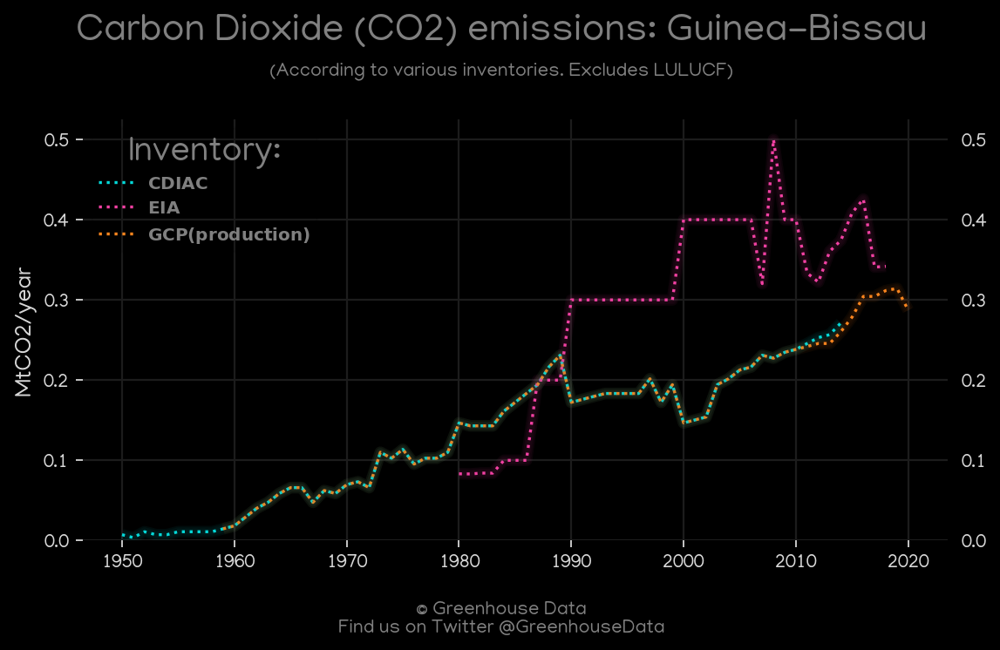
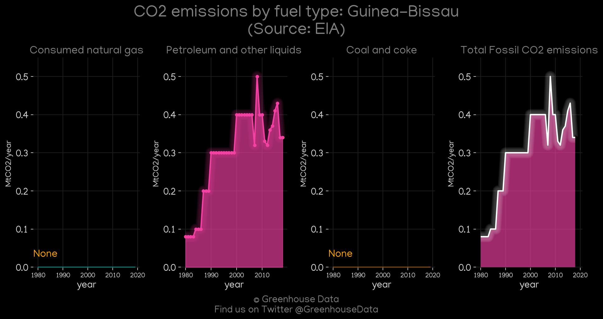
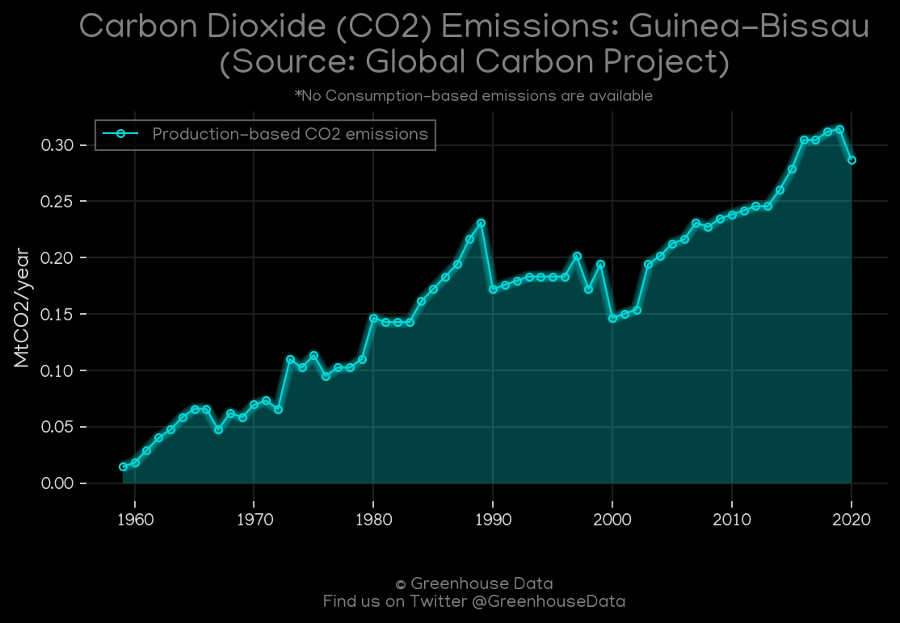
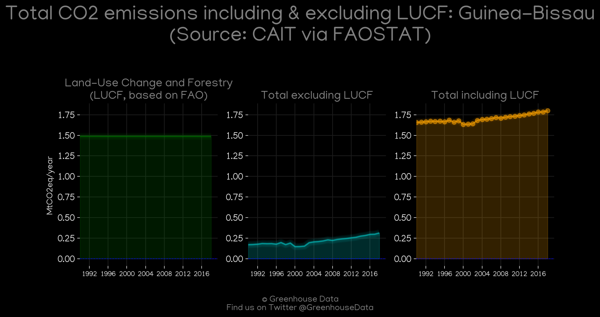

<h1 align="center">
🇬🇼🇬🇼🇬🇼🇬🇼🇬🇼
 
Guinea-Bissau
 
🇬🇼🇬🇼🇬🇼🇬🇼🇬🇼
</h1>
<h2>Datasets:</h2>

<a href="https://github.com/dquintani/GreenhouseData/tree/master/country_data/GNB_Guinea-Bissau/data">View on Github</a>
 

<a href="data/GNB_EDGAR.csv">EDGAR</a> || <a href="data/GNB_EIA.csv">EIA</a> || <a href="data/GNB_Minx_2021.csv">Minx_2021</a> || <a href="data/GNB_CDIAC.csv">CDIAC</a> || <a href="data/GNB_CAIT.csv">CAIT</a> || <a href="data/GNB_GCP_consupmption.csv">GCP_consupmption</a> || <a href="data/GNB_EPA.csv">EPA</a> || <a href="data/GNB_FAO.csv">FAO</a> || <a href="data/GNB_GCP.csv">GCP</a> || <a href="data/GNB_PRIMAP-hist.csv">PRIMAP-hist</a>

 

<h1>Figures:</h1><h2>#1 (GNB_relative_totals)</h2>

<h2>#2 (GNB_CDIAC_1)</h2>

<h2>#3 (GNB_Minx_top20_subsectors)</h2>

<h2>#4 (GNB_CAIT_gases_1)</h2>

<h2>#5 (GNB_CO2_totals)</h2>

<h2>#6 (GNB_UNFCCC_NAI_1)</h2>

<h2>#7 (GNB_EIA_1)</h2>

<h2>#8 (GNB_GCP_1)</h2>

<h2>#9 (GNB_GCP_Country_Highlight)</h2>

<h2>#10 (GNB_CAIT_lucf_vs_nolucf)</h2>

