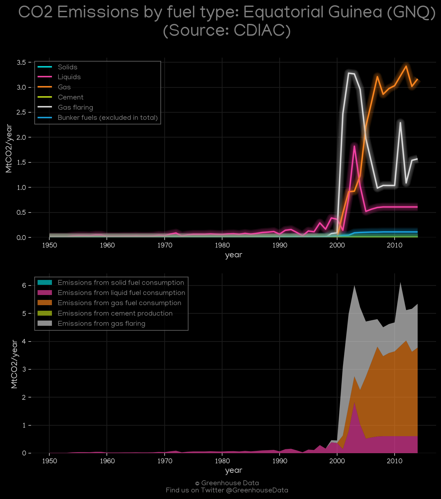
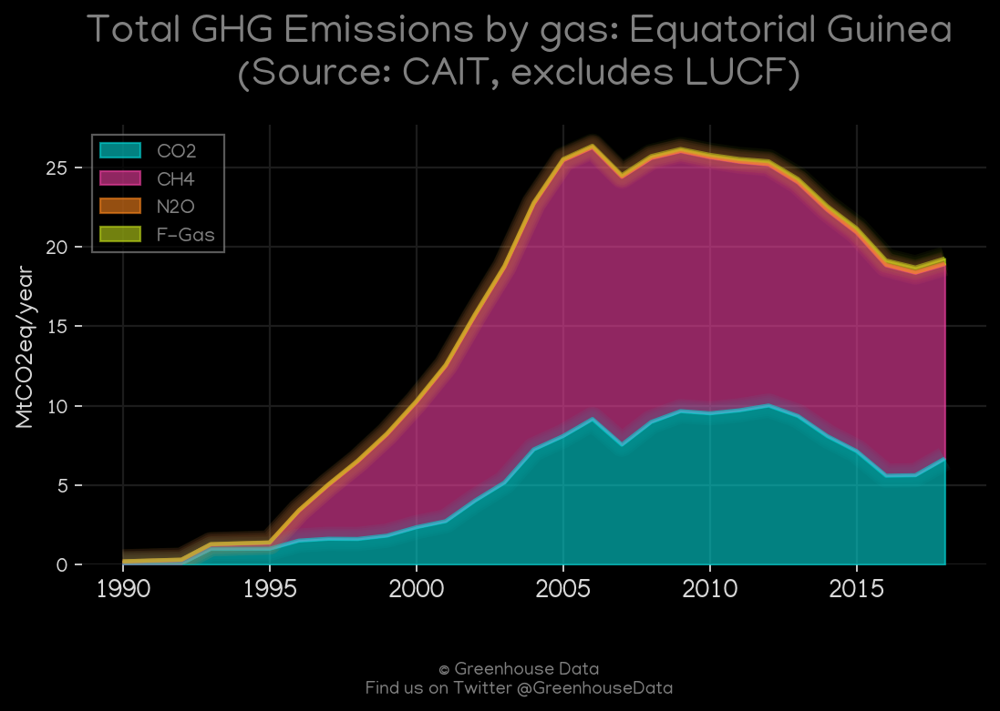
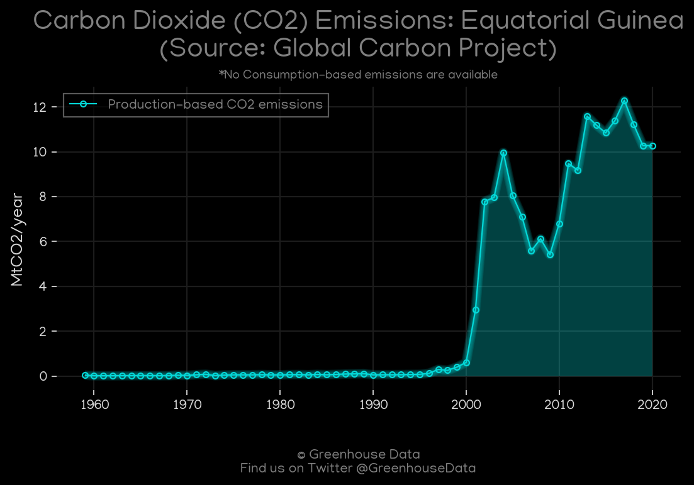
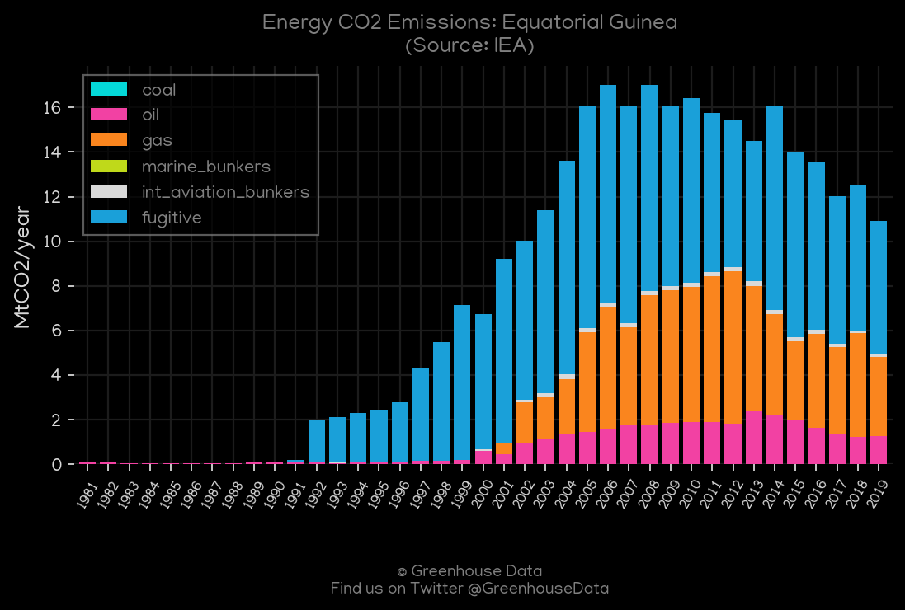
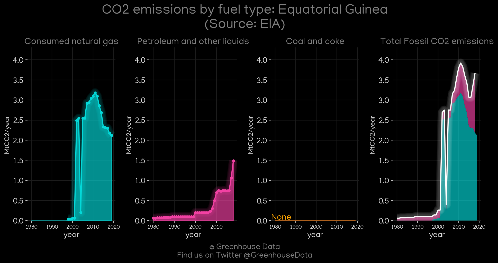
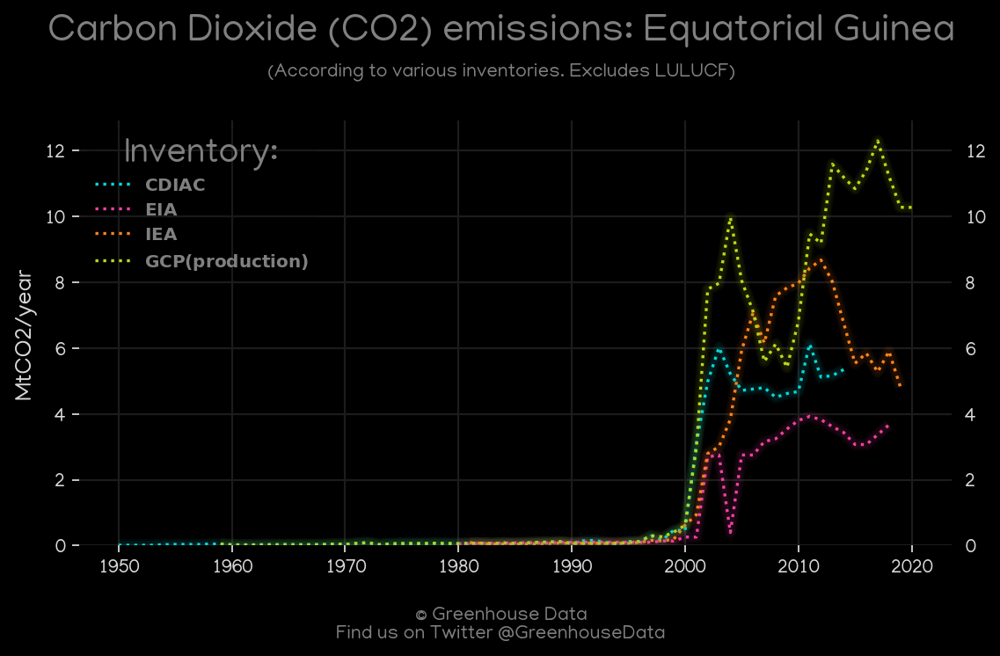
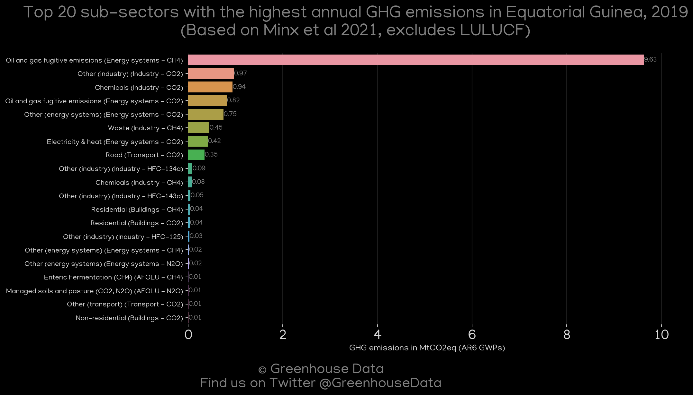

<h1 align="center">
🇬🇶🇬🇶🇬🇶🇬🇶🇬🇶
 
Equatorial Guinea
 
🇬🇶🇬🇶🇬🇶🇬🇶🇬🇶
</h1>
<h2>Datasets:</h2>

<a href="https://github.com/dquintani/GreenhouseData/tree/master/country_data/GNQ_Equatorial Guinea/data">View on Github</a>
 

<a href="data/GNQ_EPA.csv">EPA</a> || <a href="data/GNQ_IEA.csv">IEA</a> || <a href="data/GNQ_FAO.csv">FAO</a> || <a href="data/GNQ_EDGAR.csv">EDGAR</a> || <a href="data/GNQ_GCP_consupmption.csv">GCP_consupmption</a> || <a href="data/GNQ_EIA.csv">EIA</a> || <a href="data/GNQ_PRIMAP-hist.csv">PRIMAP-hist</a> || <a href="data/GNQ_GCP.csv">GCP</a> || <a href="data/GNQ_CDIAC.csv">CDIAC</a> || <a href="data/GNQ_CAIT.csv">CAIT</a> || <a href="data/GNQ_Minx_2021.csv">Minx_2021</a>

 

<h1>Figures:</h1><h2>#1 (GNQ_CDIAC_1)</h2>

<h2>#2 (GNQ_CAIT_gases_1)</h2>

<h2>#3 (GNQ_CAIT_lucf_vs_nolucf)</h2>

<h2>#4 (GNQ_GCP_1)</h2>

<h2>#5 (GNQ_IEA_1)</h2>

<h2>#6 (GNQ_EIA_1)</h2>

<h2>#7 (GNQ_CO2_totals)</h2>

<h2>#8 (GNQ_Minx_top20_subsectors)</h2>

