

<h1 align="center">
🇬🇷🇬🇷🇬🇷🇬🇷🇬🇷
 
Greece
 
🇬🇷🇬🇷🇬🇷🇬🇷🇬🇷
</h1>
<h2>Datasets:</h2>

<a href="https://github.com/dquintani/GreenhouseData/tree/master/country_data/GRC_Greece/data">View on Github</a>
 

<a href="data/GRC_PRIMAP-hist.csv">PRIMAP-hist</a> || <a href="data/GRC_CAIT.csv">CAIT</a> || <a href="data/GRC_EDGAR.csv">EDGAR</a> || <a href="data/GRC_EIA.csv">EIA</a> || <a href="data/GRC_GCP_consupmption.csv">GCP_consupmption</a> || <a href="data/GRC_FAO.csv">FAO</a> || <a href="data/GRC_Minx_2021.csv">Minx_2021</a> || <a href="data/GRC_GCP.csv">GCP</a> || <a href="data/GRC_BP.csv">BP</a> || <a href="data/GRC_EPA.csv">EPA</a> || <a href="data/GRC_IEA.csv">IEA</a> || <a href="data/GRC_CDIAC.csv">CDIAC</a>

 

<h1>Figures:</h1><h2>#1 (GRC_UNFCCC_AI_1)</h2>

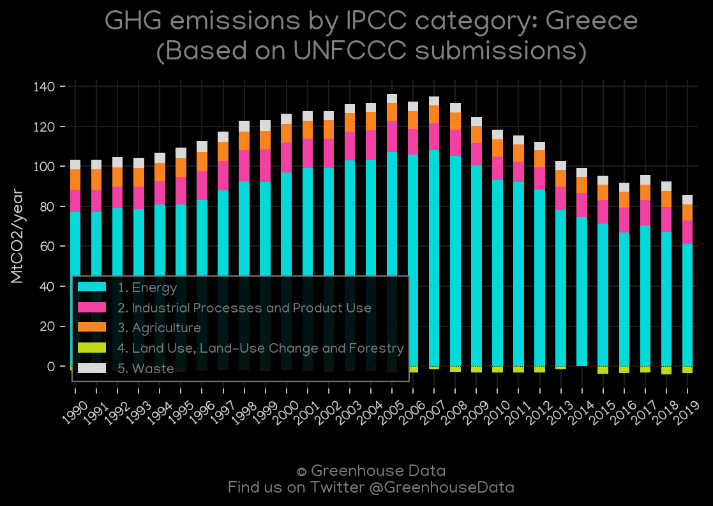
<h2>#2 (GRC_BP_1)</h2>

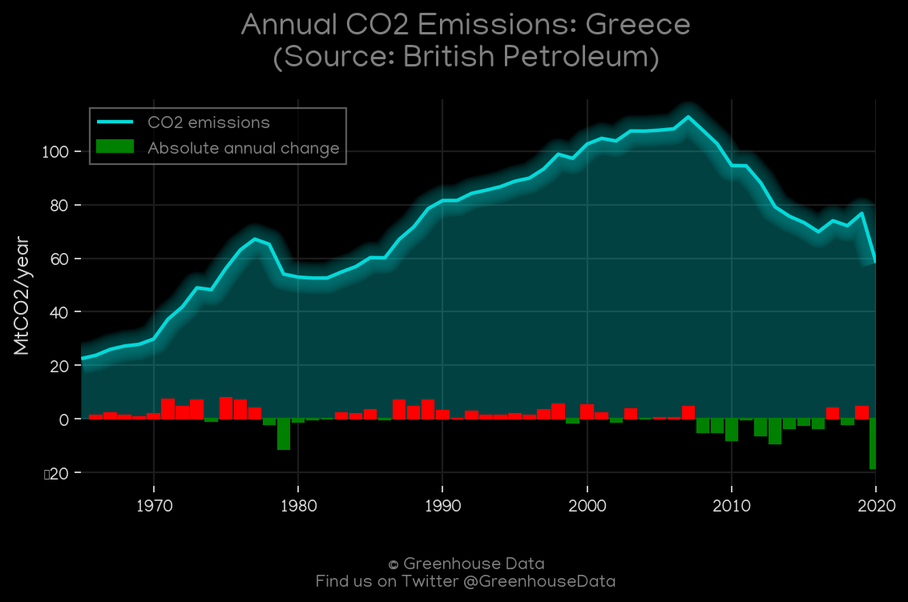
<h2>#3 (GRC_Minx_top20_subsectors)</h2>

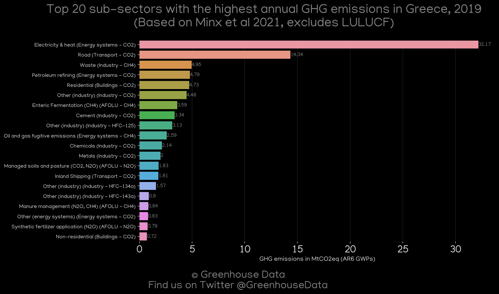
<h2>#4 (GRC_GCP_1)</h2>

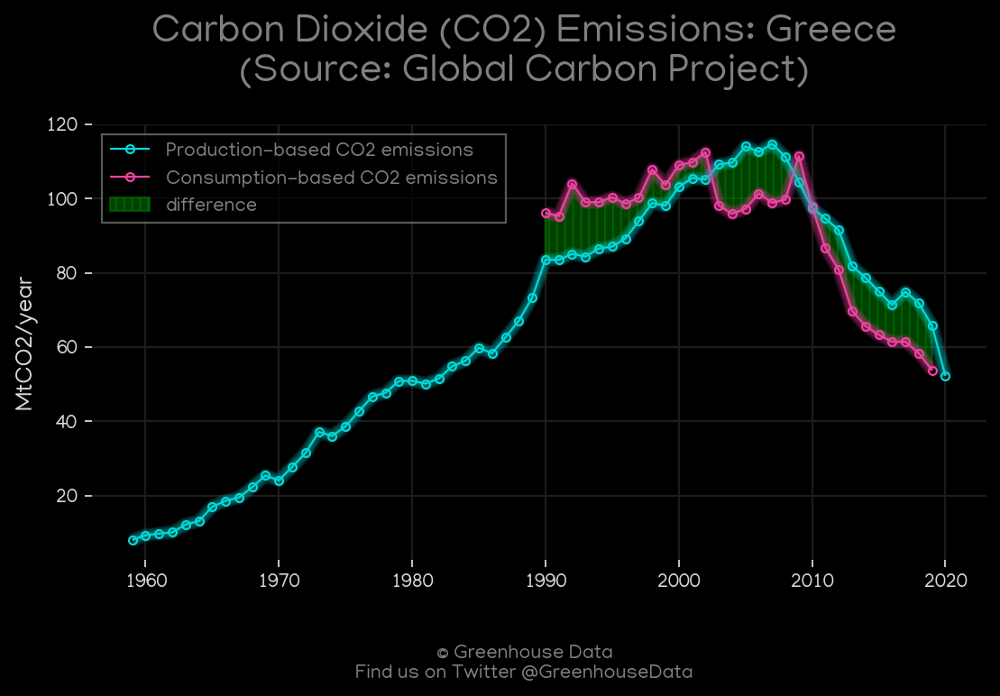
<h2>#5 (GRC_CAIT_lucf_vs_nolucf)</h2>

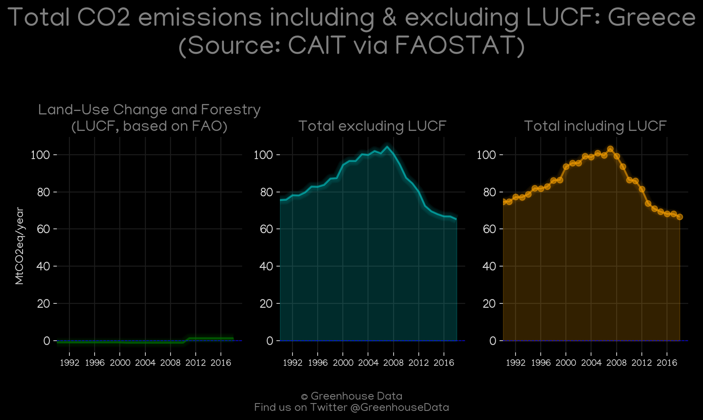
<h2>#6 (GRC_CAIT_gases_1)</h2>

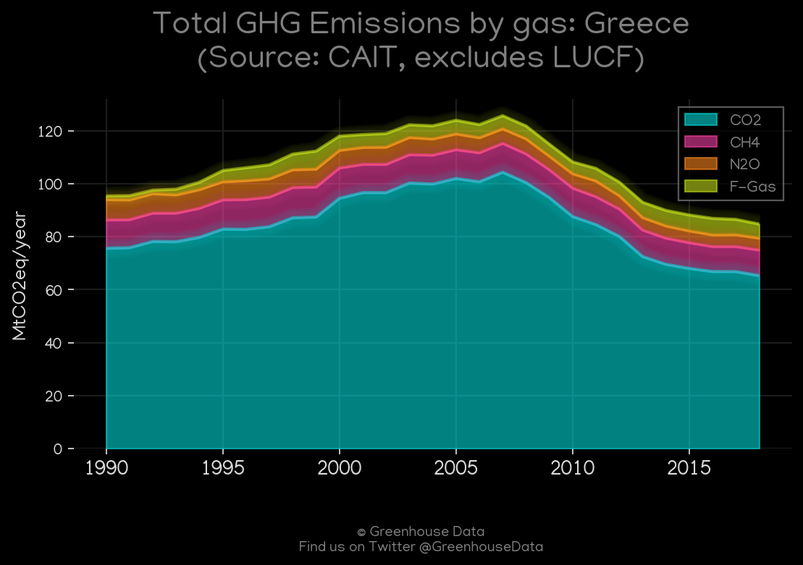
<h2>#7 (GRC_IEA_1)</h2>

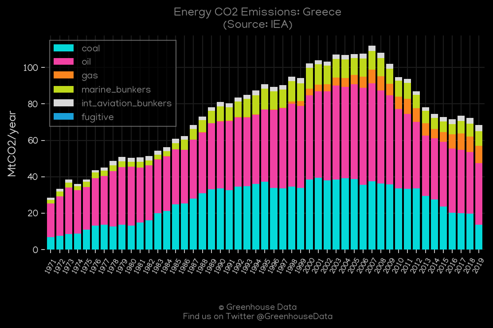
<h2>#8 (GRC_EIA_1)</h2>

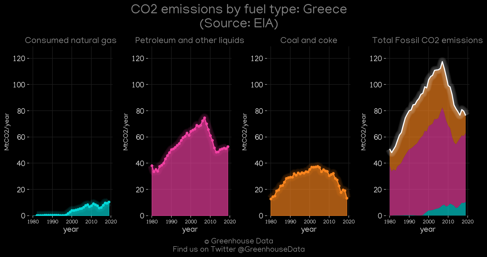
<h2>#9 (GRC_CDIAC_1)</h2>

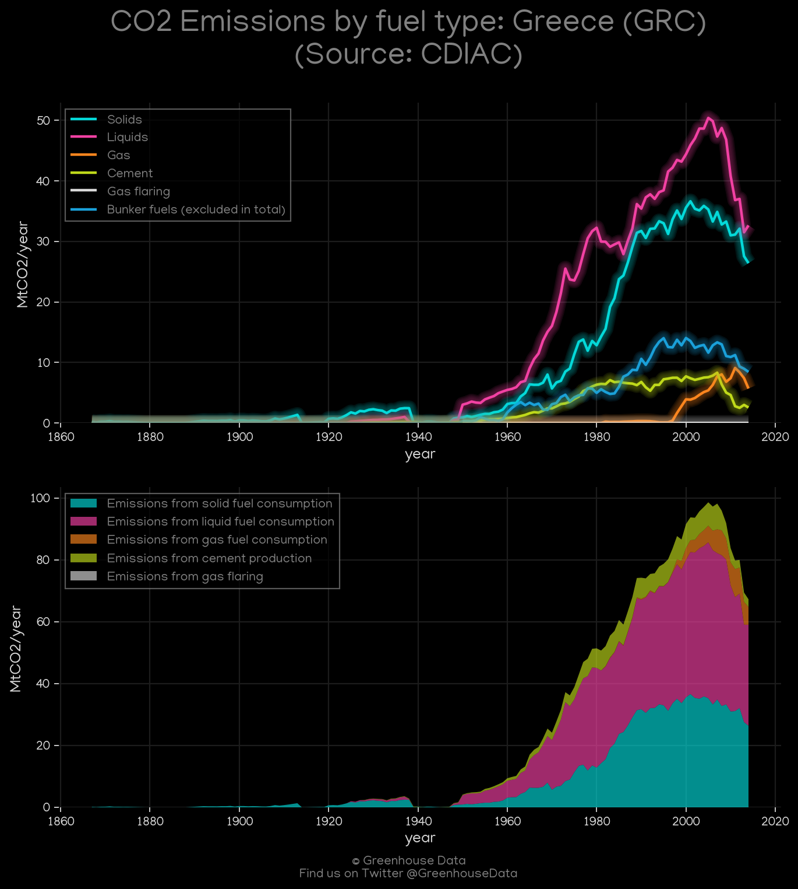
<h2>#10 (GRC_CO2_totals)</h2>

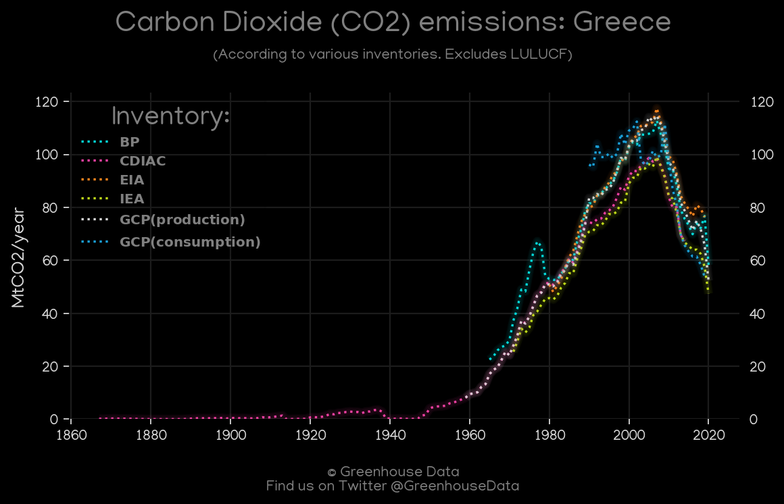
<h2>#11 (GRC_relative_totals)</h2>

<h2>#12 (GRC_GCP_Country_Highlight)</h2>

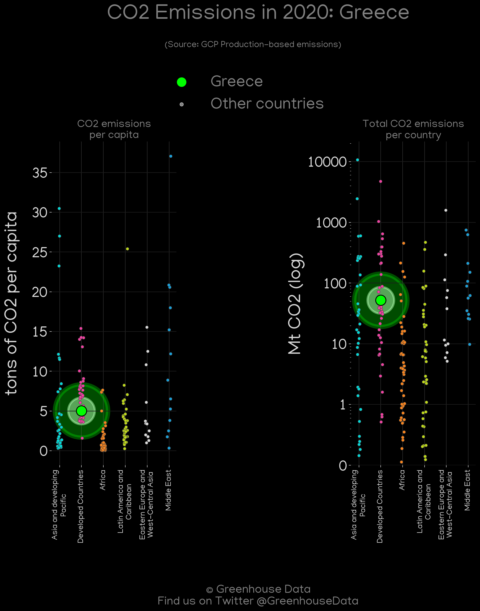
