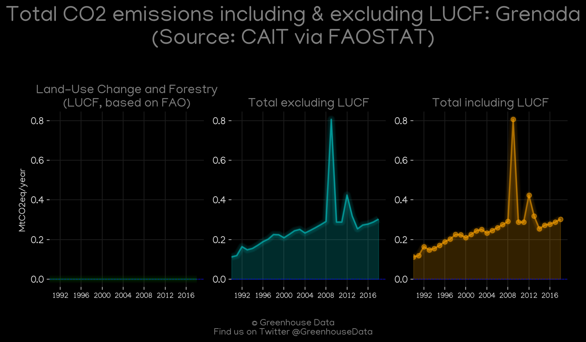
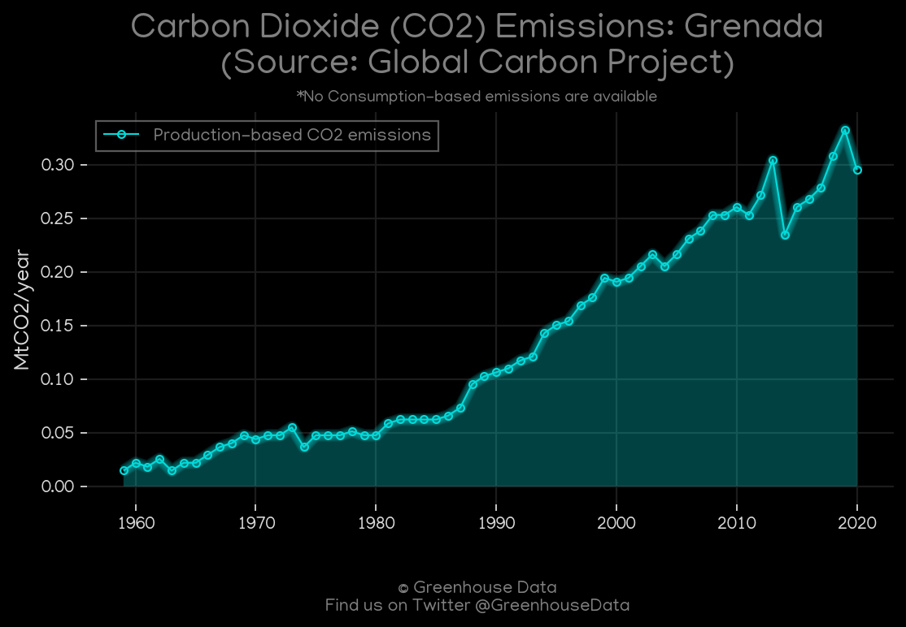
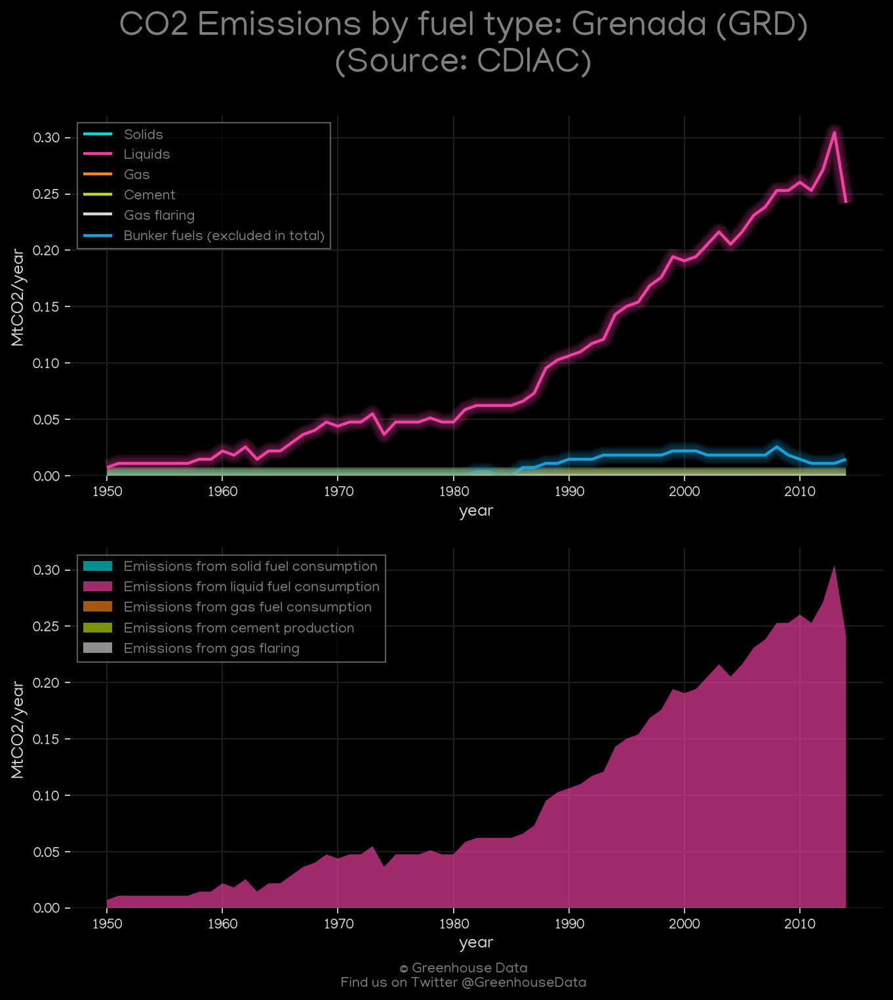
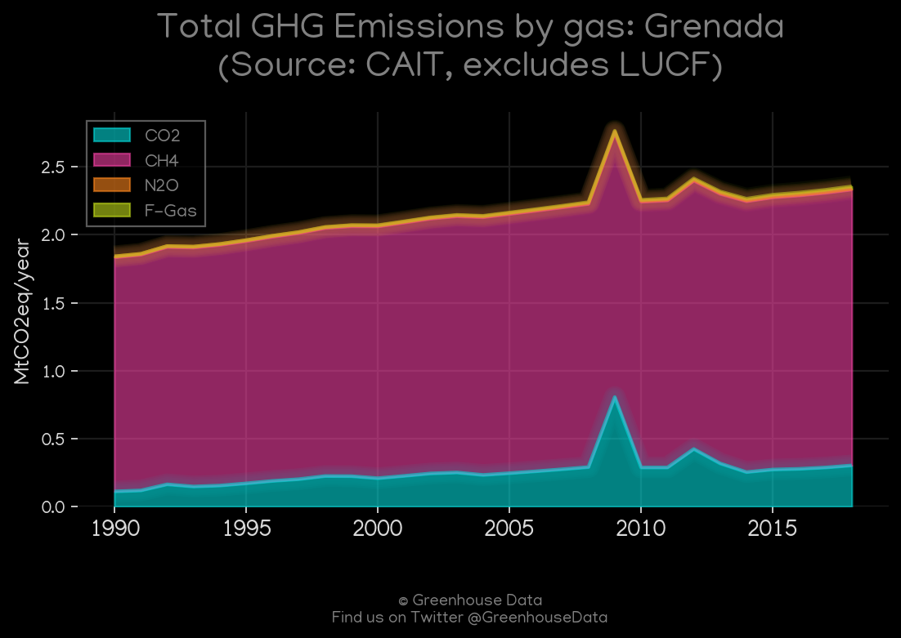
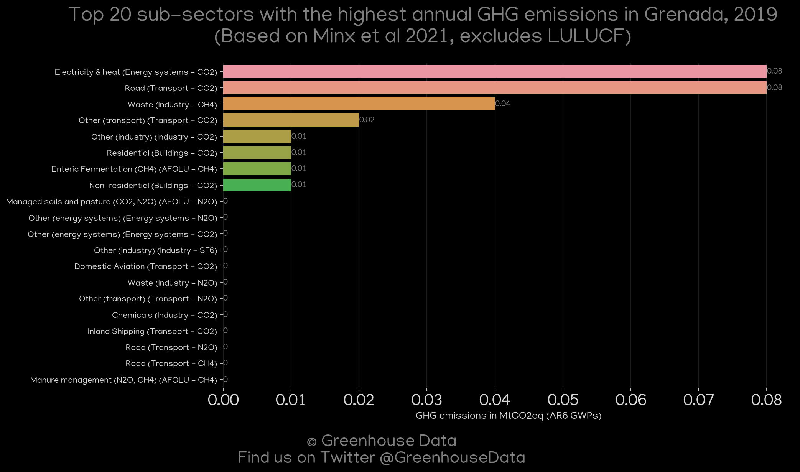
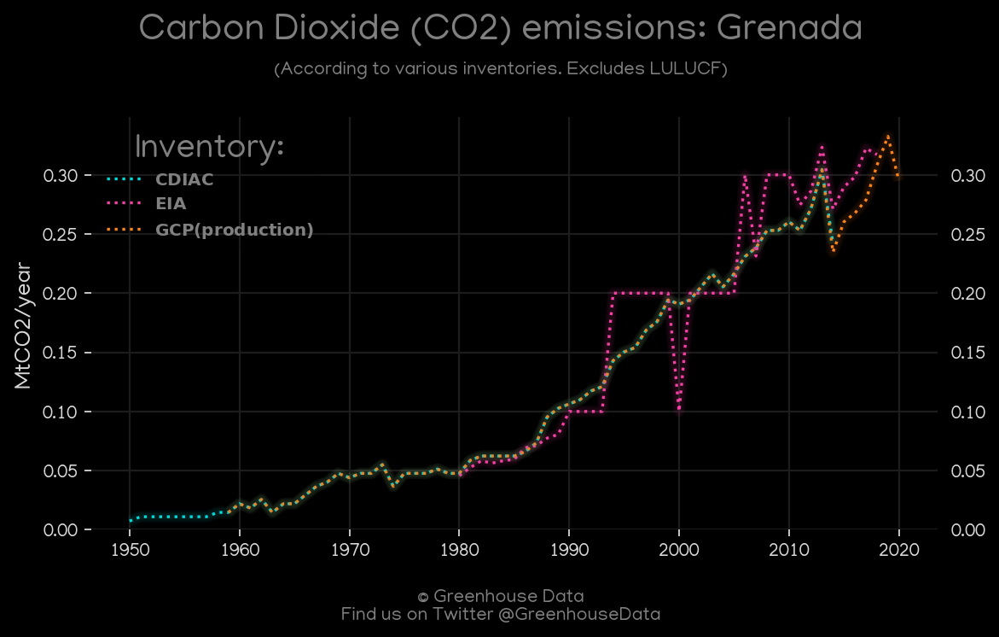
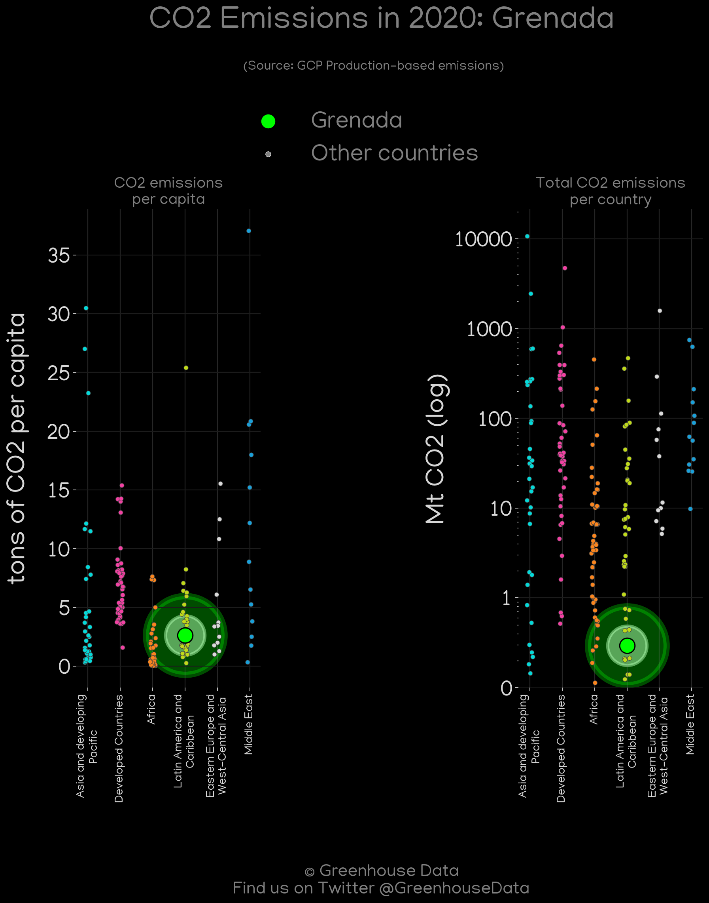
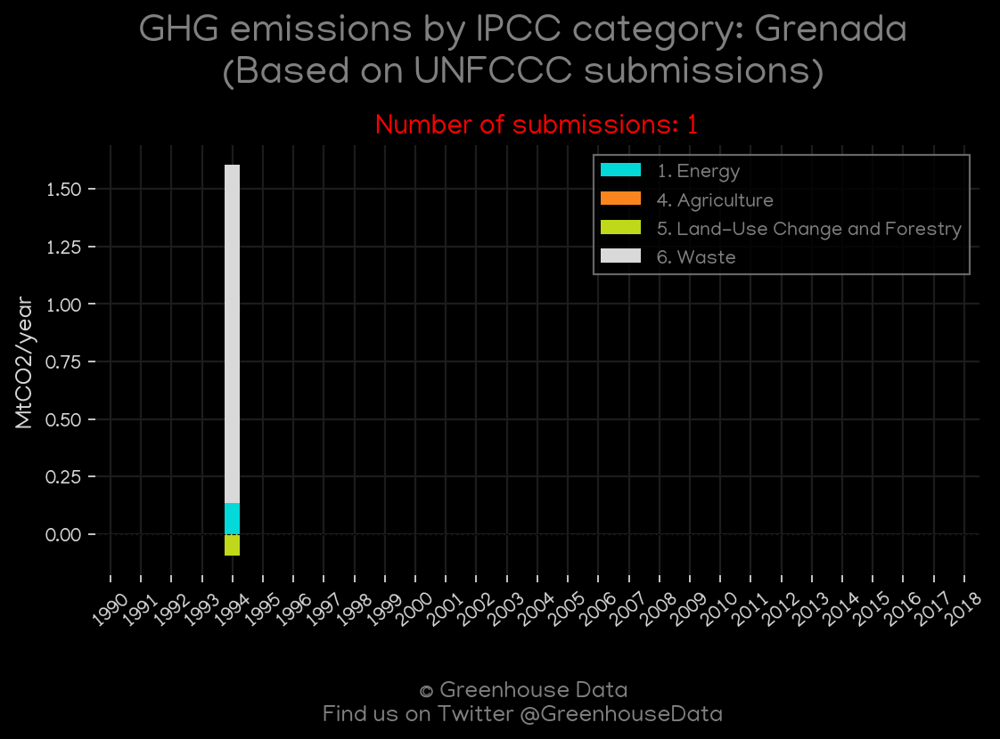
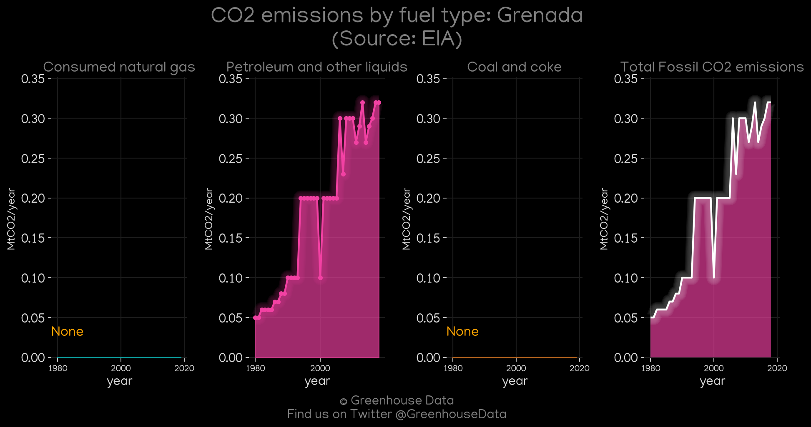

<h1 align="center">
🇬🇩🇬🇩🇬🇩🇬🇩🇬🇩
 
Grenada
 
🇬🇩🇬🇩🇬🇩🇬🇩🇬🇩
</h1>
<h2>Datasets:</h2>

<a href="https://github.com/dquintani/GreenhouseData/tree/master/country_data/GRD_Grenada/data">View on Github</a>
 

<a href="data/GRD_EIA.csv">EIA</a> || <a href="data/GRD_EDGAR.csv">EDGAR</a> || <a href="data/GRD_Minx_2021.csv">Minx_2021</a> || <a href="data/GRD_EPA.csv">EPA</a> || <a href="data/GRD_CDIAC.csv">CDIAC</a> || <a href="data/GRD_GCP.csv">GCP</a> || <a href="data/GRD_PRIMAP-hist.csv">PRIMAP-hist</a> || <a href="data/GRD_FAO.csv">FAO</a> || <a href="data/GRD_CAIT.csv">CAIT</a> || <a href="data/GRD_GCP_consupmption.csv">GCP_consupmption</a>

 

<h1>Figures:</h1><h2>#1 (GRD_CAIT_lucf_vs_nolucf)</h2>

<h2>#2 (GRD_GCP_1)</h2>

<h2>#3 (GRD_CDIAC_1)</h2>

<h2>#4 (GRD_CAIT_gases_1)</h2>

<h2>#5 (GRD_Minx_top20_subsectors)</h2>

<h2>#6 (GRD_CO2_totals)</h2>

<h2>#7 (GRD_GCP_Country_Highlight)</h2>

<h2>#8 (GRD_UNFCCC_NAI_1)</h2>

<h2>#9 (GRD_EIA_1)</h2>

