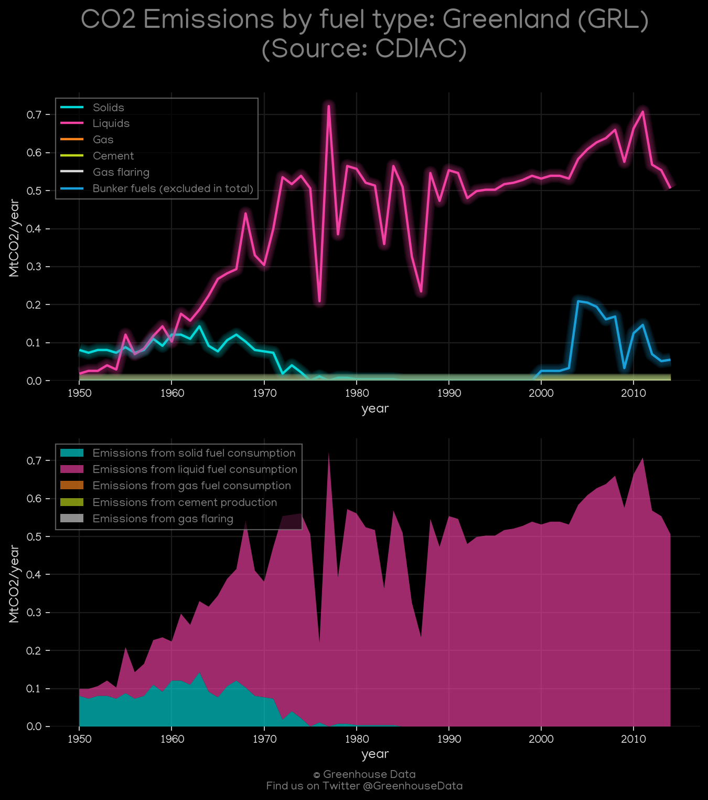
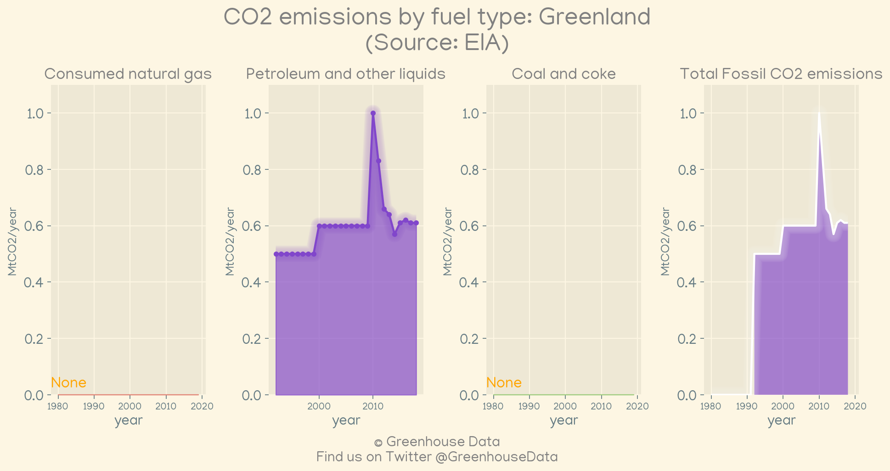
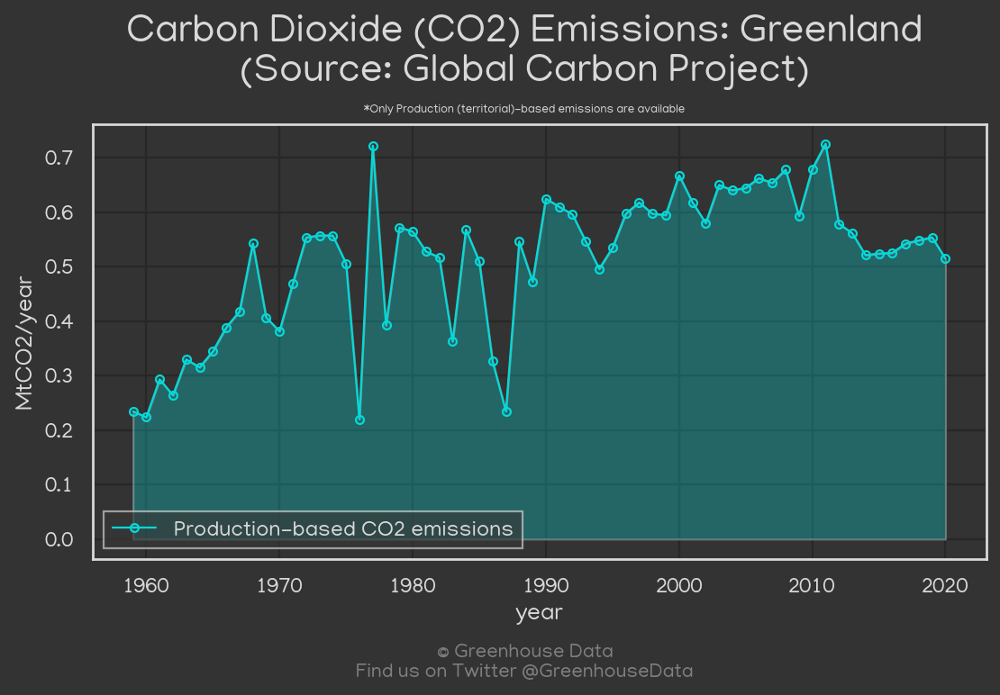
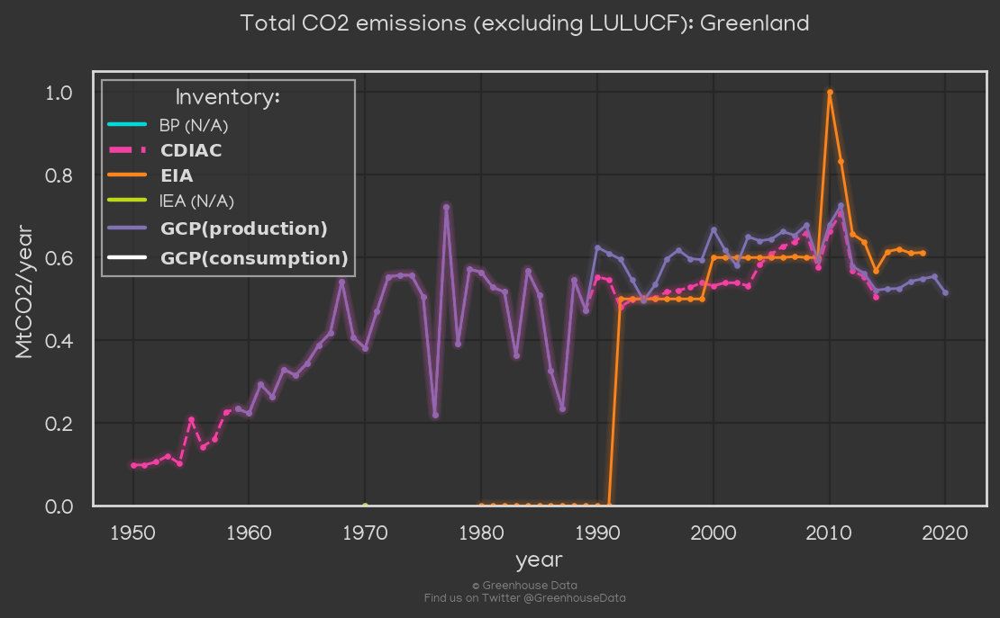
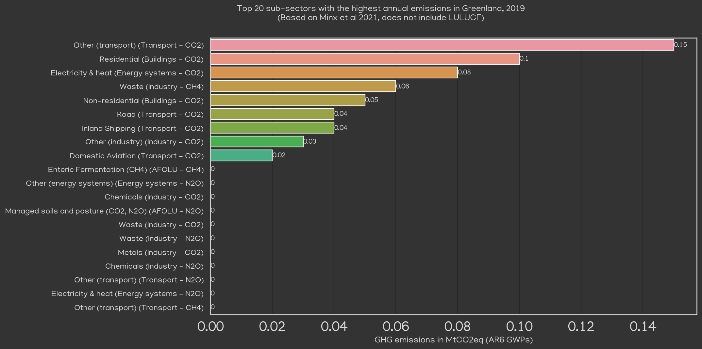
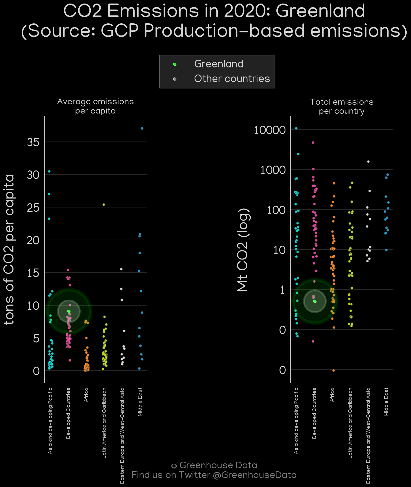

<h1 align="center">
🇬🇱🇬🇱🇬🇱🇬🇱🇬🇱
 
Greenland
 
🇬🇱🇬🇱🇬🇱🇬🇱🇬🇱
</h1>
<h2>Datasets:</h2>

<a href="https://github.com/dquintani/GreenhouseData/tree/master/country_data/GRL_Greenland/data">View on Github</a>
 

<a href="data/GRL_EIA.csv">EIA</a> || <a href="data/GRL_EDGAR.csv">EDGAR</a> || <a href="data/GRL_Minx_2021.csv">Minx_2021</a> || <a href="data/GRL_CDIAC.csv">CDIAC</a> || <a href="data/GRL_FAO.csv">FAO</a> || <a href="data/GRL_GCP.csv">GCP</a> || <a href="data/GRL_GCP_consupmption.csv">GCP_consupmption</a>

 

<h1>Figures:</h1><h2>#1 (GRL_CDIAC_1)</h2>

<h2>#2 (GRL_EIA_1)</h2>

<h2>#3 (GRL_GCP_1)</h2>

<h2>#4 (GRL_CO2_totals)</h2>

<h2>#5 (GRL_Minx_top20_subsectors)</h2>

<h2>#6 (GRL_GCP_Country_Highlight)</h2>

