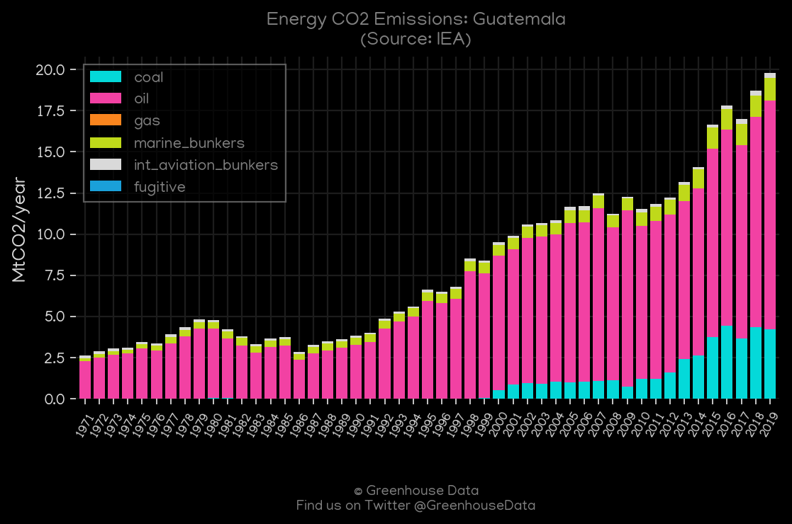
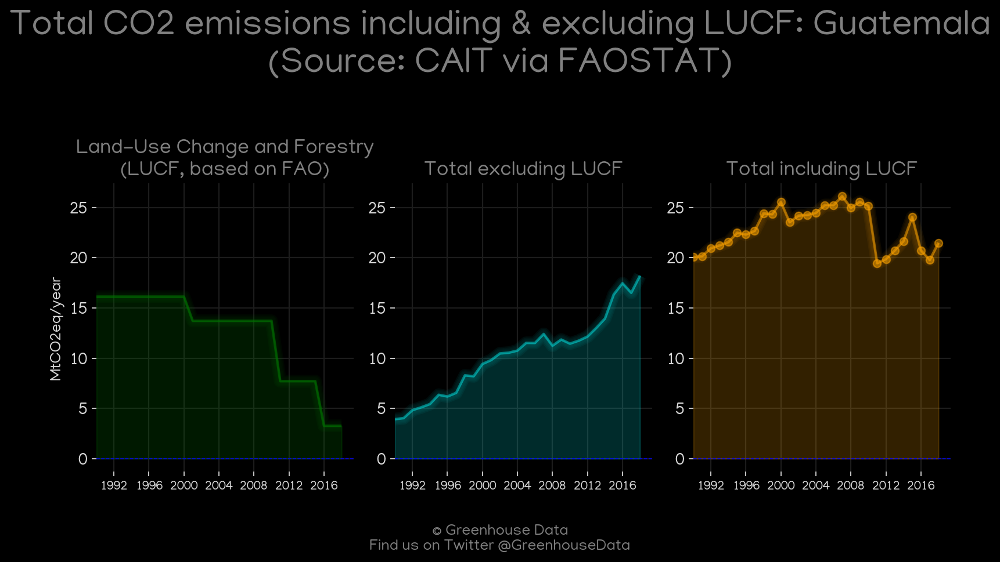
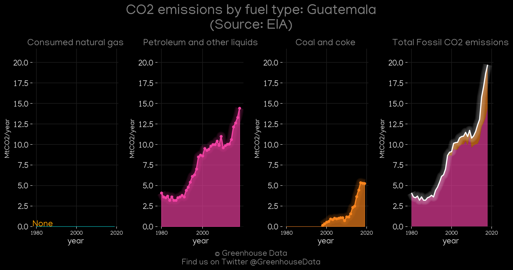
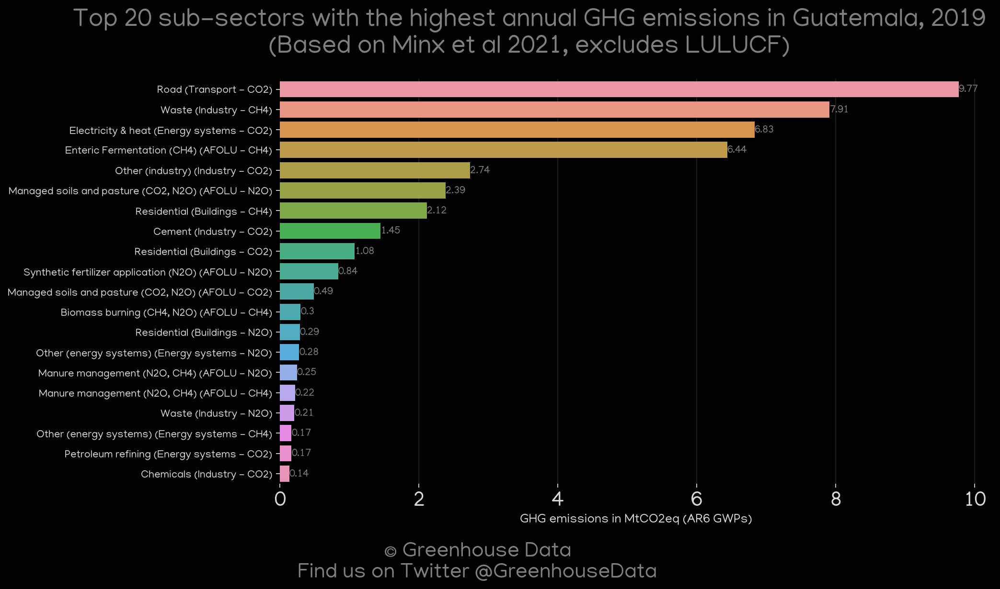
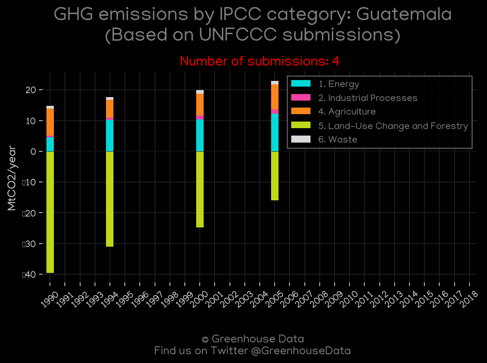
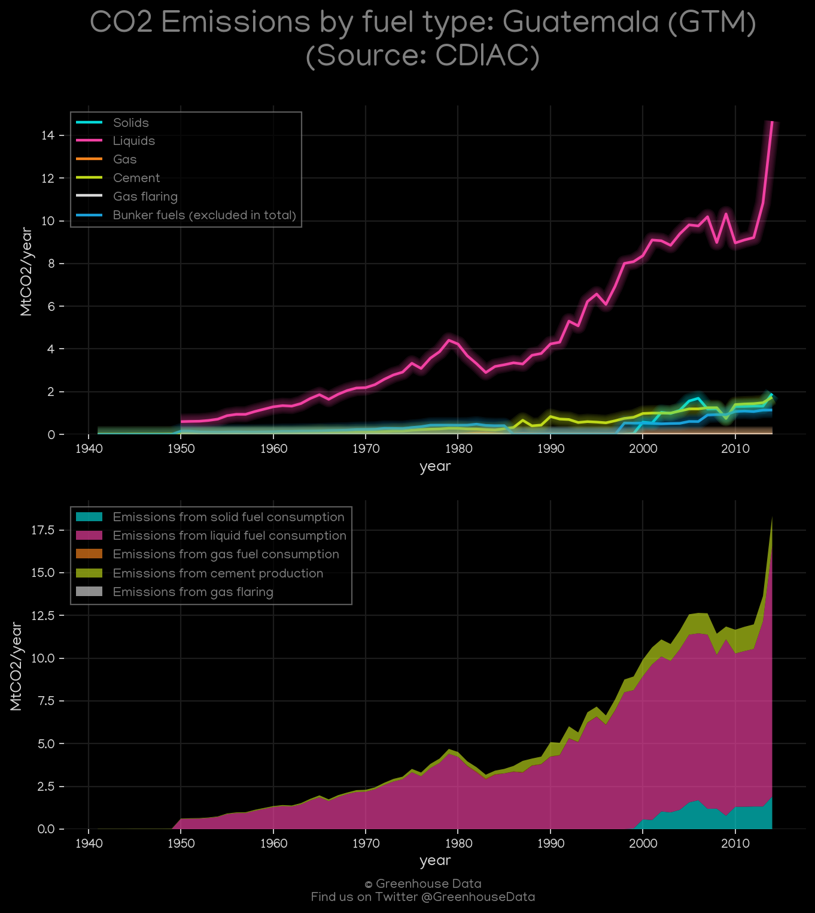

<h1 align="center">
🇬🇹🇬🇹🇬🇹🇬🇹🇬🇹
 
Guatemala
 
🇬🇹🇬🇹🇬🇹🇬🇹🇬🇹
</h1>
<h2>Datasets:</h2>

<a href="https://github.com/dquintani/GreenhouseData/tree/master/country_data/GTM_Guatemala/data">View on Github</a>
 

<a href="data/GTM_GCP.csv">GCP</a> || <a href="data/GTM_EDGAR.csv">EDGAR</a> || <a href="data/GTM_CAIT.csv">CAIT</a> || <a href="data/GTM_PRIMAP-hist.csv">PRIMAP-hist</a> || <a href="data/GTM_Minx_2021.csv">Minx_2021</a> || <a href="data/GTM_EIA.csv">EIA</a> || <a href="data/GTM_GCP_consupmption.csv">GCP_consupmption</a> || <a href="data/GTM_IEA.csv">IEA</a> || <a href="data/GTM_FAO.csv">FAO</a> || <a href="data/GTM_CDIAC.csv">CDIAC</a> || <a href="data/GTM_EPA.csv">EPA</a>

 

<h1>Figures:</h1><h2>#1 (GTM_CO2_totals)</h2>

<h2>#2 (GTM_CAIT_gases_1)</h2>

<h2>#3 (GTM_IEA_1)</h2>

<h2>#4 (GTM_CAIT_lucf_vs_nolucf)</h2>

<h2>#5 (GTM_EIA_1)</h2>

<h2>#6 (GTM_Minx_top20_subsectors)</h2>

<h2>#7 (GTM_GCP_1)</h2>

<h2>#8 (GTM_UNFCCC_NAI_1)</h2>

<h2>#9 (GTM_CDIAC_1)</h2>

