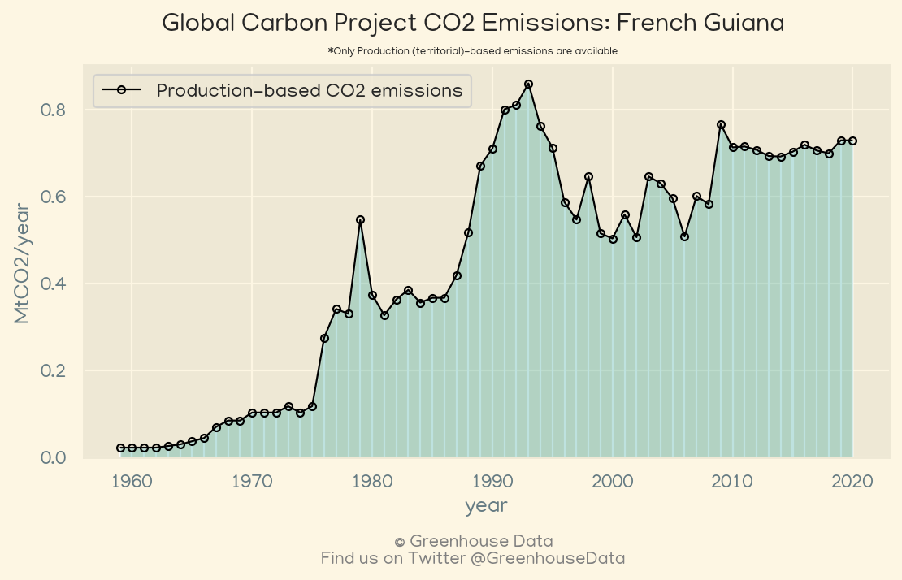
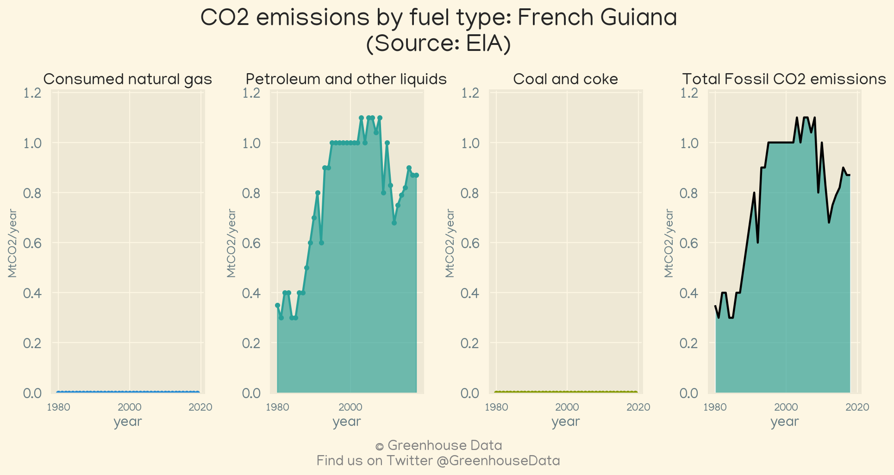
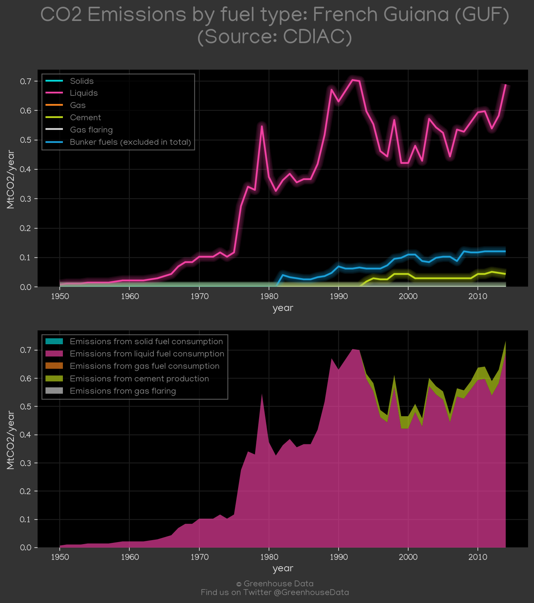
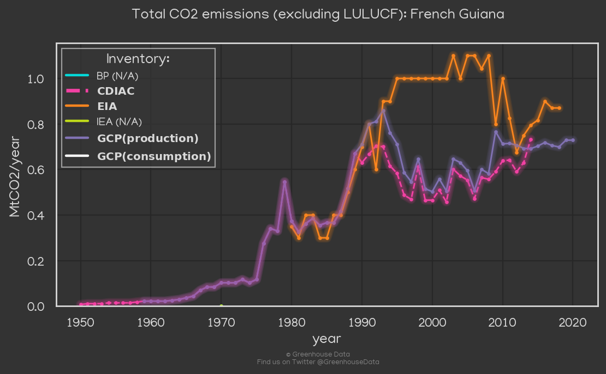
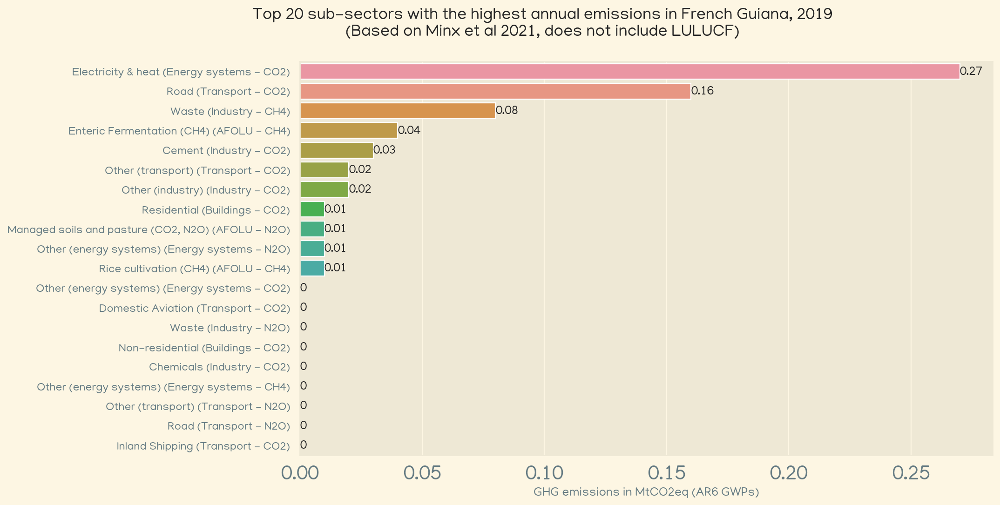

<h1 align="center">
🇬🇫🇬🇫🇬🇫🇬🇫🇬🇫
 
French Guiana
 
🇬🇫🇬🇫🇬🇫🇬🇫🇬🇫
</h1>
<h2>Datasets:</h2>

<a href="https://github.com/dquintani/Greenhouse-Data/tree/master/country_data/GUF_French Guiana/data">View on Github</a>
 

<a href="data/GUF_CDIAC.csv">CDIAC</a> || <a href="data/GUF_GCP.csv">GCP</a> || <a href="data/GUF_EDGAR.csv">EDGAR</a> || <a href="data/GUF_EIA.csv">EIA</a> || <a href="data/GUF_GCP_cons.csv">GCP_cons</a> || <a href="data/GUF_GCP_consupmption.csv">GCP_consupmption</a> || <a href="data/GUF_Minx_2021.csv">Minx_2021</a>

 

<h1>Figures:</h1><h2>#1 (GUF_GCP_1)</h2>

<h2>#2 (GUF_EIA_1)</h2>

<h2>#3 (GUF_CDIAC_1)</h2>

<h2>#4 (GUF_CO2_totals)</h2>

<h2>#5 (GUF_Minx_top20_subsectors)</h2>

