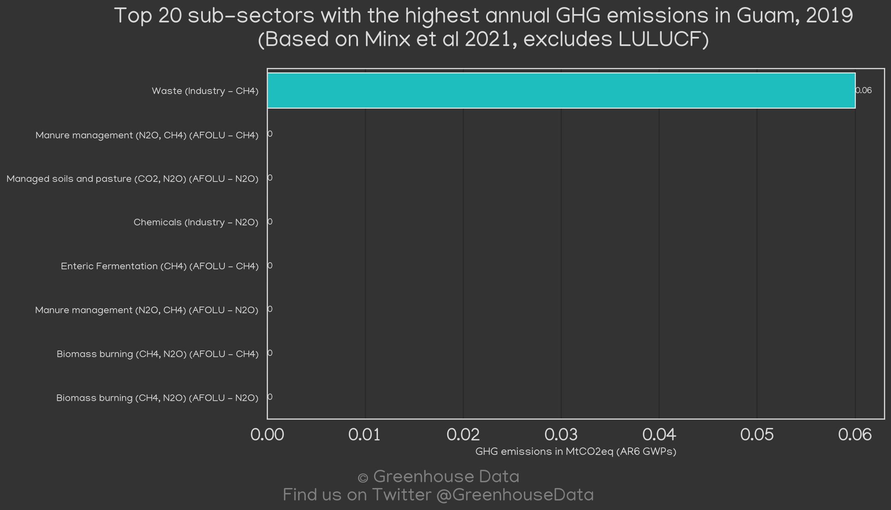
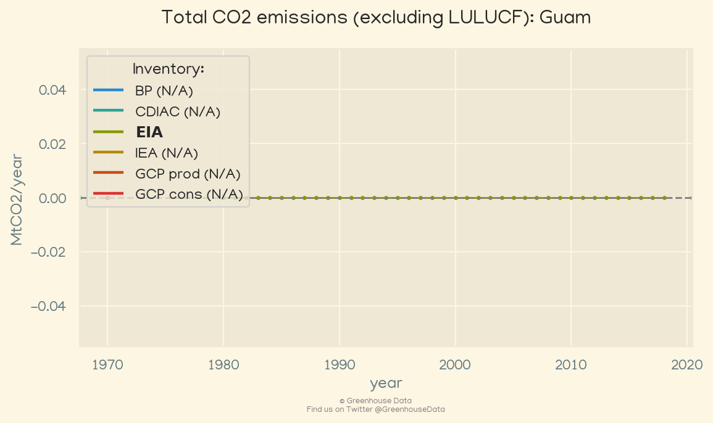
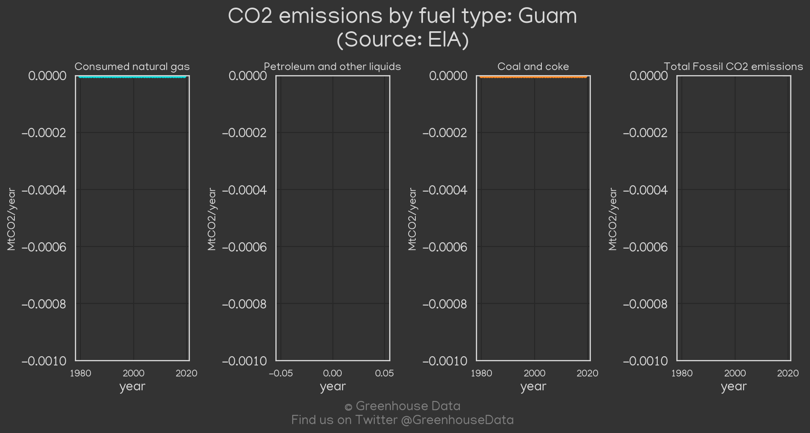

<h1 align="center">
🇬🇺🇬🇺🇬🇺🇬🇺🇬🇺
 
Guam
 
🇬🇺🇬🇺🇬🇺🇬🇺🇬🇺
</h1>
<h2>Datasets:</h2>

<a href="https://github.com/dquintani/Greenhouse-Data/tree/master/country_data/GUM_Guam/data">View on Github</a>
 

<a href="data/GUM_EDGAR.csv">EDGAR</a> || <a href="data/GUM_EIA.csv">EIA</a> || <a href="data/GUM_Minx_2021.csv">Minx_2021</a> || <a href="data/GUM_FAO.csv">FAO</a>

 

<h1>Figures:</h1><h2>#1 (GUM_Minx_top20_subsectors)</h2>

<h2>#2 (GUM_CO2_totals)</h2>

<h2>#3 (GUM_EIA_1)</h2>

