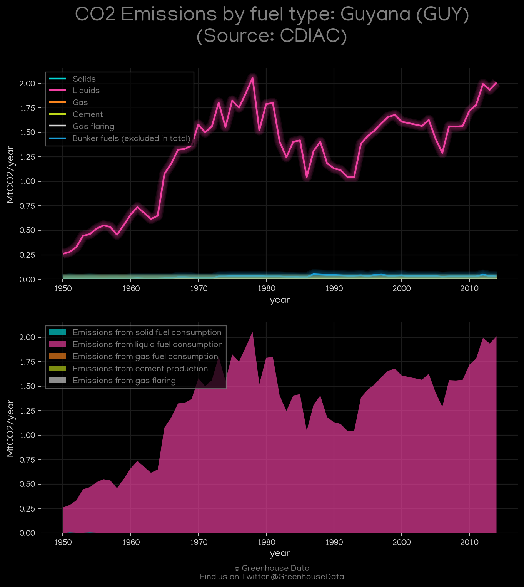
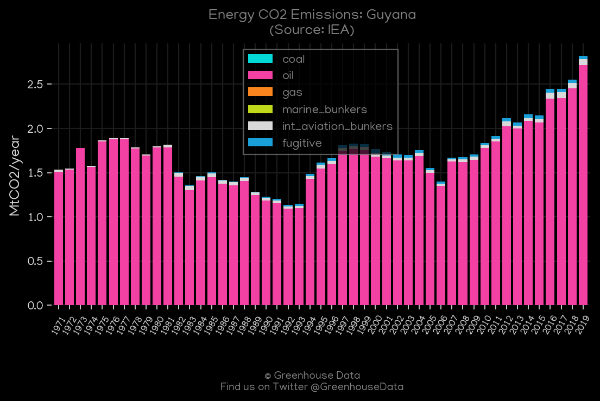
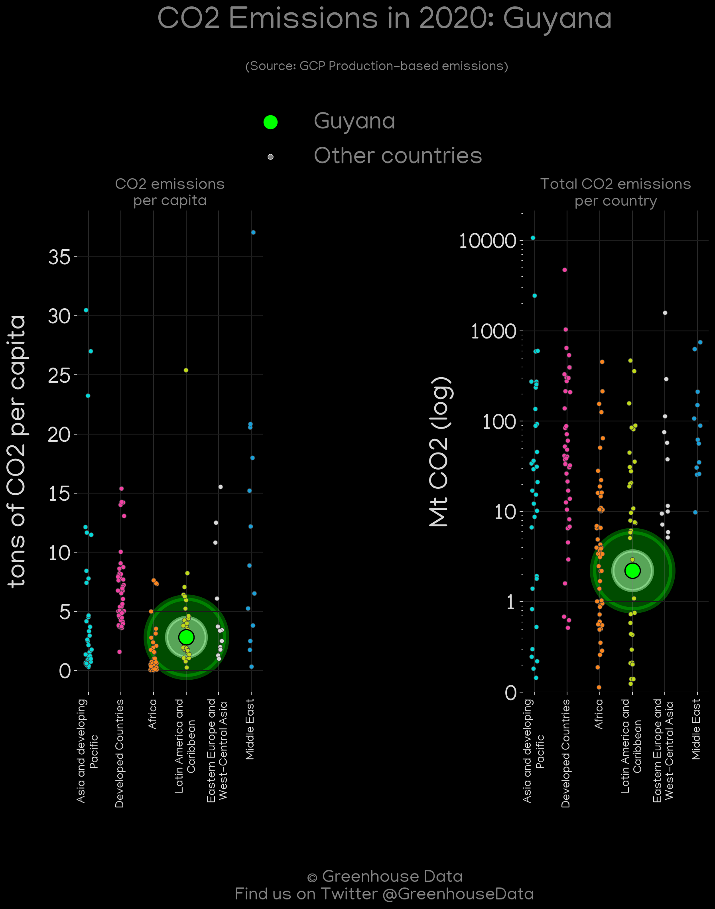
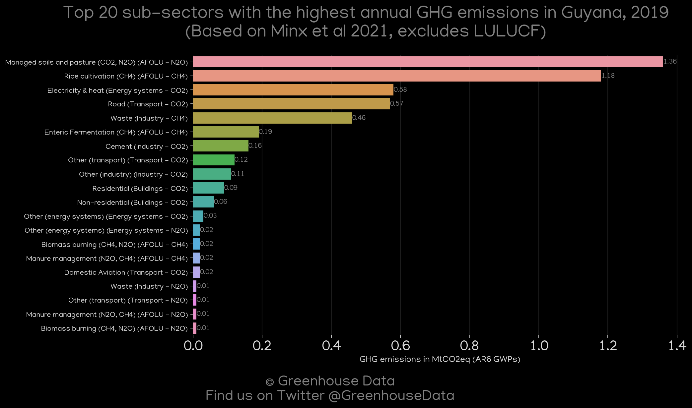
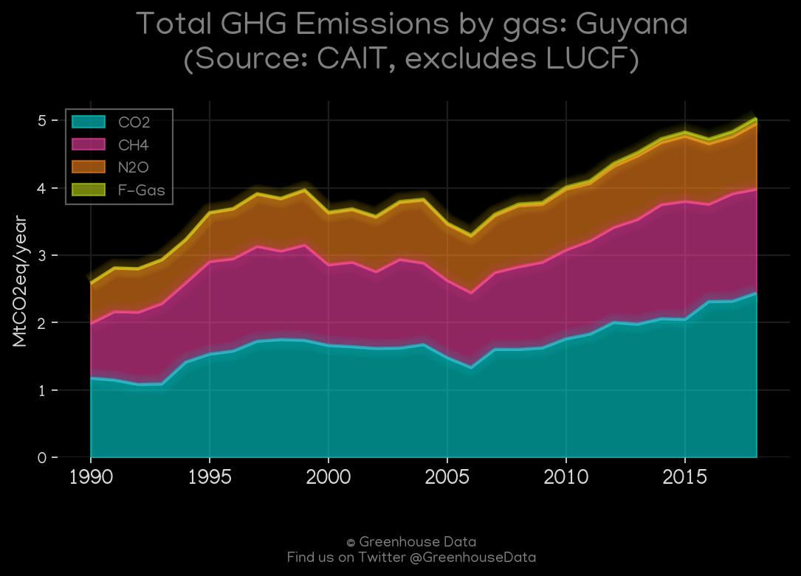
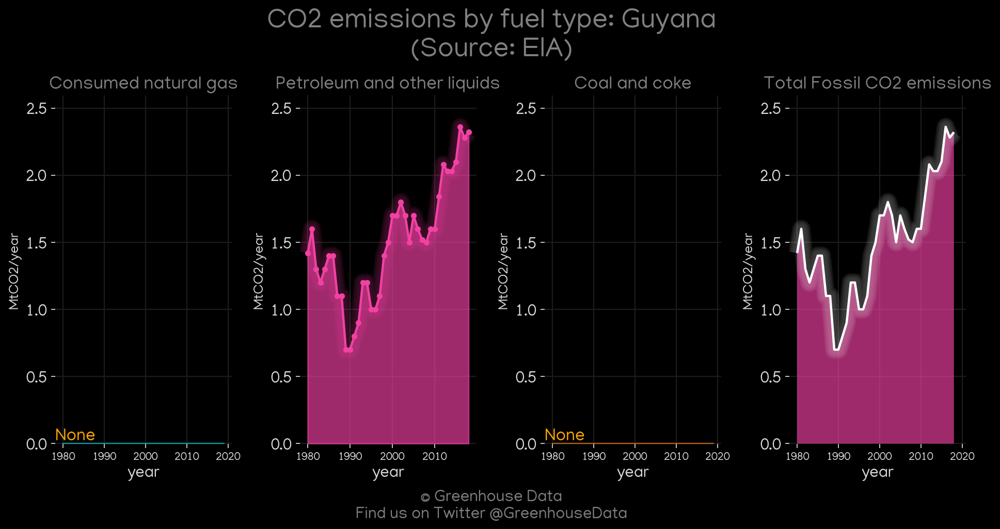
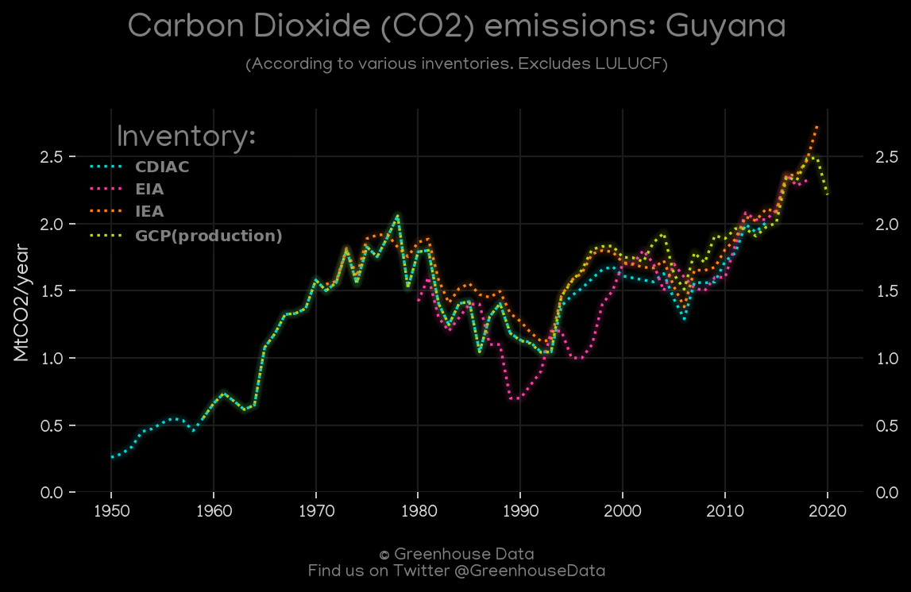
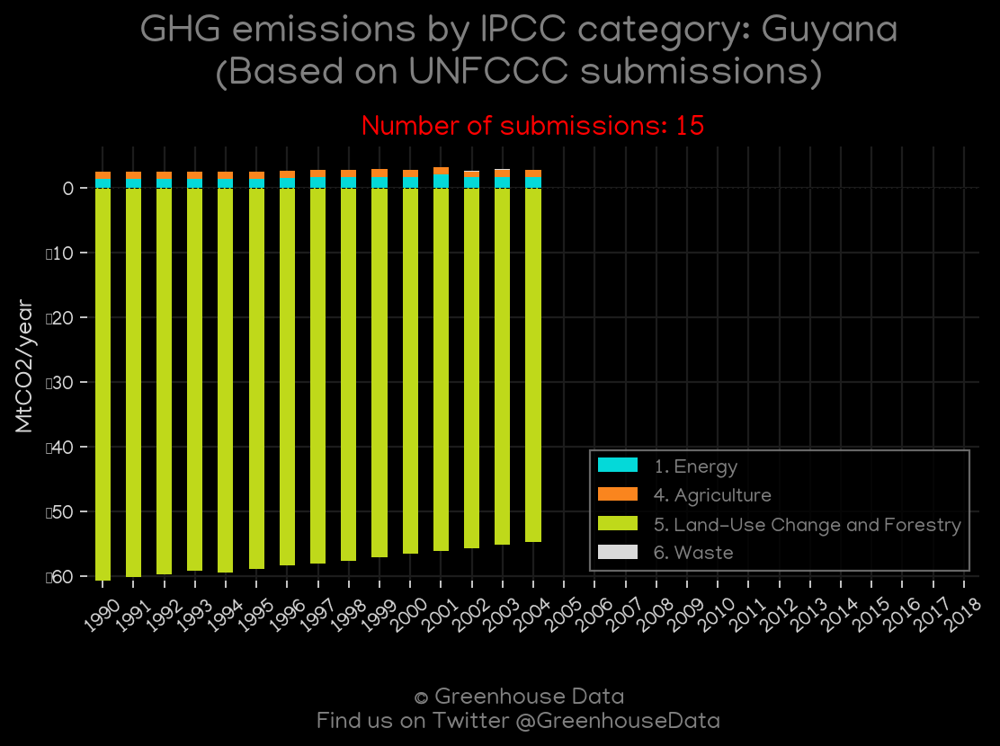

<h1 align="center">
🇬🇾🇬🇾🇬🇾🇬🇾🇬🇾
 
Guyana
 
🇬🇾🇬🇾🇬🇾🇬🇾🇬🇾
</h1>
<h2>Datasets:</h2>

<a href="https://github.com/dquintani/GreenhouseData/tree/master/country_data/GUY_Guyana/data">View on Github</a>
 

<a href="data/GUY_EIA.csv">EIA</a> || <a href="data/GUY_IEA.csv">IEA</a> || <a href="data/GUY_FAO.csv">FAO</a> || <a href="data/GUY_EPA.csv">EPA</a> || <a href="data/GUY_PRIMAP-hist.csv">PRIMAP-hist</a> || <a href="data/GUY_CAIT.csv">CAIT</a> || <a href="data/GUY_CDIAC.csv">CDIAC</a> || <a href="data/GUY_Minx_2021.csv">Minx_2021</a> || <a href="data/GUY_GCP_consupmption.csv">GCP_consupmption</a> || <a href="data/GUY_EDGAR.csv">EDGAR</a> || <a href="data/GUY_GCP.csv">GCP</a>

 

<h1>Figures:</h1><h2>#1 (GUY_CDIAC_1)</h2>

<h2>#2 (GUY_IEA_1)</h2>

<h2>#3 (GUY_GCP_Country_Highlight)</h2>

<h2>#4 (GUY_Minx_top20_subsectors)</h2>

<h2>#5 (GUY_CAIT_gases_1)</h2>

<h2>#6 (GUY_CAIT_lucf_vs_nolucf)</h2>

<h2>#7 (GUY_EIA_1)</h2>

<h2>#8 (GUY_CO2_totals)</h2>

<h2>#9 (GUY_GCP_1)</h2>

<h2>#10 (GUY_UNFCCC_NAI_1)</h2>

