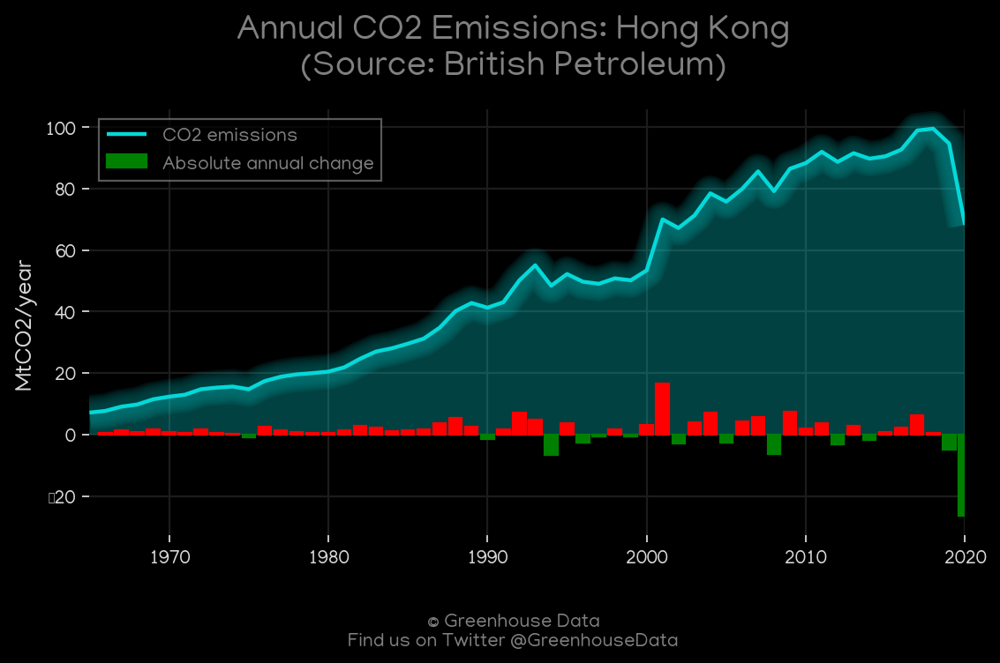
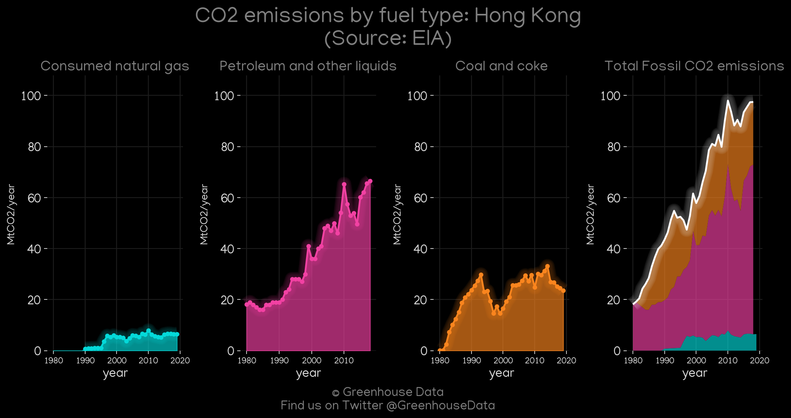
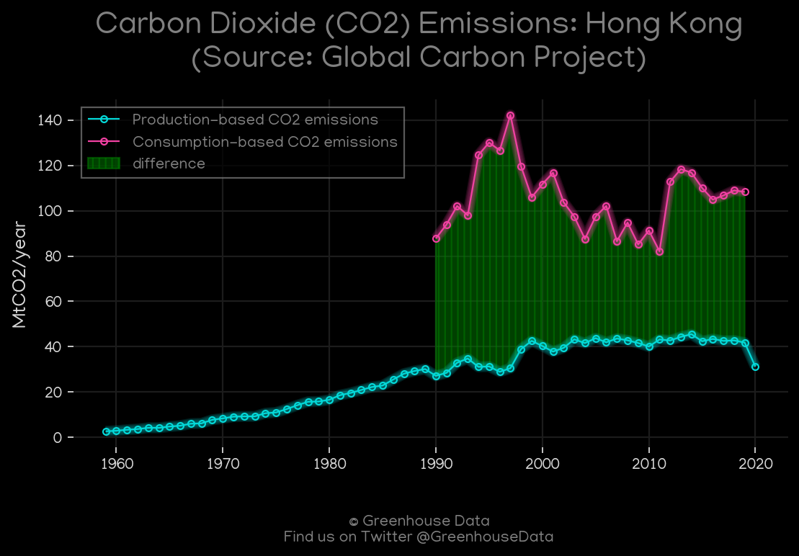
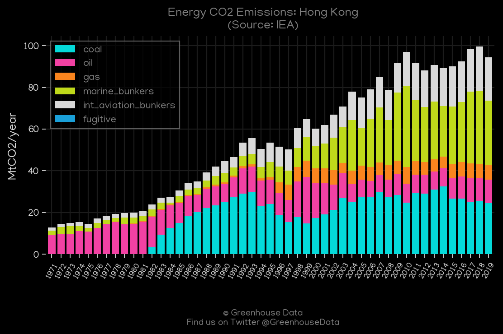
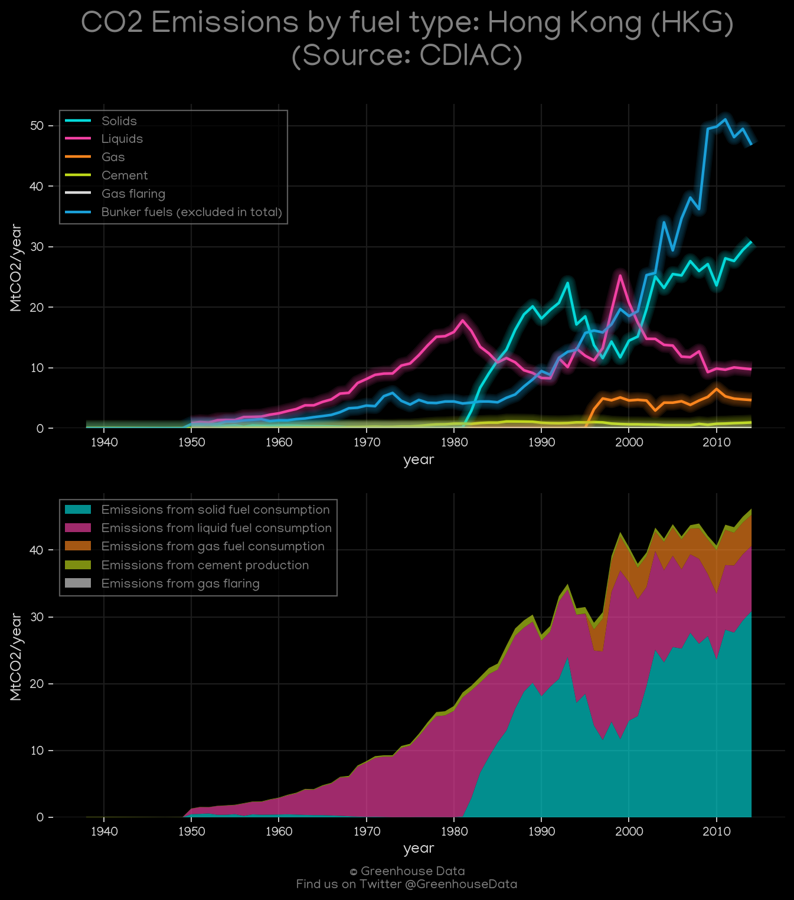
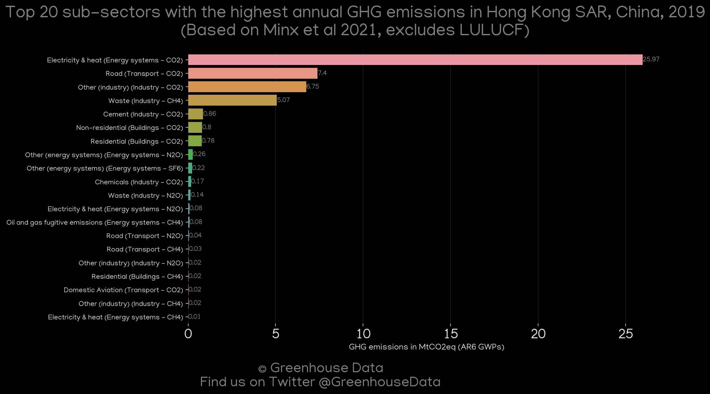

<h1 align="center">
🇭🇰🇭🇰🇭🇰🇭🇰🇭🇰
 
Hong Kong
 
🇭🇰🇭🇰🇭🇰🇭🇰🇭🇰
</h1>
<h2>Datasets:</h2>

<a href="https://github.com/dquintani/GreenhouseData/tree/master/country_data/HKG_Hong Kong/data">View on Github</a>
 

<a href="data/HKG_PRIMAP-hist.csv">PRIMAP-hist</a> || <a href="data/HKG_GCP_consupmption.csv">GCP_consupmption</a> || <a href="data/HKG_CDIAC.csv">CDIAC</a> || <a href="data/HKG_IEA.csv">IEA</a> || <a href="data/HKG_BP.csv">BP</a> || <a href="data/HKG_FAO.csv">FAO</a> || <a href="data/HKG_EDGAR.csv">EDGAR</a> || <a href="data/HKG_Minx_2021.csv">Minx_2021</a> || <a href="data/HKG_GCP.csv">GCP</a> || <a href="data/HKG_EIA.csv">EIA</a>

 

<h1>Figures:</h1><h2>#1 (HKG_BP_1)</h2>

<h2>#2 (HKG_CO2_totals)</h2>

<h2>#3 (HKG_EIA_1)</h2>

<h2>#4 (HKG_GCP_1)</h2>

<h2>#5 (HKG_GCP_Country_Highlight)</h2>

<h2>#6 (HKG_IEA_1)</h2>

<h2>#7 (HKG_CDIAC_1)</h2>

<h2>#8 (HKG_Minx_top20_subsectors)</h2>

