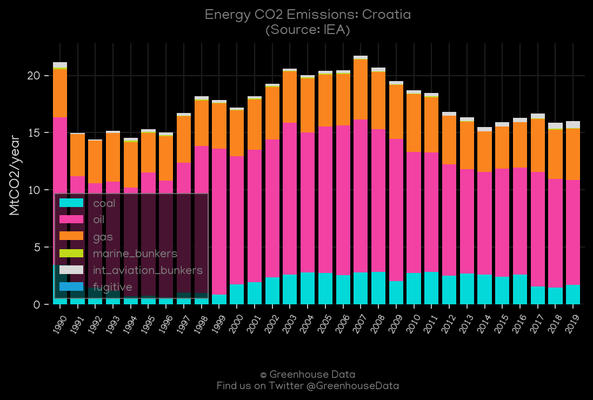
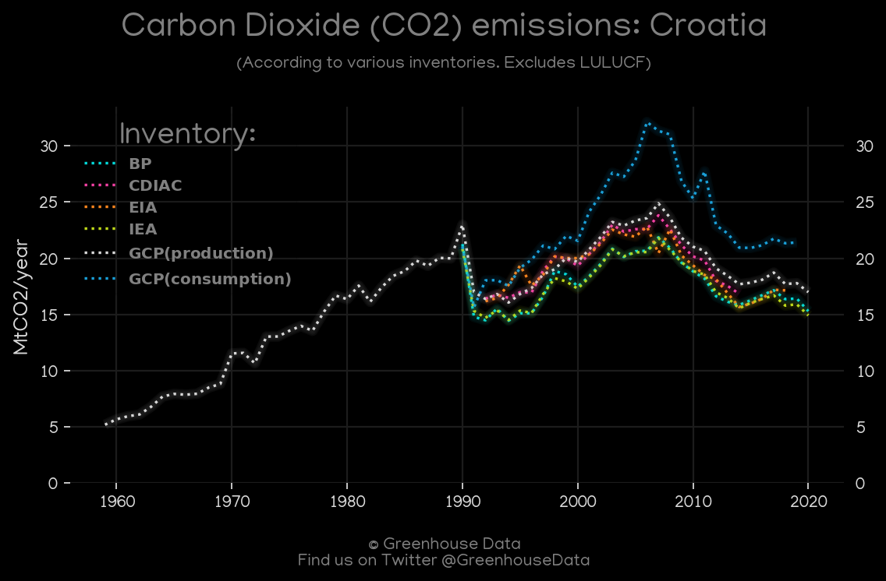
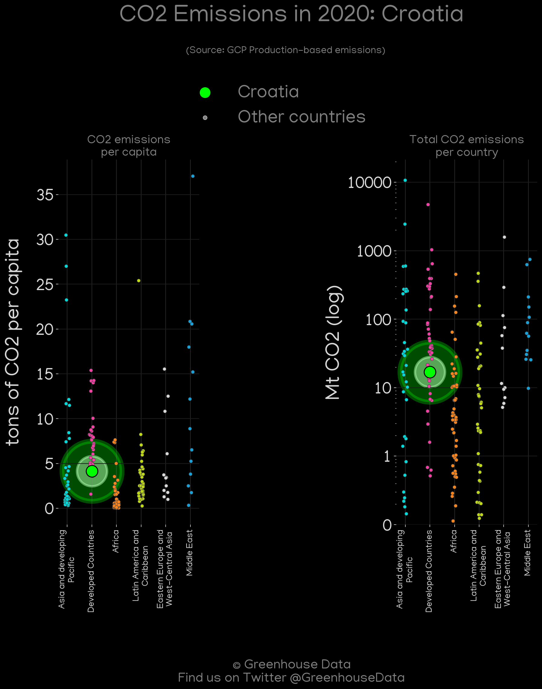
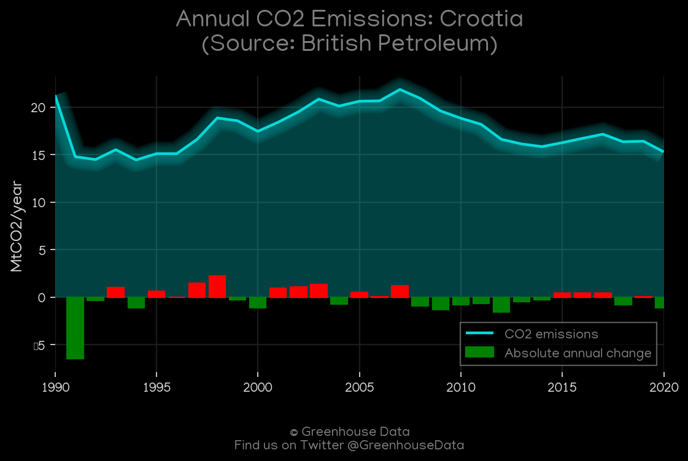
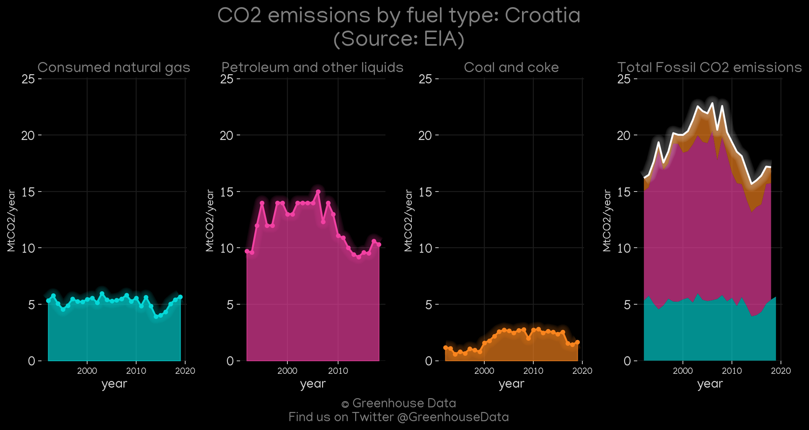
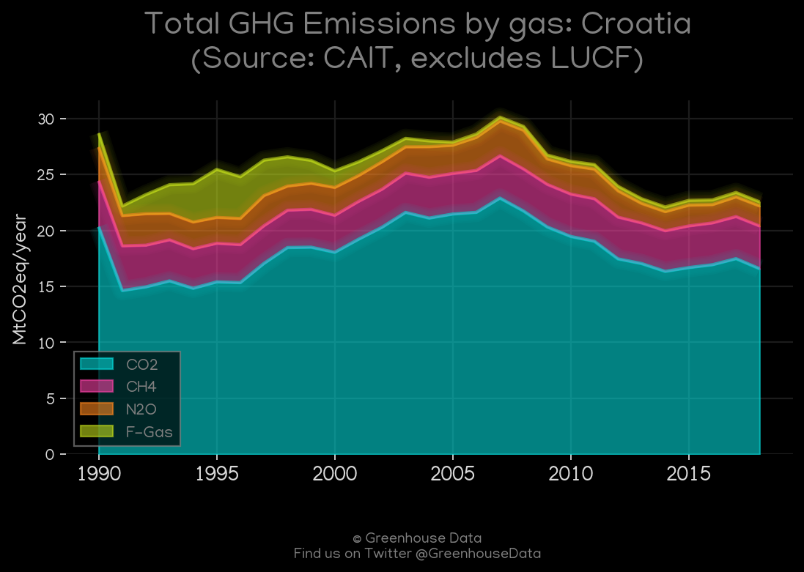
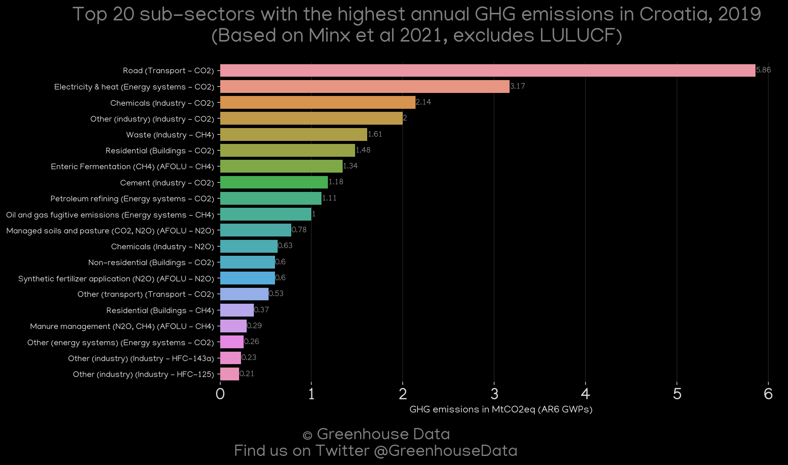
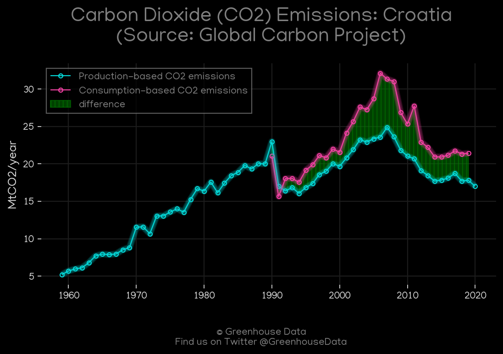
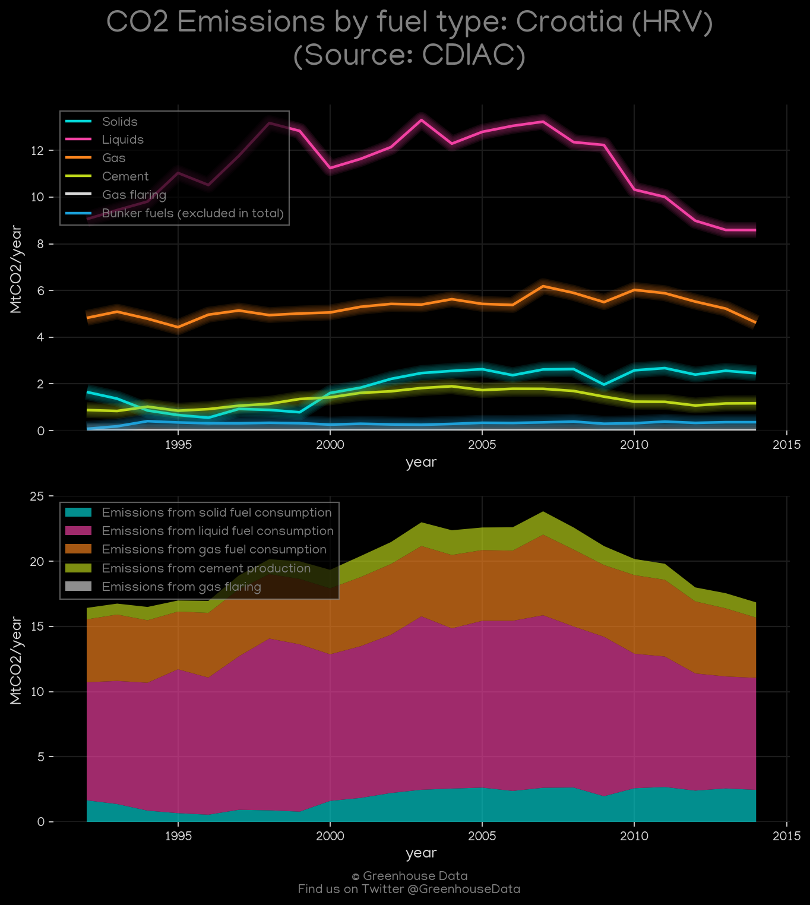

<h1 align="center">
🇭🇷🇭🇷🇭🇷🇭🇷🇭🇷
 
Croatia
 
🇭🇷🇭🇷🇭🇷🇭🇷🇭🇷
</h1>
<h2>Datasets:</h2>

<a href="https://github.com/dquintani/GreenhouseData/tree/master/country_data/HRV_Croatia/data">View on Github</a>
 

<a href="data/HRV_FAO.csv">FAO</a> || <a href="data/HRV_Minx_2021.csv">Minx_2021</a> || <a href="data/HRV_PRIMAP-hist.csv">PRIMAP-hist</a> || <a href="data/HRV_CDIAC.csv">CDIAC</a> || <a href="data/HRV_EIA.csv">EIA</a> || <a href="data/HRV_IEA.csv">IEA</a> || <a href="data/HRV_EPA.csv">EPA</a> || <a href="data/HRV_CAIT.csv">CAIT</a> || <a href="data/HRV_GCP.csv">GCP</a> || <a href="data/HRV_BP.csv">BP</a> || <a href="data/HRV_EDGAR.csv">EDGAR</a> || <a href="data/HRV_GCP_consupmption.csv">GCP_consupmption</a>

 

<h1>Figures:</h1><h2>#1 (HRV_CAIT_lucf_vs_nolucf)</h2>

<h2>#2 (HRV_IEA_1)</h2>

<h2>#3 (HRV_CO2_totals)</h2>

<h2>#4 (HRV_GCP_Country_Highlight)</h2>

<h2>#5 (HRV_BP_1)</h2>

<h2>#6 (HRV_EIA_1)</h2>

<h2>#7 (HRV_CAIT_gases_1)</h2>

<h2>#8 (HRV_Minx_top20_subsectors)</h2>

<h2>#9 (HRV_GCP_1)</h2>

<h2>#10 (HRV_CDIAC_1)</h2>

<h2>#11 (HRV_UNFCCC_AI_1)</h2>

