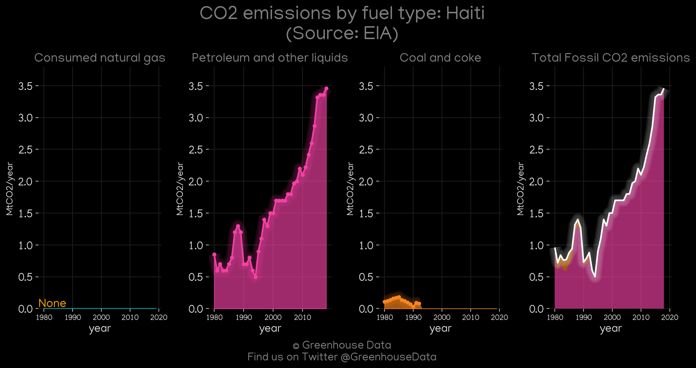
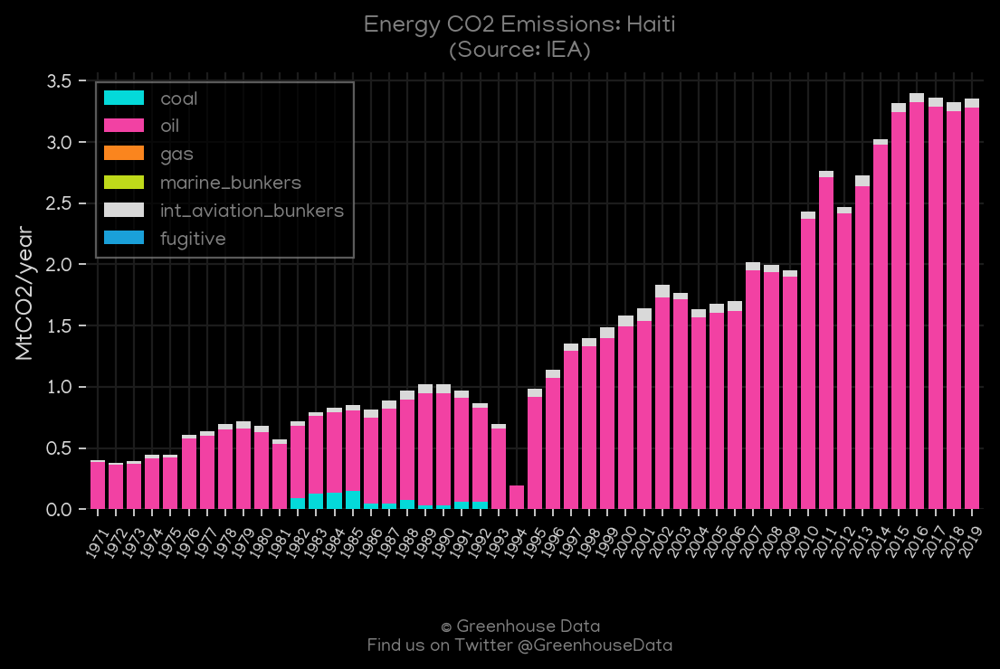
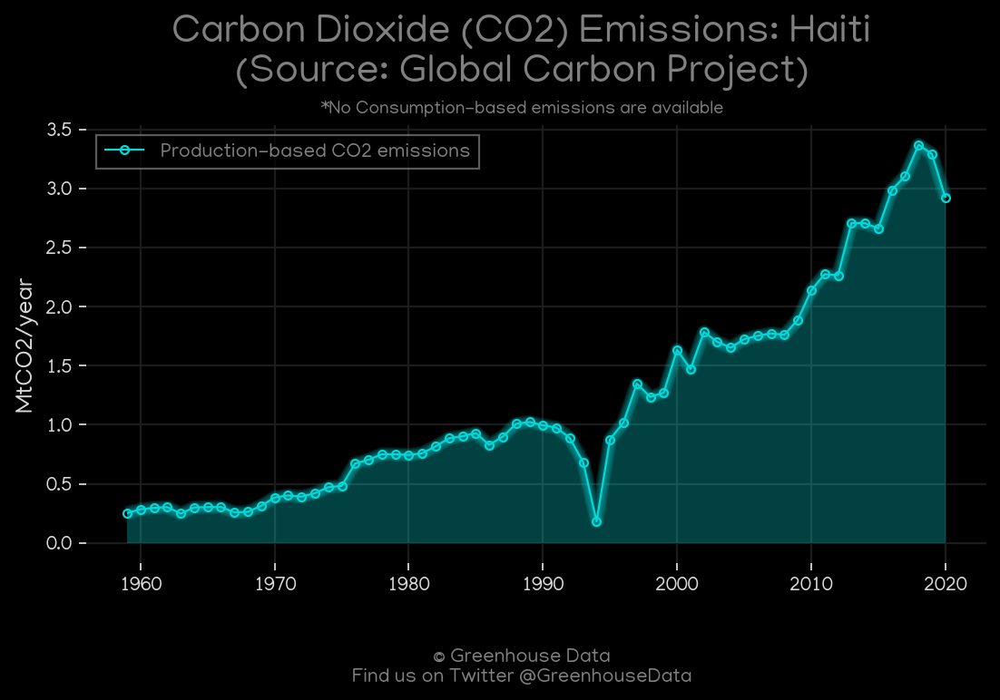
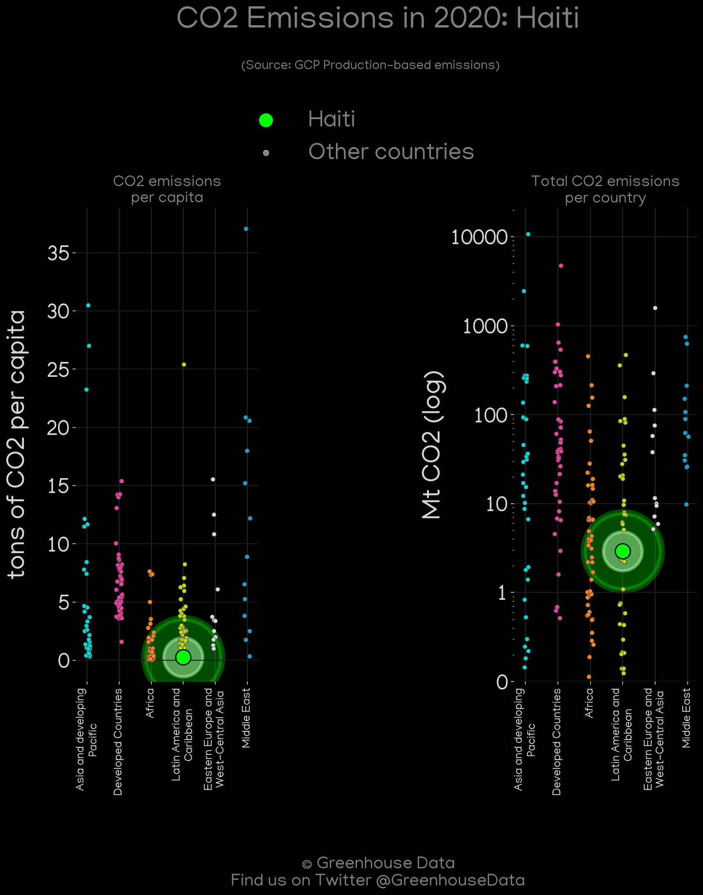
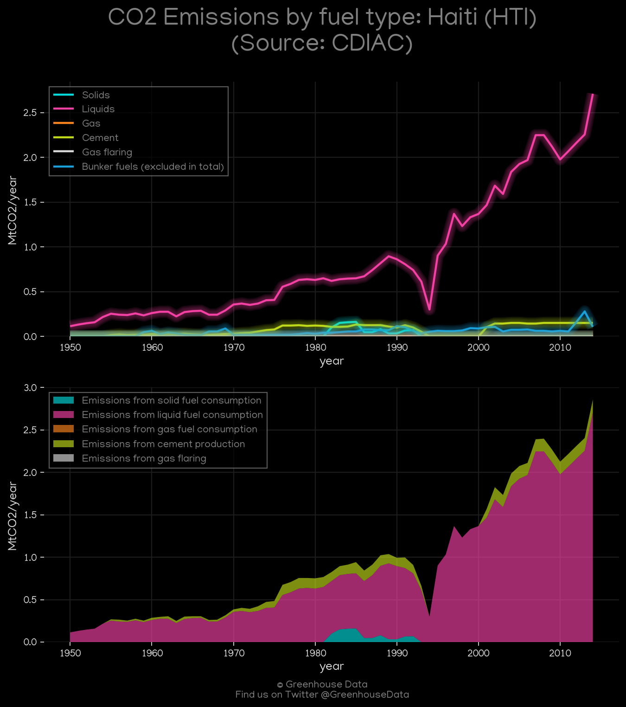
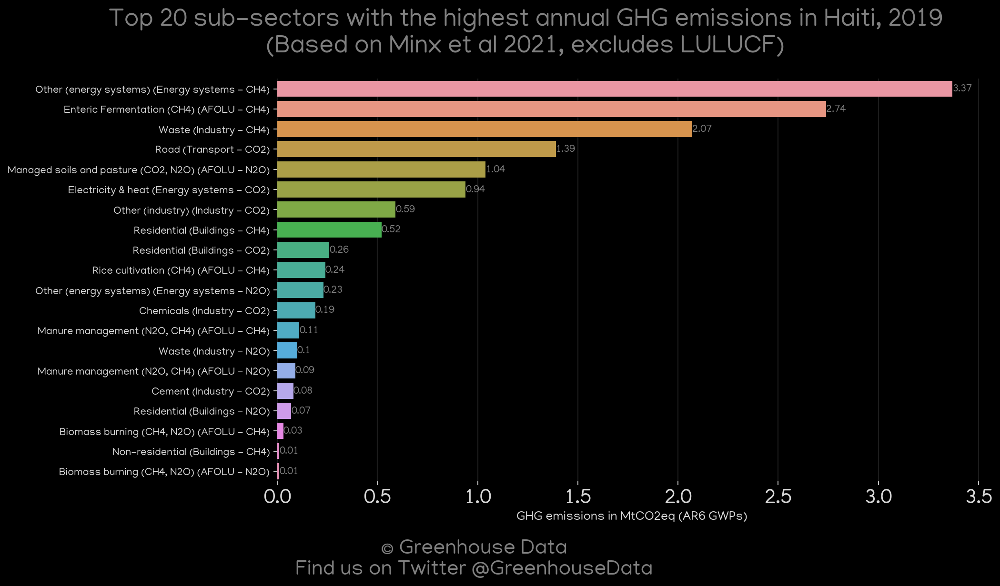
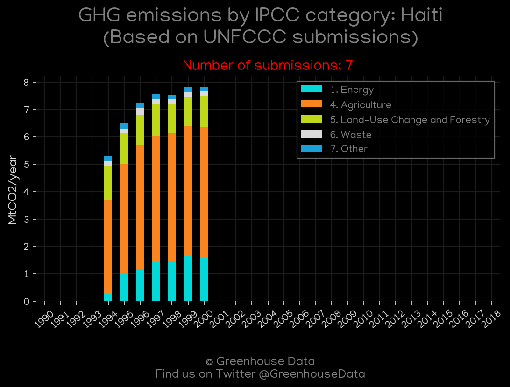
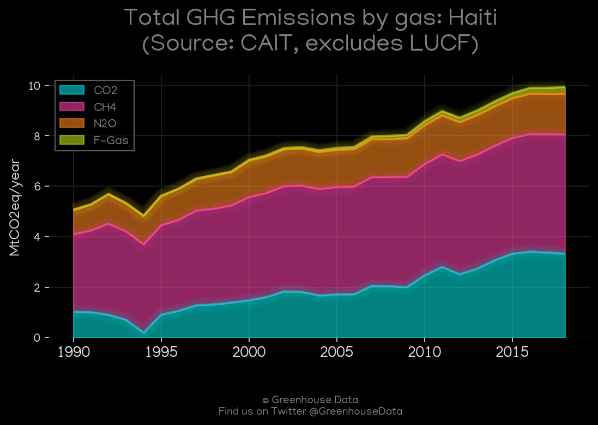
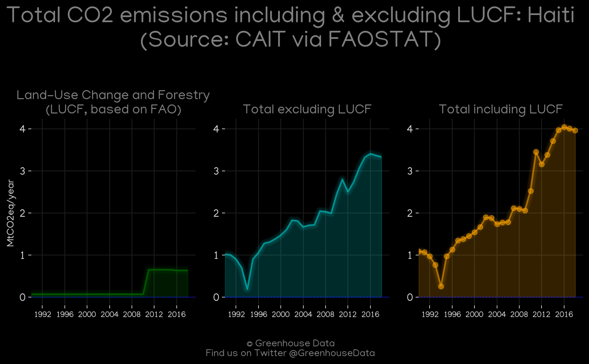

<h1 align="center">
🇭🇹🇭🇹🇭🇹🇭🇹🇭🇹
 
Haiti
 
🇭🇹🇭🇹🇭🇹🇭🇹🇭🇹
</h1>
<h2>Datasets:</h2>

<a href="https://github.com/dquintani/GreenhouseData/tree/master/country_data/HTI_Haiti/data">View on Github</a>
 

<a href="data/HTI_Minx_2021.csv">Minx_2021</a> || <a href="data/HTI_EDGAR.csv">EDGAR</a> || <a href="data/HTI_EPA.csv">EPA</a> || <a href="data/HTI_FAO.csv">FAO</a> || <a href="data/HTI_PRIMAP-hist.csv">PRIMAP-hist</a> || <a href="data/HTI_IEA.csv">IEA</a> || <a href="data/HTI_GCP.csv">GCP</a> || <a href="data/HTI_CAIT.csv">CAIT</a> || <a href="data/HTI_CDIAC.csv">CDIAC</a> || <a href="data/HTI_GCP_consupmption.csv">GCP_consupmption</a> || <a href="data/HTI_EIA.csv">EIA</a>

 

<h1>Figures:</h1><h2>#1 (HTI_EIA_1)</h2>

<h2>#2 (HTI_CO2_totals)</h2>

<h2>#3 (HTI_IEA_1)</h2>

<h2>#4 (HTI_GCP_1)</h2>

<h2>#5 (HTI_GCP_Country_Highlight)</h2>

<h2>#6 (HTI_CDIAC_1)</h2>

<h2>#7 (HTI_Minx_top20_subsectors)</h2>

<h2>#8 (HTI_UNFCCC_NAI_1)</h2>

<h2>#9 (HTI_CAIT_gases_1)</h2>

<h2>#10 (HTI_CAIT_lucf_vs_nolucf)</h2>

