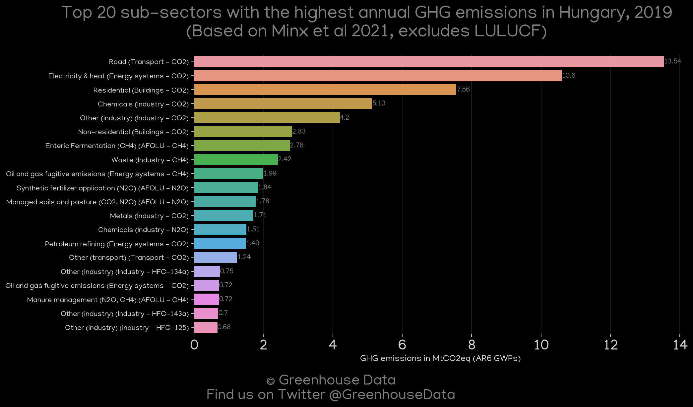
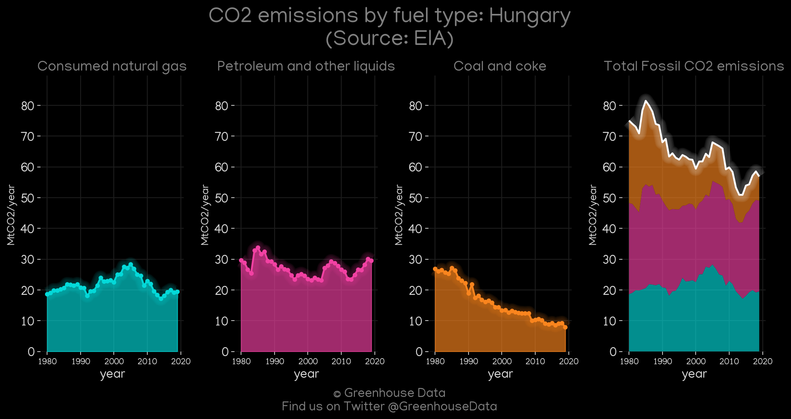
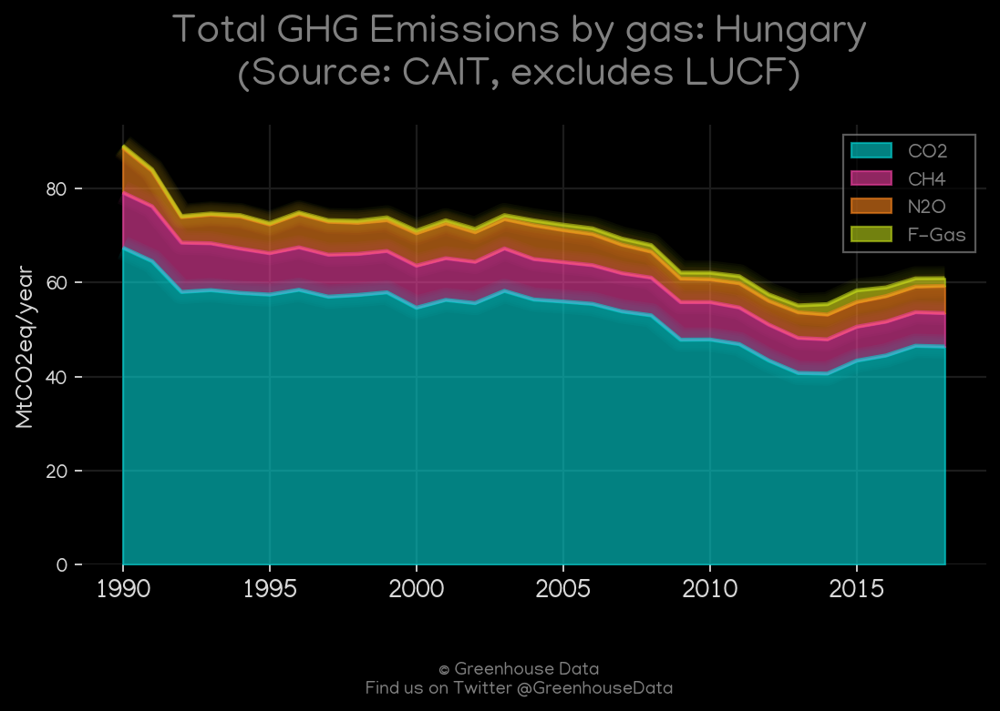
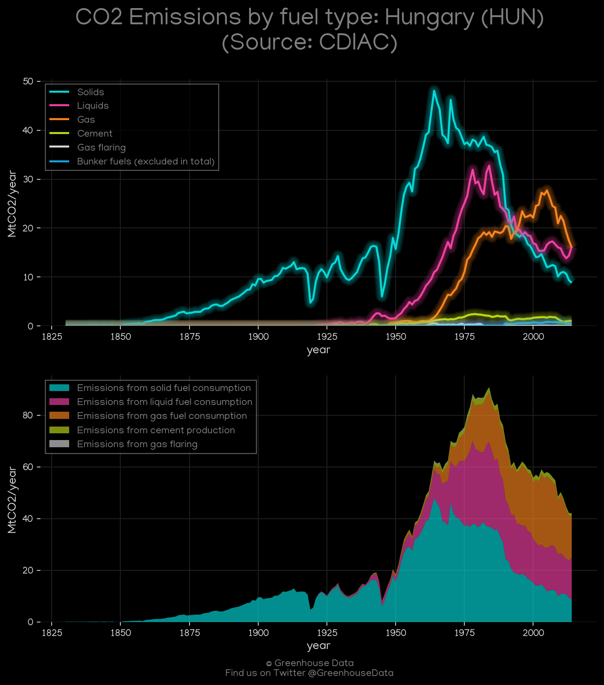
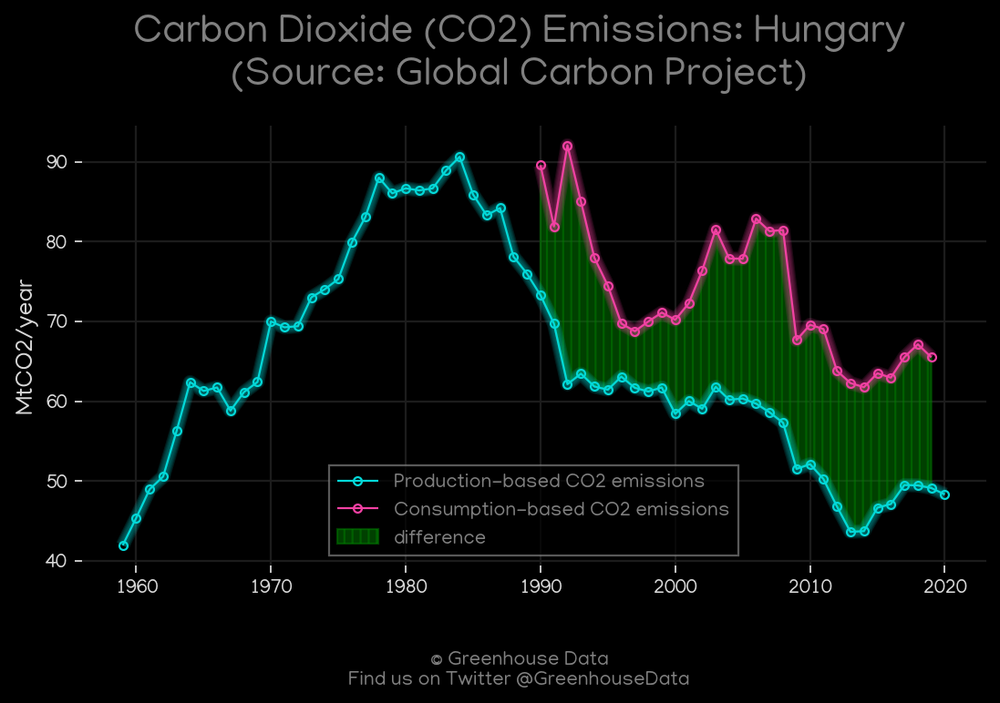
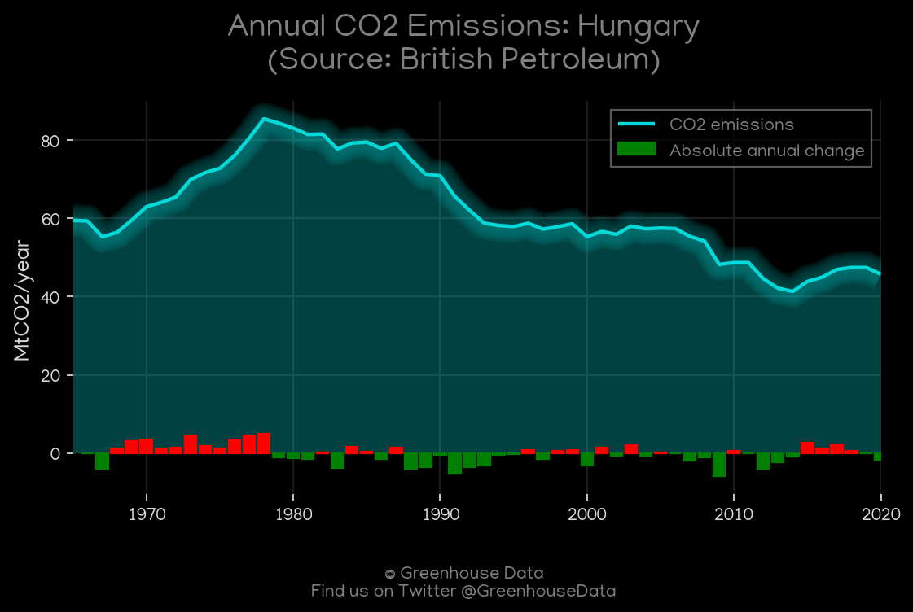
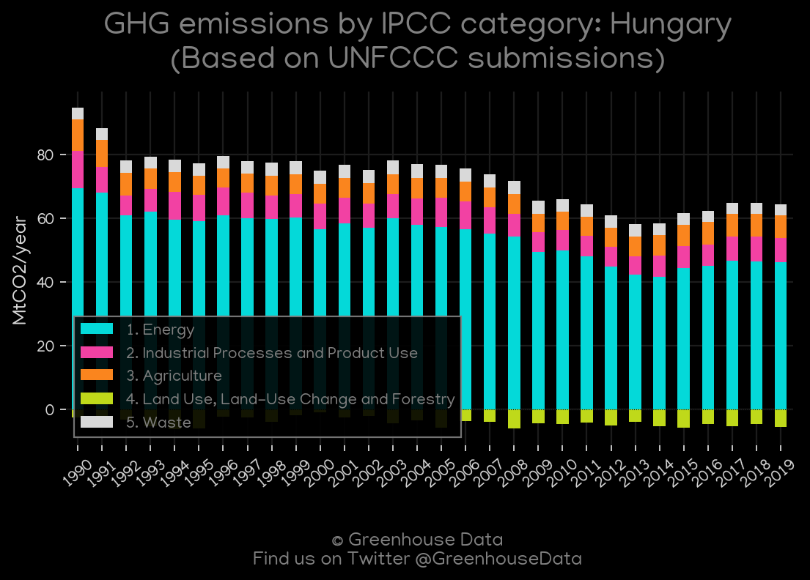
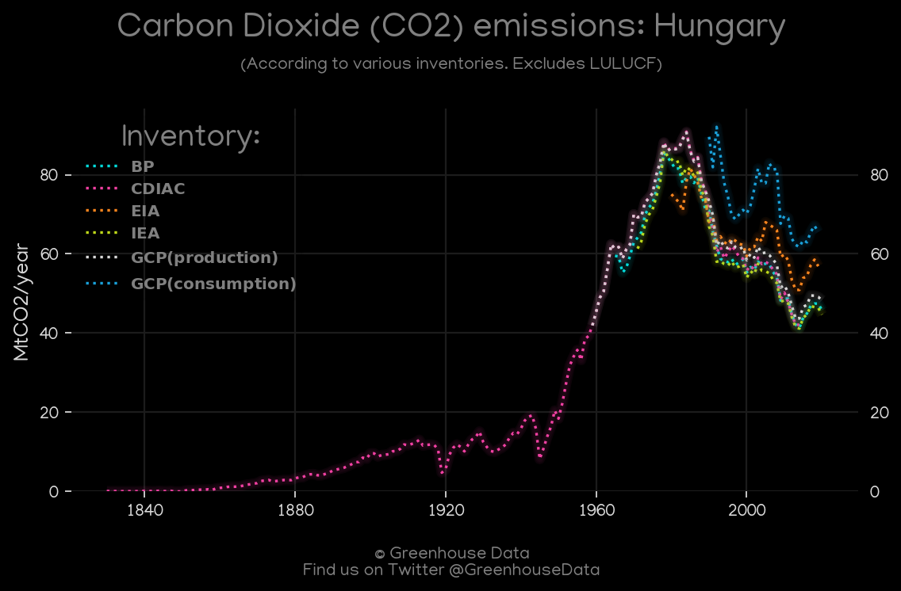
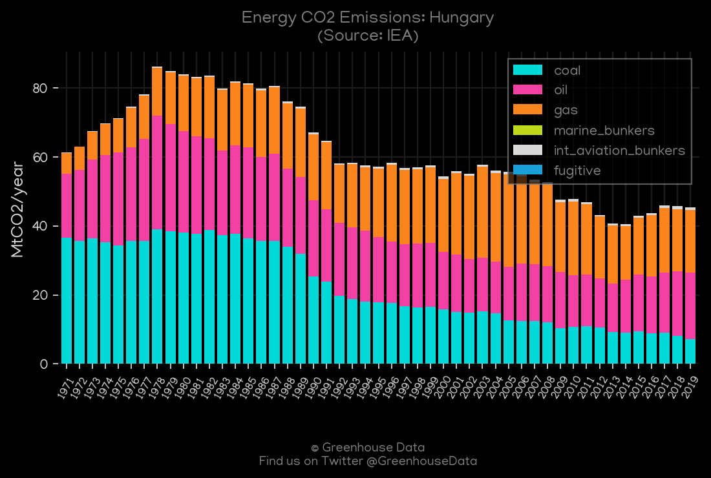

<h1 align="center">
🇭🇺🇭🇺🇭🇺🇭🇺🇭🇺
 
Hungary
 
🇭🇺🇭🇺🇭🇺🇭🇺🇭🇺
</h1>
<h2>Datasets:</h2>

<a href="https://github.com/dquintani/Greenhouse-Data/tree/master/country_data/HUN_Hungary/data">View on Github</a>
 

<a href="data/HUN_EPA.csv">EPA</a> || <a href="data/HUN_BP.csv">BP</a> || <a href="data/HUN_GCP_cons.csv">GCP_cons</a> || <a href="data/HUN_FAO.csv">FAO</a> || <a href="data/HUN_CDIAC.csv">CDIAC</a> || <a href="data/HUN_EDGAR.csv">EDGAR</a> || <a href="data/HUN_GCP_consupmption.csv">GCP_consupmption</a> || <a href="data/HUN_GCP.csv">GCP</a> || <a href="data/HUN_CAIT.csv">CAIT</a> || <a href="data/HUN_EIA.csv">EIA</a> || <a href="data/HUN_IEA.csv">IEA</a> || <a href="data/HUN_PRIMAP-hist.csv">PRIMAP-hist</a> || <a href="data/HUN_Minx_2021.csv">Minx_2021</a>

 

<h1>Figures:</h1><h2>#1 (HUN_Minx_top20_subsectors)</h2>

<h2>#2 (HUN_EIA_1)</h2>

<h2>#3 (HUN_CAIT_gases_1)</h2>

<h2>#4 (HUN_CDIAC_1)</h2>

<h2>#5 (HUN_GCP_1)</h2>

<h2>#6 (HUN_BP_1)</h2>

<h2>#7 (HUN_UNFCCC_AI_1)</h2>

<h2>#8 (HUN_CO2_totals)</h2>

<h2>#9 (HUN_IEA_1)</h2>

