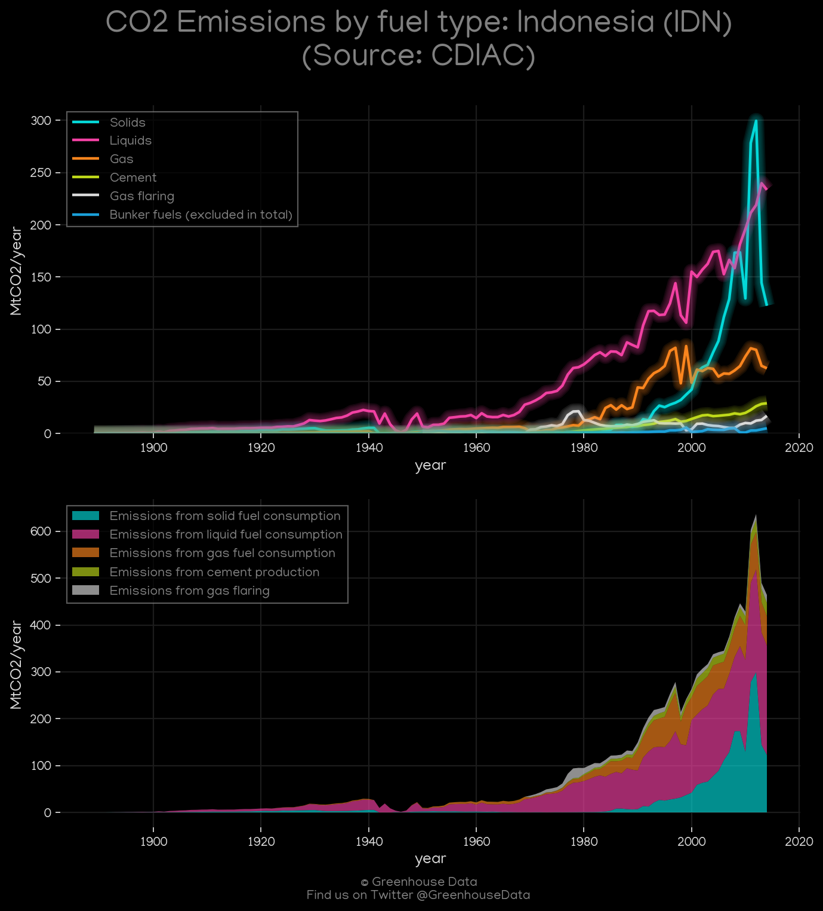
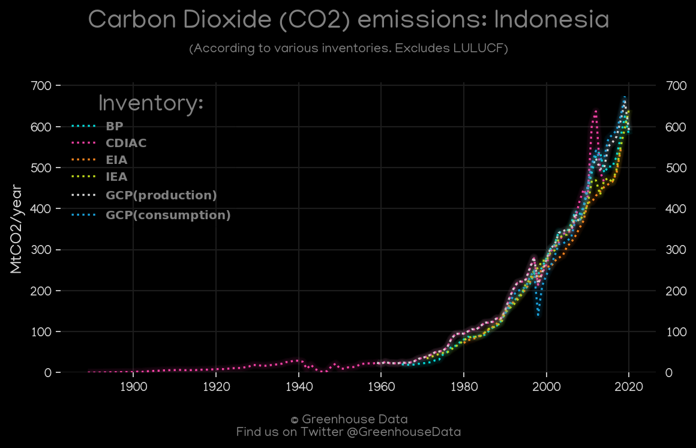
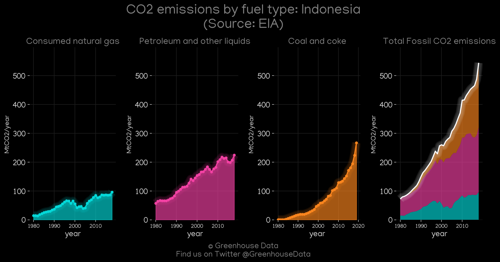
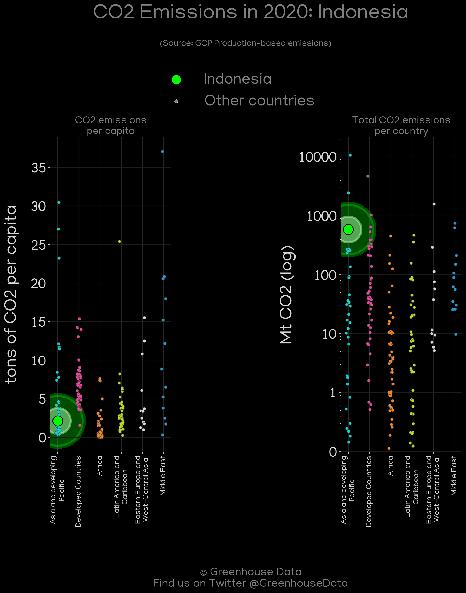
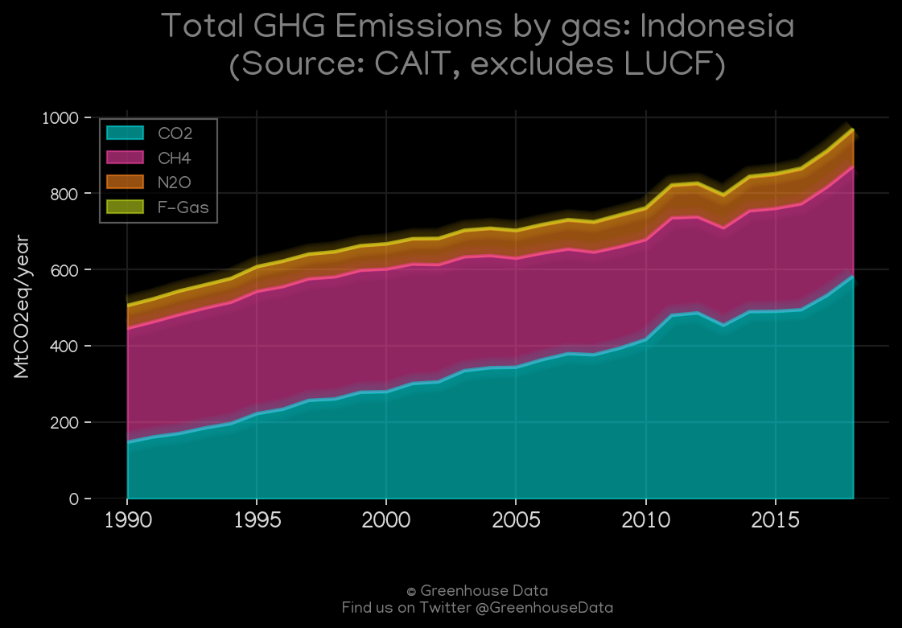
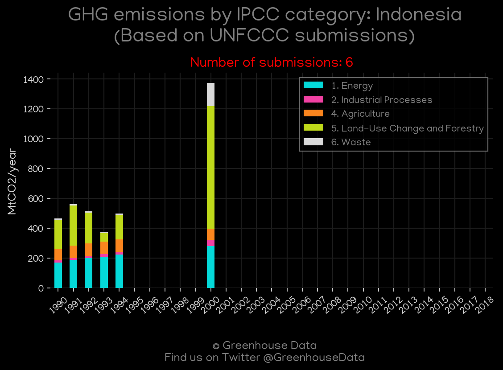
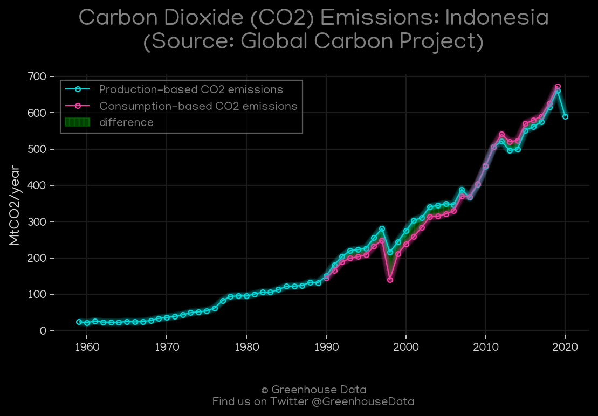
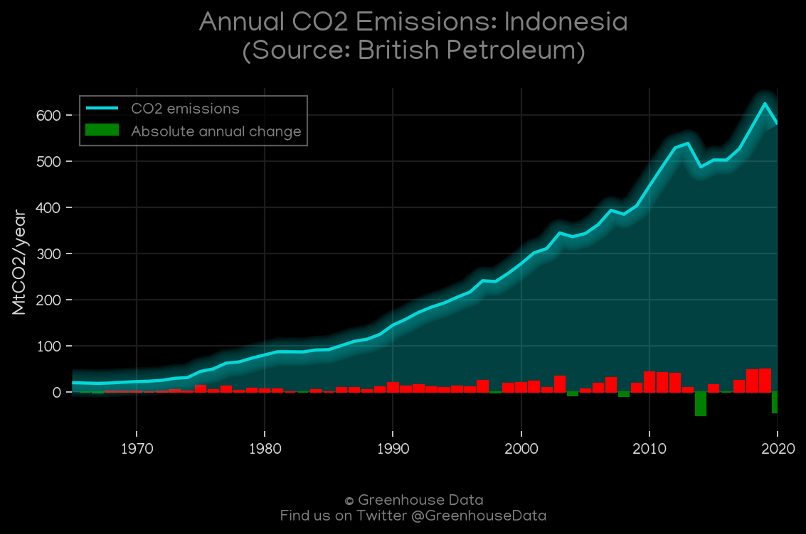
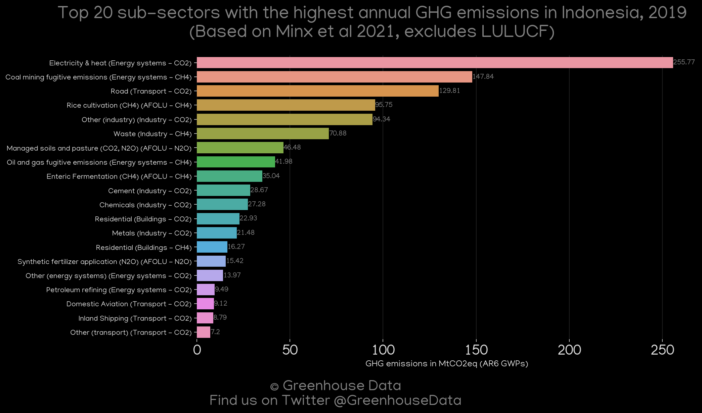

<h1 align="center">
🇮🇩🇮🇩🇮🇩🇮🇩🇮🇩
 
Indonesia
 
🇮🇩🇮🇩🇮🇩🇮🇩🇮🇩
</h1>
<h2>Datasets:</h2>

<a href="https://github.com/dquintani/GreenhouseData/tree/master/country_data/IDN_Indonesia/data">View on Github</a>
 

<a href="data/IDN_EDGAR.csv">EDGAR</a> || <a href="data/IDN_GCP.csv">GCP</a> || <a href="data/IDN_GCP_consupmption.csv">GCP_consupmption</a> || <a href="data/IDN_CAIT.csv">CAIT</a> || <a href="data/IDN_EPA.csv">EPA</a> || <a href="data/IDN_IEA.csv">IEA</a> || <a href="data/IDN_FAO.csv">FAO</a> || <a href="data/IDN_BP.csv">BP</a> || <a href="data/IDN_CDIAC.csv">CDIAC</a> || <a href="data/IDN_EIA.csv">EIA</a> || <a href="data/IDN_PRIMAP-hist.csv">PRIMAP-hist</a> || <a href="data/IDN_Minx_2021.csv">Minx_2021</a>

 

<h1>Figures:</h1><h2>#1 (IDN_CDIAC_1)</h2>

<h2>#2 (IDN_CAIT_lucf_vs_nolucf)</h2>

<h2>#3 (IDN_CO2_totals)</h2>

<h2>#4 (IDN_EIA_1)</h2>

<h2>#5 (IDN_GCP_Country_Highlight)</h2>

<h2>#6 (IDN_CAIT_gases_1)</h2>

<h2>#7 (IDN_UNFCCC_NAI_1)</h2>

<h2>#8 (IDN_GCP_1)</h2>

<h2>#9 (IDN_BP_1)</h2>

<h2>#10 (IDN_Minx_top20_subsectors)</h2>

<h2>#11 (IDN_IEA_1)</h2>

