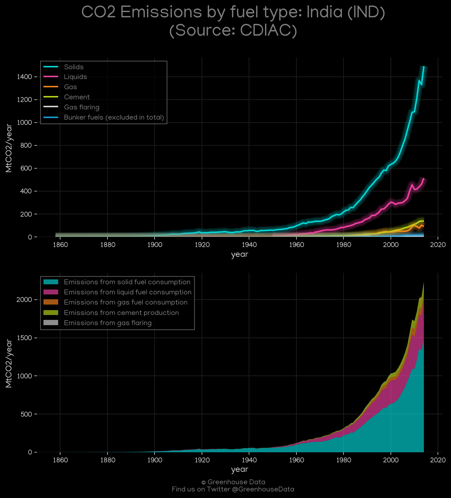
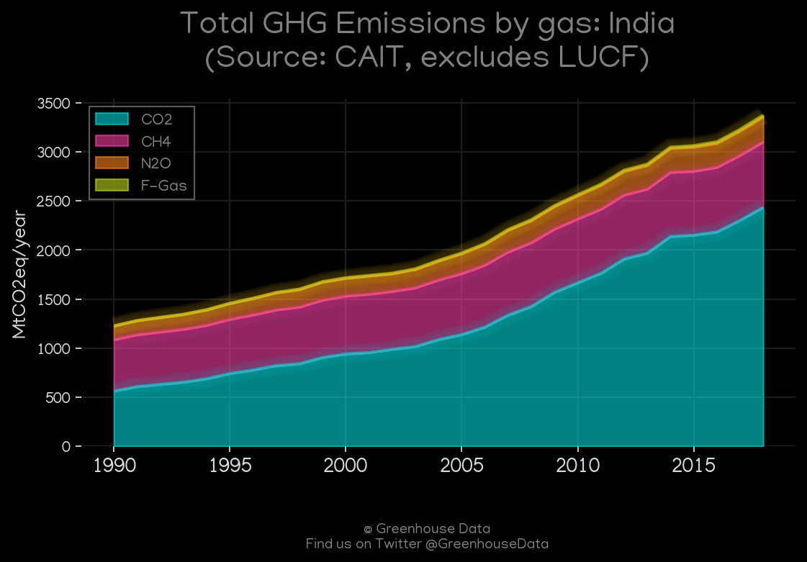
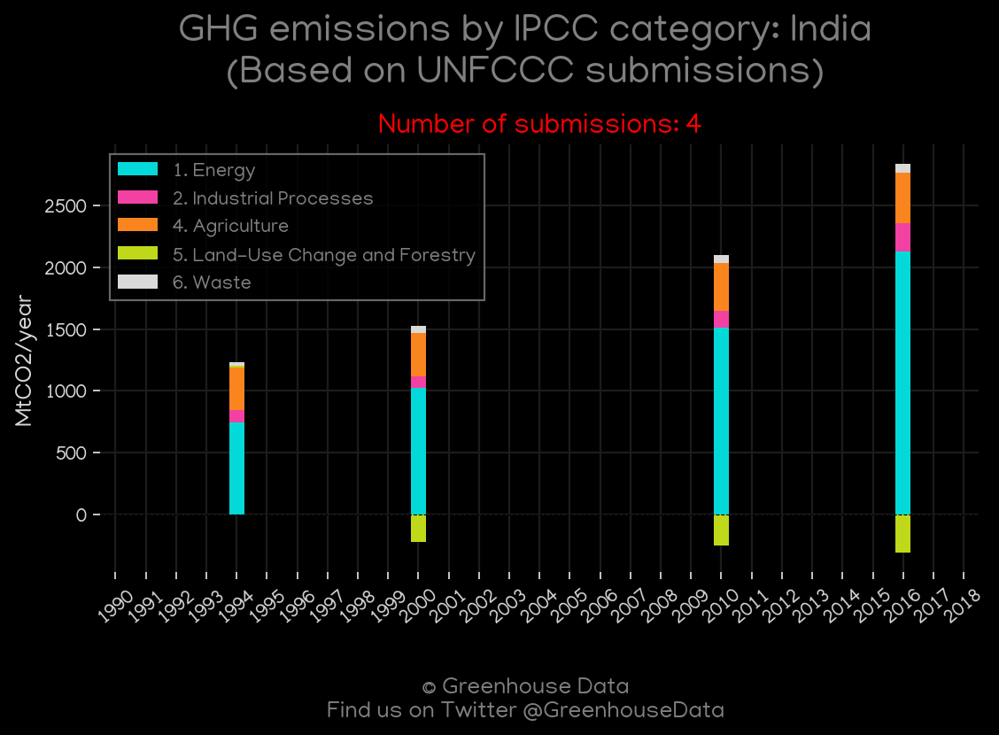
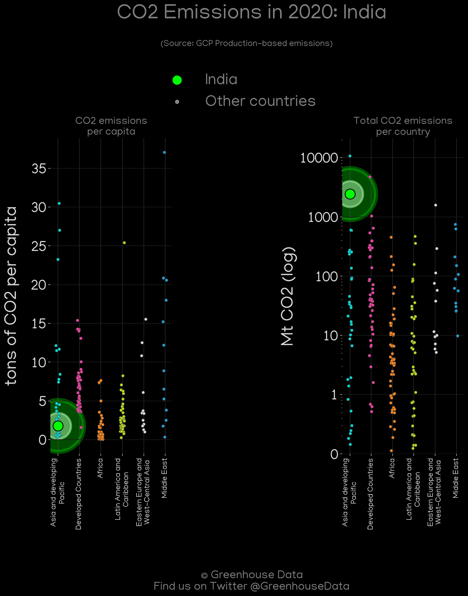
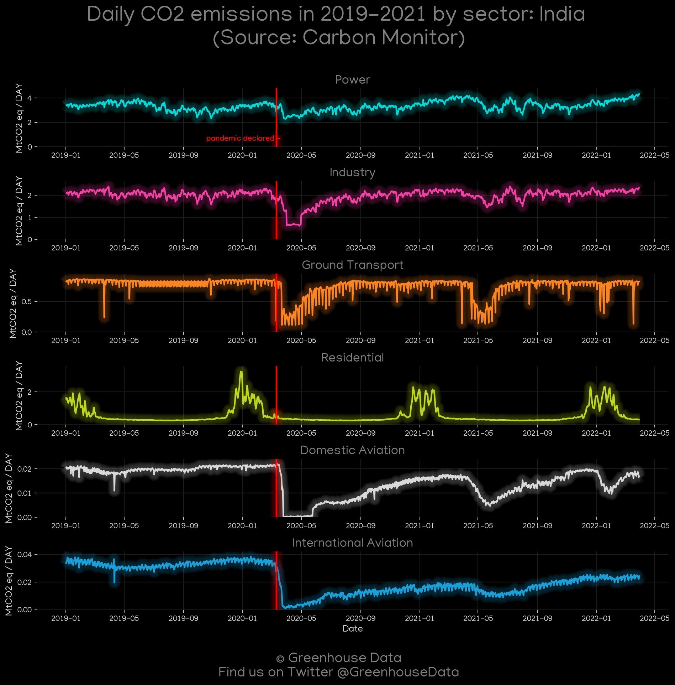
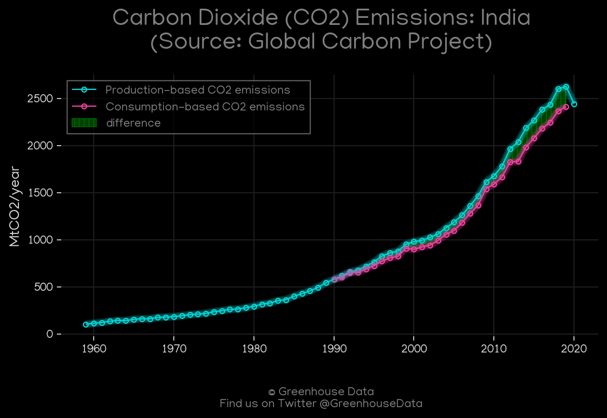
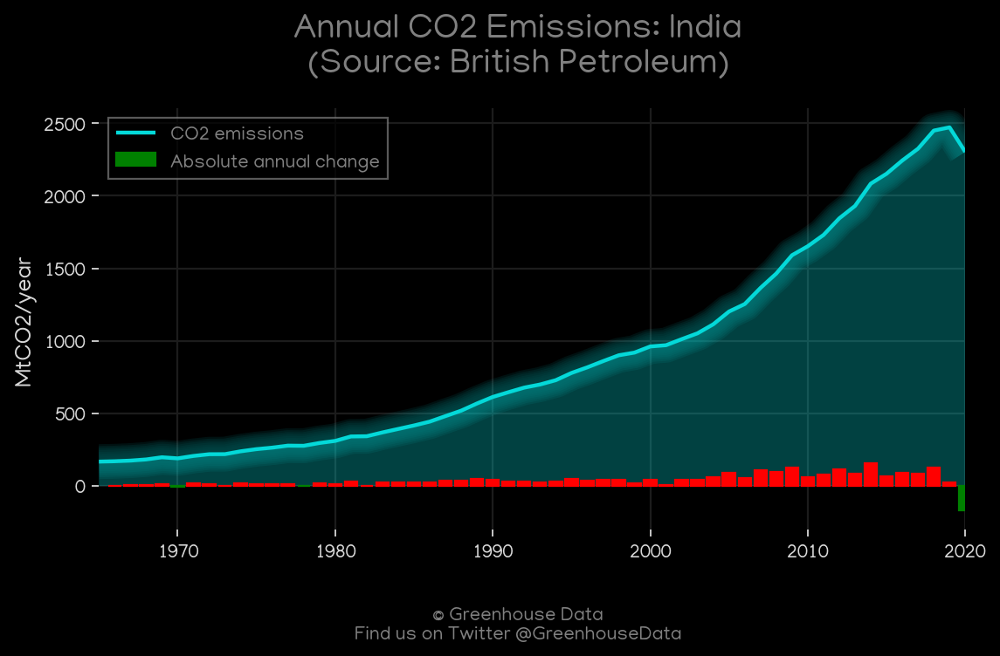
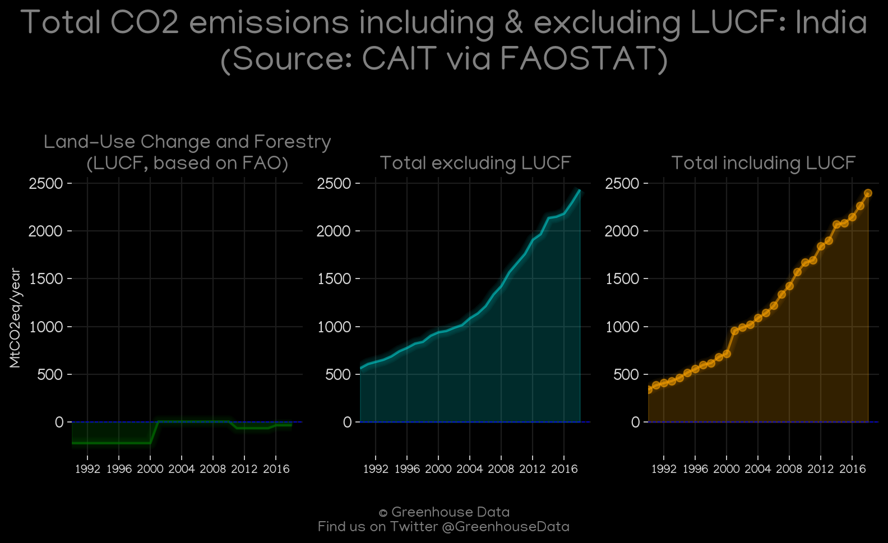
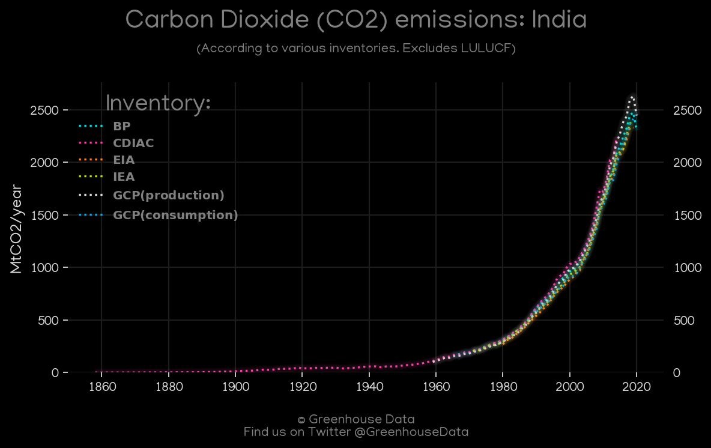
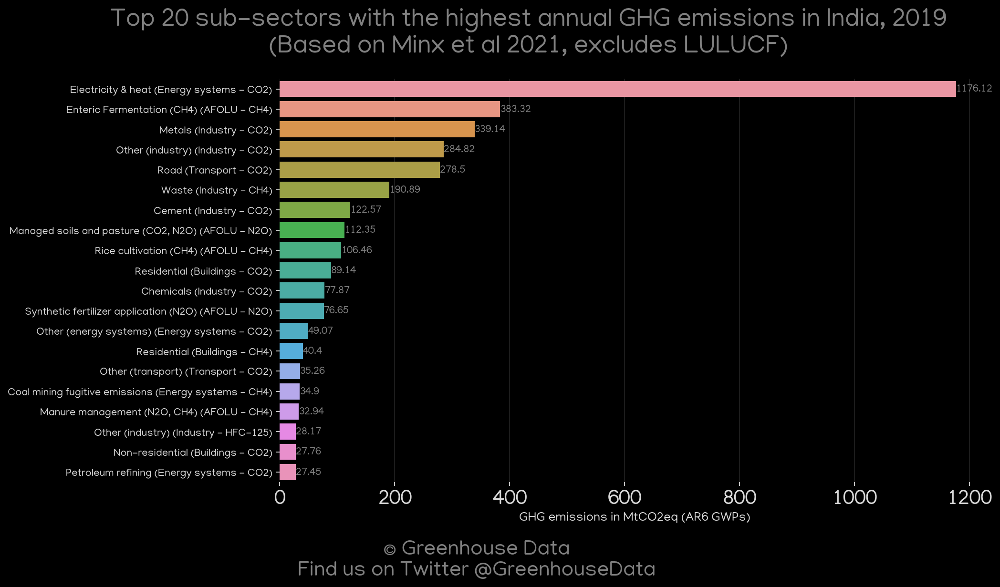

<h1 align="center">
🇮🇳🇮🇳🇮🇳🇮🇳🇮🇳
 
India
 
🇮🇳🇮🇳🇮🇳🇮🇳🇮🇳
</h1>
<h2>Datasets:</h2>

<a href="https://github.com/dquintani/GreenhouseData/tree/master/country_data/IND_India/data">View on Github</a>
 

<a href="data/IND_BP.csv">BP</a> || <a href="data/IND_GCP_consupmption.csv">GCP_consupmption</a> || <a href="data/IND_EIA.csv">EIA</a> || <a href="data/IND_CDIAC.csv">CDIAC</a> || <a href="data/IND_EDGAR.csv">EDGAR</a> || <a href="data/IND_EPA.csv">EPA</a> || <a href="data/IND_CAIT.csv">CAIT</a> || <a href="data/IND_Minx_2021.csv">Minx_2021</a> || <a href="data/IND_IEA.csv">IEA</a> || <a href="data/IND_FAO.csv">FAO</a> || <a href="data/IND_PRIMAP-hist.csv">PRIMAP-hist</a> || <a href="data/IND_GCP.csv">GCP</a>

 

<h1>Figures:</h1><h2>#1 (IND_CDIAC_1)</h2>

<h2>#2 (IND_CAIT_gases_1)</h2>

<h2>#3 (IND_EIA_1)</h2>

<h2>#4 (IND_UNFCCC_NAI_1)</h2>

<h2>#5 (IND_IEA_1)</h2>

<h2>#6 (IND_GCP_Country_Highlight)</h2>

<h2>#7 (IND_Carbon_Monitor_1)</h2>

<h2>#8 (IND_GCP_1)</h2>

<h2>#9 (IND_BP_1)</h2>

<h2>#10 (IND_CAIT_lucf_vs_nolucf)</h2>

<h2>#11 (IND_CO2_totals)</h2>

<h2>#12 (IND_Minx_top20_subsectors)</h2>

