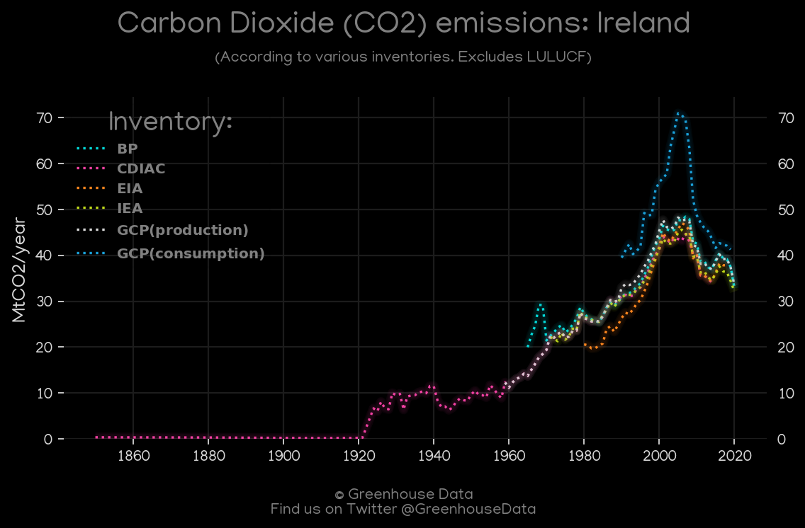
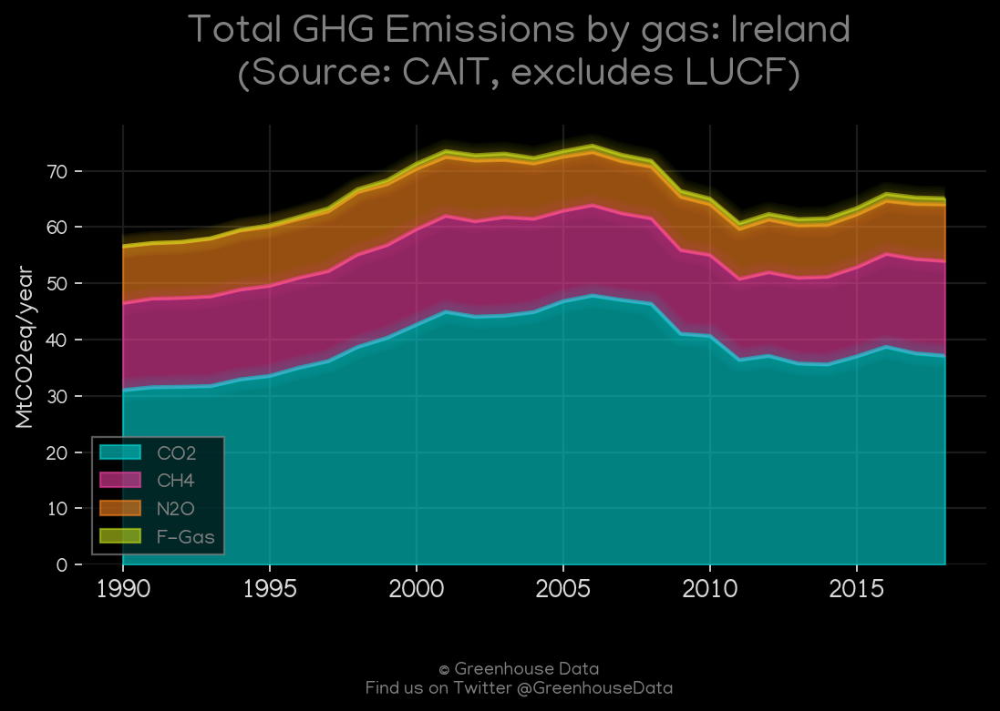
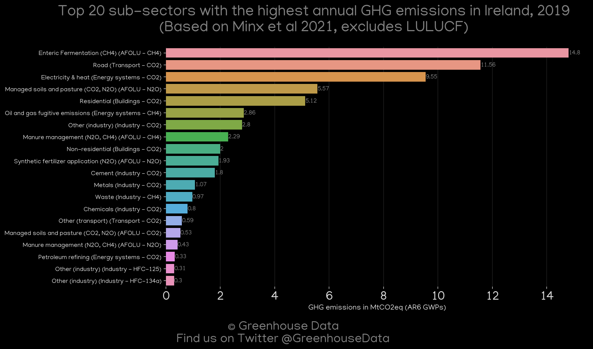
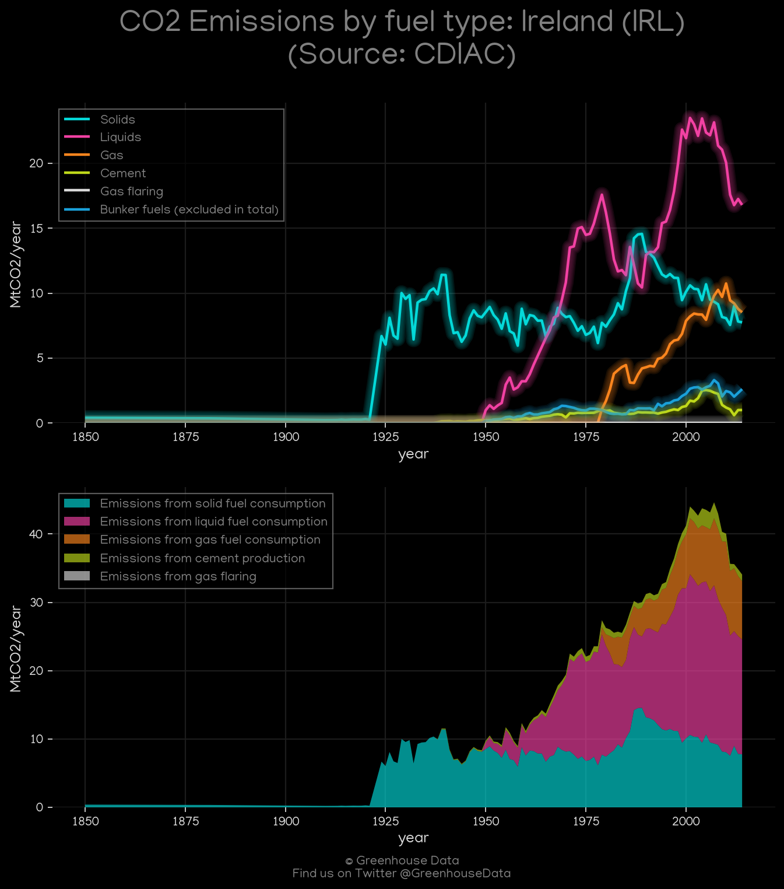
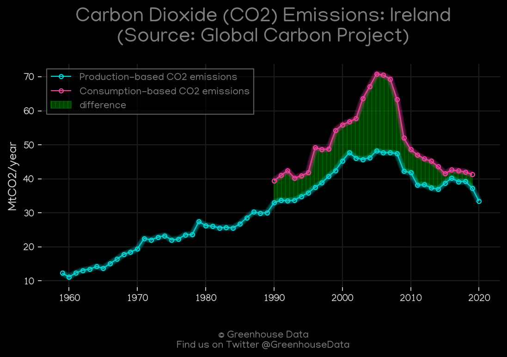
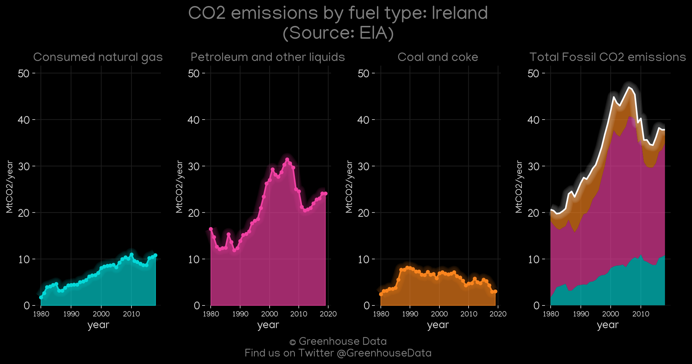
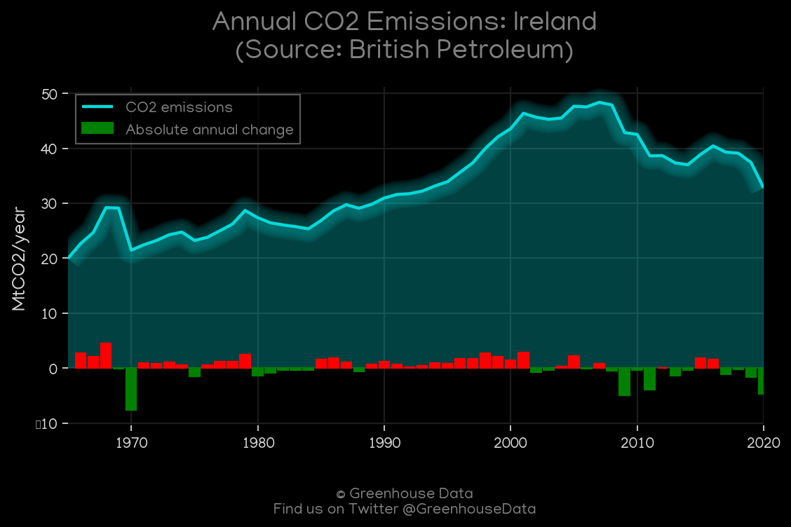
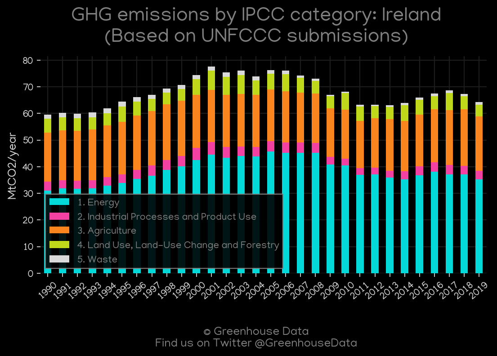

<h1 align="center">
🇮🇪🇮🇪🇮🇪🇮🇪🇮🇪
 
Ireland
 
🇮🇪🇮🇪🇮🇪🇮🇪🇮🇪
</h1>
<h2>Datasets:</h2>

<a href="https://github.com/dquintani/GreenhouseData/tree/master/country_data/IRL_Ireland/data">View on Github</a>
 

<a href="data/IRL_EIA.csv">EIA</a> || <a href="data/IRL_FAO.csv">FAO</a> || <a href="data/IRL_EPA.csv">EPA</a> || <a href="data/IRL_GCP_cons.csv">GCP_cons</a> || <a href="data/IRL_PRIMAP-hist.csv">PRIMAP-hist</a> || <a href="data/IRL_GCP_consupmption.csv">GCP_consupmption</a> || <a href="data/IRL_BP.csv">BP</a> || <a href="data/IRL_CDIAC.csv">CDIAC</a> || <a href="data/IRL_EDGAR.csv">EDGAR</a> || <a href="data/IRL_Minx_2021.csv">Minx_2021</a> || <a href="data/IRL_IEA.csv">IEA</a> || <a href="data/IRL_GCP.csv">GCP</a> || <a href="data/IRL_CAIT.csv">CAIT</a>

 

<h1>Figures:</h1><h2>#1 (IRL_CO2_totals)</h2>

<h2>#2 (IRL_CAIT_gases_1)</h2>

<h2>#3 (IRL_Minx_top20_subsectors)</h2>

<h2>#4 (IRL_CDIAC_1)</h2>

<h2>#5 (IRL_IEA_1)</h2>

<h2>#6 (IRL_GCP_1)</h2>

<h2>#7 (IRL_EIA_1)</h2>

<h2>#8 (IRL_BP_1)</h2>

<h2>#9 (IRL_UNFCCC_AI_1)</h2>

