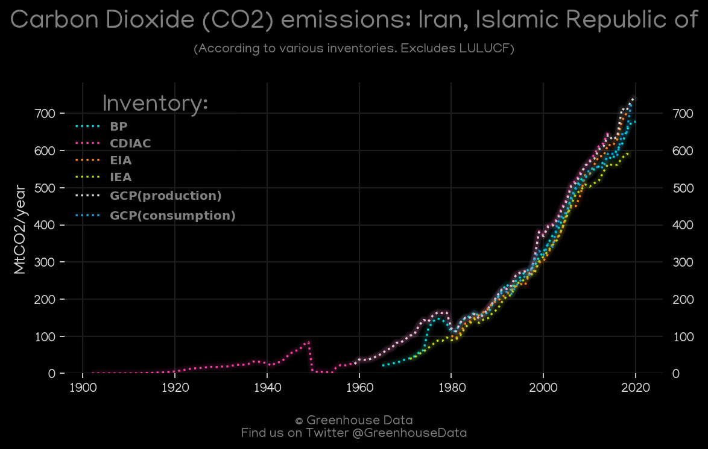
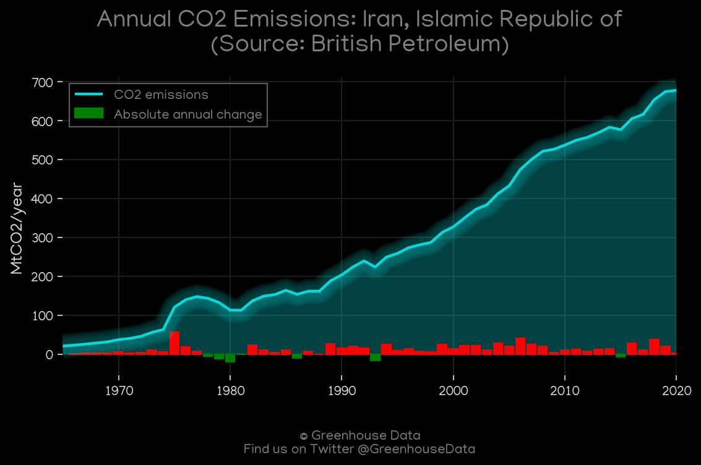
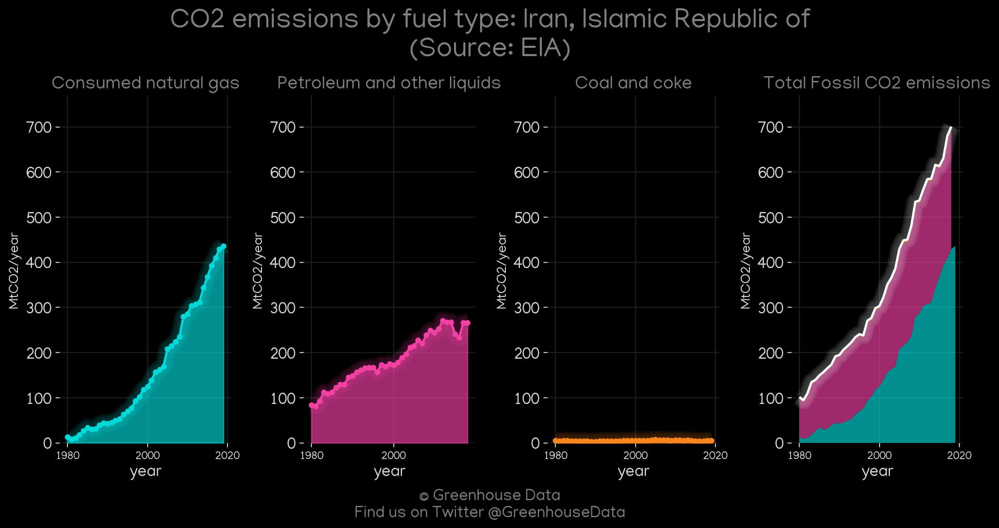
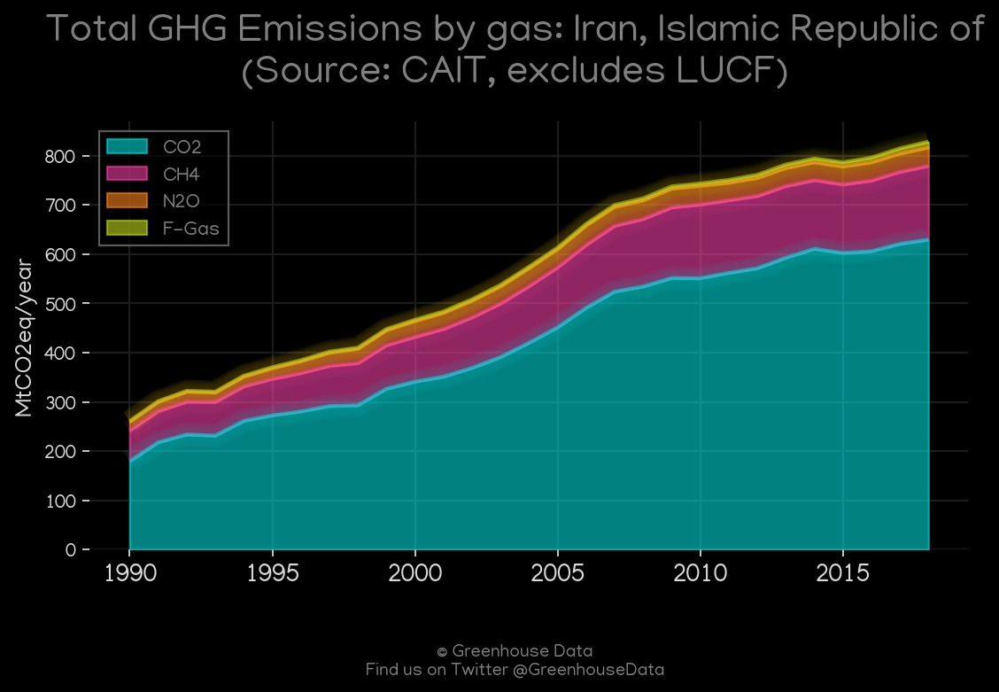
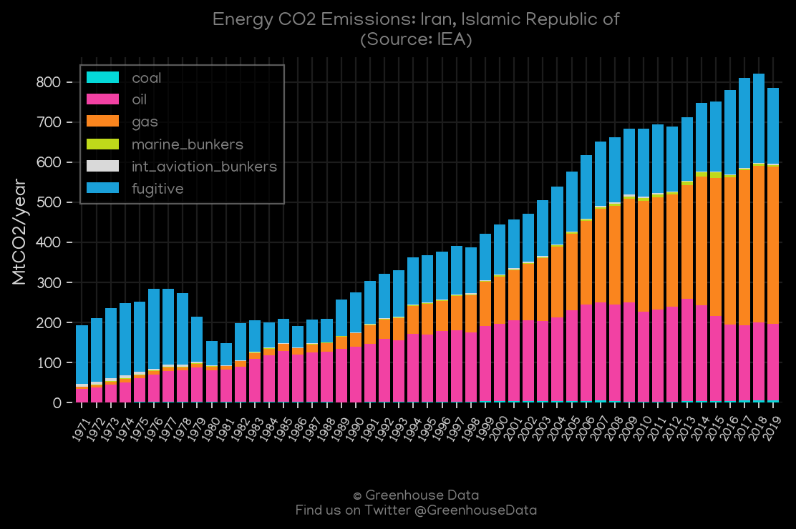
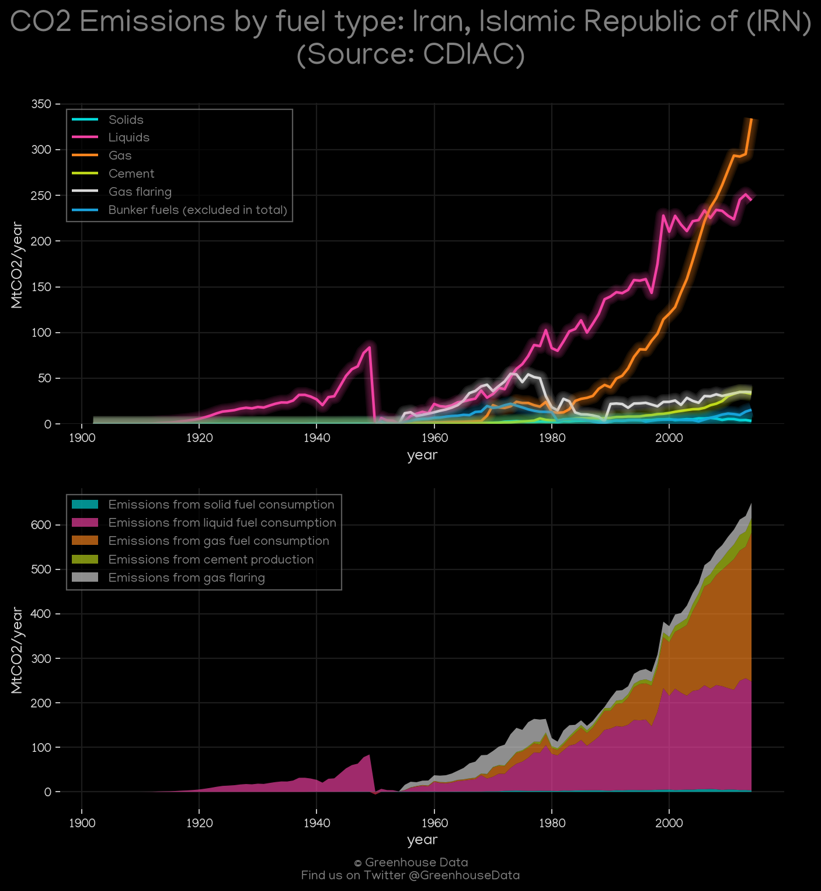

<h1 align="center">
🇮🇷🇮🇷🇮🇷🇮🇷🇮🇷
 
Iran, Islamic Republic of
 
🇮🇷🇮🇷🇮🇷🇮🇷🇮🇷
</h1>
<h2>Datasets:</h2>

<a href="https://github.com/dquintani/Greenhouse-Data/tree/master/country_data/IRN_Iran, Islamic Republic of/data">View on Github</a>
 

<a href="data/IRN_CAIT.csv">CAIT</a> || <a href="data/IRN_GCP.csv">GCP</a> || <a href="data/IRN_EIA.csv">EIA</a> || <a href="data/IRN_EPA.csv">EPA</a> || <a href="data/IRN_PRIMAP-hist.csv">PRIMAP-hist</a> || <a href="data/IRN_EDGAR.csv">EDGAR</a> || <a href="data/IRN_GCP_consupmption.csv">GCP_consupmption</a> || <a href="data/IRN_FAO.csv">FAO</a> || <a href="data/IRN_GCP_cons.csv">GCP_cons</a> || <a href="data/IRN_CDIAC.csv">CDIAC</a> || <a href="data/IRN_Minx_2021.csv">Minx_2021</a> || <a href="data/IRN_BP.csv">BP</a> || <a href="data/IRN_IEA.csv">IEA</a>

 

<h1>Figures:</h1><h2>#1 (IRN_CO2_totals)</h2>

<h2>#2 (IRN_BP_1)</h2>

<h2>#3 (IRN_EIA_1)</h2>

<h2>#4 (IRN_CAIT_gases_1)</h2>

<h2>#5 (IRN_UNFCCC_NAI_1)</h2>

<h2>#6 (IRN_IEA_1)</h2>

<h2>#7 (IRN_GCP_1)</h2>

<h2>#8 (IRN_Minx_top20_subsectors)</h2>

<h2>#9 (IRN_CDIAC_1)</h2>

