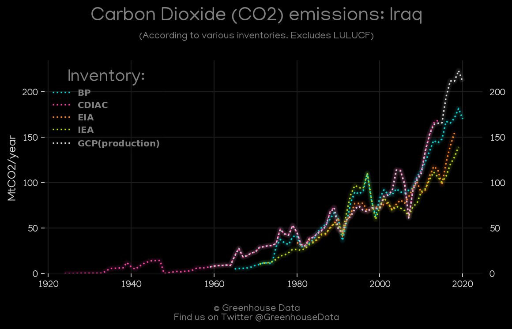
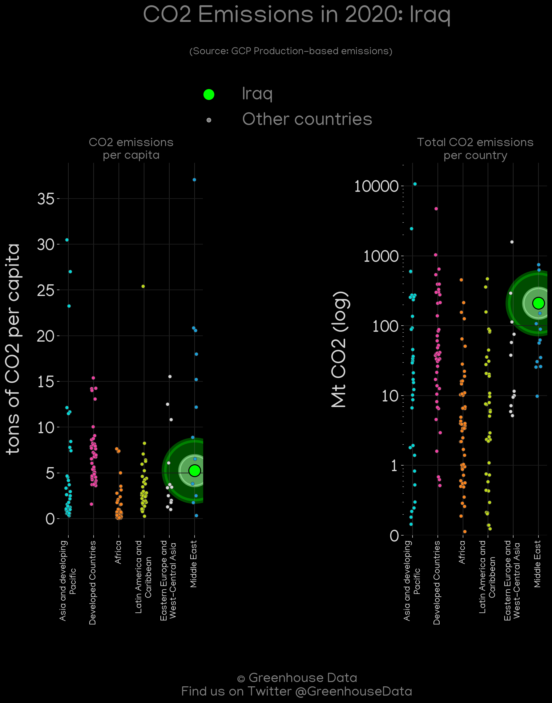
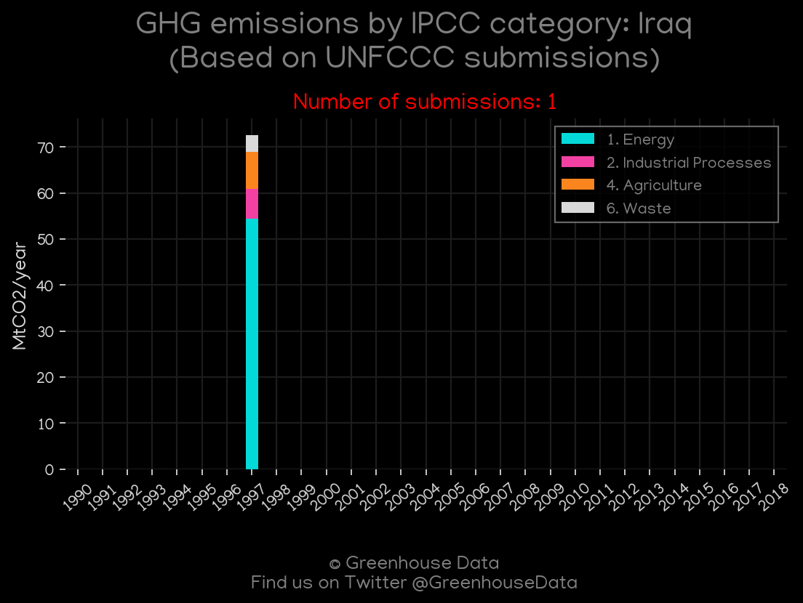
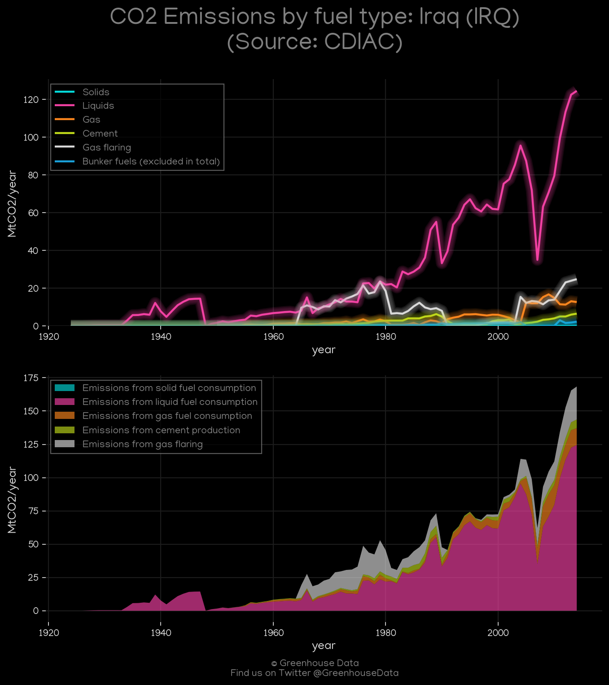
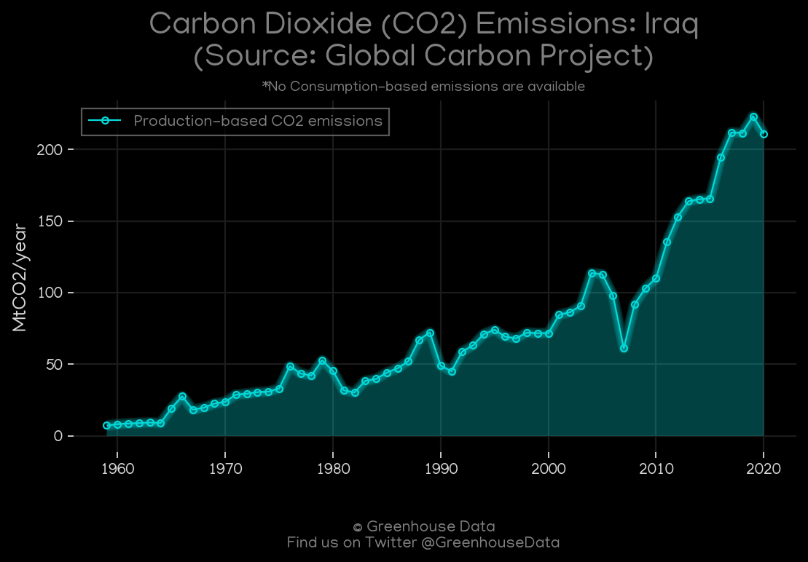
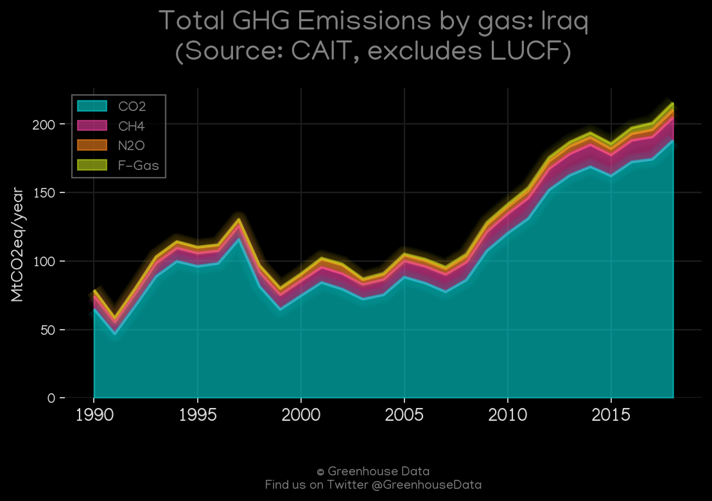
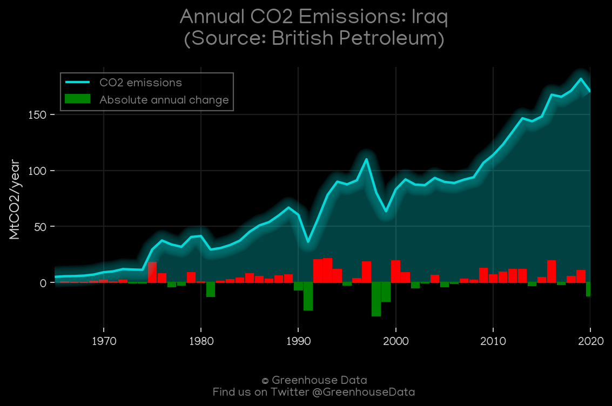
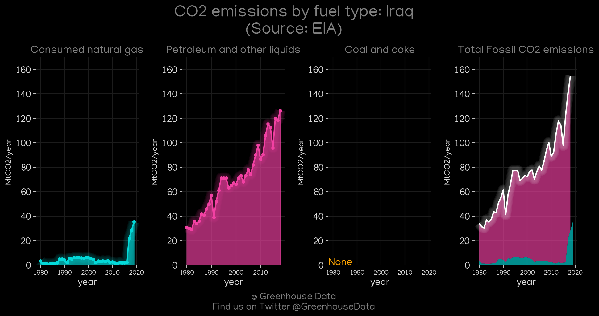
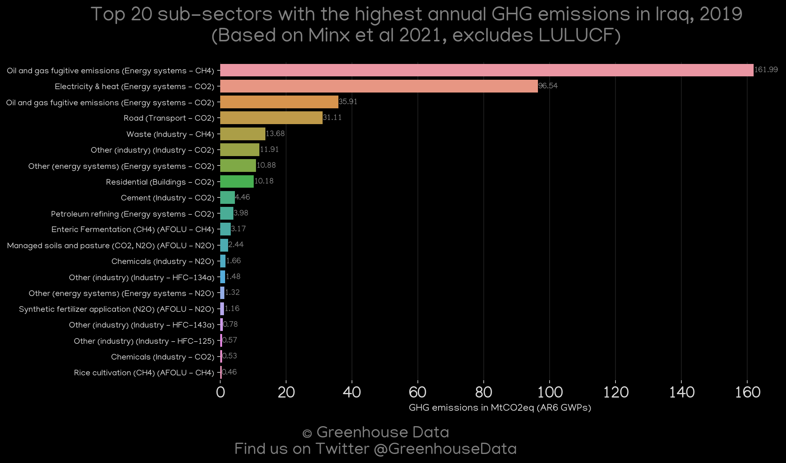
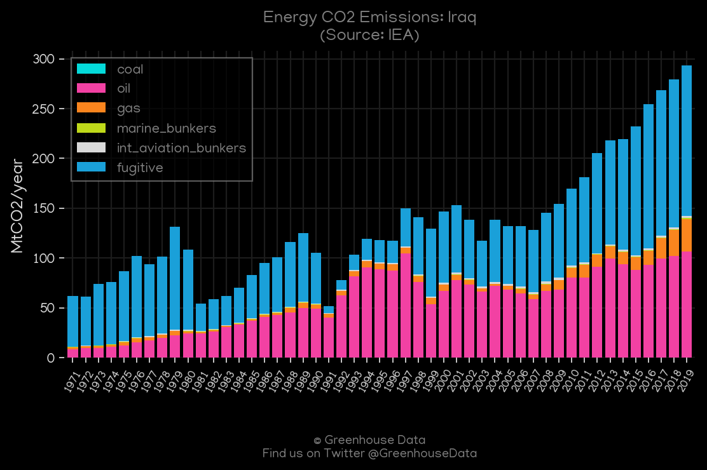

<h1 align="center">
🇮🇶🇮🇶🇮🇶🇮🇶🇮🇶
 
Iraq
 
🇮🇶🇮🇶🇮🇶🇮🇶🇮🇶
</h1>
<h2>Datasets:</h2>

<a href="https://github.com/dquintani/GreenhouseData/tree/master/country_data/IRQ_Iraq/data">View on Github</a>
 

<a href="data/IRQ_EPA.csv">EPA</a> || <a href="data/IRQ_IEA.csv">IEA</a> || <a href="data/IRQ_EDGAR.csv">EDGAR</a> || <a href="data/IRQ_FAO.csv">FAO</a> || <a href="data/IRQ_Minx_2021.csv">Minx_2021</a> || <a href="data/IRQ_EIA.csv">EIA</a> || <a href="data/IRQ_BP.csv">BP</a> || <a href="data/IRQ_CAIT.csv">CAIT</a> || <a href="data/IRQ_GCP_consupmption.csv">GCP_consupmption</a> || <a href="data/IRQ_GCP.csv">GCP</a> || <a href="data/IRQ_CDIAC.csv">CDIAC</a> || <a href="data/IRQ_PRIMAP-hist.csv">PRIMAP-hist</a>

 

<h1>Figures:</h1><h2>#1 (IRQ_CO2_totals)</h2>

<h2>#2 (IRQ_GCP_Country_Highlight)</h2>

<h2>#3 (IRQ_UNFCCC_NAI_1)</h2>

<h2>#4 (IRQ_CAIT_lucf_vs_nolucf)</h2>

<h2>#5 (IRQ_CDIAC_1)</h2>

<h2>#6 (IRQ_GCP_1)</h2>

<h2>#7 (IRQ_CAIT_gases_1)</h2>

<h2>#8 (IRQ_BP_1)</h2>

<h2>#9 (IRQ_EIA_1)</h2>

<h2>#10 (IRQ_Minx_top20_subsectors)</h2>

<h2>#11 (IRQ_IEA_1)</h2>

