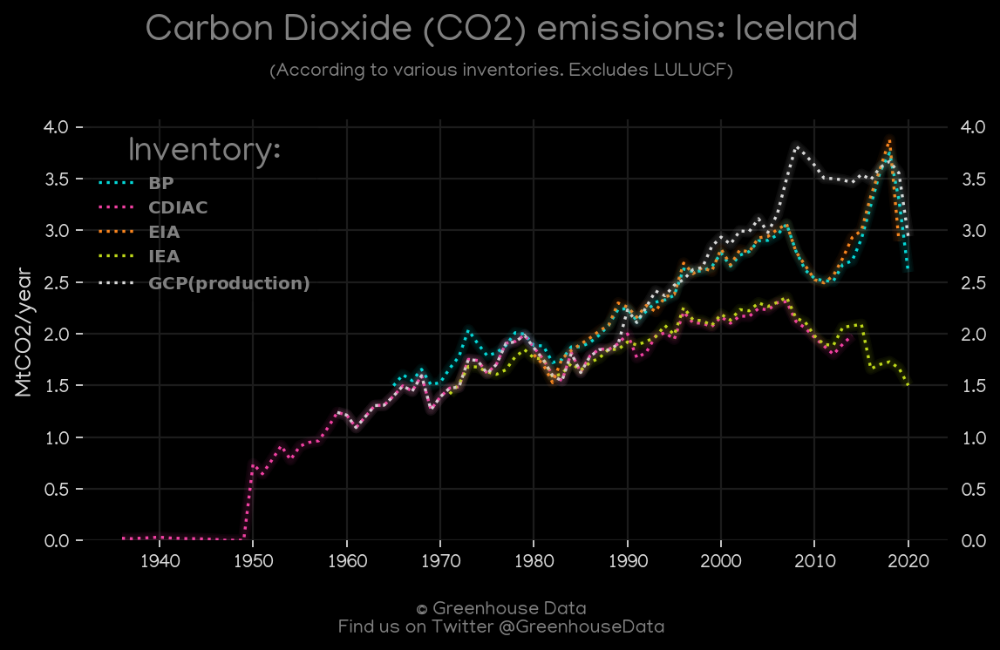
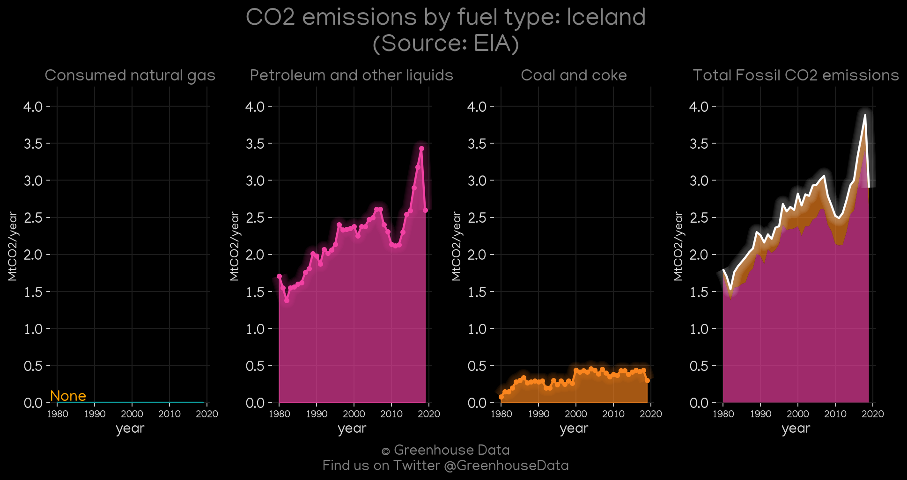
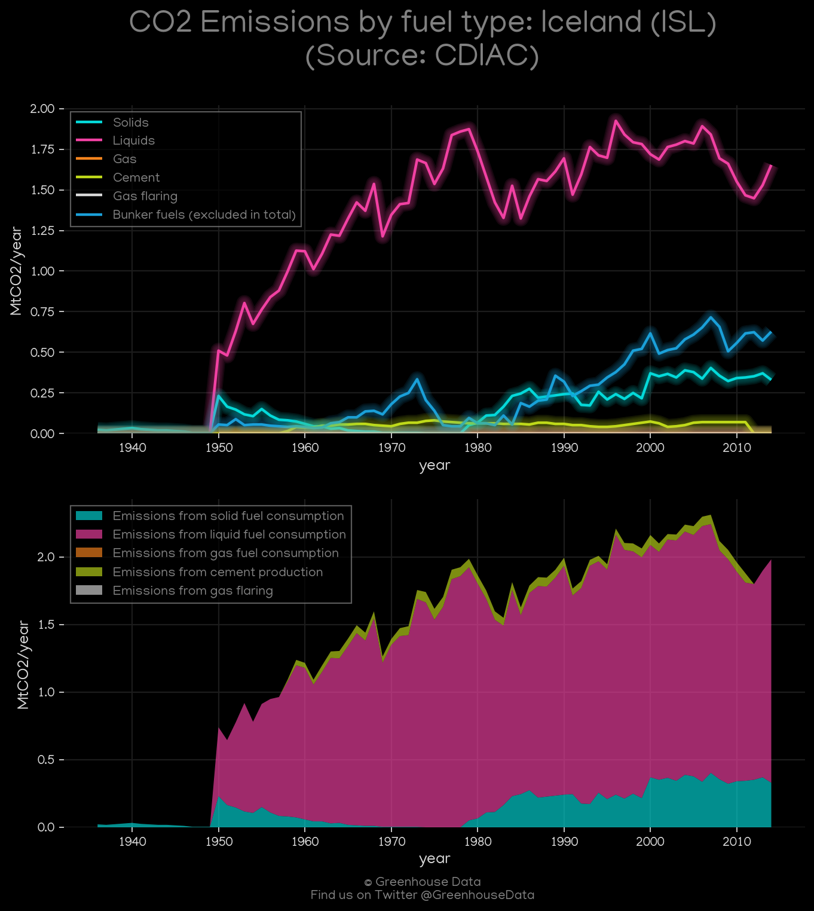
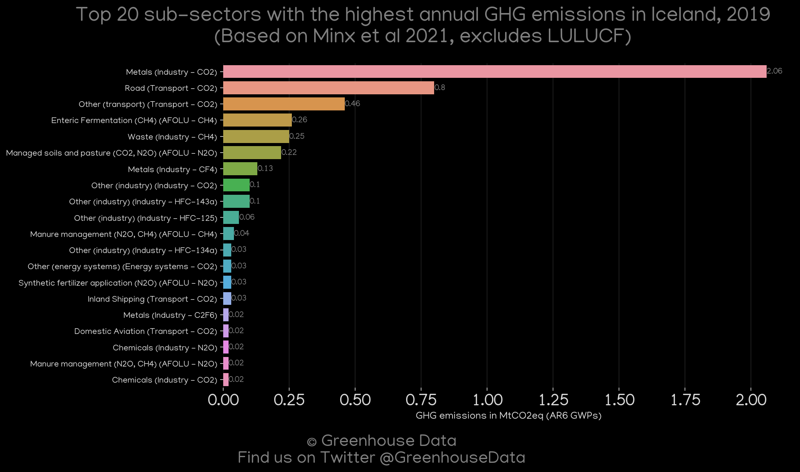
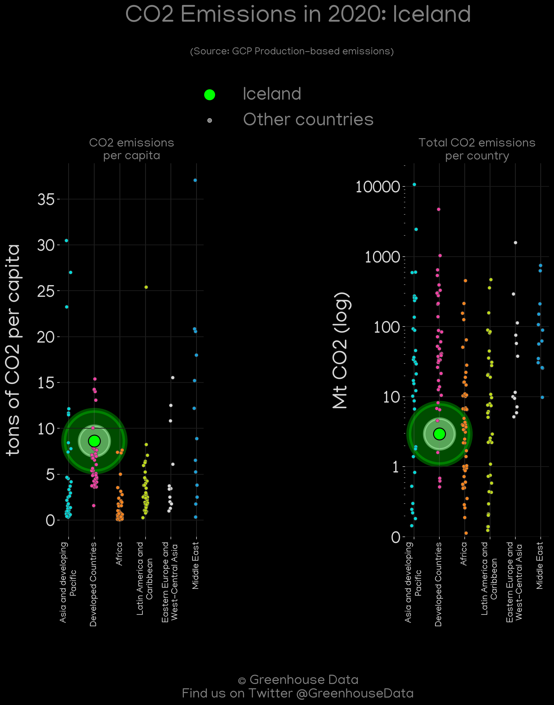
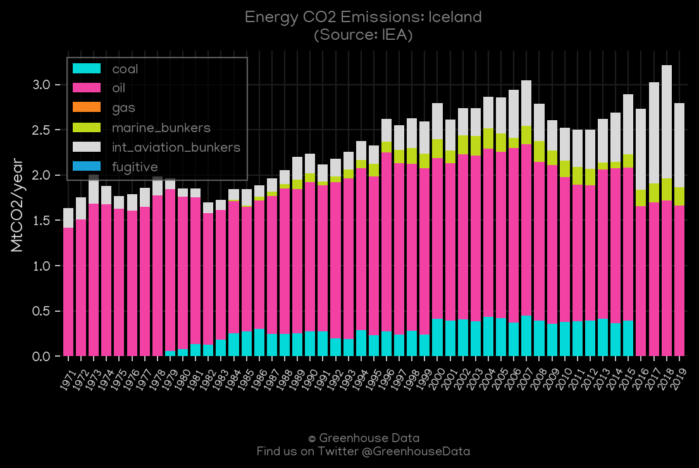
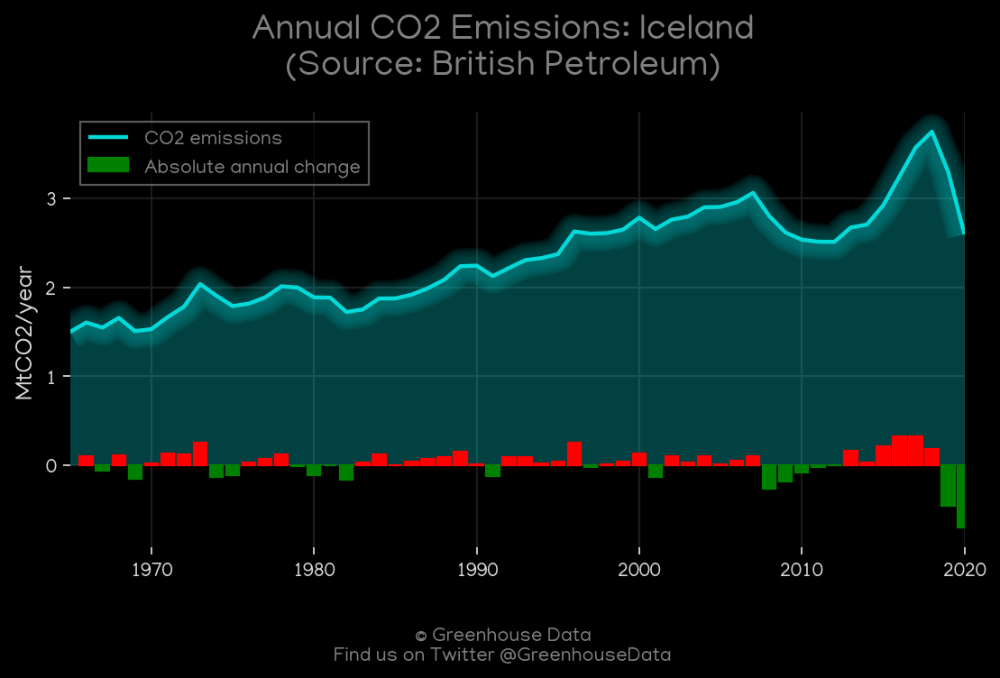
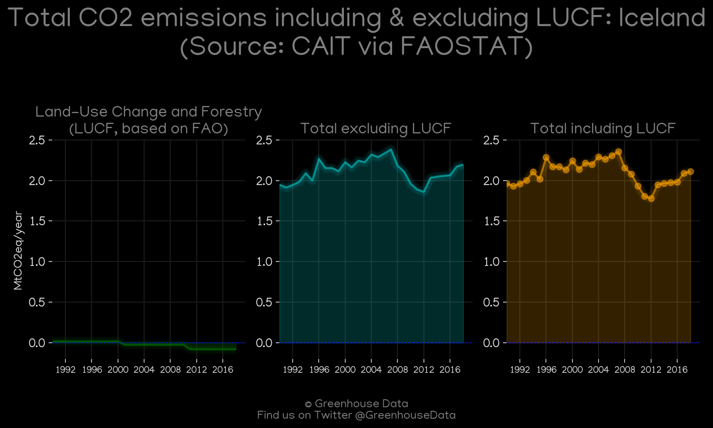
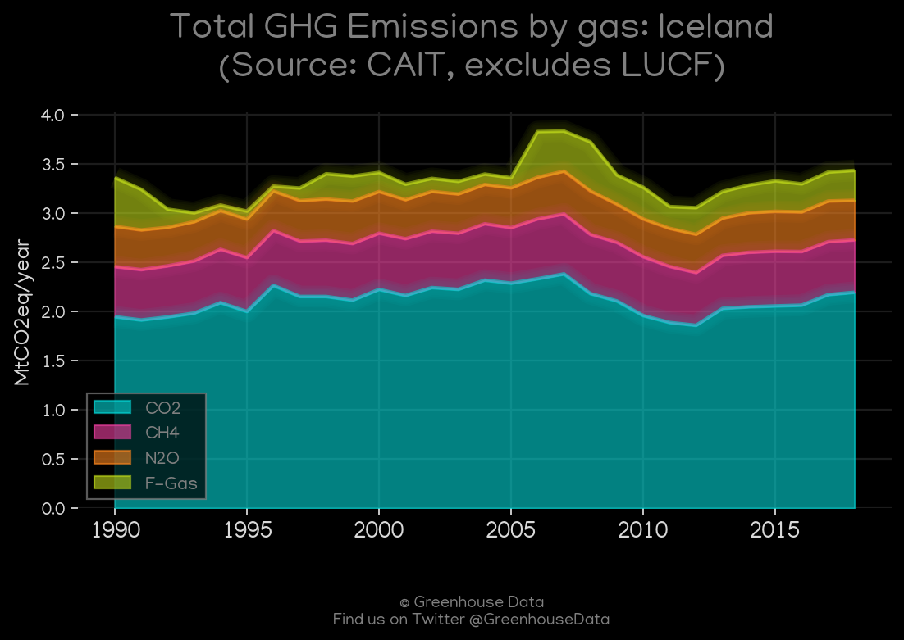
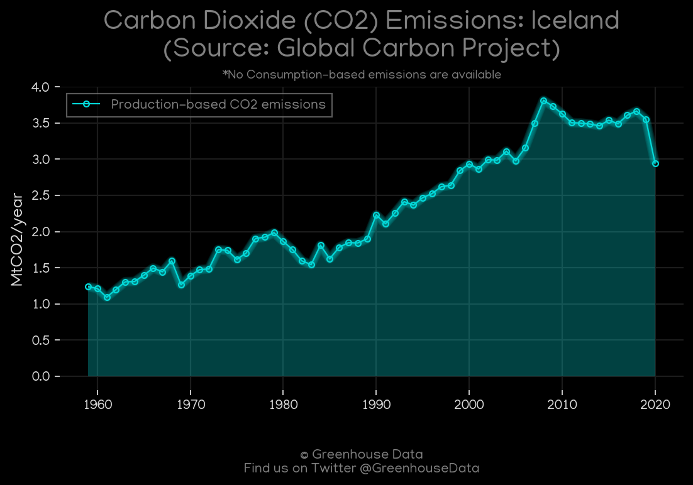

<h1 align="center">
🇮🇸🇮🇸🇮🇸🇮🇸🇮🇸
 
Iceland
 
🇮🇸🇮🇸🇮🇸🇮🇸🇮🇸
</h1>
<h2>Datasets:</h2>

<a href="https://github.com/dquintani/GreenhouseData/tree/master/country_data/ISL_Iceland/data">View on Github</a>
 

<a href="data/ISL_GCP_consupmption.csv">GCP_consupmption</a> || <a href="data/ISL_CAIT.csv">CAIT</a> || <a href="data/ISL_FAO.csv">FAO</a> || <a href="data/ISL_Minx_2021.csv">Minx_2021</a> || <a href="data/ISL_PRIMAP-hist.csv">PRIMAP-hist</a> || <a href="data/ISL_GCP.csv">GCP</a> || <a href="data/ISL_CDIAC.csv">CDIAC</a> || <a href="data/ISL_IEA.csv">IEA</a> || <a href="data/ISL_EPA.csv">EPA</a> || <a href="data/ISL_BP.csv">BP</a> || <a href="data/ISL_EDGAR.csv">EDGAR</a> || <a href="data/ISL_EIA.csv">EIA</a>

 

<h1>Figures:</h1><h2>#1 (ISL_CO2_totals)</h2>

<h2>#2 (ISL_EIA_1)</h2>

<h2>#3 (ISL_CDIAC_1)</h2>

<h2>#4 (ISL_Minx_top20_subsectors)</h2>

<h2>#5 (ISL_GCP_Country_Highlight)</h2>

<h2>#6 (ISL_IEA_1)</h2>

<h2>#7 (ISL_BP_1)</h2>

<h2>#8 (ISL_CAIT_lucf_vs_nolucf)</h2>

<h2>#9 (ISL_CAIT_gases_1)</h2>

<h2>#10 (ISL_UNFCCC_AI_1)</h2>

<h2>#11 (ISL_GCP_1)</h2>

