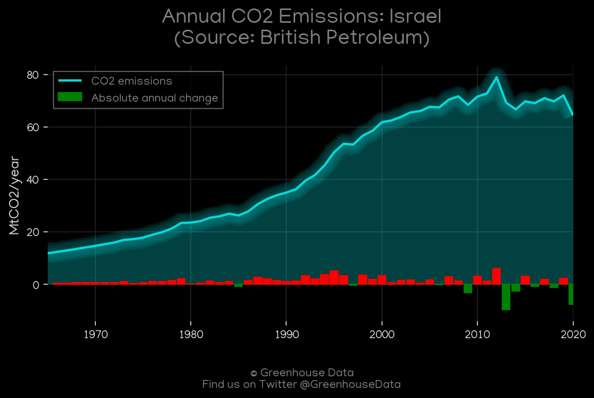
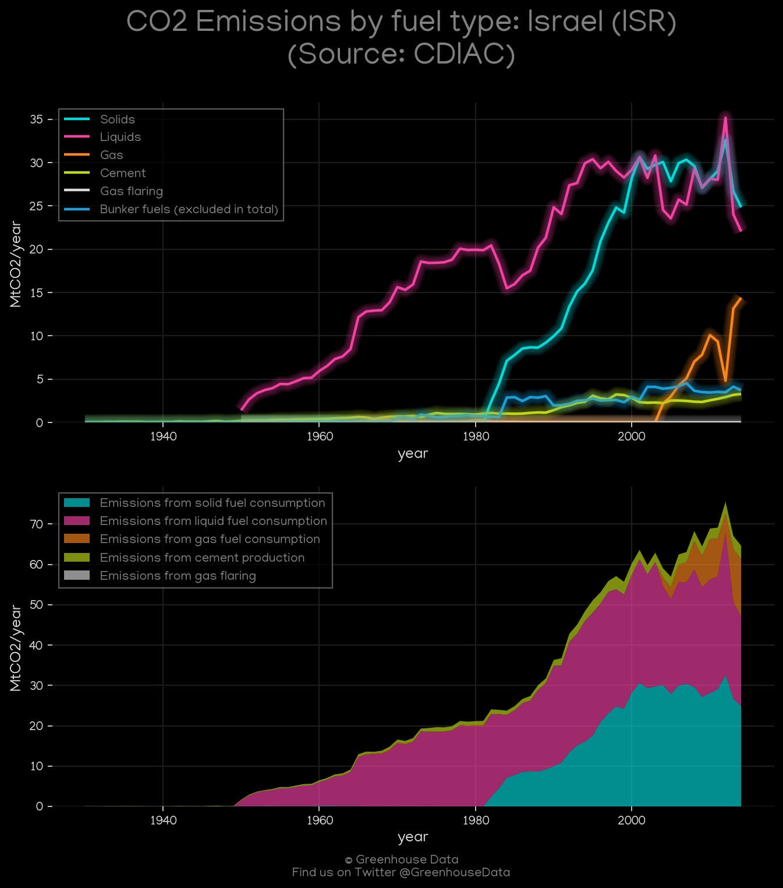
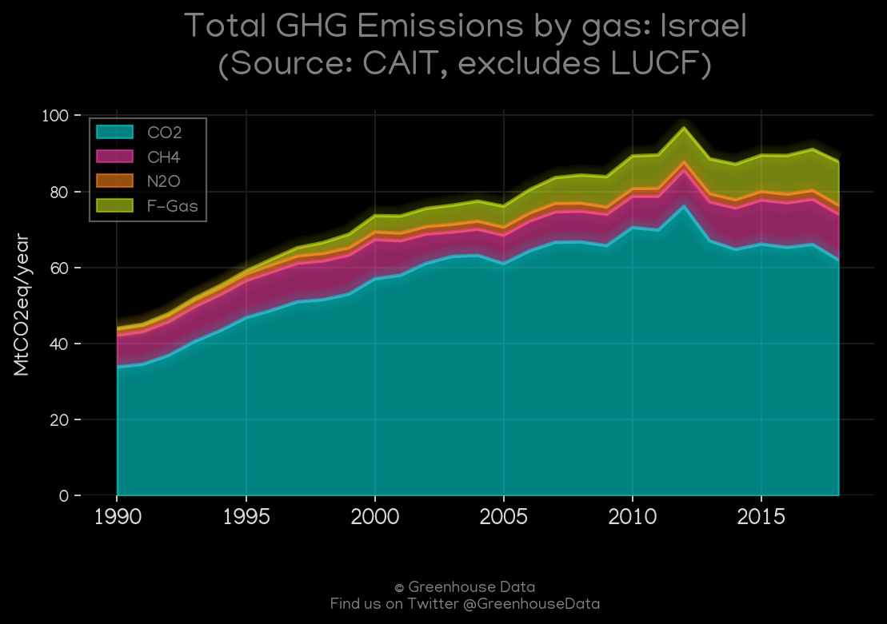
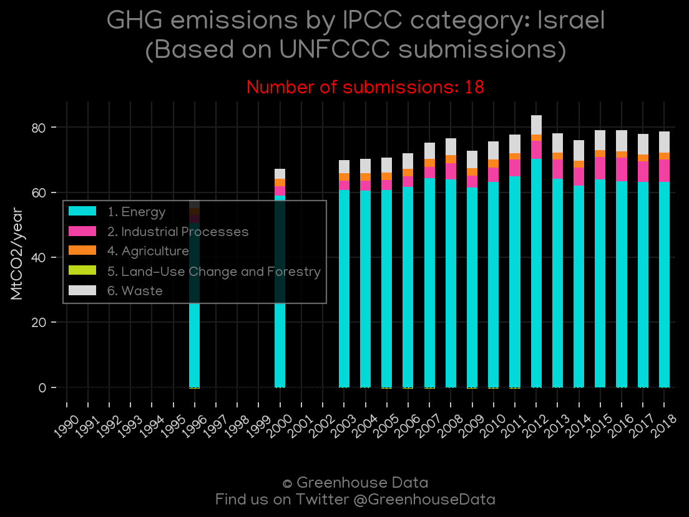
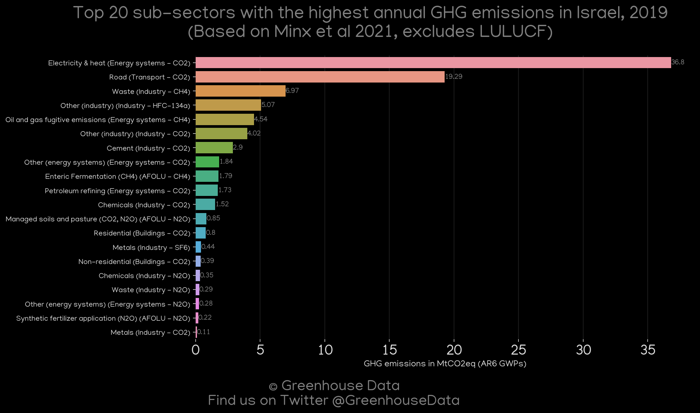
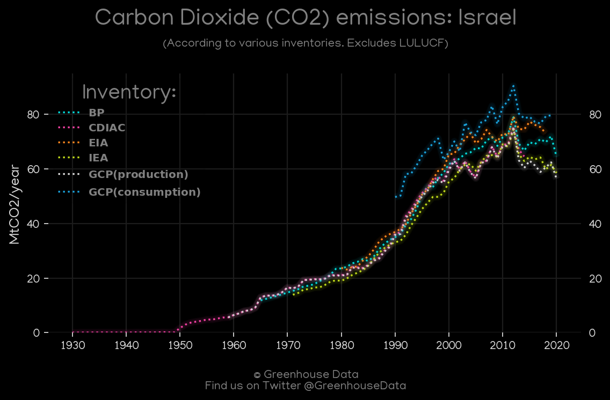
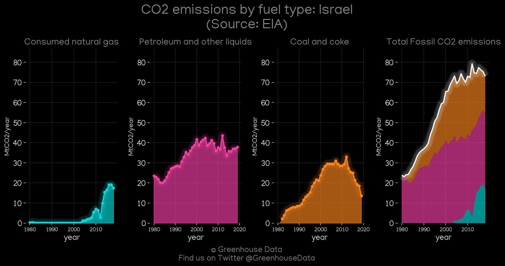
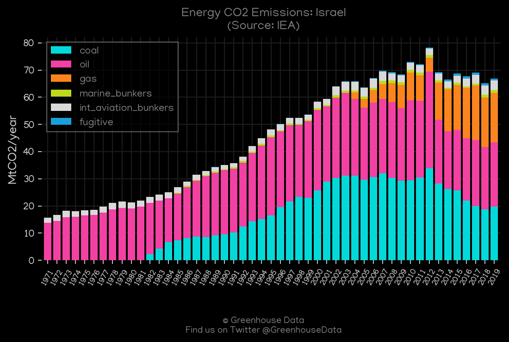
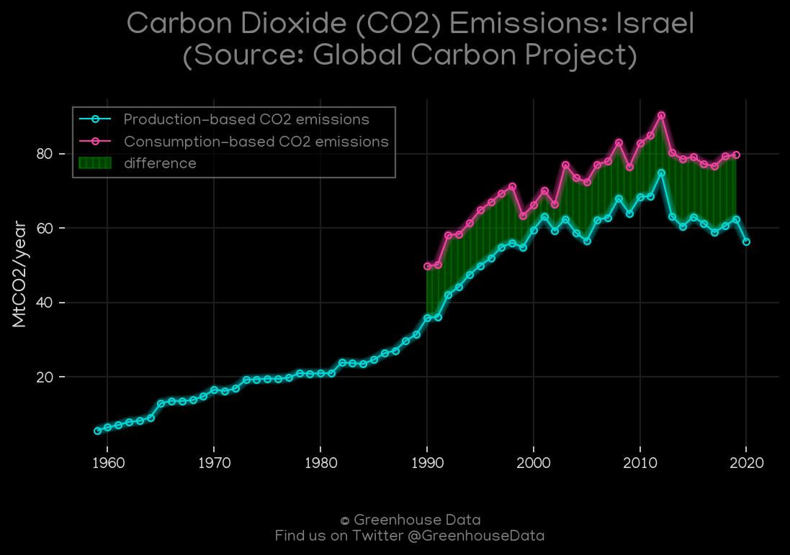

<h1 align="center">
🇮🇱🇮🇱🇮🇱🇮🇱🇮🇱
 
Israel
 
🇮🇱🇮🇱🇮🇱🇮🇱🇮🇱
</h1>
<h2>Datasets:</h2>

<a href="https://github.com/dquintani/GreenhouseData/tree/master/country_data/ISR_Israel/data">View on Github</a>
 

<a href="data/ISR_CDIAC.csv">CDIAC</a> || <a href="data/ISR_Minx_2021.csv">Minx_2021</a> || <a href="data/ISR_IEA.csv">IEA</a> || <a href="data/ISR_FAO.csv">FAO</a> || <a href="data/ISR_BP.csv">BP</a> || <a href="data/ISR_GCP.csv">GCP</a> || <a href="data/ISR_PRIMAP-hist.csv">PRIMAP-hist</a> || <a href="data/ISR_GCP_cons.csv">GCP_cons</a> || <a href="data/ISR_EDGAR.csv">EDGAR</a> || <a href="data/ISR_EIA.csv">EIA</a> || <a href="data/ISR_CAIT.csv">CAIT</a> || <a href="data/ISR_EPA.csv">EPA</a> || <a href="data/ISR_GCP_consupmption.csv">GCP_consupmption</a>

 

<h1>Figures:</h1><h2>#1 (ISR_BP_1)</h2>

<h2>#2 (ISR_CDIAC_1)</h2>

<h2>#3 (ISR_CAIT_gases_1)</h2>

<h2>#4 (ISR_UNFCCC_NAI_1)</h2>

<h2>#5 (ISR_Minx_top20_subsectors)</h2>

<h2>#6 (ISR_CO2_totals)</h2>

<h2>#7 (ISR_EIA_1)</h2>

<h2>#8 (ISR_IEA_1)</h2>

<h2>#9 (ISR_GCP_1)</h2>

