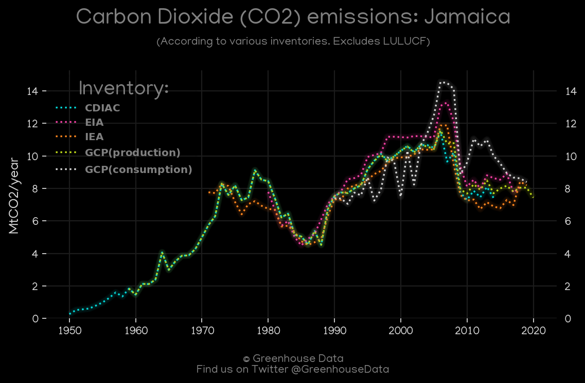
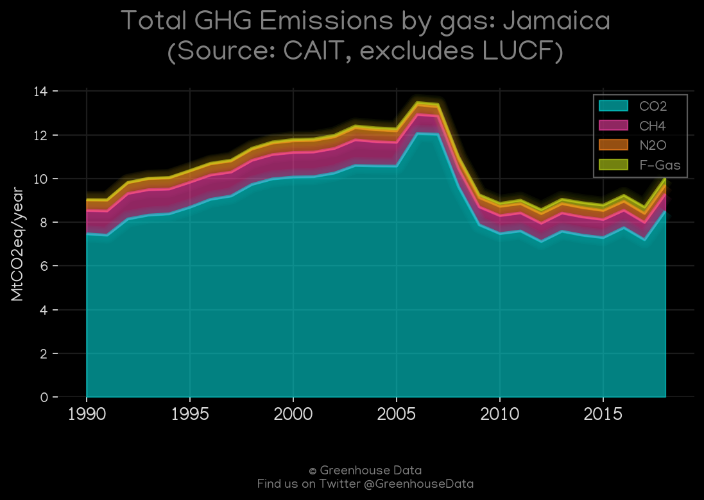
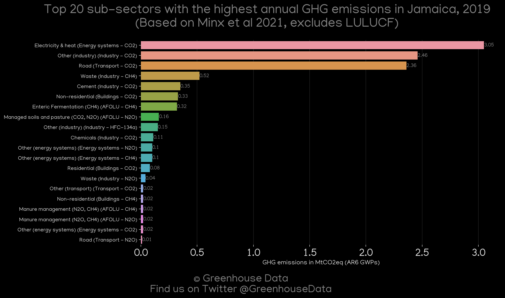
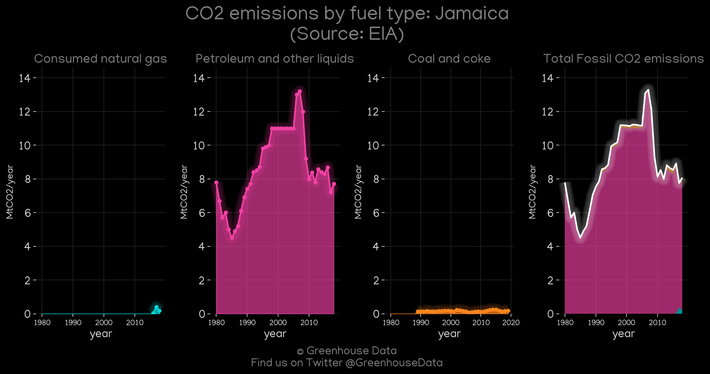
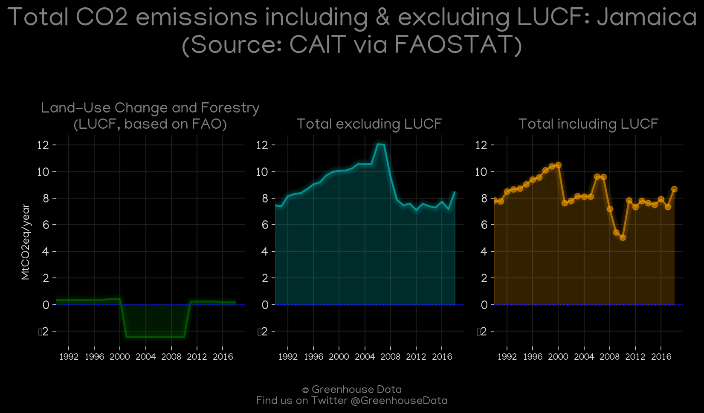
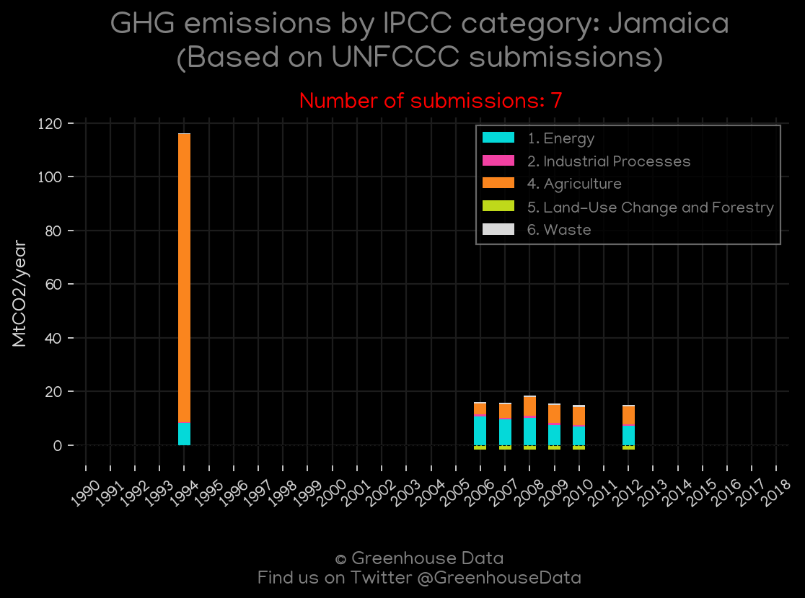
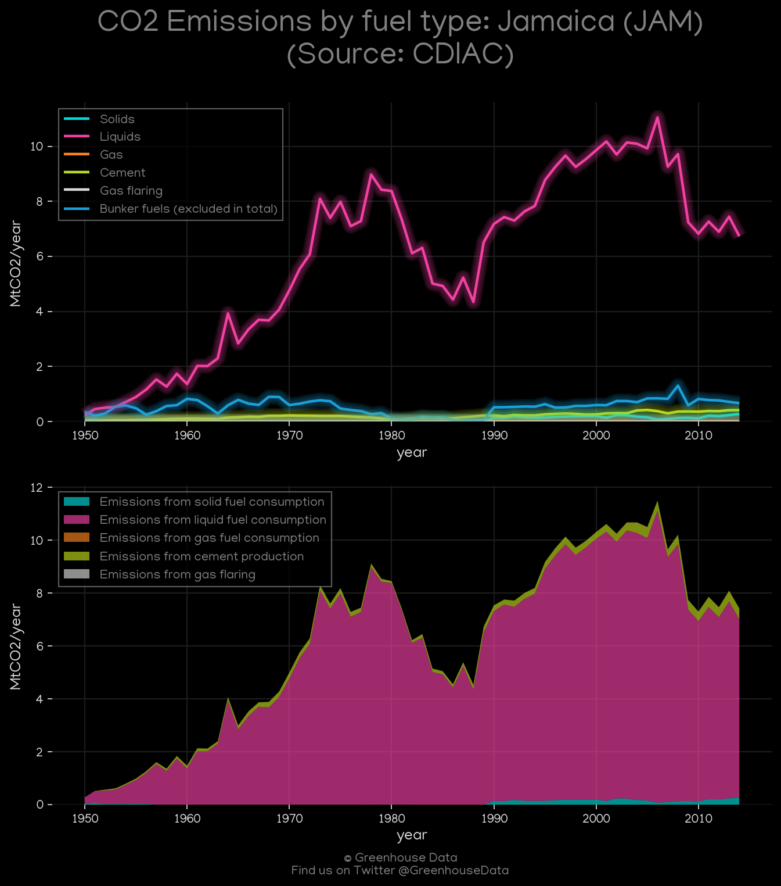
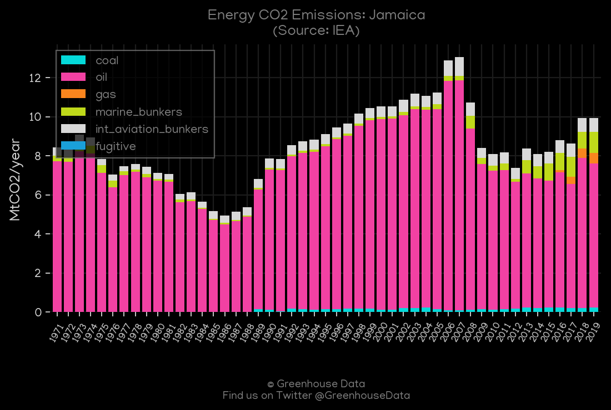
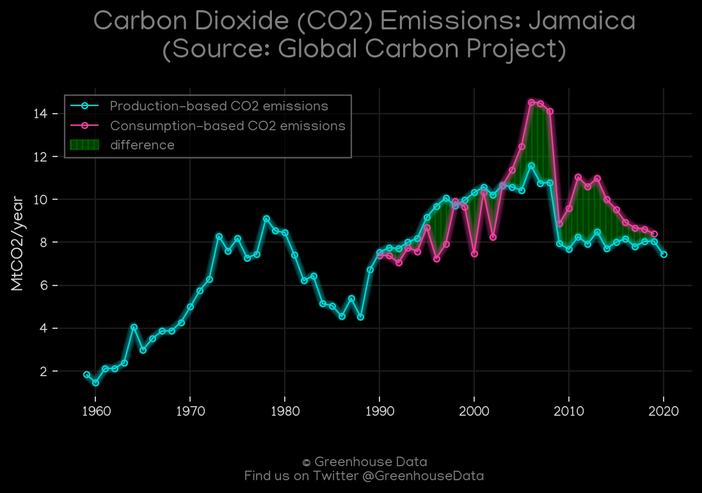

<h1 align="center">
🇯🇲🇯🇲🇯🇲🇯🇲🇯🇲
 
Jamaica
 
🇯🇲🇯🇲🇯🇲🇯🇲🇯🇲
</h1>
<h2>Datasets:</h2>

<a href="https://github.com/dquintani/GreenhouseData/tree/master/country_data/JAM_Jamaica/data">View on Github</a>
 

<a href="data/JAM_EDGAR.csv">EDGAR</a> || <a href="data/JAM_Minx_2021.csv">Minx_2021</a> || <a href="data/JAM_EIA.csv">EIA</a> || <a href="data/JAM_IEA.csv">IEA</a> || <a href="data/JAM_EPA.csv">EPA</a> || <a href="data/JAM_CDIAC.csv">CDIAC</a> || <a href="data/JAM_FAO.csv">FAO</a> || <a href="data/JAM_PRIMAP-hist.csv">PRIMAP-hist</a> || <a href="data/JAM_GCP.csv">GCP</a> || <a href="data/JAM_CAIT.csv">CAIT</a> || <a href="data/JAM_GCP_consupmption.csv">GCP_consupmption</a>

 

<h1>Figures:</h1><h2>#1 (JAM_CO2_totals)</h2>

<h2>#2 (JAM_CAIT_gases_1)</h2>

<h2>#3 (JAM_Minx_top20_subsectors)</h2>

<h2>#4 (JAM_EIA_1)</h2>

<h2>#5 (JAM_CAIT_lucf_vs_nolucf)</h2>

<h2>#6 (JAM_UNFCCC_NAI_1)</h2>

<h2>#7 (JAM_CDIAC_1)</h2>

<h2>#8 (JAM_IEA_1)</h2>

<h2>#9 (JAM_GCP_1)</h2>

