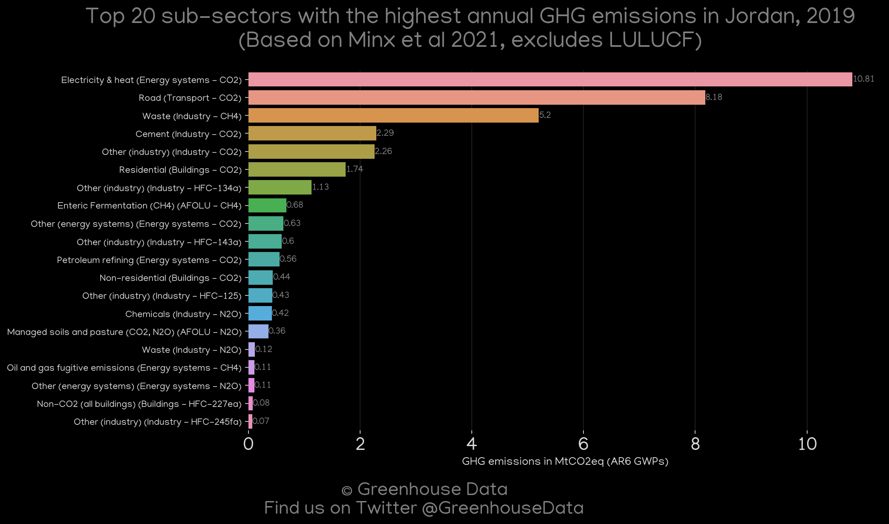
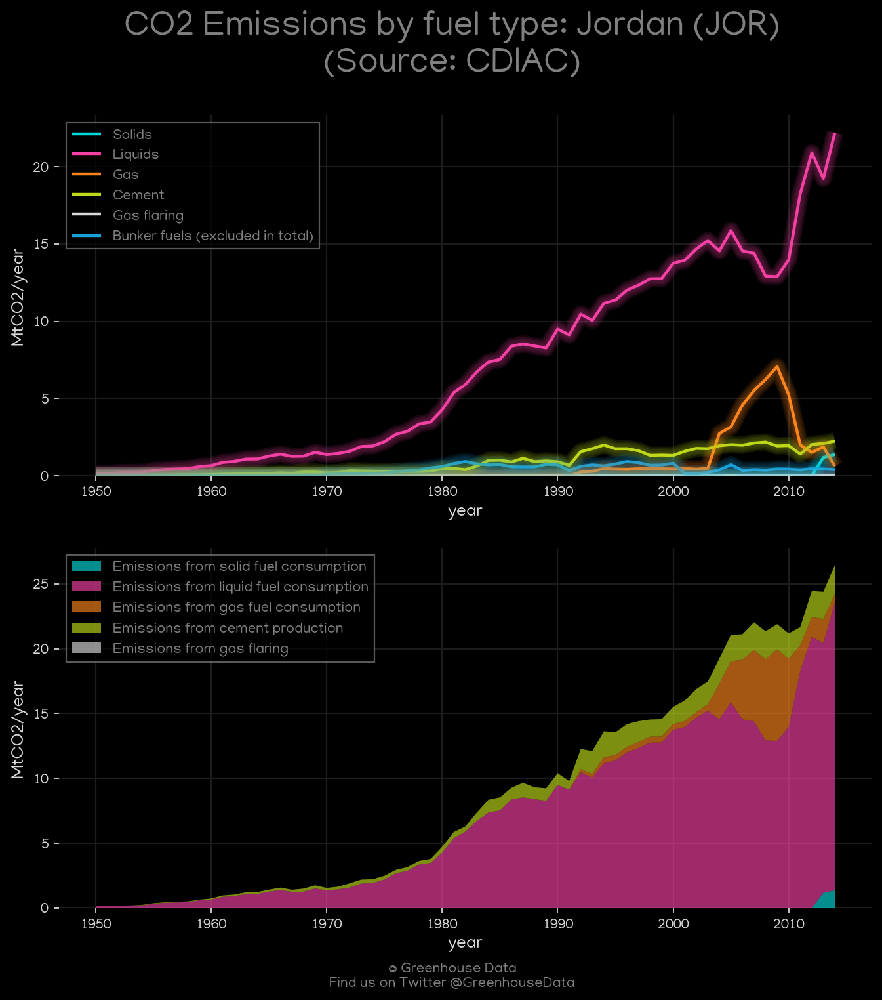
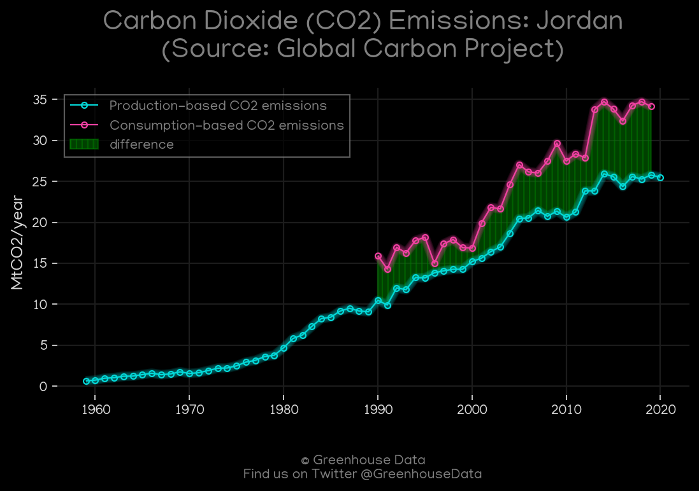
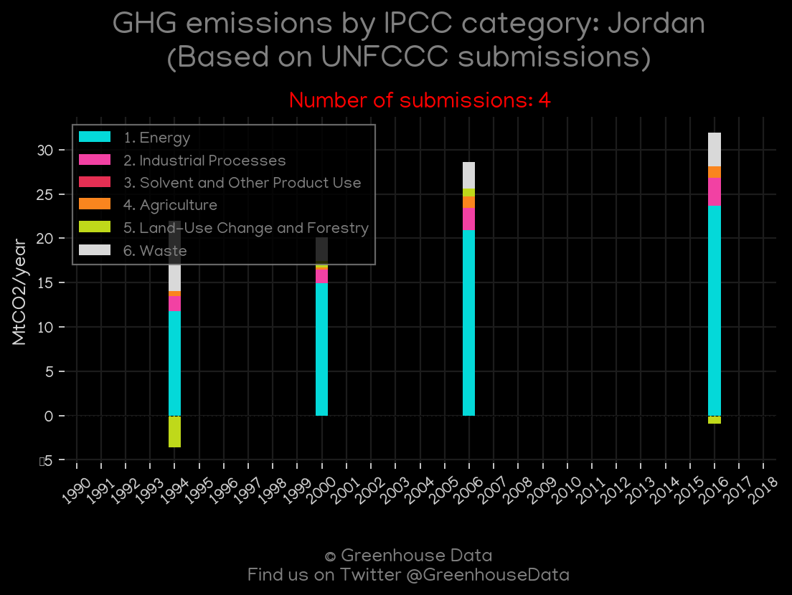
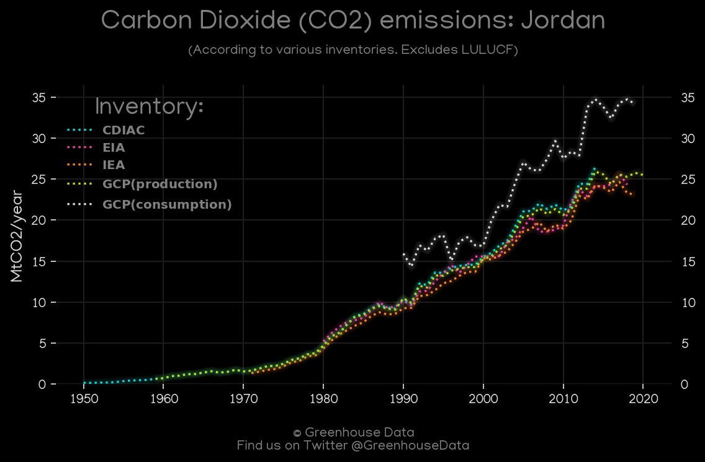
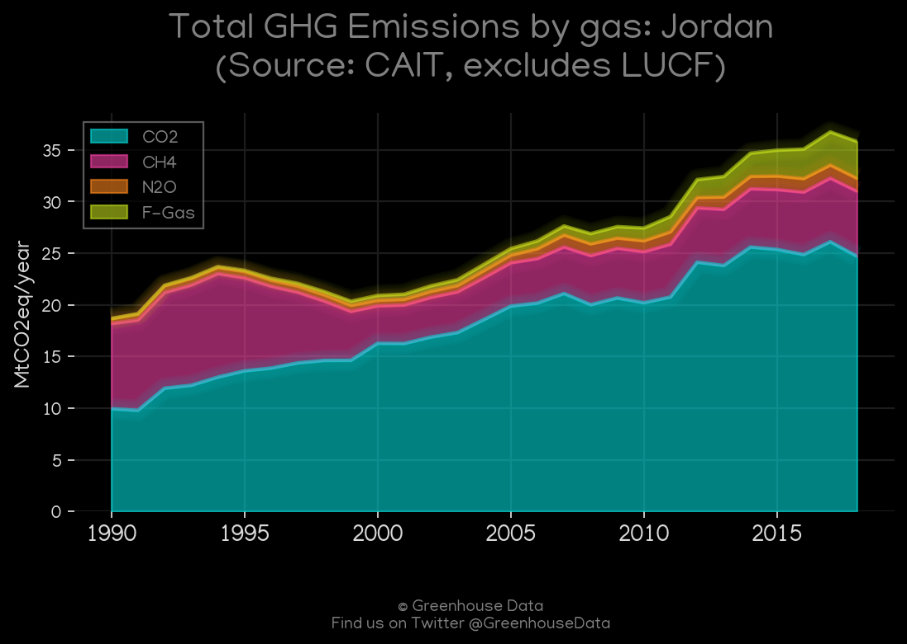

<h1 align="center">
🇯🇴🇯🇴🇯🇴🇯🇴🇯🇴
 
Jordan
 
🇯🇴🇯🇴🇯🇴🇯🇴🇯🇴
</h1>
<h2>Datasets:</h2>

<a href="https://github.com/dquintani/Greenhouse-Data/tree/master/country_data/JOR_Jordan/data">View on Github</a>
 

<a href="data/JOR_PRIMAP-hist.csv">PRIMAP-hist</a> || <a href="data/JOR_EDGAR.csv">EDGAR</a> || <a href="data/JOR_EPA.csv">EPA</a> || <a href="data/JOR_GCP_cons.csv">GCP_cons</a> || <a href="data/JOR_GCP_consupmption.csv">GCP_consupmption</a> || <a href="data/JOR_FAO.csv">FAO</a> || <a href="data/JOR_Minx_2021.csv">Minx_2021</a> || <a href="data/JOR_CDIAC.csv">CDIAC</a> || <a href="data/JOR_IEA.csv">IEA</a> || <a href="data/JOR_CAIT.csv">CAIT</a> || <a href="data/JOR_EIA.csv">EIA</a> || <a href="data/JOR_GCP.csv">GCP</a>

 

<h1>Figures:</h1><h2>#1 (JOR_Minx_top20_subsectors)</h2>

<h2>#2 (JOR_IEA_1)</h2>

<h2>#3 (JOR_CDIAC_1)</h2>

<h2>#4 (JOR_EIA_1)</h2>

<h2>#5 (JOR_GCP_1)</h2>

<h2>#6 (JOR_UNFCCC_NAI_1)</h2>

<h2>#7 (JOR_CO2_totals)</h2>

<h2>#8 (JOR_CAIT_gases_1)</h2>

