

<h1 align="center">
🇯🇵🇯🇵🇯🇵🇯🇵🇯🇵
 
Japan
 
🇯🇵🇯🇵🇯🇵🇯🇵🇯🇵
</h1>
<h2>Datasets:</h2>

<a href="https://github.com/dquintani/GreenhouseData/tree/master/country_data/JPN_Japan/data">View on Github</a>
 

<a href="data/JPN_EDGAR.csv">EDGAR</a> || <a href="data/JPN_EPA.csv">EPA</a> || <a href="data/JPN_Minx_2021.csv">Minx_2021</a> || <a href="data/JPN_FAO.csv">FAO</a> || <a href="data/JPN_GCP.csv">GCP</a> || <a href="data/JPN_CAIT.csv">CAIT</a> || <a href="data/JPN_PRIMAP-hist.csv">PRIMAP-hist</a> || <a href="data/JPN_GCP_consupmption.csv">GCP_consupmption</a> || <a href="data/JPN_EIA.csv">EIA</a> || <a href="data/JPN_IEA.csv">IEA</a> || <a href="data/JPN_CDIAC.csv">CDIAC</a> || <a href="data/JPN_BP.csv">BP</a>

 

<h1>Figures:</h1><h2>#1 (JPN_IEA_1)</h2>

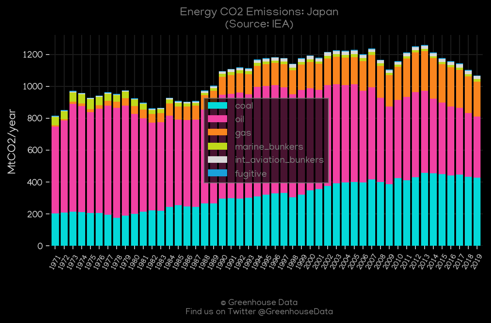
<h2>#2 (JPN_BP_1)</h2>

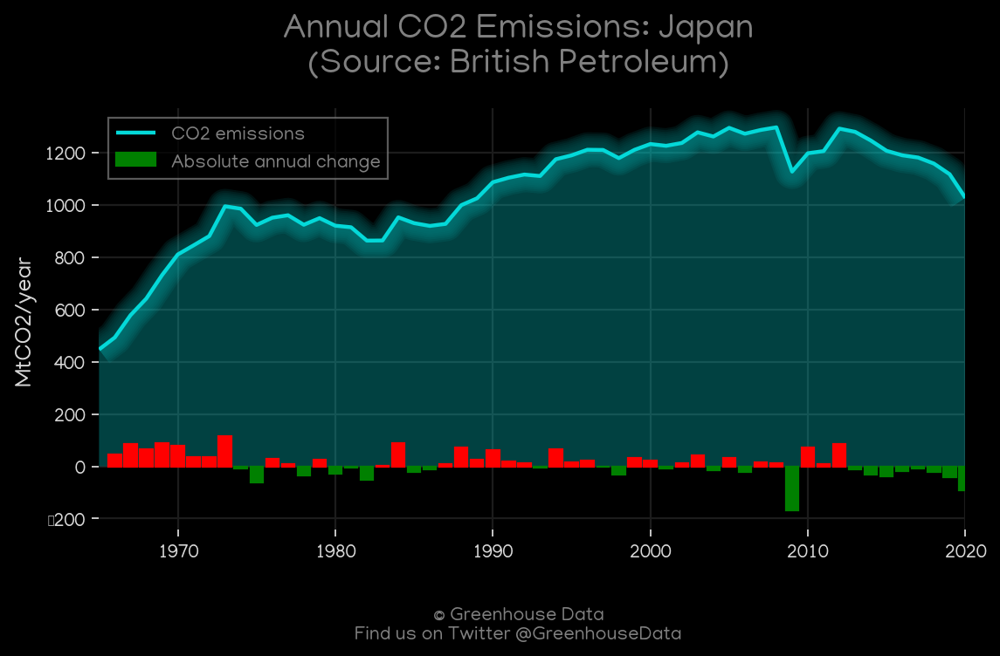
<h2>#3 (JPN_UNFCCC_AI_1)</h2>

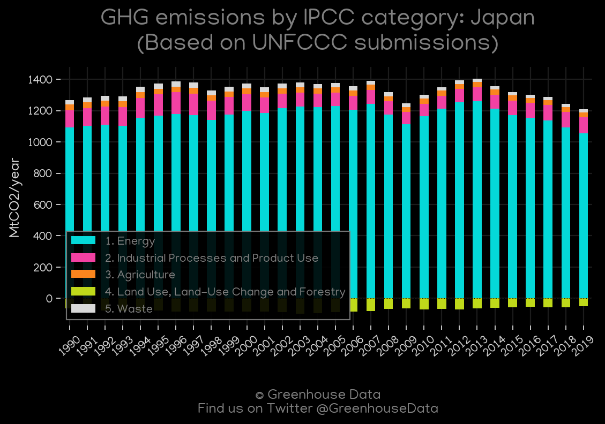
<h2>#4 (JPN_CDIAC_1)</h2>

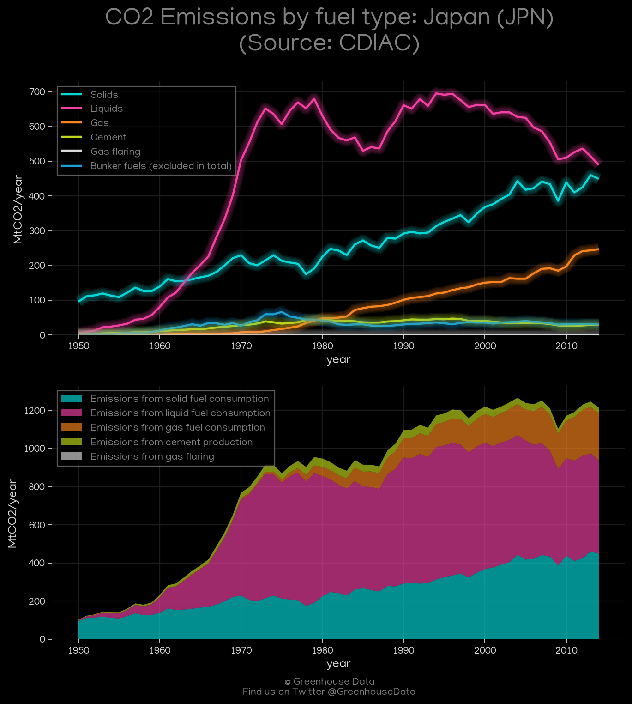
<h2>#5 (JPN_CAIT_gases_1)</h2>

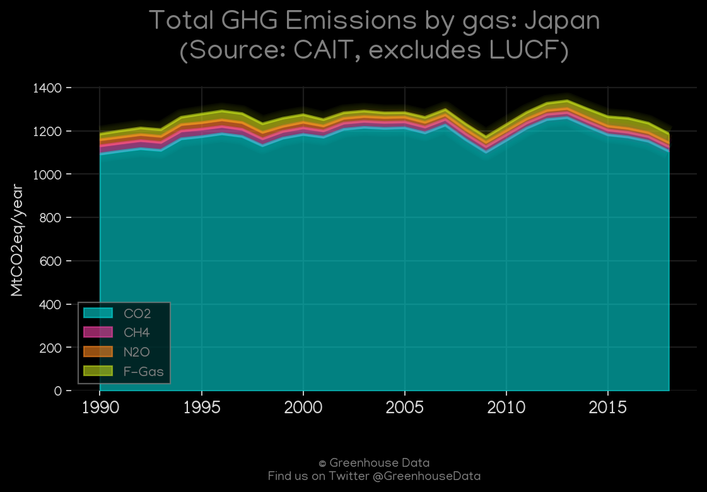
<h2>#6 (JPN_CAIT_lucf_vs_nolucf)</h2>

<h2>#7 (JPN_Carbon_Monitor_1)</h2>

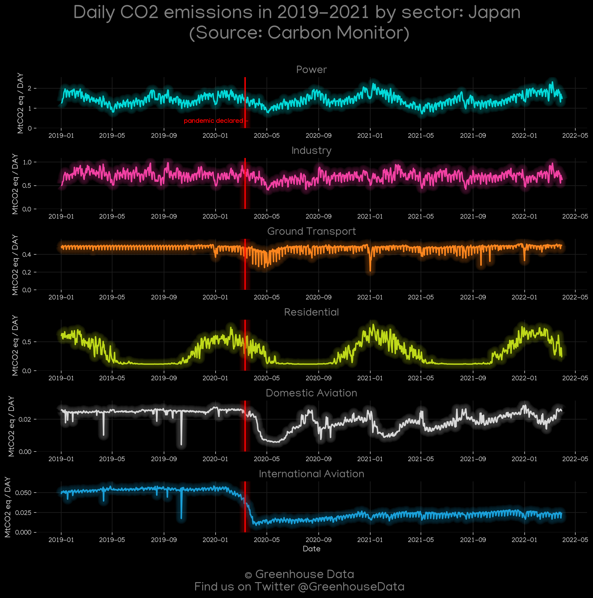
<h2>#8 (JPN_GCP_Country_Highlight)</h2>

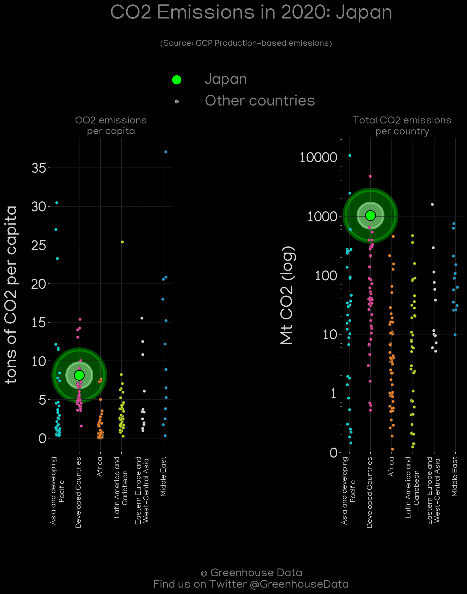
<h2>#9 (JPN_EIA_1)</h2>

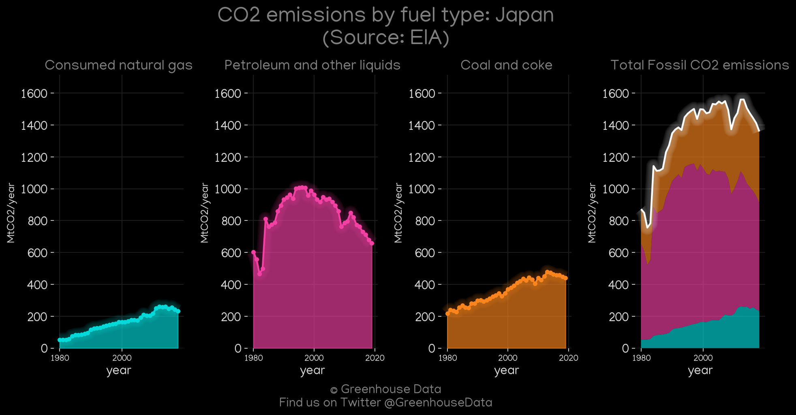
<h2>#10 (JPN_GCP_1)</h2>

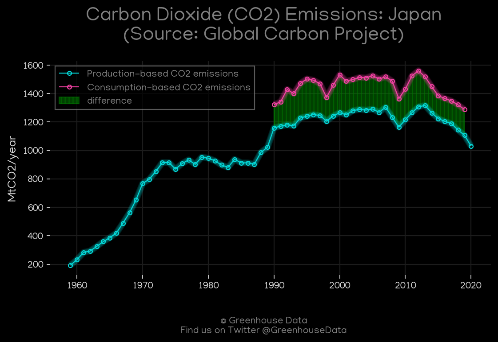
<h2>#11 (JPN_CO2_totals)</h2>

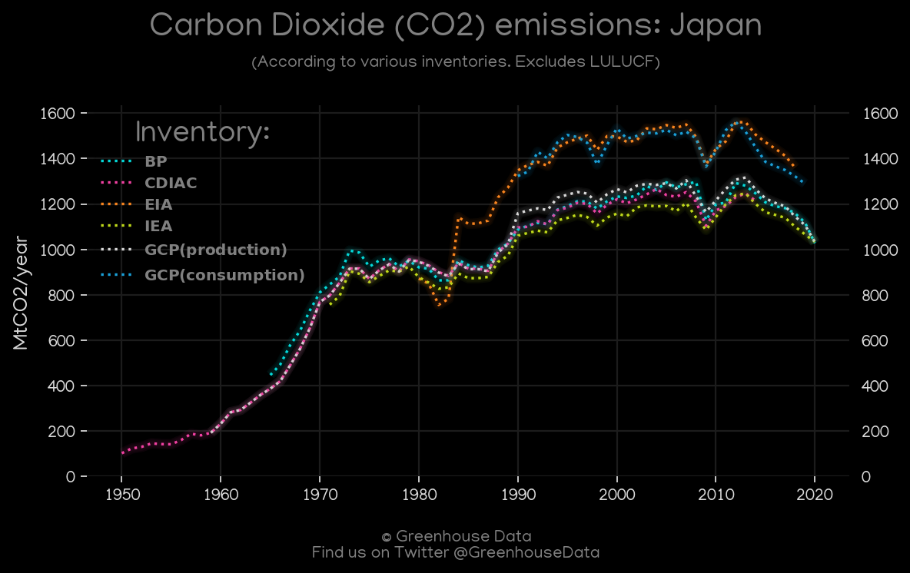
<h2>#12 (JPN_Minx_top20_subsectors)</h2>

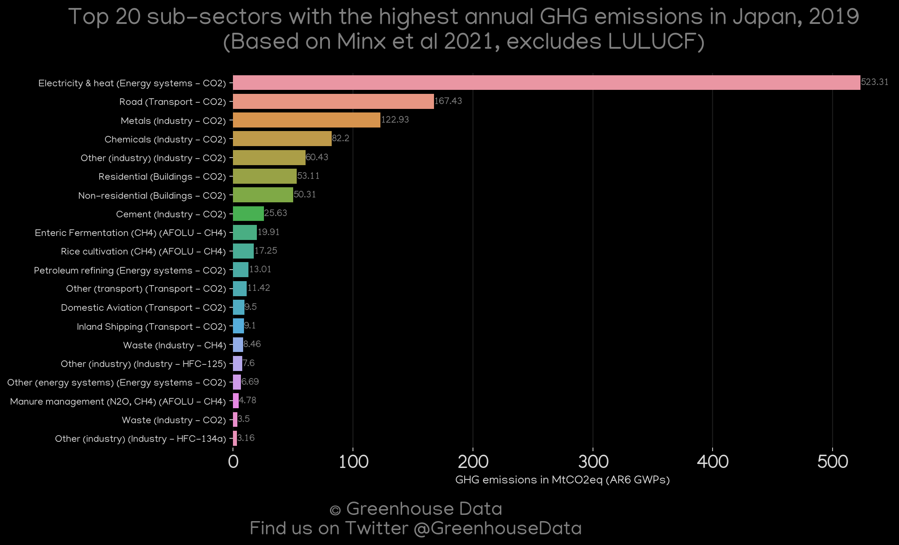
