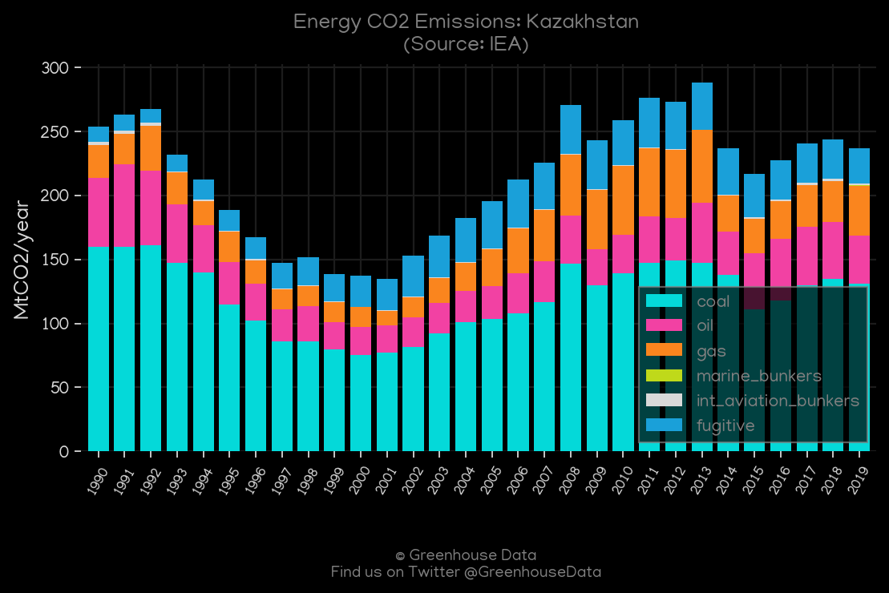
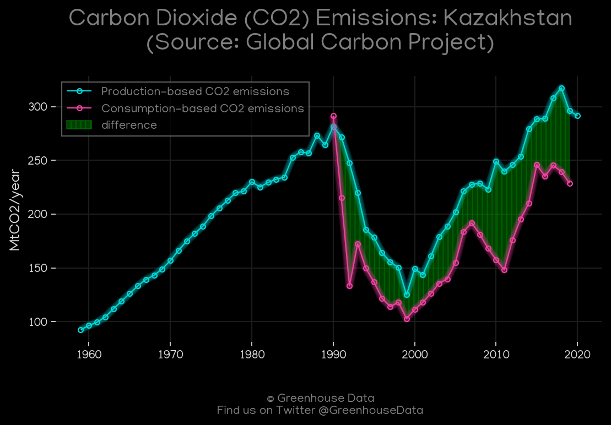
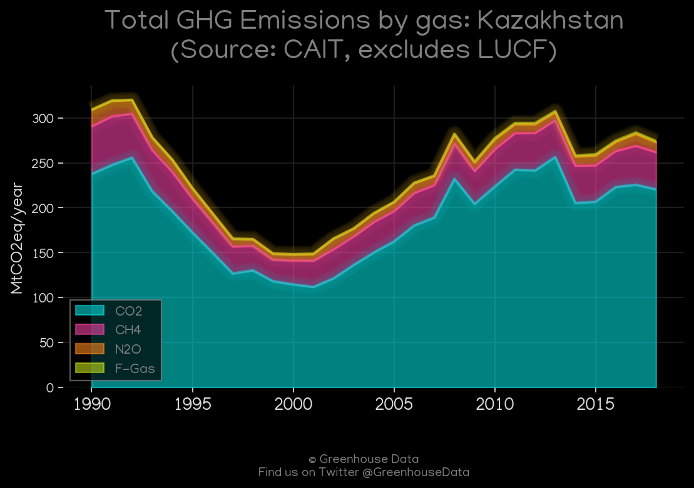
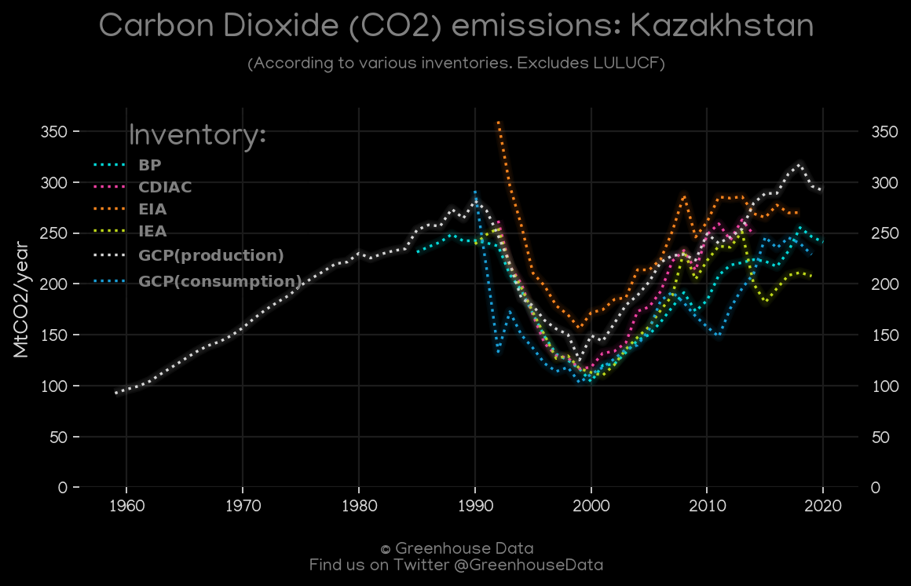
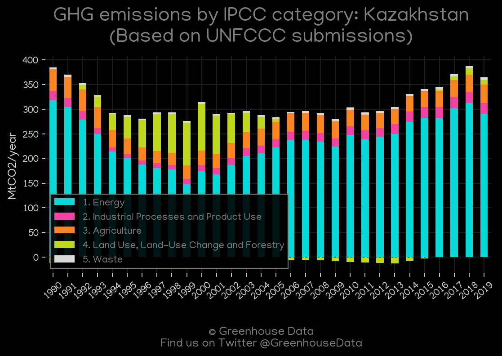
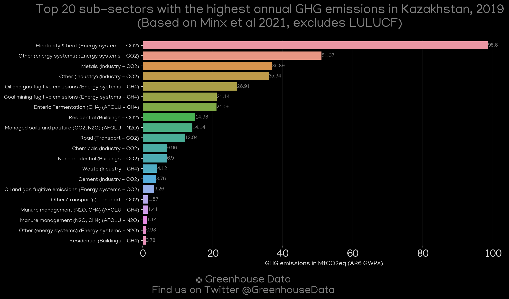
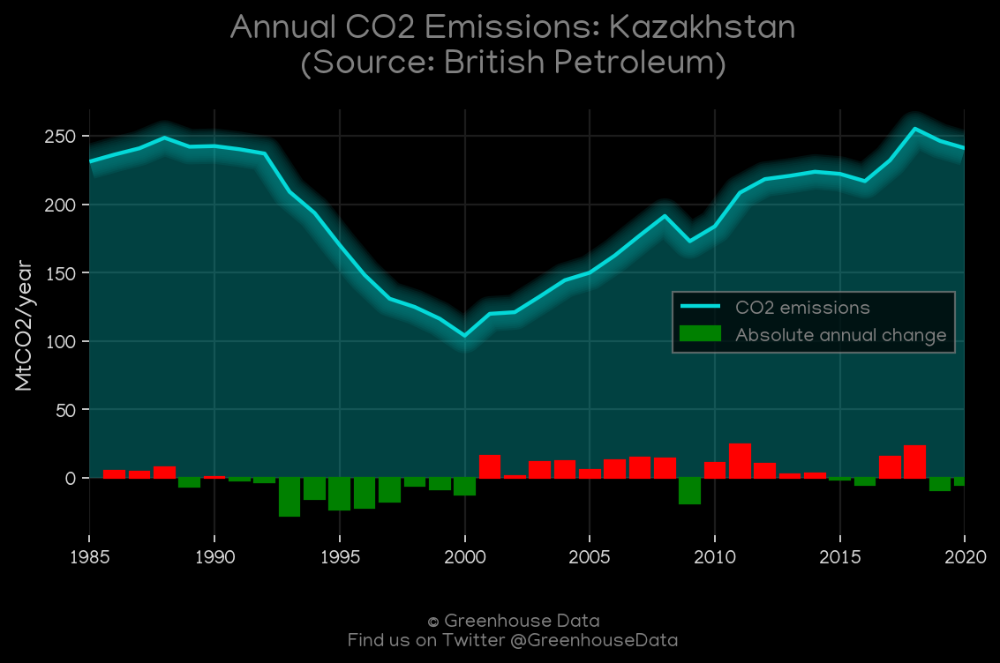
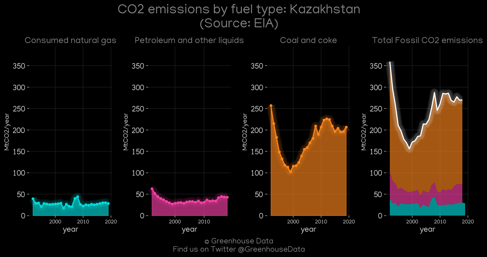
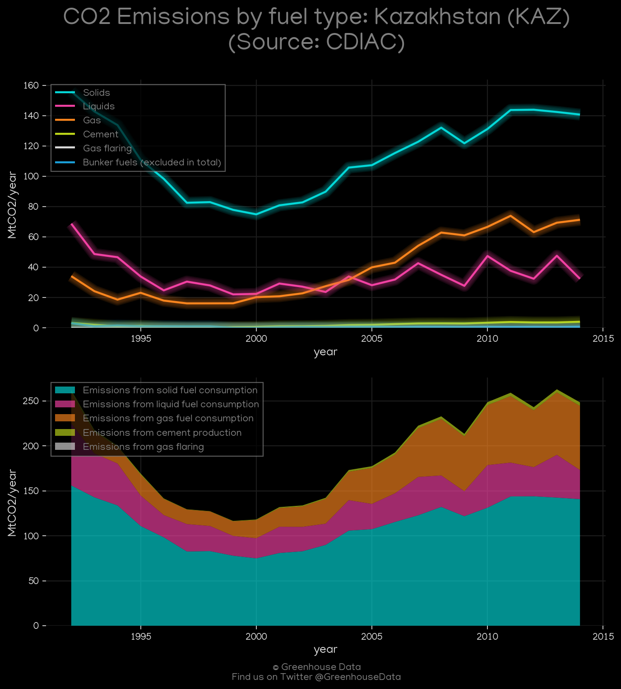

<h1 align="center">
🇰🇿🇰🇿🇰🇿🇰🇿🇰🇿
 
Kazakhstan
 
🇰🇿🇰🇿🇰🇿🇰🇿🇰🇿
</h1>
<h2>Datasets:</h2>

<a href="https://github.com/dquintani/GreenhouseData/tree/master/country_data/KAZ_Kazakhstan/data">View on Github</a>
 

<a href="data/KAZ_GCP.csv">GCP</a> || <a href="data/KAZ_CAIT.csv">CAIT</a> || <a href="data/KAZ_IEA.csv">IEA</a> || <a href="data/KAZ_PRIMAP-hist.csv">PRIMAP-hist</a> || <a href="data/KAZ_EDGAR.csv">EDGAR</a> || <a href="data/KAZ_GCP_consupmption.csv">GCP_consupmption</a> || <a href="data/KAZ_EIA.csv">EIA</a> || <a href="data/KAZ_FAO.csv">FAO</a> || <a href="data/KAZ_BP.csv">BP</a> || <a href="data/KAZ_EPA.csv">EPA</a> || <a href="data/KAZ_CDIAC.csv">CDIAC</a> || <a href="data/KAZ_Minx_2021.csv">Minx_2021</a>

 

<h1>Figures:</h1><h2>#1 (KAZ_IEA_1)</h2>

<h2>#2 (KAZ_GCP_1)</h2>

<h2>#3 (KAZ_CAIT_gases_1)</h2>

<h2>#4 (KAZ_CO2_totals)</h2>

<h2>#5 (KAZ_UNFCCC_AI_1)</h2>

<h2>#6 (KAZ_Minx_top20_subsectors)</h2>

<h2>#7 (KAZ_BP_1)</h2>

<h2>#8 (KAZ_EIA_1)</h2>

<h2>#9 (KAZ_CDIAC_1)</h2>

