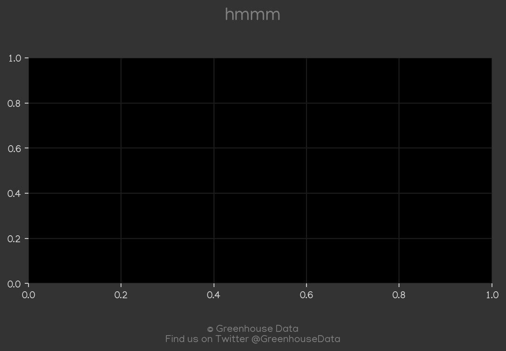
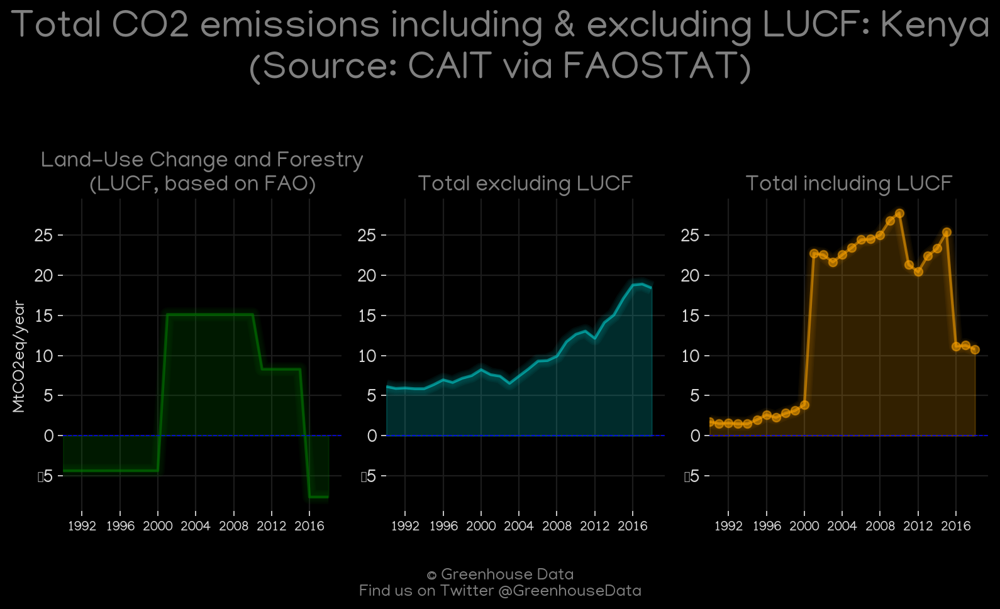
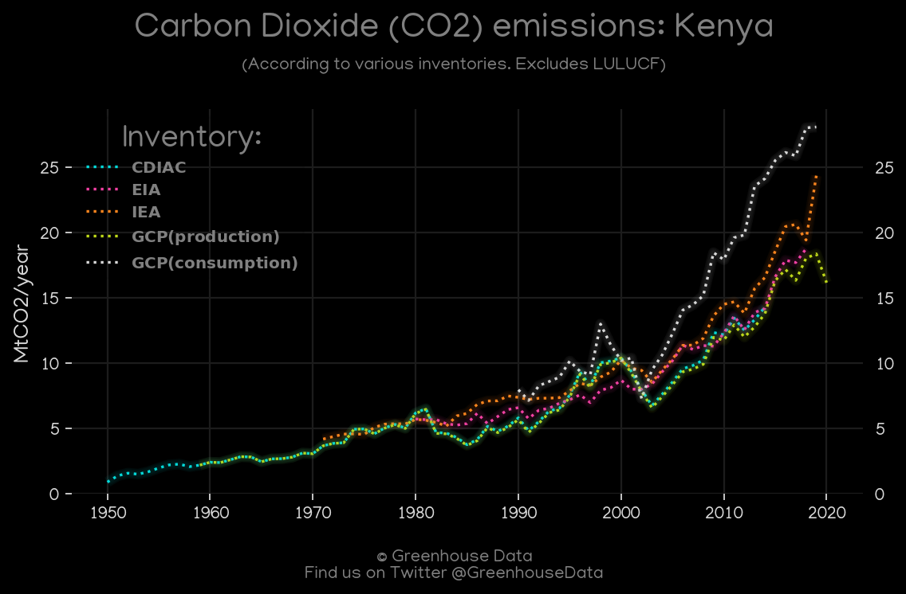
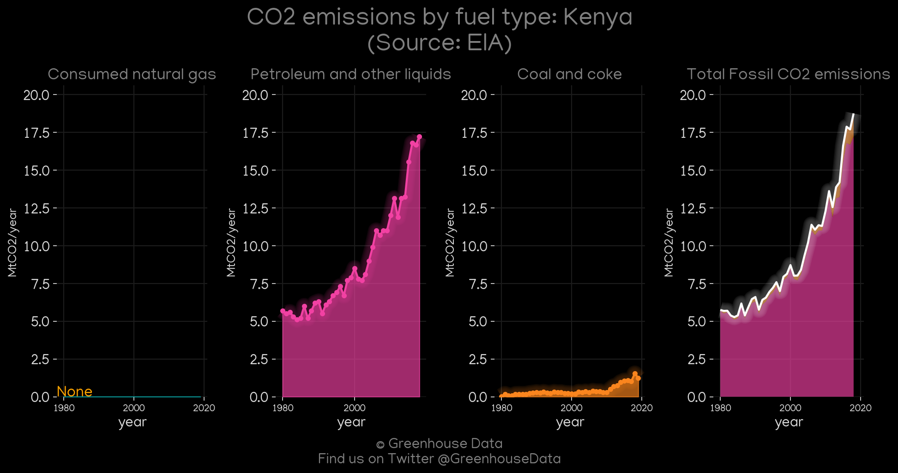
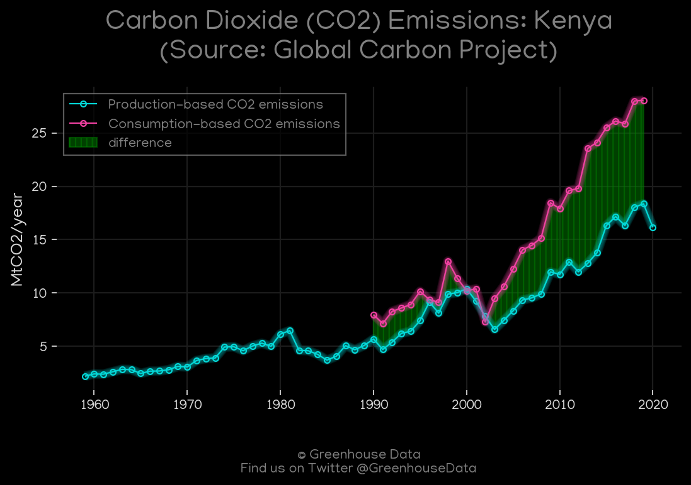
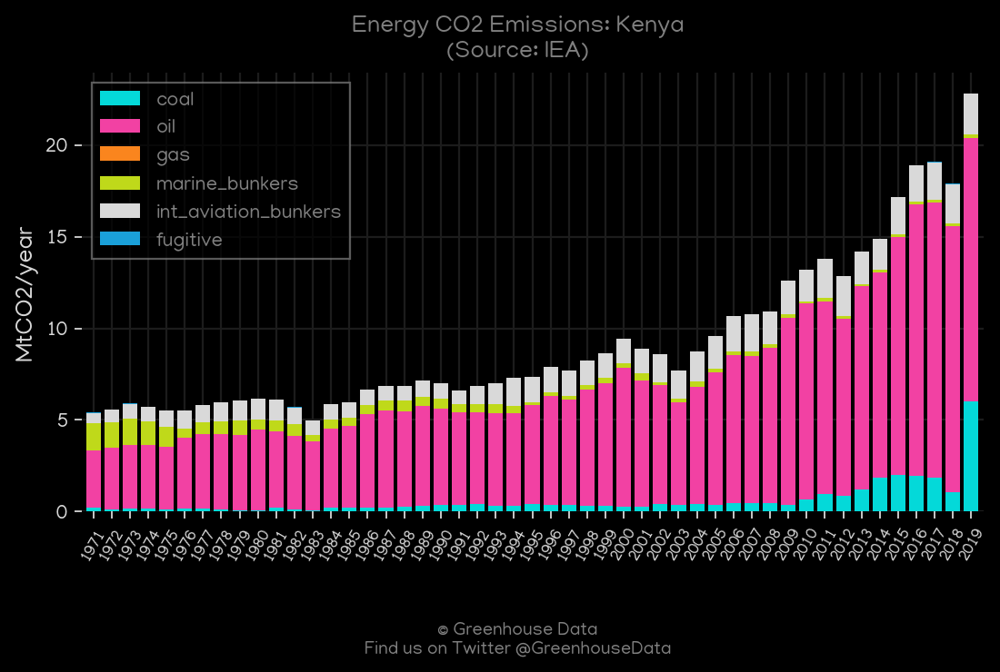
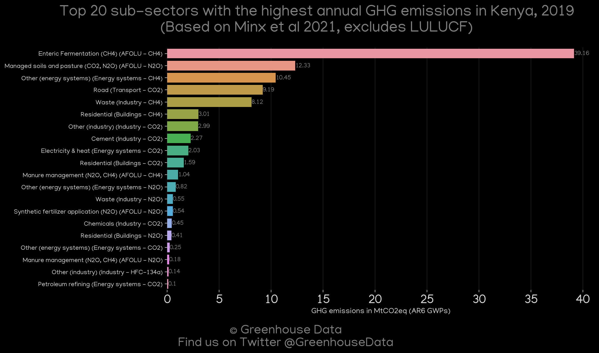
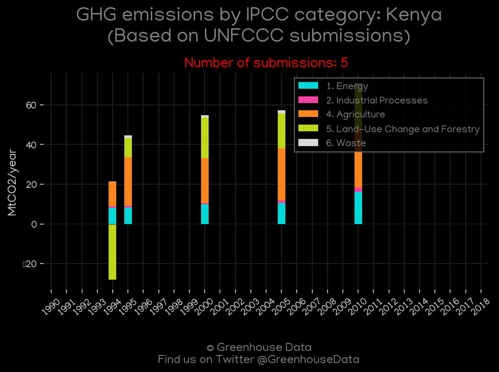

<h1 align="center">
🇰🇪🇰🇪🇰🇪🇰🇪🇰🇪
 
Kenya
 
🇰🇪🇰🇪🇰🇪🇰🇪🇰🇪
</h1>
<h2>Datasets:</h2>

<a href="https://github.com/dquintani/GreenhouseData/tree/master/country_data/KEN_Kenya/data">View on Github</a>
 

<a href="data/KEN_CAIT.csv">CAIT</a> || <a href="data/KEN_CDIAC.csv">CDIAC</a> || <a href="data/KEN_EDGAR.csv">EDGAR</a> || <a href="data/KEN_EIA.csv">EIA</a> || <a href="data/KEN_EPA.csv">EPA</a> || <a href="data/KEN_FAO.csv">FAO</a> || <a href="data/KEN_GCP.csv">GCP</a> || <a href="data/KEN_GCP_consupmption.csv">GCP_consupmption</a> || <a href="data/KEN_IEA.csv">IEA</a> || <a href="data/KEN_Minx_2021.csv">Minx_2021</a> || <a href="data/KEN_PRIMAP-hist.csv">PRIMAP-hist</a>

 

<h1>Figures:</h1><h2>#1 (KEN_BP_1)</h2>

<h2>#2 (KEN_CAIT_gases_1)</h2>

<h2>#3 (KEN_CAIT_lucf_vs_nolucf)</h2>

<h2>#4 (KEN_CDIAC_1)</h2>

<h2>#5 (KEN_CO2_totals)</h2>

<h2>#6 (KEN_EIA_1)</h2>

<h2>#7 (KEN_GCP_1)</h2>

<h2>#8 (KEN_GCP_Country_Highlight)</h2>

<h2>#9 (KEN_IEA_1)</h2>

<h2>#10 (KEN_Minx_top20_subsectors)</h2>

<h2>#11 (KEN_relative_totals)</h2>

<h2>#12 (KEN_UNFCCC_NAI_1)</h2>

