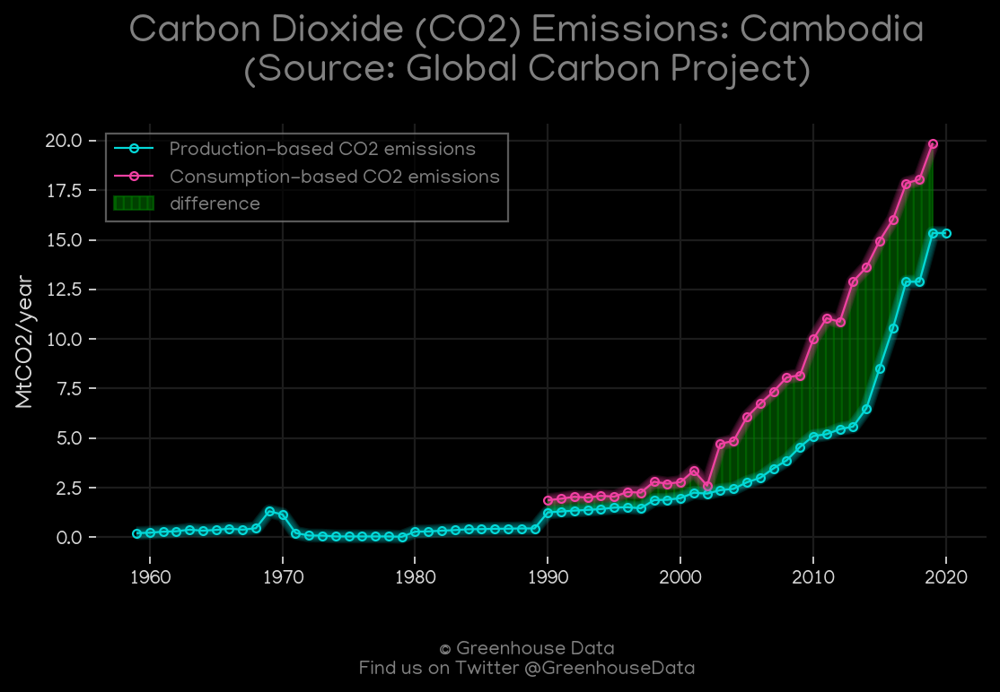
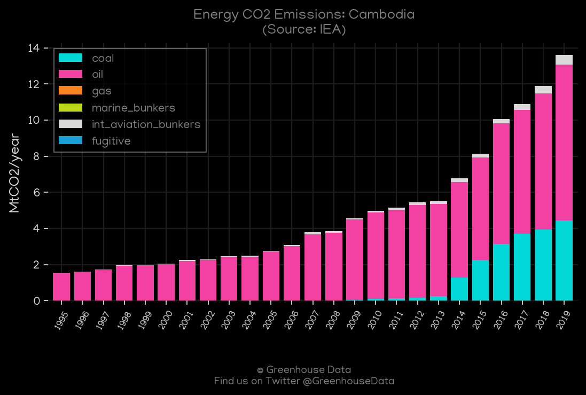
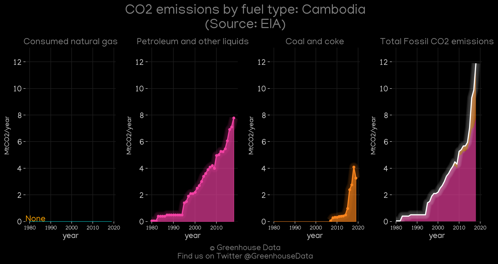
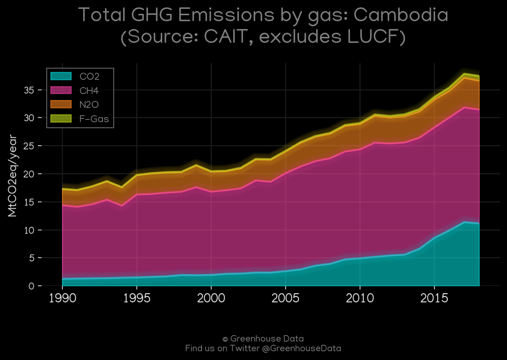
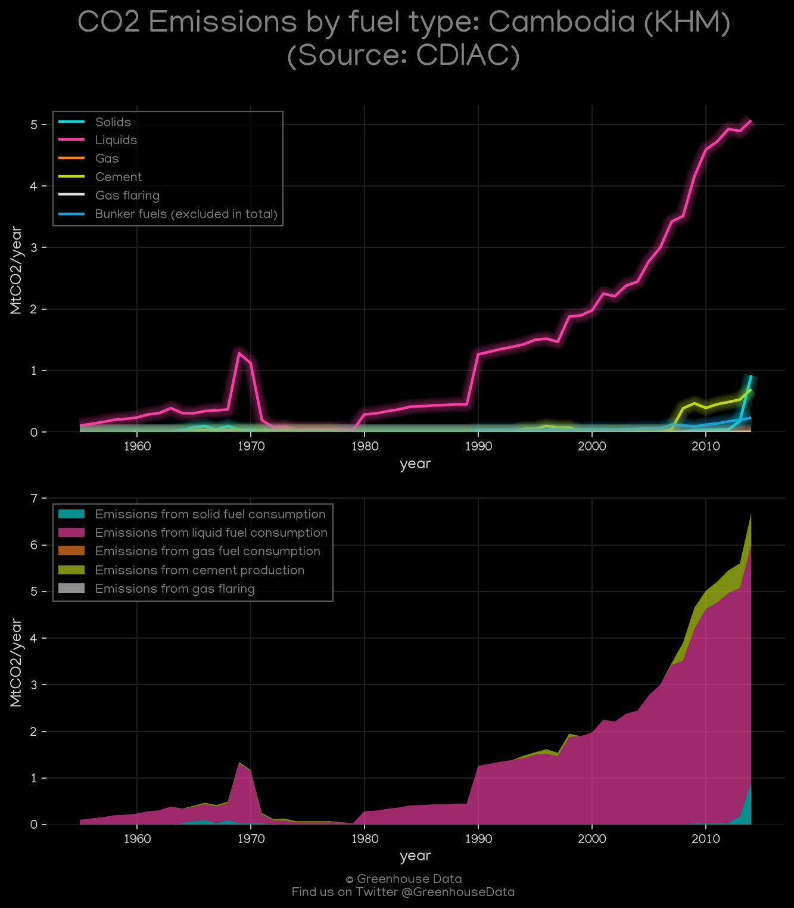
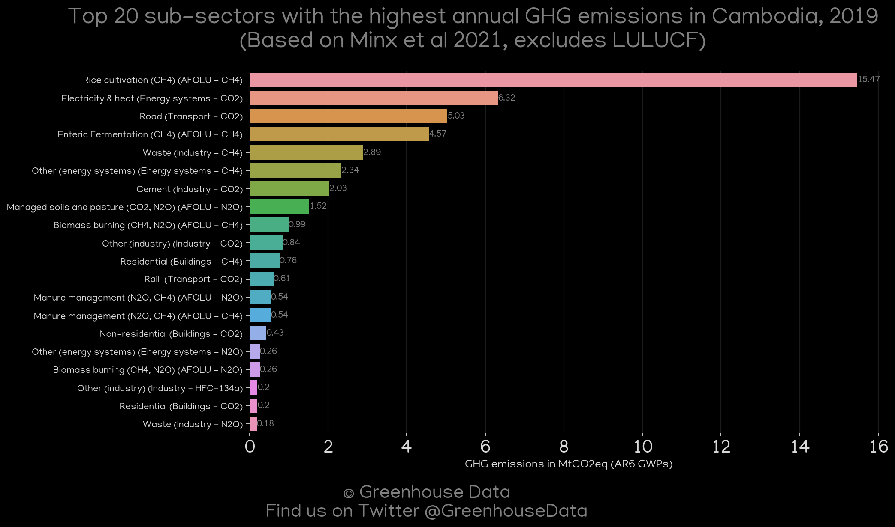

<h1 align="center">
🇰🇭🇰🇭🇰🇭🇰🇭🇰🇭
 
Cambodia
 
🇰🇭🇰🇭🇰🇭🇰🇭🇰🇭
</h1>
<h2>Datasets:</h2>

<a href="https://github.com/dquintani/GreenhouseData/tree/master/country_data/KHM_Cambodia/data">View on Github</a>
 

<a href="data/KHM_CDIAC.csv">CDIAC</a> || <a href="data/KHM_EDGAR.csv">EDGAR</a> || <a href="data/KHM_GCP_cons.csv">GCP_cons</a> || <a href="data/KHM_FAO.csv">FAO</a> || <a href="data/KHM_GCP.csv">GCP</a> || <a href="data/KHM_CAIT.csv">CAIT</a> || <a href="data/KHM_EPA.csv">EPA</a> || <a href="data/KHM_Minx_2021.csv">Minx_2021</a> || <a href="data/KHM_PRIMAP-hist.csv">PRIMAP-hist</a> || <a href="data/KHM_EIA.csv">EIA</a> || <a href="data/KHM_GCP_consupmption.csv">GCP_consupmption</a> || <a href="data/KHM_IEA.csv">IEA</a>

 

<h1>Figures:</h1><h2>#1 (KHM_GCP_1)</h2>

<h2>#2 (KHM_IEA_1)</h2>

<h2>#3 (KHM_EIA_1)</h2>

<h2>#4 (KHM_CAIT_gases_1)</h2>

<h2>#5 (KHM_UNFCCC_NAI_1)</h2>

<h2>#6 (KHM_CO2_totals)</h2>

<h2>#7 (KHM_CDIAC_1)</h2>

<h2>#8 (KHM_Minx_top20_subsectors)</h2>

