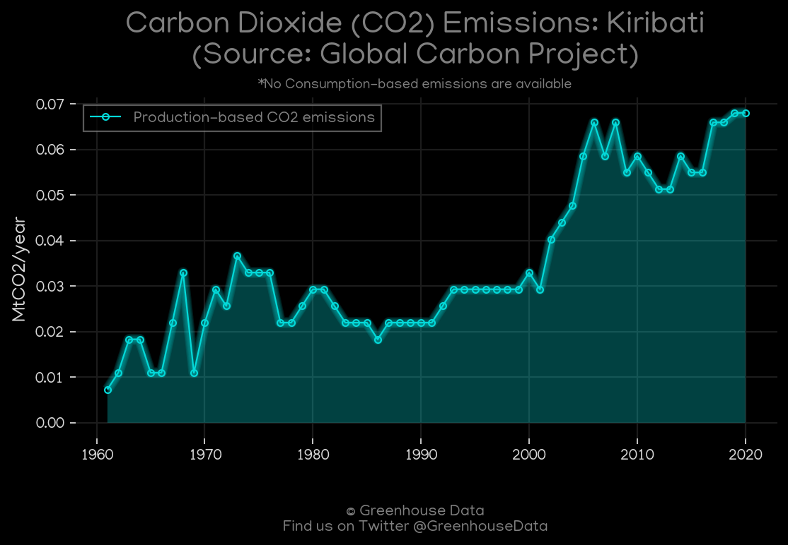
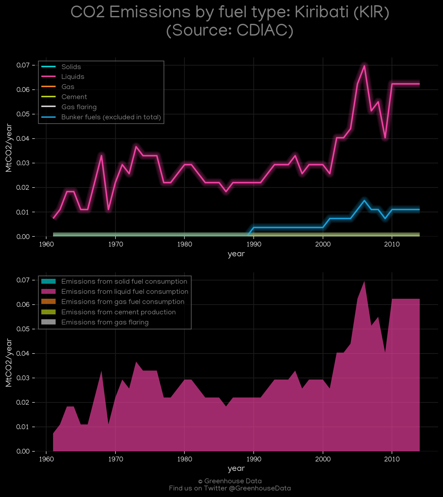
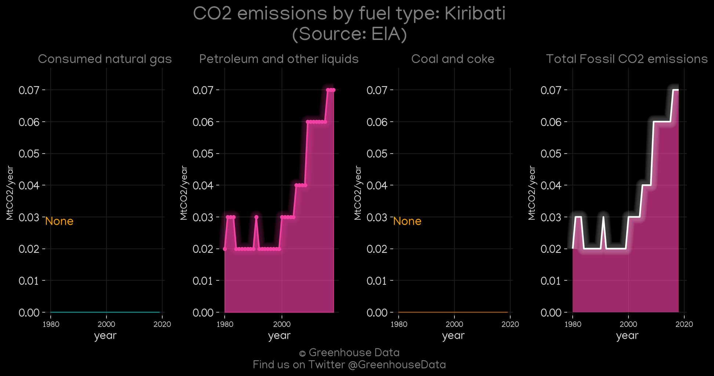
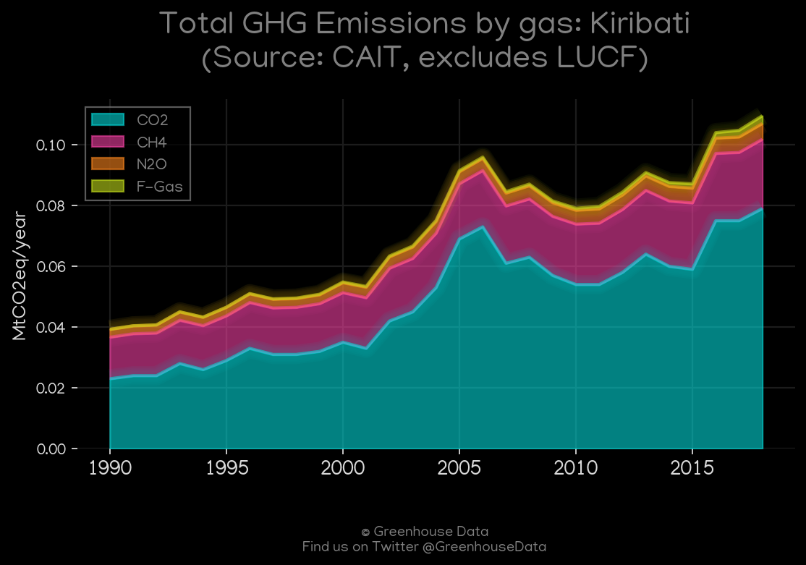
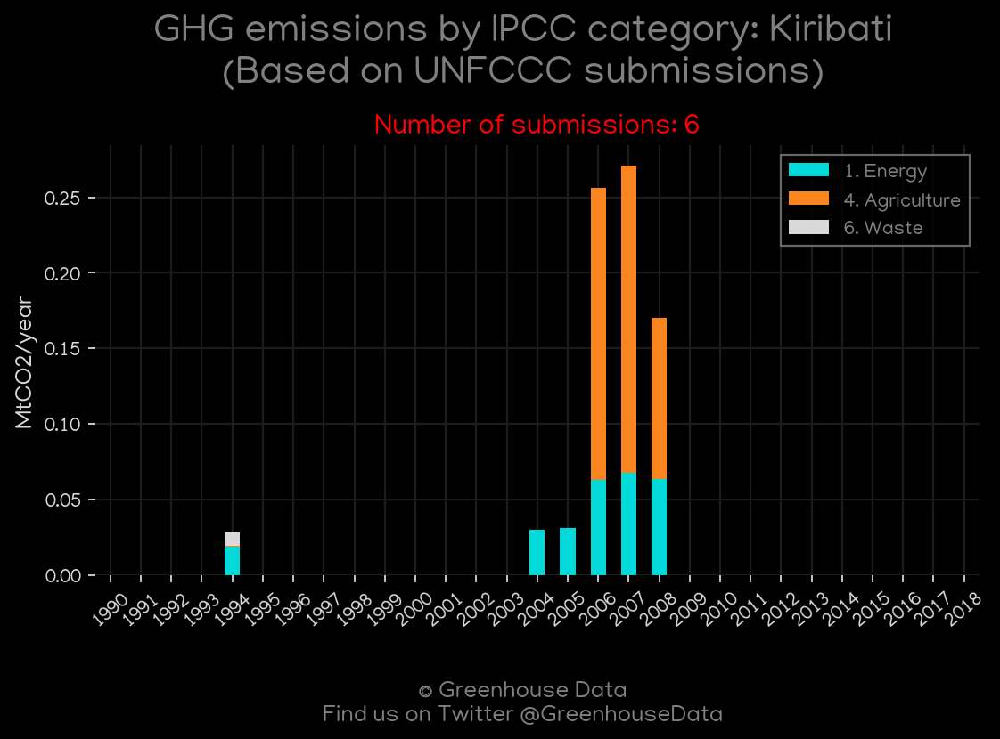
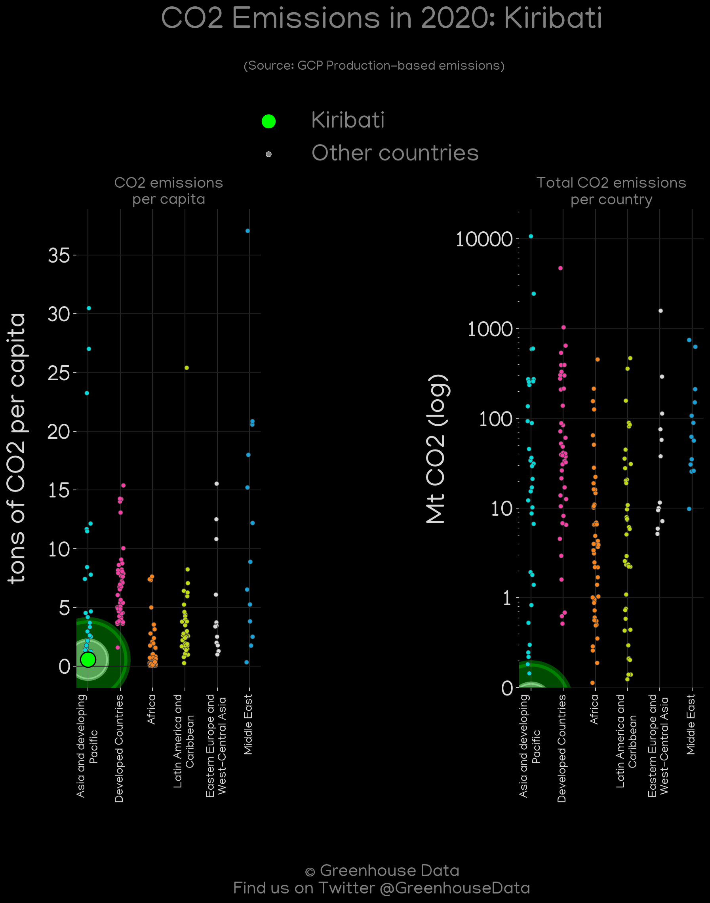
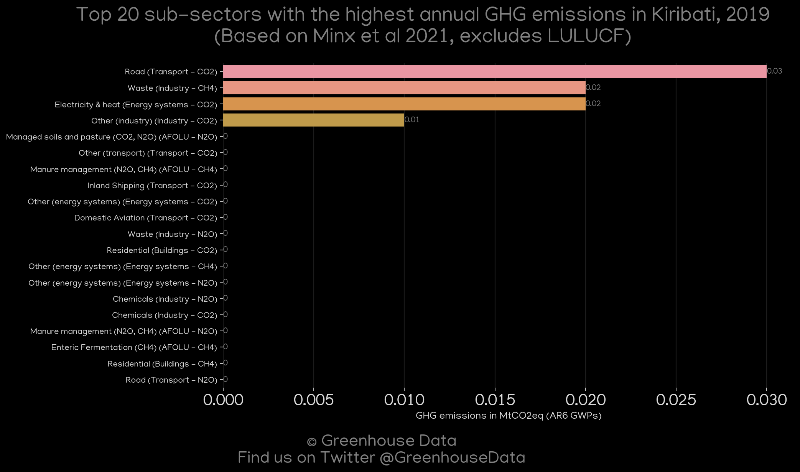

<h1 align="center">
🇰🇮🇰🇮🇰🇮🇰🇮🇰🇮
 
Kiribati
 
🇰🇮🇰🇮🇰🇮🇰🇮🇰🇮
</h1>
<h2>Datasets:</h2>

<a href="https://github.com/dquintani/GreenhouseData/tree/master/country_data/KIR_Kiribati/data">View on Github</a>
 

<a href="data/KIR_PRIMAP-hist.csv">PRIMAP-hist</a> || <a href="data/KIR_CDIAC.csv">CDIAC</a> || <a href="data/KIR_GCP.csv">GCP</a> || <a href="data/KIR_FAO.csv">FAO</a> || <a href="data/KIR_EIA.csv">EIA</a> || <a href="data/KIR_GCP_consupmption.csv">GCP_consupmption</a> || <a href="data/KIR_CAIT.csv">CAIT</a> || <a href="data/KIR_EPA.csv">EPA</a> || <a href="data/KIR_EDGAR.csv">EDGAR</a> || <a href="data/KIR_Minx_2021.csv">Minx_2021</a>

 

<h1>Figures:</h1><h2>#1 (KIR_GCP_1)</h2>

<h2>#2 (KIR_CDIAC_1)</h2>

<h2>#3 (KIR_EIA_1)</h2>

<h2>#4 (KIR_CAIT_gases_1)</h2>

<h2>#5 (KIR_UNFCCC_NAI_1)</h2>

<h2>#6 (KIR_CO2_totals)</h2>

<h2>#7 (KIR_GCP_Country_Highlight)</h2>

<h2>#8 (KIR_Minx_top20_subsectors)</h2>

