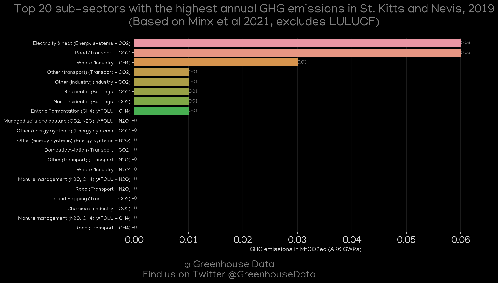
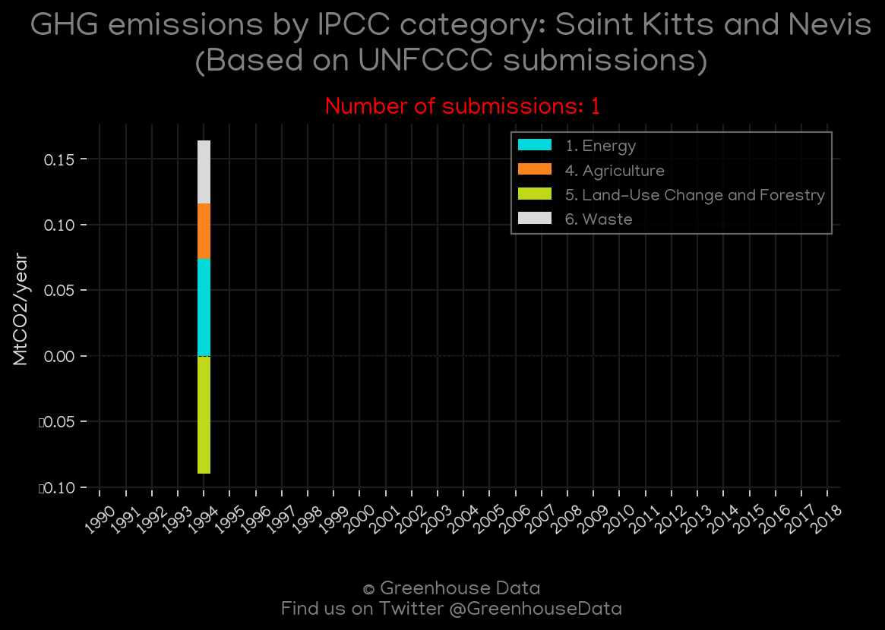
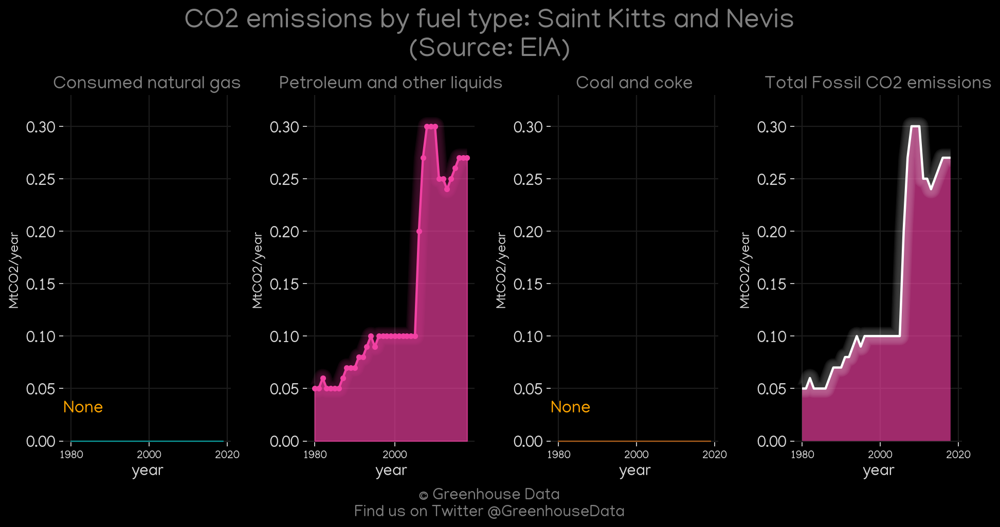
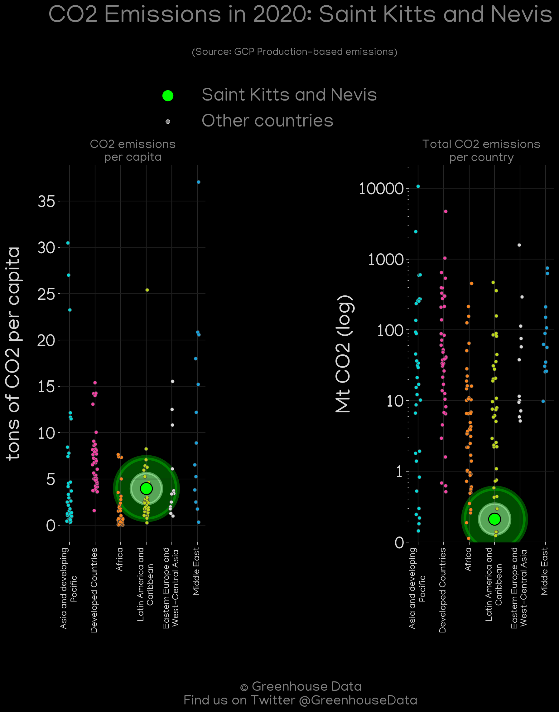
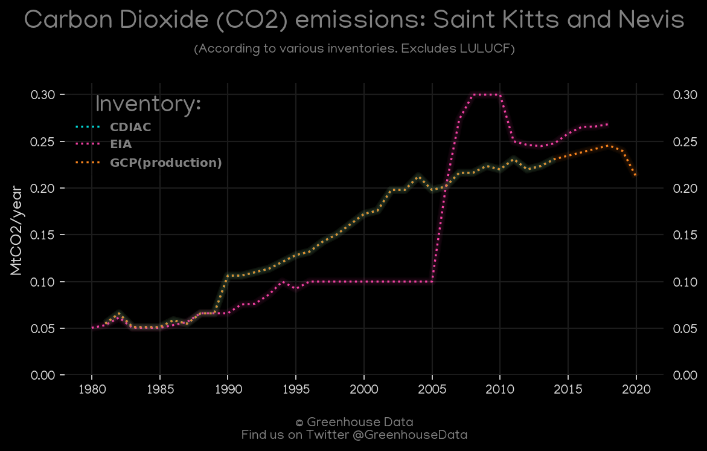
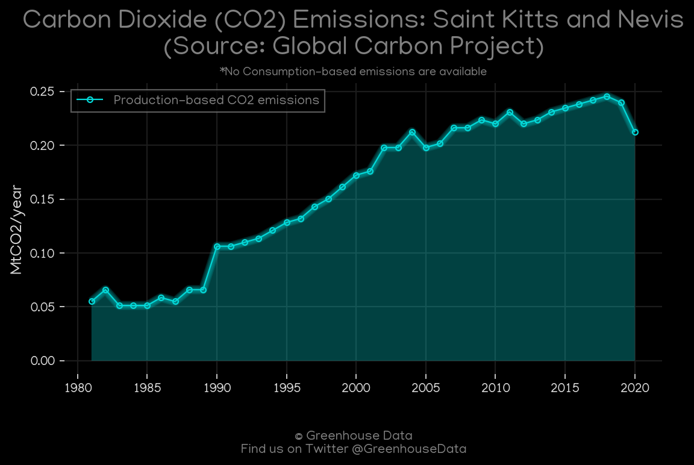

<h1 align="center">
🇰🇳🇰🇳🇰🇳🇰🇳🇰🇳
 
Saint Kitts and Nevis
 
🇰🇳🇰🇳🇰🇳🇰🇳🇰🇳
</h1>
<h2>Datasets:</h2>

<a href="https://github.com/dquintani/GreenhouseData/tree/master/country_data/KNA_Saint Kitts and Nevis/data">View on Github</a>
 

<a href="data/KNA_CAIT.csv">CAIT</a> || <a href="data/KNA_GCP.csv">GCP</a> || <a href="data/KNA_CDIAC.csv">CDIAC</a> || <a href="data/KNA_FAO.csv">FAO</a> || <a href="data/KNA_EIA.csv">EIA</a> || <a href="data/KNA_PRIMAP-hist.csv">PRIMAP-hist</a> || <a href="data/KNA_GCP_consupmption.csv">GCP_consupmption</a> || <a href="data/KNA_EDGAR.csv">EDGAR</a> || <a href="data/KNA_EPA.csv">EPA</a> || <a href="data/KNA_Minx_2021.csv">Minx_2021</a>

 

<h1>Figures:</h1><h2>#1 (KNA_Minx_top20_subsectors)</h2>

<h2>#2 (KNA_UNFCCC_NAI_1)</h2>

<h2>#3 (KNA_EIA_1)</h2>

<h2>#4 (KNA_CAIT_gases_1)</h2>

<h2>#5 (KNA_CDIAC_1)</h2>

<h2>#6 (KNA_GCP_Country_Highlight)</h2>

<h2>#7 (KNA_CO2_totals)</h2>

<h2>#8 (KNA_GCP_1)</h2>

