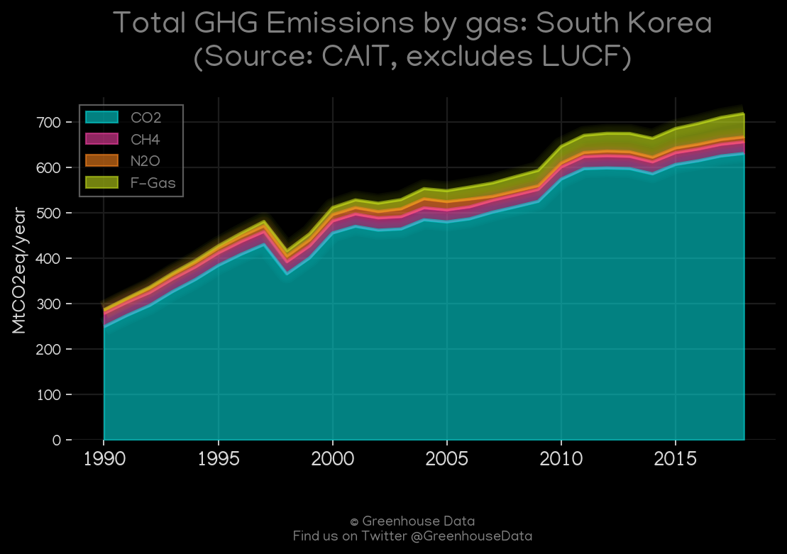
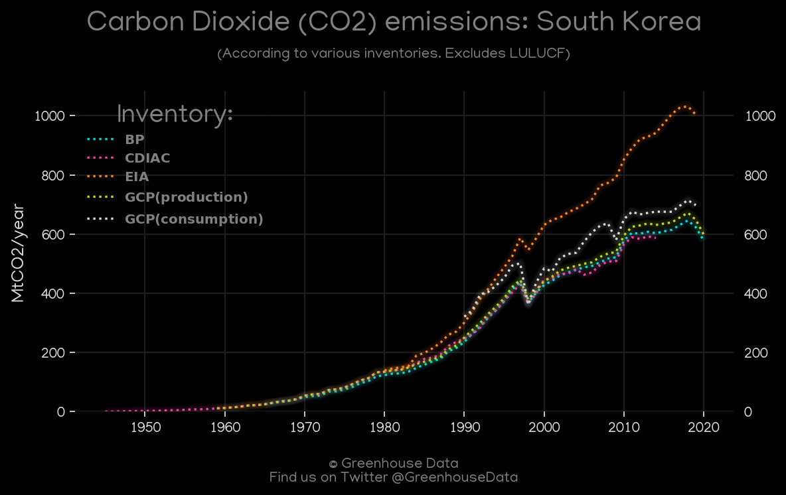
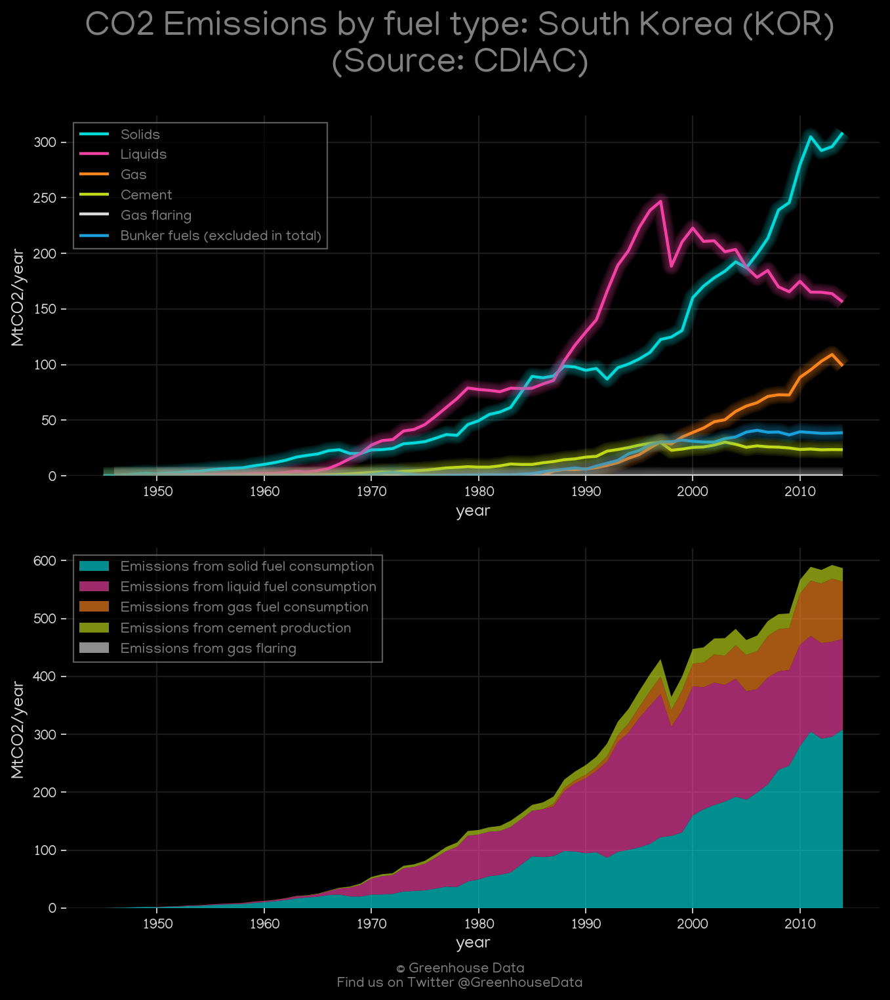
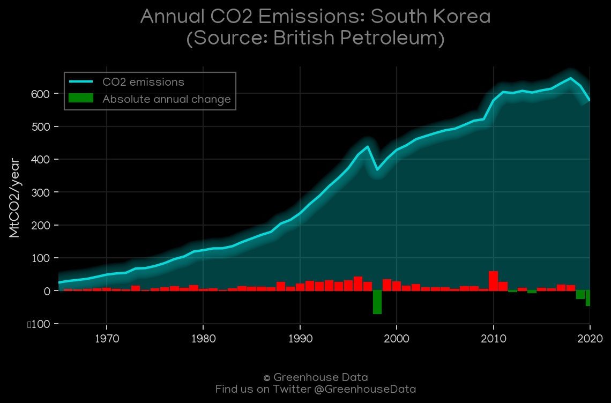
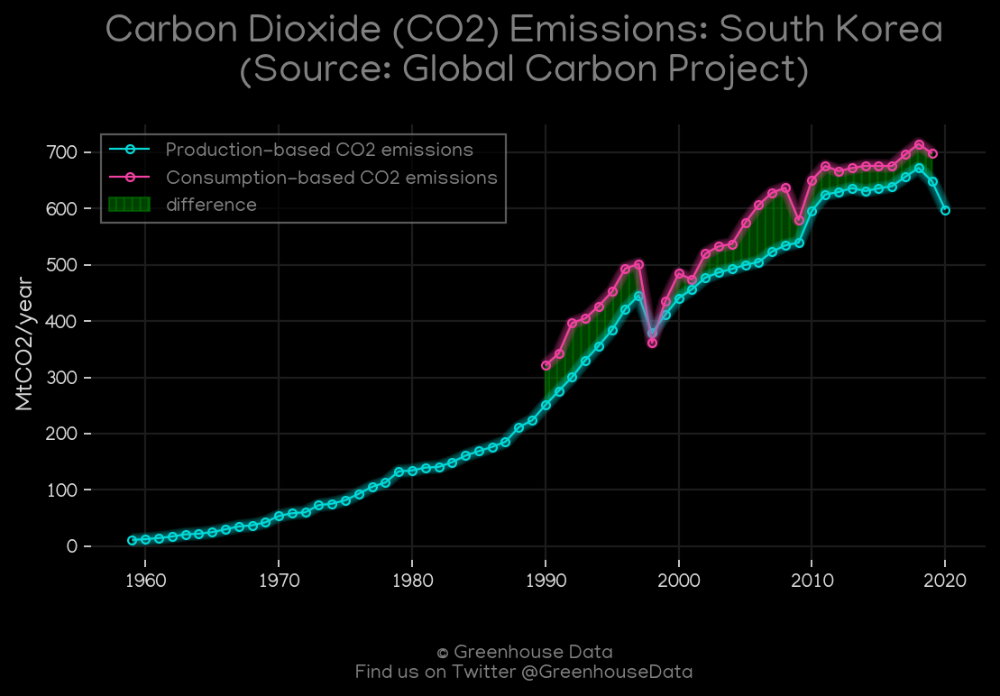
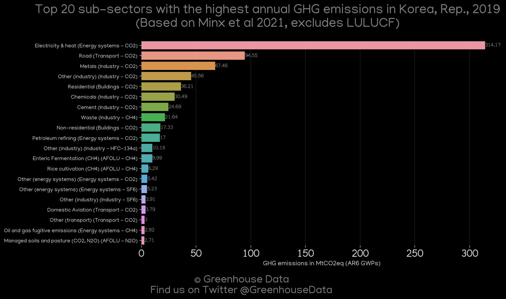
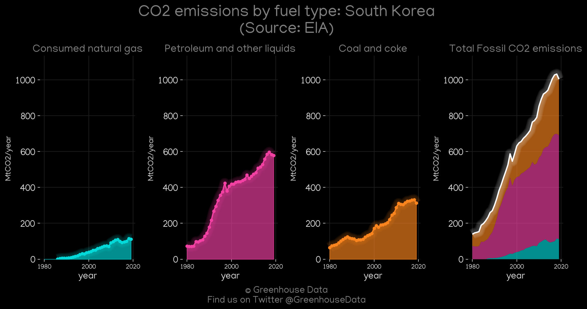

<h1 align="center">
🇰🇷🇰🇷🇰🇷🇰🇷🇰🇷
 
South Korea
 
🇰🇷🇰🇷🇰🇷🇰🇷🇰🇷
</h1>
<h2>Datasets:</h2>

<a href="https://github.com/dquintani/GreenhouseData/tree/master/country_data/KOR_South Korea/data">View on Github</a>
 

<a href="data/KOR_GCP.csv">GCP</a> || <a href="data/KOR_CDIAC.csv">CDIAC</a> || <a href="data/KOR_FAO.csv">FAO</a> || <a href="data/KOR_EIA.csv">EIA</a> || <a href="data/KOR_GCP_consupmption.csv">GCP_consupmption</a> || <a href="data/KOR_BP.csv">BP</a> || <a href="data/KOR_EPA.csv">EPA</a> || <a href="data/KOR_EDGAR.csv">EDGAR</a> || <a href="data/KOR_PRIMAP-hist.csv">PRIMAP-hist</a> || <a href="data/KOR_Minx_2021.csv">Minx_2021</a> || <a href="data/KOR_CAIT.csv">CAIT</a>

 

<h1>Figures:</h1><h2>#1 (KOR_CAIT_gases_1)</h2>

<h2>#2 (KOR_UNFCCC_NAI_1)</h2>

<h2>#3 (KOR_CO2_totals)</h2>

<h2>#4 (KOR_CDIAC_1)</h2>

<h2>#5 (KOR_BP_1)</h2>

<h2>#6 (KOR_GCP_1)</h2>

<h2>#7 (KOR_Minx_top20_subsectors)</h2>

<h2>#8 (KOR_EIA_1)</h2>

