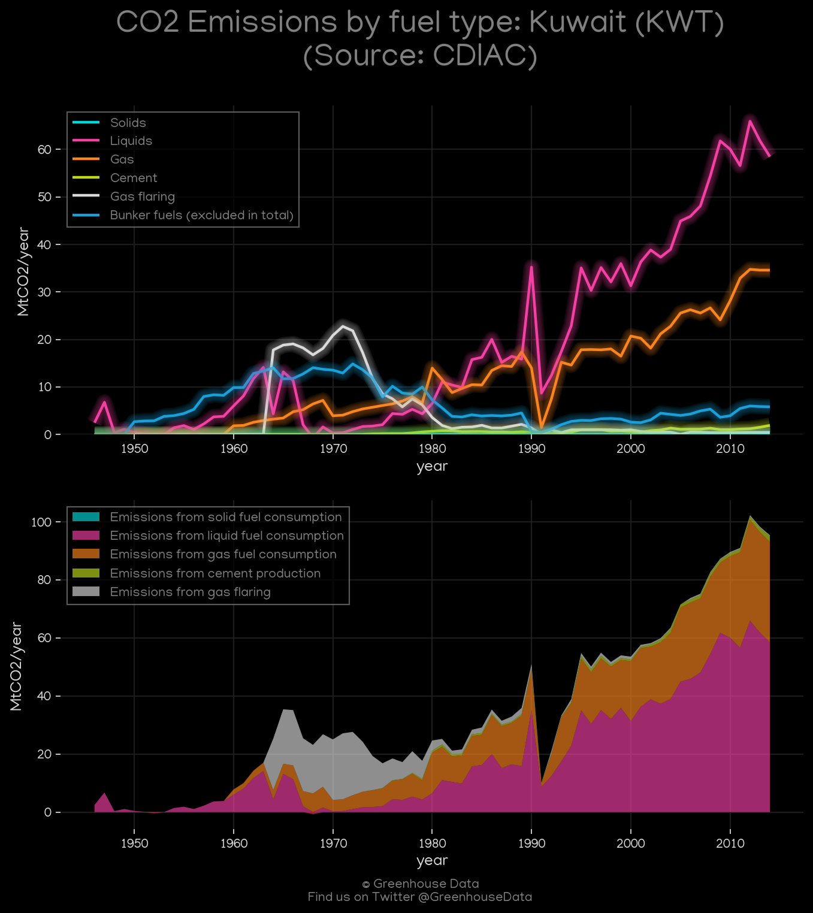
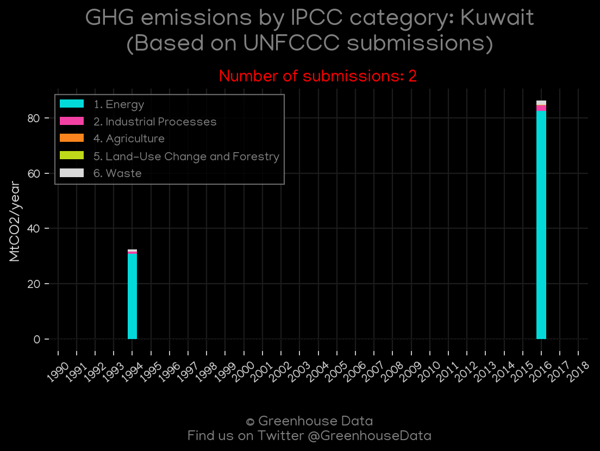
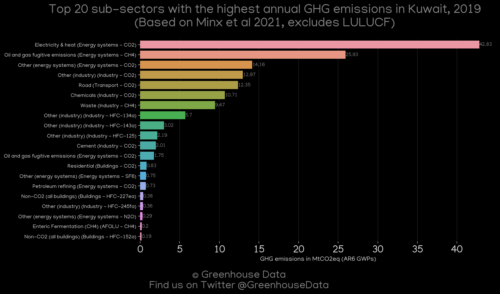
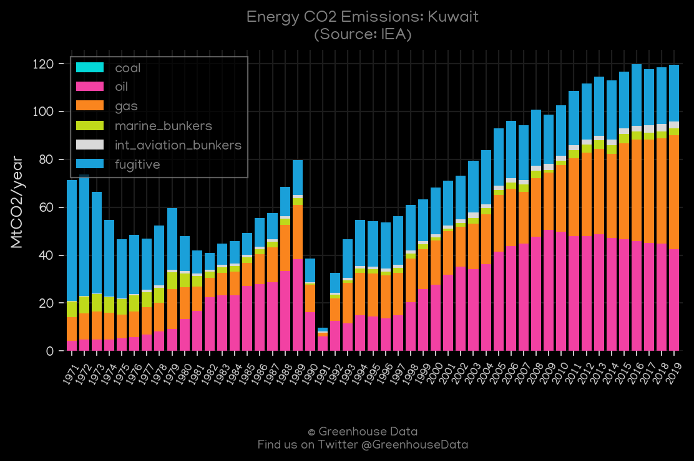
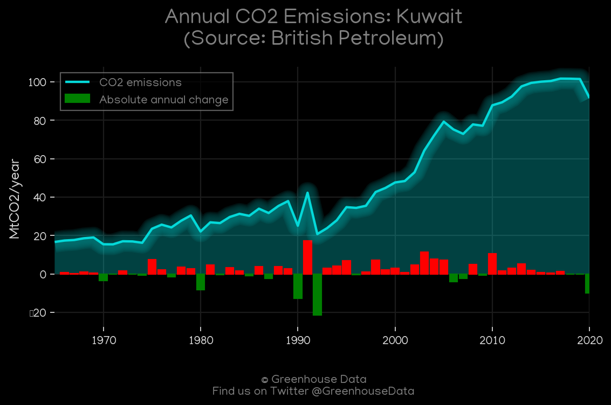
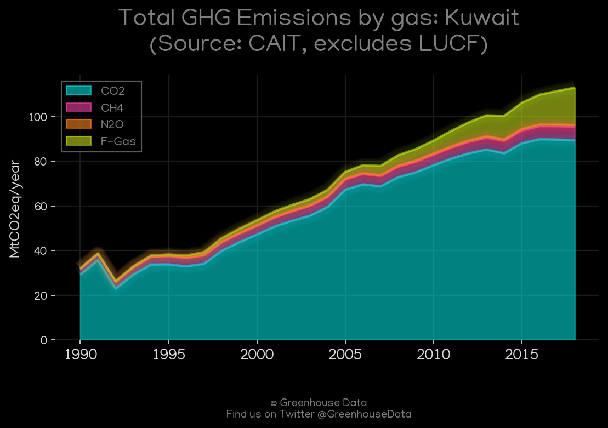
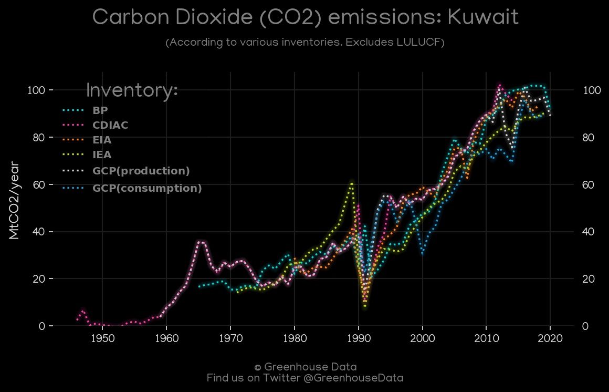
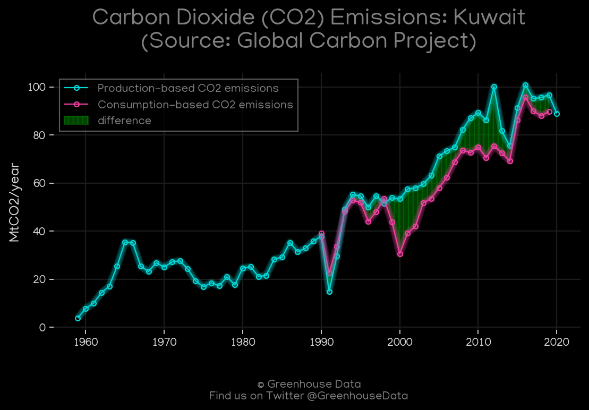
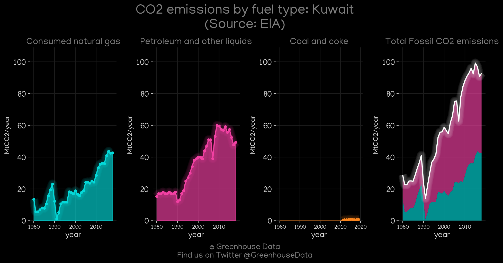

<h1 align="center">
🇰🇼🇰🇼🇰🇼🇰🇼🇰🇼
 
Kuwait
 
🇰🇼🇰🇼🇰🇼🇰🇼🇰🇼
</h1>
<h2>Datasets:</h2>

<a href="https://github.com/dquintani/GreenhouseData/tree/master/country_data/KWT_Kuwait/data">View on Github</a>
 

<a href="data/KWT_GCP.csv">GCP</a> || <a href="data/KWT_EDGAR.csv">EDGAR</a> || <a href="data/KWT_CAIT.csv">CAIT</a> || <a href="data/KWT_FAO.csv">FAO</a> || <a href="data/KWT_GCP_consupmption.csv">GCP_consupmption</a> || <a href="data/KWT_CDIAC.csv">CDIAC</a> || <a href="data/KWT_EIA.csv">EIA</a> || <a href="data/KWT_Minx_2021.csv">Minx_2021</a> || <a href="data/KWT_IEA.csv">IEA</a> || <a href="data/KWT_PRIMAP-hist.csv">PRIMAP-hist</a> || <a href="data/KWT_GCP_cons.csv">GCP_cons</a> || <a href="data/KWT_BP.csv">BP</a> || <a href="data/KWT_EPA.csv">EPA</a>

 

<h1>Figures:</h1><h2>#1 (KWT_CDIAC_1)</h2>

<h2>#2 (KWT_UNFCCC_NAI_1)</h2>

<h2>#3 (KWT_Minx_top20_subsectors)</h2>

<h2>#4 (KWT_IEA_1)</h2>

<h2>#5 (KWT_BP_1)</h2>

<h2>#6 (KWT_CAIT_gases_1)</h2>

<h2>#7 (KWT_CO2_totals)</h2>

<h2>#8 (KWT_GCP_1)</h2>

<h2>#9 (KWT_EIA_1)</h2>

