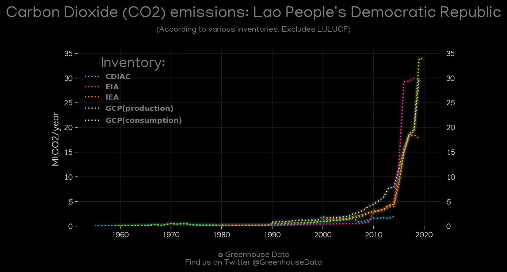
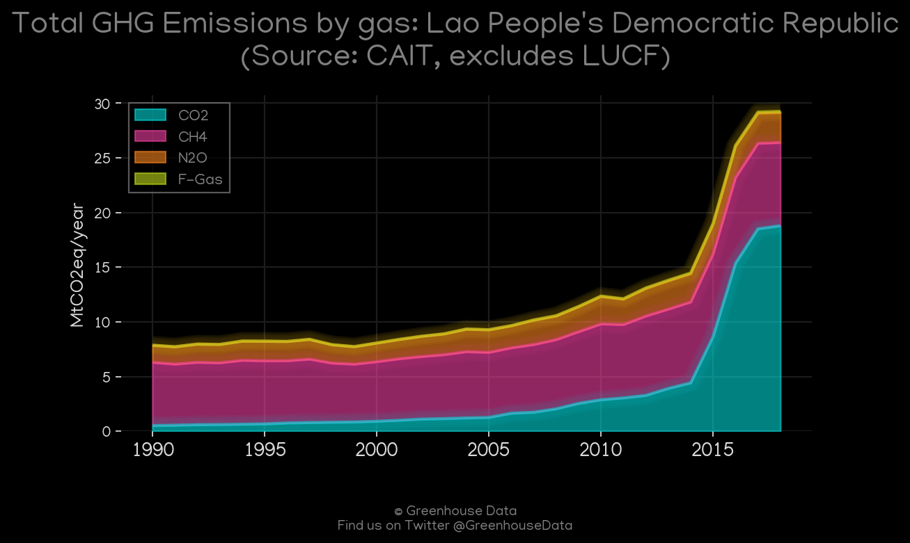
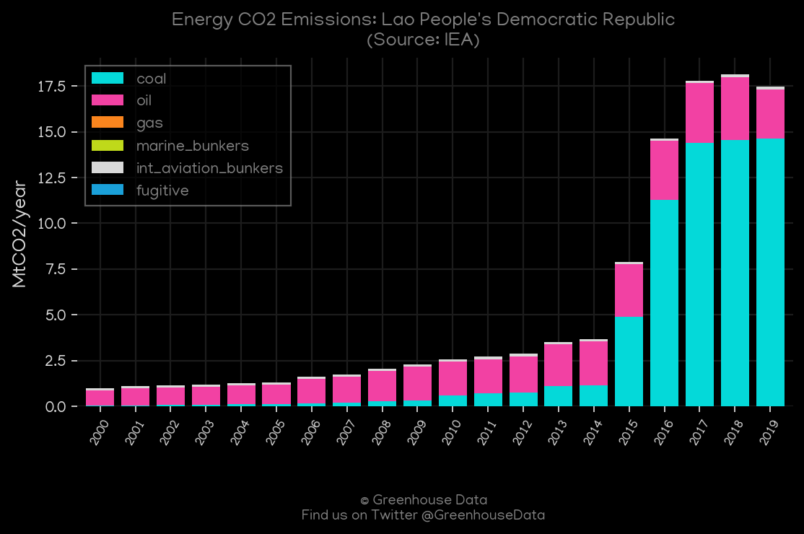
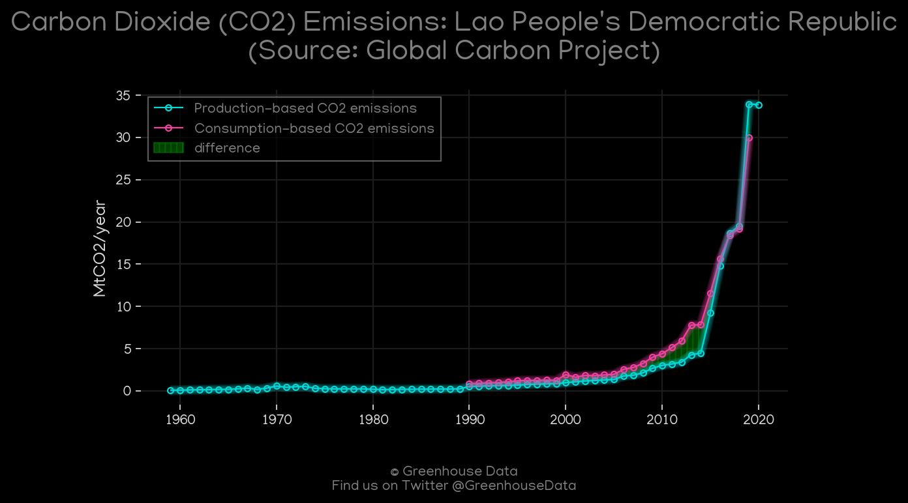
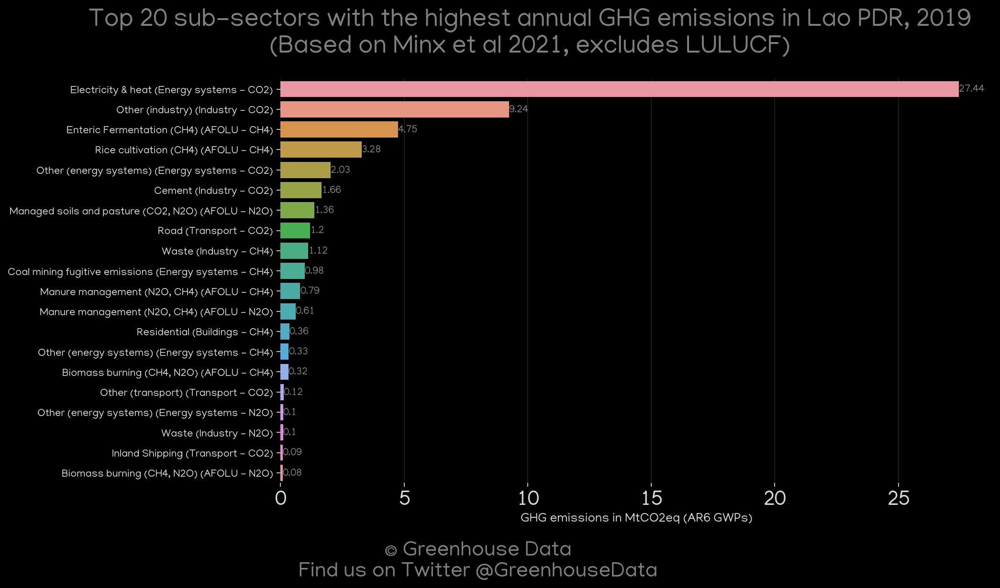
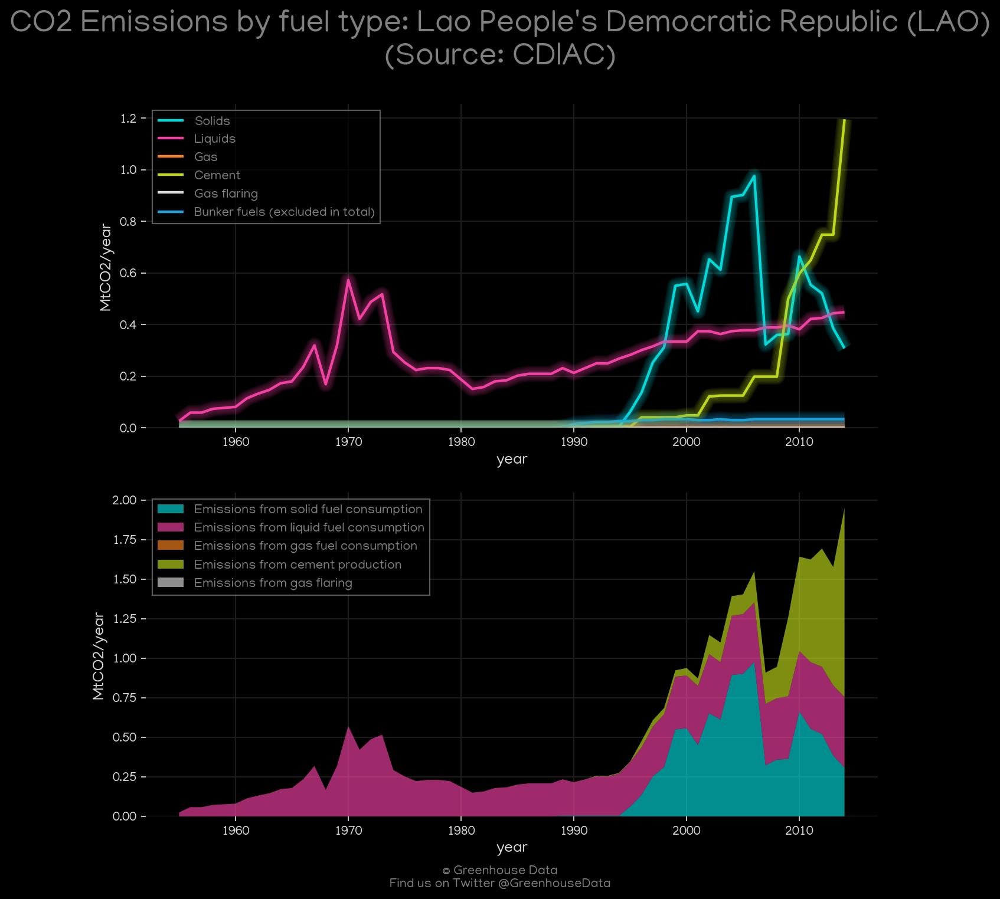
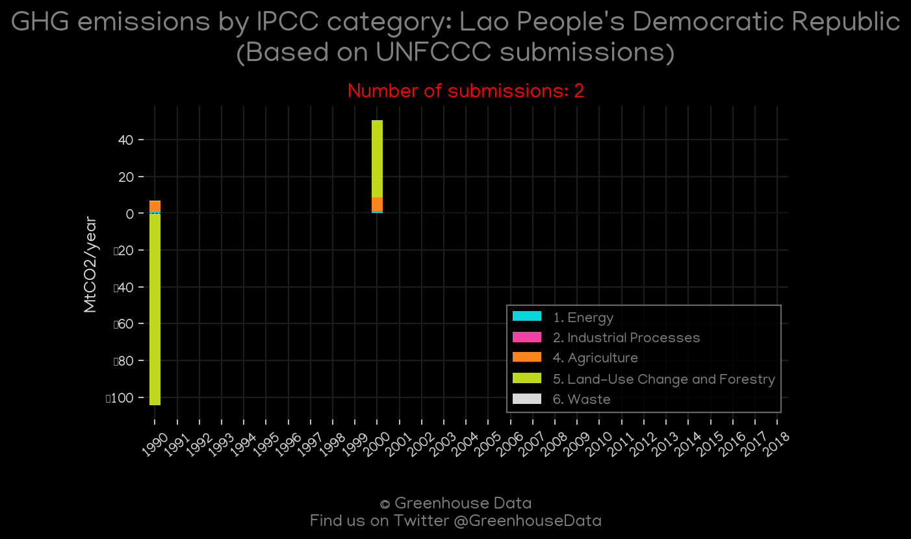

<h1 align="center">
🇱🇦🇱🇦🇱🇦🇱🇦🇱🇦
 
Lao People's Democratic Republic
 
🇱🇦🇱🇦🇱🇦🇱🇦🇱🇦
</h1>
<h2>Datasets:</h2>

<a href="https://github.com/dquintani/Greenhouse-Data/tree/master/country_data/LAO_Lao People's Democratic Republic/data">View on Github</a>
 

<a href="data/LAO_GCP_consupmption.csv">GCP_consupmption</a> || <a href="data/LAO_FAO.csv">FAO</a> || <a href="data/LAO_EPA.csv">EPA</a> || <a href="data/LAO_GCP.csv">GCP</a> || <a href="data/LAO_IEA.csv">IEA</a> || <a href="data/LAO_GCP_cons.csv">GCP_cons</a> || <a href="data/LAO_CAIT.csv">CAIT</a> || <a href="data/LAO_PRIMAP-hist.csv">PRIMAP-hist</a> || <a href="data/LAO_Minx_2021.csv">Minx_2021</a> || <a href="data/LAO_EIA.csv">EIA</a> || <a href="data/LAO_EDGAR.csv">EDGAR</a> || <a href="data/LAO_CDIAC.csv">CDIAC</a>

 

<h1>Figures:</h1><h2>#1 (LAO_CO2_totals)</h2>

<h2>#2 (LAO_EIA_1)</h2>

<h2>#3 (LAO_CAIT_gases_1)</h2>

<h2>#4 (LAO_IEA_1)</h2>

<h2>#5 (LAO_GCP_1)</h2>

<h2>#6 (LAO_Minx_top20_subsectors)</h2>

<h2>#7 (LAO_CDIAC_1)</h2>

<h2>#8 (LAO_UNFCCC_NAI_1)</h2>

